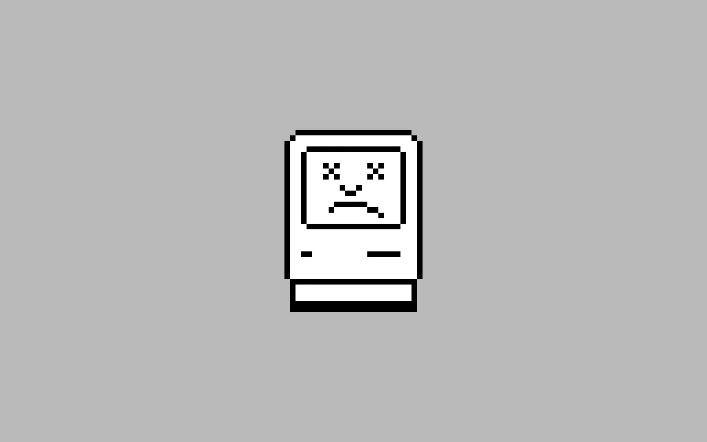

# 苹果留下的空白

> 原文：<https://medium.com/hackernoon/what-happened-to-apple-3c2029b98845>

***TL；大卫:苹果留下了一片空白。亚马逊和谷歌正在填补这一空白。***

苹果怎么了？

还记得早在 2009 年，苹果曾经为我们定义新的产品类别吗？

iPod 向我们展示了便携式音乐播放器应该是什么样子。iPhone 告诉我们，智能手机应该有触摸屏，没有键盘。iPad 向我们展示了平板电脑应该是 iPad。

笔记本电脑应该由金属、配件和包装制成，网站应该是白色的。

苹果领先，其他厂商紧随其后。笔记本电脑制造商仍然努力让他们的笔记本电脑尽可能地像 MacBooks 一样，三星手机与 iPhones 几乎没有区别。

但是新的事情正在发生。

2014 年末，[亚马逊](https://hackernoon.com/tagged/amazon)，在线零售商*，发布了一款定义类别的家用语音助手。*

*这感觉像是苹果公司的举措:Echo 不是市场上第一个声控扬声器，但它是第一个真正有效的扬声器。它运行良好，足以让我们看到亚马逊的未来愿景。它似乎在说，*这个*就是家庭语音界面的样子。*

*其实这种改变在 Echo 之前就开始了。亚马逊推出了 Kindle，它定义了数字图书市场。图书阅读器是 Kindle，Kindle 是图书阅读器。他们拥有那个市场。*

*这是亚马逊为我们定义的两个新的消费电子产品类别。我们可能会认为第一个是侥幸，特别是考虑到亚马逊在图书方面的历史。但是，在第二次定义类别的发布会之后，很难忽视 Lab126 正在发生的一些特别的事情。*

*与此同时，谷歌推出了令人惊喜的 Chromecast。然后是用于音频的 Chromecast，然后是家庭扬声器，侧身滑入家庭语音接口的世界。*

*现在，亚马逊和谷歌正以一种荒谬的速度推出新产品。Echo 有三个版本，谷歌即将推出第四个版本的 Chromecast。几年来还不错。*

*两家公司都在建立规模可观的组织来管理供应链、库存、分销，并为其新的消费电子产品部门提供支持。他们非常认真地对待消费硬件，跳进了苹果留下的空白。*

*与此同时，我昨天读到苹果正在退出 wi-fi 路由器领域。他们[已经削减了自动驾驶汽车](https://www.bloomberg.com/news/articles/2016-10-17/how-apple-scaled-back-its-titanic-plan-to-take-on-detroit)。他们对 VR 保持沉默。*

*他们确实买了 Beats。我不确定为什么。*

*当然，不可能知道苹果在幕后做什么。也许他们会推出一款让我们大吃一惊的 Siri 扬声器。或者其他一些我们还没有聪明到可以预见的新设备类别。*

*但在我看来不像。我看到他们[不必要地堵塞了 HomeKit 生态系统](https://techcrunch.com/2016/09/30/apple-is-screwing-up-homekit-heres-how-they-can-fix-it/)。我看到他们根据生态系统战略而不是用户满意度做出产品决策。*

*我们消费者会没事的，因为一家在线零售商和一家搜索公司正在抢创新的接力棒。*

*但是，我还是有点难过。*

*苹果，重回游戏怎么样？*

**丹尼尔是* [*叭网*](http://www.beepnetworks.com) *的联合创始人。他之前在谷歌的早期 Android 和 Access 团队工作。**

******

> *[黑客中午](http://bit.ly/Hackernoon)是黑客如何开始他们的下午。我们是阿妹家庭的一员。我们现在[接受投稿](http://bit.ly/hackernoonsubmission)并乐意[讨论广告&赞助](mailto:partners@amipublications.com)的机会。*
> 
> *如果你喜欢这个故事，我们推荐你阅读我们的[最新科技故事](http://bit.ly/hackernoonlatestt)和[趋势科技故事](https://hackernoon.com/trending)。直到下一次，不要把世界的现实想当然！*

**