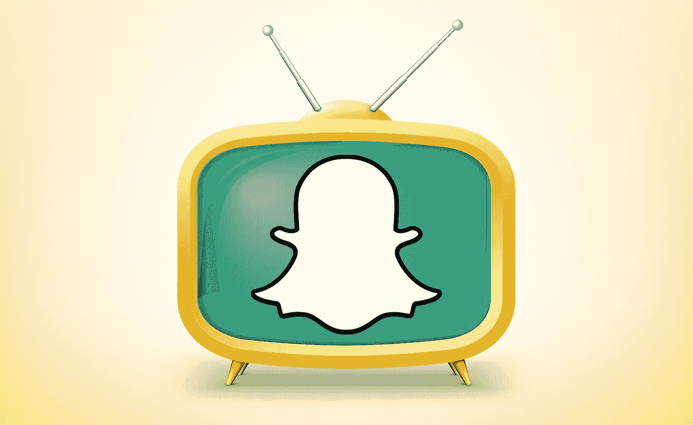
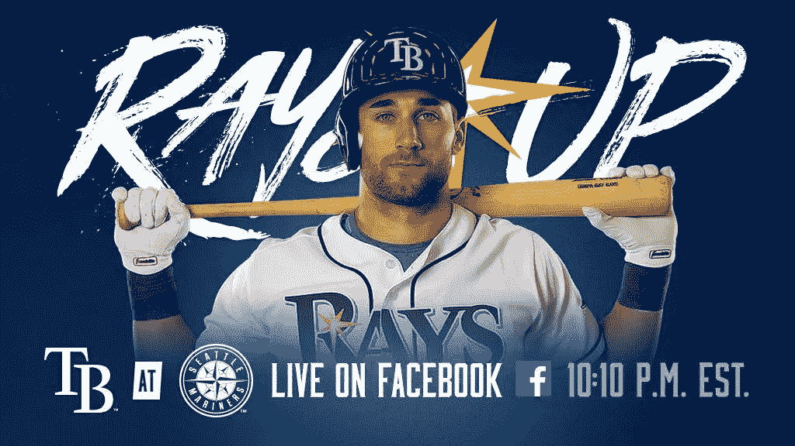
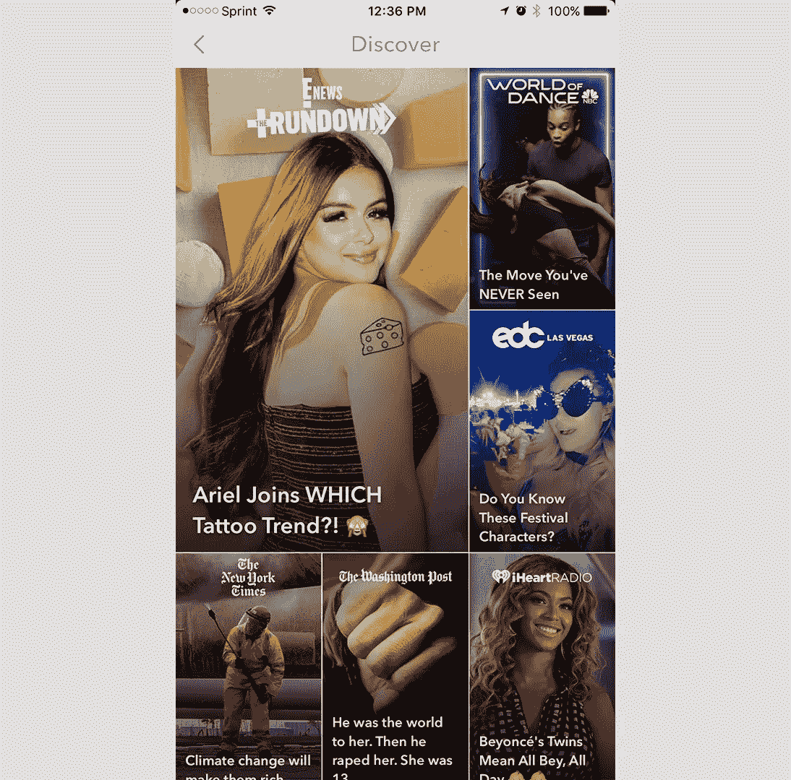

# 当社交媒体成为新的电视时会发生什么？

> 原文：<https://medium.com/hackernoon/what-happens-when-social-media-becomes-the-new-tv-fb2db546c34b>

就在你认为 Snapchat 已经通过[建造一个巨大的黄色摩天轮](https://www.recode.net/2017/6/17/15824222/snapchat-ferris-wheel-cannes-ad)作为今年戛纳电影节的广告完成了自我冲洗的时候，时代华纳走了过来，用 [1 亿美元](http://www.cnbc.com/2017/06/19/time-warner-snapchat-agree-to-100-million-content-partnership.html)作为广告和原创节目拍他们的屁股。

随着出版商、代理商和广播巨头印第安纳·琼斯(Indiana Jones)穿越毒镖和纳粹到达千年圣地，直播和社交平台特定节目正成为常态。

Twitter 正在努力成为事实上的社交体育和新闻网络，拥有大量直播活动，如网球、NBA、PGA 巡回赛和 MLB 奥运会。他们还用彭博和切达干酪报道了世界、科技和金融新闻。

在亚马逊收购了 NFL 周四晚直播权后，人们认为他们正在失去阵地，但似乎忘记了他们保留了所有重播和 gif 的权利，为他们提供了精彩节目所需的所有弹药。

随着 [16 个直播合作伙伴](http://www.adweek.com/digital/twitter-announces-16-new-livestreaming-partners-at-its-first-newfronts-presentation/)的加入，Twitter 在保持对话的直播互动节目方面遥遥领先。

脸书一直在涉足自己的编程份额，但很难找到它们在整个游戏中的确切位置。随机播放的美国职业足球大联盟足球比赛和很少激动人心的 MLB 比赛很难与 Twitter 上不断涌现的节目相比。除了广告之外，在社交 feed 中进行广播的主要吸引力是来自用户的持续对话。

当然，这通常是一场垃圾箱火灾，对脸书最高的评论似乎是“别做鬼脸了！”有 4000 张其他皱眉的脸，但在广播或直播体育赛事时，仍然是真实的人在实时互动。

现在 Snapchat 正在进入，我们不得不对自己思考，“既然我们从来没有在电视上看过它，我们什么时候才能停止称它为电视？”

时代华纳带来了一系列节目和广告选项，甚至可能让 Snapchat 上的用户获得一些 HBO 内容。这笔交易将使他们的脚本节目从每天一个增加到三个，并具有明星效应，真正吸引品牌广告触及特定人群。

每个人都倾向于忘记的是，近 80%的节目在第一季结束后就失败了，再也没有机会续约。对于所有转向社交媒体的广播公司来说，这是一个有待解决的问题。如果您只有三个项目，这是否意味着剩下的只有一半像样了？

下一个障碍是更年轻的注意力跨度和心态，变化很快。这些新的节目选择要么是独立的一次性节目，要么是 7 到 10 分钟的剧集，这会在更短的时间内给广告商带来麻烦。

无论哪种方式，都要为您的 Snapchat Discover 转换到新的 SnapGuide 做好准备，让我们看看这些节目是否真的能引起特定的、非常关注广告商的观众的共鸣。

在经历了这么多糟糕的决定和糟糕的计划后，情况必须好转，对吗？

> [黑客午间](http://bit.ly/Hackernoon)是黑客们下午的开始时间。我们是 [@AMI](http://bit.ly/atAMIatAMI) 家庭的一员。我们现在[接受提交](http://bit.ly/hackernoonsubmission)并很高兴[讨论广告&赞助](mailto:partners@amipublications.com)的机会。
> 
> 如果您喜欢这个故事，我们建议您阅读我们的[最新科技故事](http://bit.ly/hackernoonlatestt)和[趋势科技故事](https://hackernoon.com/trending)。直到下一次，不要把世界的现实视为理所当然！

