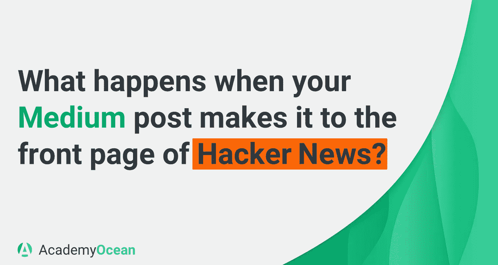
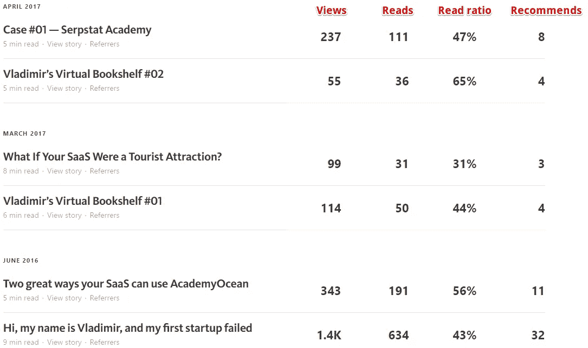
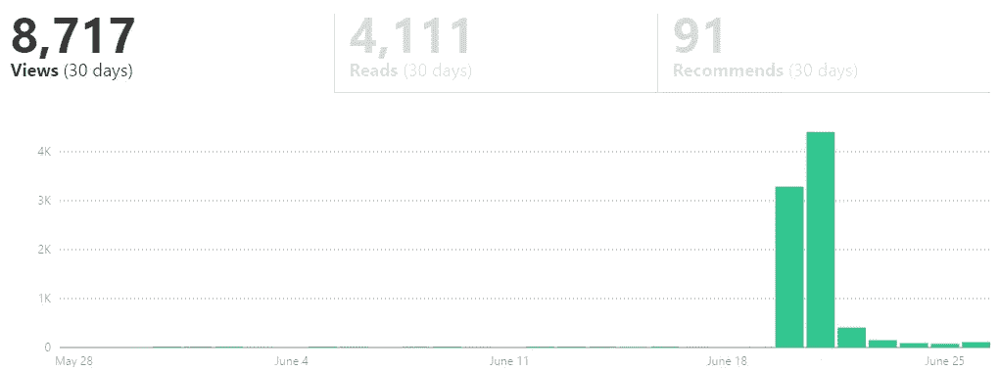
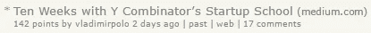

# 当你的媒体文章登上黑客新闻的头版时会发生什么？

> 原文：<https://medium.com/hackernoon/what-happens-when-your-medium-post-makes-it-to-the-front-page-of-hacker-news-a266e1ceaca>

我喜欢总结事情。例如，在每个月的**月末**我会创建一个[谷歌](https://hackernoon.com/tagged/google)文档，并为自己写一份报告，记录我的成功和失败，写下我所取得的成绩以及我仍需努力的地方。

在每年的**年底**我还会创建一个单独的文档，在那里我会总结过去的 12 个月。这份“年度报告”涵盖了个人和职业成就。

此外，在新年前夕，我会把我们在这一年里拍的所有集体照发给我们在海洋学院的团队。回顾我们分享的特别时刻(我们的第一个演示请求，我们的第一个付费客户，或者一个玩棋盘游戏的周五晚上)是很好的。

从 YC [创业](https://hackernoon.com/tagged/startup)学校毕业后，我决定写一个故事**总结这十周**。

> 我花了两个晚上写了这个小故事:[Y Combinator 的创业学校十周:一个圈内人的观点](/@VladimirPolo/ten-weeks-with-y-combinators-startup-school-an-insider-s-view-5cc3d8e5b3f)

我使用媒介有两个原因:

*   用他们的界面很容易做出好看的帖子。
*   它提供了简短但描述性的统计数据。

我的小博客的统计数据如下:

有五列:

1.  故事名称
2.  视图
3.  从头到尾阅读过你的故事的独立访问者的数量
4.  前两个指标的比率。(如你所见，在我的故事中，这个比例在 31%到 65%之间。)
5.  建议数量。这个指标介于脸书的喜欢和分享之间。当有人推荐你的故事时(通过点击一个小心形图标)，一个链接会出现在他们的个人资料上。

你可能已经注意到了，我博客上的帖子平均有 50-100 次阅读。上面表格底部的帖子是一个有趣的个人故事，阅读量高于平均水平，因为它是我一年前写的。

当我关于 YC 创业学校的新故事准备好了，我把它发给了我的 YC 小组和我的朋友们。我的 YC 小组的导师推荐我在 [**黑客新闻**](https://news.ycombinator.com/) 上**发布帖子链接。我还通过[脸书](https://www.facebook.com/academyocean/)和[推特](https://twitter.com/vodpolo)分享了它。两小时内，不寻常的事情开始发生。每 5 分钟我的帖子就有 50 个新阅读。结果，我的博客获得了巨大的阅读量。**

If you look closely at the chart leading up to June 20, you can see some nearly microscopic green columns, which represent visitor counts on a usual day. : )

我后来发现，6 月 20 日访客激增的原因是**我的故事出现在黑客新闻**的头版(只有一些帖子在那里)。我的故事甚至没有高过头版的第十一行，但仅此一项就带来了 142 个“点”和巨大的流量飙升。

第一天，我的故事被 3000 多人观看。超过一半的人从头到尾读完了这个故事。

> 在三天的时间里，这篇报道被浏览了 8000 次。

现在还很难说 Hacker News 的流量是否会转化为客户，但它的影响对我来说非常有趣，我很高兴与你分享我的观察。

**结论:**

1.**如果你正在创业(或计划创业)，利用加速器。他们的线下活动和在线课程都很有用。YC 创业学校是一个不错的选择，我认为随着时间的推移，其他大型加速器也将推出自己的在线学校。**

2.**参加完某个加速器的活动后，写一篇博文，并附上一份报告或评论**。这对你(你会从经历中记住更多)和你的读者(尤其是那些没有参加过这类活动的人)都有帮助。你的故事和反馈甚至会让你参与的活动的经理感兴趣。

3.**如果你觉得你有有趣的故事可以分享，请分享！**也许下次你会幸运的得到黑客新闻。: )另外，欢迎在评论中分享你的故事。我很想看看你参加的活动！