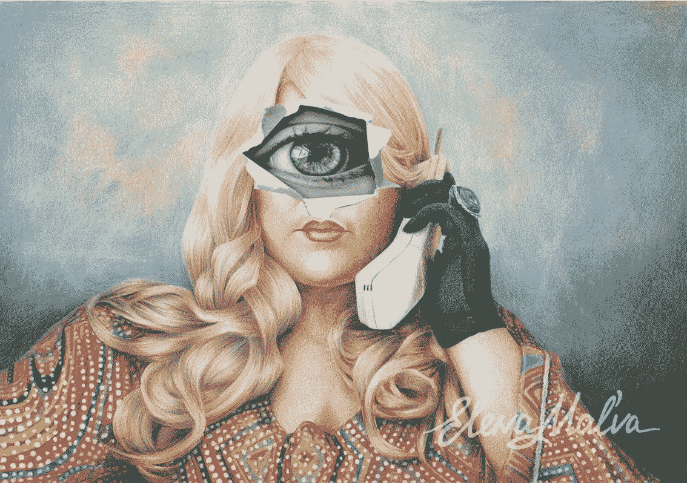
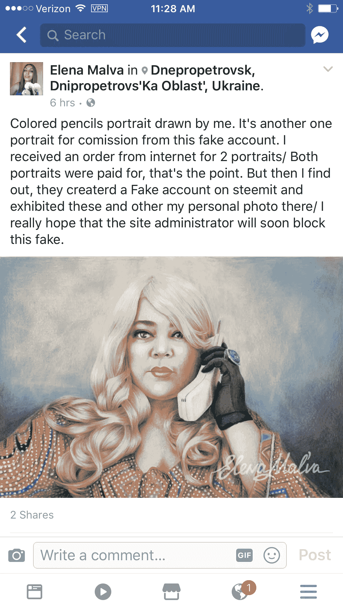
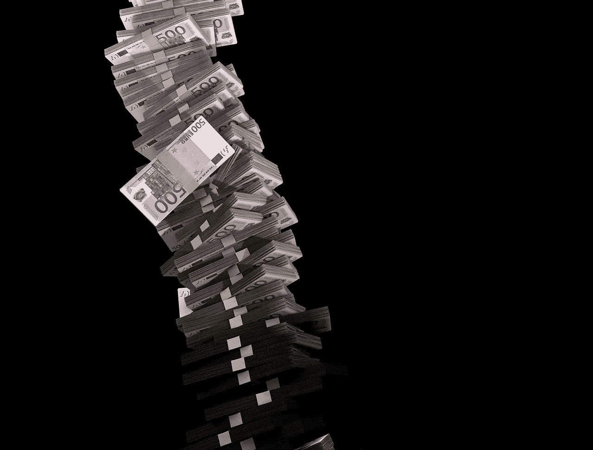
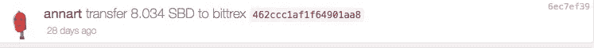
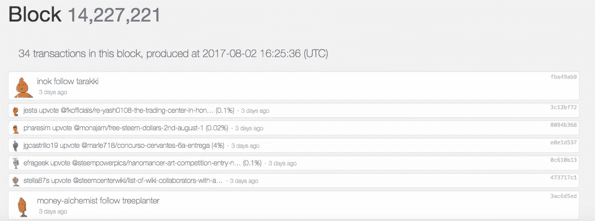
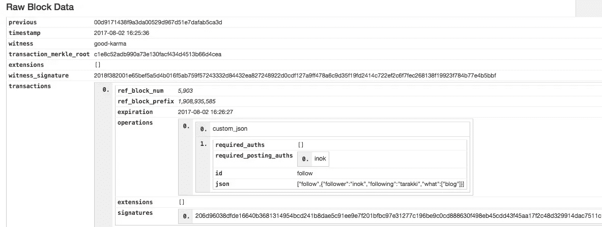
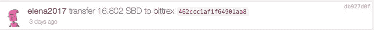
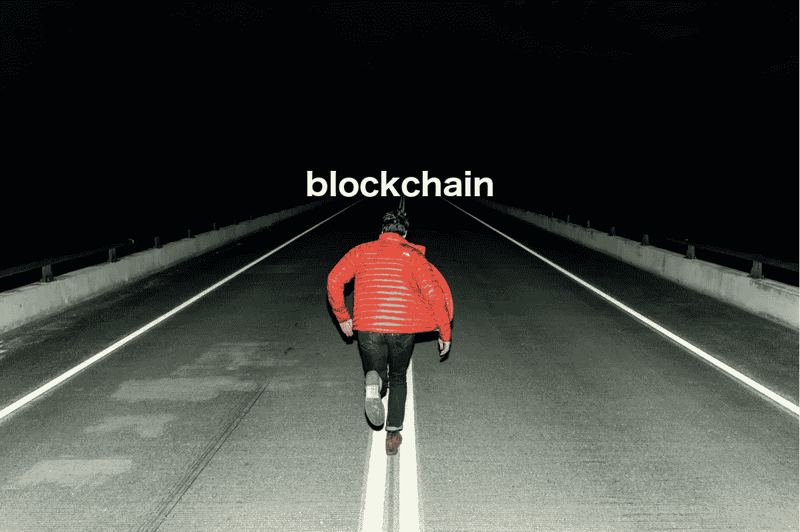

# 在帮助破获斯提米特的一个精心策划的骗局时，我对区块链的了解

> 原文：<https://medium.com/hackernoon/what-i-learned-about-the-blockchain-while-helping-to-bust-an-elaborate-scam-in-steemit-88d8580a5967>

painting of me by [Elena Malva](https://www.instagram.com/elenamalva/), commissioned by a scammer

# 软件正在吞噬世界，但区块链正在踢骗子的屁股。

如果你到现在还没听说过区块链的 ***和***，你很可能生活在岩石下。区块链 ico 让硅谷的兄弟们湿了裤子，好像一夜之间创造了一个新的宗教。

很少有人知道什么是区块链，更不用说区块链在现实世界中能做什么，但我要告诉你的故事有望说明这一点。

## 我要告诉你一个疯狂的故事。

它涉及艺术、多重身份盗窃、乌克兰、斯蒂姆·区块链、我自己和夏洛克·福尔摩斯。嗯，这不是真正的*夏洛克·福尔摩斯，而是在 [Steemit](https://steemit.com/) 的一个名为@sherlockholmes 的账户。*

## 这是:

几周前，一个名为 [@elena2017](https://steemit.com/@elena2017) 的 [Steemit](https://steemit.com/) 用户给我画了一张非常详细的肖像。我不认识这个用户，因为她当时在斯提米特不是我的朋友。这是她给我画的肖像(作为我的 Steemicide 热线角色)。相当详细，相当不错:

art by Elena Malva

我对她的帖子投了赞成票，这使她获得了一些支持，声誉得分增加，在社区中的知名度也提高了。在她画了我的肖像后，我开始支持和分享她在 Steemit 的更多帖子。她开始吸引更多的追随者，因为她的艺术才华令人印象深刻。这是我最喜欢的一个:

art by Elena Malva

## 快进几周…..

昨天，一个名副其实的用户， [@sherlockholmes](https://steemit.com/@sherlockholmes) ，透露了他对这个账户的惊人发现，@elena2017:这完全是个假的。他有证据证明这一点。@elena2017 盗用了乌克兰一位名为 [Elena Malva](https://www.facebook.com/elena.malva) 的真正艺术家的身份，并在 Steemit 上发布了她的照片、绘画和素描长达数月。但是我的肖像是怎么画的，又是谁画的呢？拿着我肖像的人是谁？有人画了我的肖像，但是是谁呢？

## 这就是故事变得超级怪异的地方。

骗子联系了真实的埃琳娜，并付给她 15 美元为我画像。骗子还要求真实的埃琳娜拿着我的肖像给自己拍照。这是一张真实的埃琳娜抱着我的照片:

Elena holds painting of me

在骗子付钱给真实的埃琳娜为我画像后，她把我的画像贴在了 Steemit 上，然后像《没有明天》一样大肆宣传。这个骗子写了几篇文章，称赞我是“斯提米特最好的博客写手”和其他类似的东西，我自然投了赞成票。

快速浏览一下真实的艾琳娜的脸书主页就能发现一个令人不安的事实，即自己正被卷入一场身份盗窃案。她明确表示，她从未加入 Steemit，有人盗用了她的身份，并在 Steemit 上发布她的作品以获取金钱利益:

夏洛克·福尔摩斯也更新了他之前关于埃琳娜的帖子。这表明[埃琳娜·马尔瓦](https://www.facebook.com/elena.malva)并不是唯一被模仿的艺术家。这个诈骗团伙延伸到了另外 4 名乌克兰艺术家，夏洛克正在解开每一个人背后的故事。所有的身份盗窃艺术家账户都与[@安娜特](https://steemit.com/@annart)联系在一起，这是一个真实的人。在 vk.com 和 https://vk.com/id57240151，夏洛克都曾联系过@annart，但与那些身份被盗的艺术家不同，这个人从未回复过夏洛克。

**你可以在这里阅读@sherlockholmes 的完整故事:**

[https://stee MIT . com/stee MIT/@ sherlockholmes/case-6-busting-annart-s-Ukrainian-fake-artist-ring](https://steemit.com/steemit/@sherlockholmes/case-6-busting-annart-s-ukrainian-fake-artist-ring)

就在这个时候，我决定在区块链上做一点搜索，以确保所有这些信息都是正确的。因为我直到最近才听说过@sherlockholmes，所以我想确保他的证据坚如磐石。

## **资金如何流入流出 Steemit**

了解资金如何流入流出 Steemit 很重要。为了从 [Steemit](https://steemit.com/) 中提取你的 Steem，你需要在一个加密货币交易所设立账户，比如[Bittrex.com](https://bittrex.com/)。由于这个骗子使用了 Bittrex，让我们来看看它是如何工作的。

Steem 的每个 Bittrex 帐户都有一个与之关联的备忘录标识。所以，每次你从 Steemit 提取 Steem 到你的 Bittrex 账户，你必须使用你的 memo id。如果你不使用它，Bittrex 将不知道把你的 Steem 发送到哪里，你将会失去你的钱。

备忘录 id 就像您在 Bittrex 中的个人地址。这是你的身份证明。这些备忘录 id 显示在每个人的帐户中，因为 Steemit 在区块链上运行，所以每个人都可以研究这些数据。这也意味着每个人都可以看到每个人的账户，因为所有的钱包和金钱交易都是透明的。事实上，你可以在 Steem 区块链上看到所有活动，甚至删除评论。

因此，我查看了@annart 在 Steem 区块链的交易，以便找到一个与她向 Bittrex 提款有关的备忘录 id:

## @annart 的 Bittrex 备忘录:
(注意备忘录 id: 462ccc1af1f64901aa8)

如果你以前从未见过区块链，机会来了:

当我们单击原始数据块时，我们可以更深入地了解区块链结构:

接下来，我想从夏洛克指控由@annart 运营的其他账户中找到一个 Bittrex memo id。这里有一个来自@elena2017 的交易，果然备忘录 id 和@annart 的完全一样。

## (注意备忘录 id: 462ccc1af1f64901aa8)

这意味着这两个 Steemit 账户的钱进入了同一个 Bittrex 账户。其实所有的假账号:@elena2017、@nellyhandmade、@katrinart、 [@juliyahandwork](https://steemit.com/@juliyahandwork) 用的都是一模一样的 memo id， **462ccc1af1f64901aa8** ，和@annart 一样。所有 5 个 Steemit 账户的钱都进入了一个 Bittrex 账户。

# “跟着钱走”这句话在这种情况下非常适用。

夏洛克更进一步，在传统社交媒体网站(VK.com，脸书，Instagram)上追捕所有被认为身份被盗的艺术家，以确认他们不在 Steemit 上。所有被问到的艺术家都告诉他他们不在 Steemit。@annart 账户是唯一一个没有回复他的账户。

很明显，一个涉及 4 起身份盗窃的精心策划的诈骗团伙正在由@annart 运作。

我做了一点额外的调查，发现所有这些账户也倾向于互相支持。这是意料之中的，因为在 Steemit 获得关注需要更多的投票和评论。

在用《区块链》证实了夏洛克的证据后，我开始标记这些账户发布的帖子，从而拿走他们获得的任何金钱奖励。我倾向于避免在 Steemit 标记人，除非绝对必要，就像在这种情况下一个真正的身份窃贼。

但我的投票权和衰退力不会永远持续下去。在@elena2017 上标记了超过 15-20 个不同的帖子之后，加上一天对作者的投票，我的投票优势几乎荡然无存。控制这种投票强度行为的算法是有意创建的，以防止个人滥用。

就我而言，因为我在 Steemit 非常努力地工作了一年多，并获得了 Steemit 社区许多人的信任，所以我写了[一篇帖子，请求其他鲸鱼的帮助](https://steemit.com/scam/@stellabelle/i-need-help-from-my-whale-friends-to-flag-scammer-elena2017-who-stole-the-identity-of-an-artist)(stee MIT 的鲸鱼是那些拥有大量账户并有能力取消金钱奖励以及降低他人声誉的人。)一个骗子被抓的消息传开后，其他人蜂拥而至，开始标记这 5 个账户。

没有区块链，任何欺诈活动都不可能知道*。*普通公民可以访问这些不可更改的区块链数据，从而调查可疑活动。

# 这才是现在大家对 ***对【区块链】*** 尿湿裤子的真正原因。

这在以前是不可能的，因为金钱交易一直隐藏在普通公民之外…… *直到现在。*

# 但是不要搞错，区块链不会独自去摧毁一个诈骗团伙。

## 区块链只是一个工具。

## 区块链是人类的工具。

## 区块链是一个可以被利用或忽略的工具。

## 区块链的用处取决于使用它的人。

如果这个世界，以及其中所有的人都不再关心欺骗、身份盗窃、诈骗和腐败，猜猜会发生什么？区块链变得没用了。而且，如果我们所有人都不为自己和社会负责，总是认为:

> “让别人去处理吧，”

区块链将变得无用。

我的一位脸书朋友在阅读了乌克兰诈骗团伙后评论道:

> “来自乌克兰的骗子？这太糟糕了，因为没有一个系统可以处理她。希望你的 Steem 团队炸了她！”

我回答:

> “欺诈无处不在，但由于我们所有的交易在区块链都是透明的，欺诈很容易被识破。有一个系统:它被称为激情社区。”

一个充满激情的虚拟社区意味着人们真正关心发生在他们身上的事情。我以前从未有过像区块链这样的工具，我承认这是一个全新的强大组合:

## 在乎+区块链=彻底改变让社会变得更好。

像川普这样的人很有可能无法在未来的区块链共存。

这个故事最精彩的部分是，夏洛克和我找到了真正的埃琳娜，让她知道她的诈骗犯正在受到惩罚，她将很快在 Steemit 变成一个非实体。此外，我还亲自邀请了 Elena 去 Steemit，希望当她加入时，我会把她介绍给 Steemit 社区，这样人们就会知道她是真正的明星。