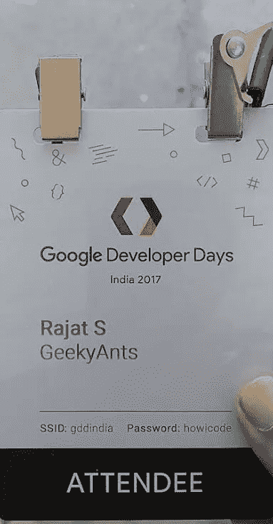
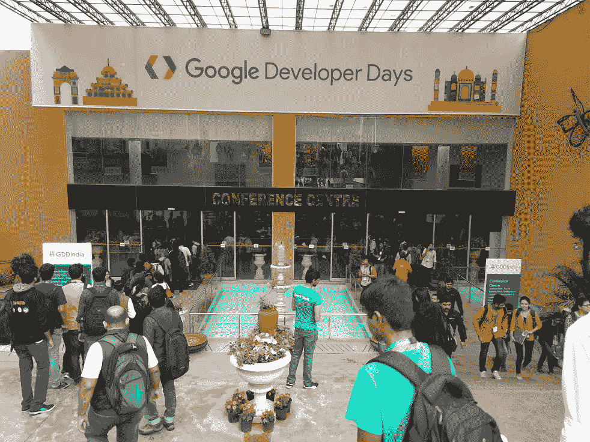
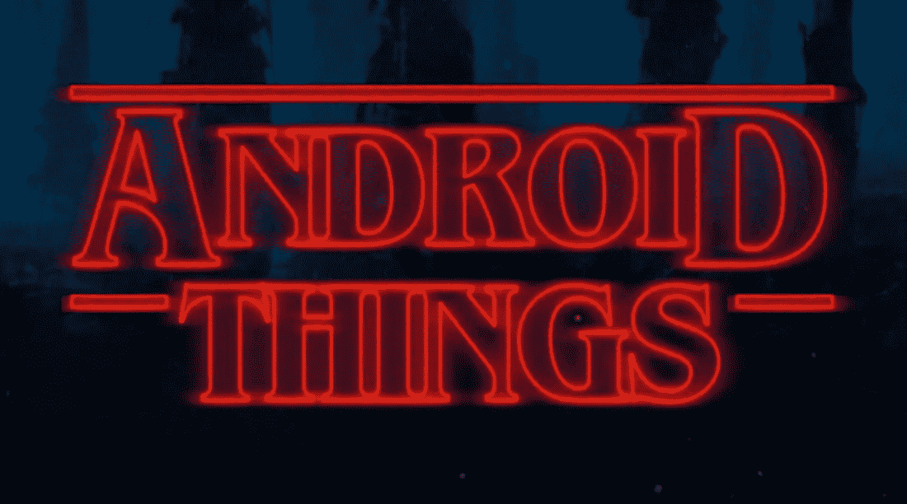
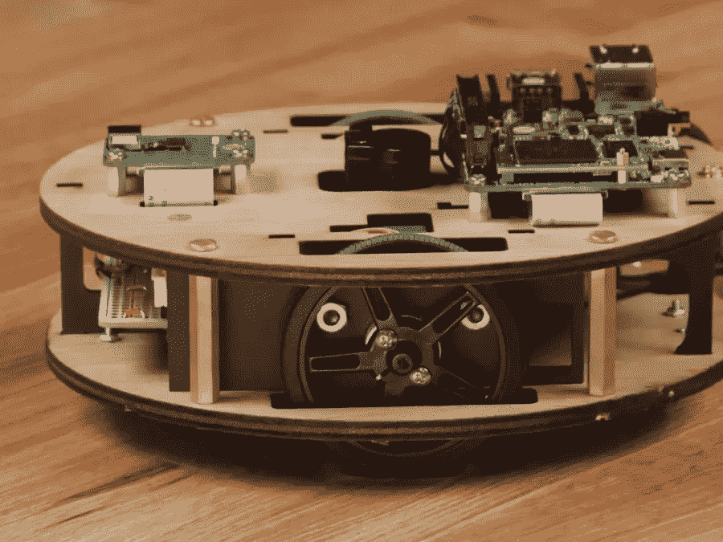
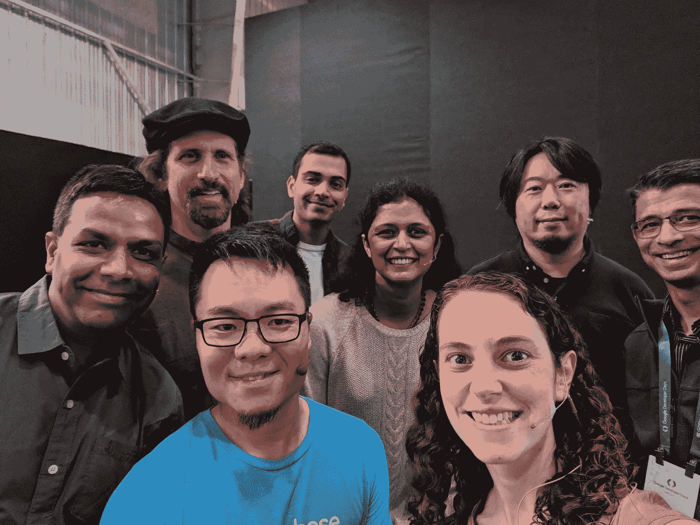

# 我在谷歌开发者日学到的——第一天

> 原文：<https://medium.com/hackernoon/what-i-learned-at-google-developer-days-day-1-97b316c06321>

## “印度 GDD”于 2017 年 12 月 1 日和 2 日在印度班加罗尔举行

# 这篇文章是关于谷歌开发者日的第一天

*   **第一天**
*   [第二天](/@rajat_57730/what-i-learned-at-google-developer-days-day-2-f3431ea7c670)

# TL；速度三角形定位法(dead reckoning)

点击此处查看所有会谈录音:

以下是所有培训课程的代码和说明:

 [## 2017 年谷歌开发者日

### 谷歌代码实验室

codelabs.developers.google.com](https://codelabs.developers.google.com/gdd17) 

# 什么是谷歌开发者日？

[谷歌开发者日](https://developers.google.com/events/gdd-india/?utm_source=devsite&utm_medium=events&utm_campaign=past) (GDD)是展示谷歌最新开发者产品和平台的全球性活动。

我是有机会参加这次活动的幸运儿之一。在本帖中，我将分享我的一些见解、回忆和我在这个令人惊叹的活动中学到的一切。

我是在孟买参加 GDG 发展节时知道 GDD 的。由于这是 GDD 第一次在印度举行，我立即报名了！虽然我被告知被选中为时已晚，但我希望我会被选中。瞧啊。我在活动前几天才收到确认邮件。

# 地铁网络😆

我在活动中遇到了一些非常酷的人。但是我在回家的路上也在地铁里遇到了一些人。

老实说，我在运输途中做了大部分的网络工作。部分原因是因为活动中的演讲太棒了，我完全全神贯注地听演讲者讲了些什么！

另一部分原因是，即使作为一个内容作家，我也认为自己是一个 React 本地人！所以对我来说，很难与那些坚定支持 Android 的开发者联系起来。

# 场地

该活动在一个名为“ [BIEC](http://www.biec.in/) ”的地方举行，这是印度顶级的国际展览&会议设施。BIEC 补充其 4 万平方米的覆盖空间在四个美学和功能设计的展厅。这个地方太大了，甚至两天都不足以让我完全探索它。

撇开巨大的场地不谈，有太多的事情同时发生，不可能看到、做和体验所有的事情。此外，几乎所有的活动都要排长队😆。

我见到了来自世界各地的开发人员，包括初学者和专家。有来自知名公司如 PayPal 的开发者，也有来自新兴公司的开发者。

这次活动充满了来自谷歌和开发者社区的关于各种谷歌产品的讨论。

# 第一天

GDD·因迪亚就是这样被推出的:

感谢谷歌开发者选择了这首美妙的音乐😄。

# 好东西——安卓的东西

在沙盒区，有一个可爱的小机器人。

Drawbot 使用 Pico Pro 驱动的摄像头捕捉图像，然后将其缩放到屏幕上。然后机器人在纸上画下捕捉到的图片。

令人惊讶的是，我们实际上可以将 Pico Pro Maker 套件带回家！😂

# 社区休息室

社区休息室有一些非常好的谈话和讨论。在这里，我学到了 gdg 和 meetups 如何帮助传播我们的知识，并帮助发展社区。

“Solve for India”计划旨在指导开发者。这显示了很大的希望。

我有机会见到许多开发者、企业家、爱好者和学生。

# 第一天会谈

## 开幕主题演讲

[潘卡伊·古普塔](https://medium.com/u/f17d9945ab70?source=post_page-----97b316c06321--------------------------------)、[丹尼尔·高尔平](https://medium.com/u/2e0fc9a4a8c2?source=post_page-----97b316c06321--------------------------------)、[弗朗西斯·马](https://twitter.com/cantforget)、萨吉特·米什拉、[塔尔·奥本海默](https://twitter.com/taloppenheimer)、[卡兹·佐藤](https://medium.com/u/4b21e207ea2c?source=post_page-----97b316c06321--------------------------------)和阿尼塔·维贾亚库玛讲述了谷歌开发者产品和平台的最新消息和更新，如[安卓](https://www.android.com/)、[谷歌助手](https://assistant.google.com/intl/en_in/)、[谷歌云平台](https://cloud.google.com/)、[Firebase](https://firebase.google.com/)

So many speakers in one keynote!!

## 渐进式网络应用:什么，为什么和如何？

在这次演讲中，[萨姆·达顿](https://medium.com/u/83614ef87b86?source=post_page-----97b316c06321--------------------------------)与来自 [UC 浏览器的林杰伟](https://twitter.com/UCBrowser)和[萨拉·克拉克](https://medium.com/u/52b2e167411?source=post_page-----97b316c06321--------------------------------)解释了为什么渐进式网络应用被认为是下一个大事件！通过结合最好的网络和应用程序，PWAs 即使在不稳定的网络上也能快速加载。PWAs 还可以通过发送推送通知来重新吸引用户，并作为顶级全屏体验进行加载。

这句假话真让我捧腹大笑😆：

> “最好的应用程序是最少的应用程序”——亚伯拉罕·林肯(不是)

## 使用 [TensorFlow](https://www.tensorflow.org/) 和 [Cloud ML](https://cloud.google.com/ml-engine) 的真实世界机器学习

[Kaz Sato](https://medium.com/u/4b21e207ea2c?source=post_page-----97b316c06321--------------------------------) 在这里谈到了 tensor flow——谷歌用于机器学习的开源库。

TensorFlow 自 2015 年推出以来，一直在推动机器智能世界的民主化。将 TensorFlow 与 Cloud ML 的可扩展性结合起来，几乎任何人都可以使用 TensorFlow 以非常便宜的价格，在没有太多专业知识的情况下，获得一些真正的深度学习技术。

## 介绍[云 Firestore](http://irebase.google.com/cloud/firestore‎)

自从测试版发布以来，人们一直在谈论云 Firestore。在本次演讲中，[丹·麦格拉思·☁](https://medium.com/u/2b0e2a4871b8?source=post_page-----97b316c06321--------------------------------)分享了所有关于云 Firestore 的细节，并展示了如何使用这一令人敬畏的新技术构建可扩展的应用。

基本上，Cloud Firestore 是一个完全托管的 NoSQL 文档数据库，用于移动和 web 应用程序开发，旨在轻松存储和同步全球范围内的应用程序数据。

## 测试科特林

在这次演讲中，[肖恩·麦克奎蓝](https://medium.com/u/9440003af14a?source=post_page-----97b316c06321--------------------------------)通过深入写作测试，教我们如何使用[科特林](https://kotlinlang.org/)。

Kotlin 是一种与 Java 和 Android Studio 完全集成的高级语言。Kotlin 取得了如此巨大的成功，以至于它已经可以创建生产级的应用程序了！

Sean 证明开发人员可以通过用这种语言编写可读的测试来轻松学习这种语言。

## 用 [AMP](https://www.ampproject.org/) 建立一个电子商务网站

加速移动页面(AMP)项目是谷歌的一个开源项目，旨在让网络对所有人都更好。

该项目使网站和广告的创建始终快速、美观和高效，不受设备和分发平台的影响。

在 AMP 中发布的 Webp 页面和广告几乎可以即时加载，让用户在移动和桌面上获得流畅且更具吸引力的体验。

出版商和广告商可以决定如何展示他们的产品以及使用哪些技术供应商，同时保持和提高关键性能指标。

在这次演讲中， [Ben Morss](https://twitter.com/benmorss) 和 Raghu Simha 向我展示了使用 AMP 可以做的所有令人惊奇的事情，包括如何使用 AMP 创建一个完整的电子商务网站。

## 潜入[奥利奥](https://www.android.com/versions/oreo-8-0/)和[支援库](https://developer.android.com/topic/libraries/support-library/index.html)

不，这个演讲不是关于美味的奶油饼干。 [Daniel Galpin](https://medium.com/u/2e0fc9a4a8c2?source=post_page-----97b316c06321--------------------------------) 谈到 Android 8.0 (Oreo)和支持库，它提供了一种标准的方式来在早期版本的 Android 上提供更新的功能或优雅地退回到等效的功能。

此外，支持库提供了标准框架 API 中没有的额外的便利类和特性。这些类使开发变得更加容易，并提供对附加设备的支持。

## 物联网、 [TensorFlow](https://www.tensorflow.org/) 和[谷歌助手](https://assistant.google.com/intl/en_in/)是怎么回事

谷歌有各种各样的平台和工具来支持随时随地的计算。

在本专题讲座中， [Wayne Piekarski](https://medium.com/u/b0d0b1a4ba7?source=post_page-----97b316c06321--------------------------------) 讲述了如何利用 Android 简化物联网设备的开发和生产。

还可以学习如何为 Google Assistant 开发应用程序，并与用户进行交流。更有甚者，看看 Android 手机、Android Wear、电视如何让用户随时随地与你的服务互动。

[Wayne](https://medium.com/u/b0d0b1a4ba7?source=post_page-----97b316c06321--------------------------------) 还谈到了 TensorFlow 如何在不同类型的物联网应用中简化机器学习。

## 使用谷歌上的[动作为谷歌助手开发对话应用](https://developers.google.com/actions/)

[丹尼尔·伊姆里-斯图纳亚克](https://medium.com/u/f0885637f153?source=post_page-----97b316c06321--------------------------------)讲述了谷歌上的操作如何扩展谷歌助手的功能，让我们可以创建自己的对话应用。

Daniel 还谈到了 Google Actions 的关键组件，并向我展示了如何使用 DialogFlow 等工具轻松构建 Google Assistant 的应用程序。语音用户界面真的让我大吃一惊！VUI 可以用来创造一个真正引人注目的对话式用户体验。

## 位置和电池

我们都喜欢基于位置的应用程序。不管是优步、OLA、Foodpanda 还是 Pokemon Go。这些应用程序有一个共同点，那就是它们都严重依赖于位置。但是定位反过来依赖于电池用户。

众所周知，使用定位服务的应用程序是电池消耗的主要来源之一。Shailen Tuli 讲述了位置和电池之间的复杂关系，讨论了编写位置丰富的应用程序同时最大限度地减少电池消耗的策略。

## 利用 [Firebase](http://firebase.google.com/official/site‎) 获得切实可行的见解

分析和洞察是每个应用成功的核心。 [Amrit Sanjeev](https://medium.com/u/65fb31e804c4?source=post_page-----97b316c06321--------------------------------) 讲述了 Firebase 如何回答关于应用用户及其行为的关键问题。这将帮助你对你的产品路线图做出明智的决定。

## 渐进式 Web 应用的框架和工具

两年前，如果开发人员想要利用浏览器中的新 API，他们必须自己完成大部分应用程序的安装。

今天，我们拥有强大而健壮的工具，任何背景的开发人员都可以使用这些工具快速发布更具吸引力的应用程序。在本次会议中， [Rowan Merewood](https://medium.com/u/485bfc970aa2?source=post_page-----97b316c06321--------------------------------) 讲述了最佳 PWA 实践和实用技巧以及各种入门工具。

## 架构组件—用例

Architecture Components 是一组库，可以帮助您设计健壮的、可测试的和可维护的应用程序。

弗洛里纳·蒙特内斯库讨论了这些库的功能，并向我们展示了设计优秀应用应该遵循的模式。

## 容器、 [Kubernetes](https://kubernetes.io/) 和谷歌云

可以理解的是，设计单个微服务更容易。但是当我们需要创建多个微服务时，事情开始变得混乱。

管理一个微服务集群，同时担心推出和回滚、按需扩展单个服务以及在服务之间安全地共享数据是一项极其复杂的工作。

为了解决这个问题，Google 创建了 Kubernetes:一个开源的容器管理系统。

[KC Ayyagari](https://twitter.com/kc_ayyagari) 采用简单的微服务，使用 [Docker](https://www.docker.com/) 将其封装，然后将其扩展到由 Kubernetes 管理的弹性微服务集群。同时解释为什么 Kubernetes 是一个自动化部署、操作和扩展容器化应用程序的优秀系统。

## 现代工具、测试和自动化:开始使用[灯塔](https://developers.google.com/web/tools/lighthouse/)和[木偶师](https://github.com/GoogleChrome/puppeteer)

> 现代 Web 开发需要现代工具。

Eric Bidelman 和 Vinamrata Singal 谈论了 Chrome DevTools 团队的最新产品。

Lighthouse 是一个开源的自动化工具，用于提高网页质量。它可以在任何网页上运行，公共的或需要认证的。Lighthouse 提供对性能、可访问性、渐进式 web 应用等的审计。

Puppeteer 是一个节点库，它提供了一个高级 API 来控制 DevTools 协议上的“无头”Chrome。它也可以配置为使用全铬。

## 使用[插件](https://developers.google.com/apps-script/add-ons/)扩展 Google 文档、表单和幻灯片

[Wesley Chun](https://medium.com/u/3b9af9a62a52?source=post_page-----97b316c06321--------------------------------) 讲述了如何通过使用附加组件将自己的功能添加到 G Suite 应用程序中，如 Google Docs、Sheets 和 Slides。

附加组件允许开发人员编写代码来访问他们的数据，包括定制用户界面中的菜单和侧栏，从另一个服务器获取数据或连接到数据库。

Google Apps Script 是一种 JavaScript 云脚本语言，提供了跨 Google 产品和第三方服务自动执行任务以及构建 web 应用程序的简单方法。

## 质量胜于数量:为什么质量很重要

Johannes Tonollo 和 Nick Fortescue 向我展示了如何使用材料设计和 Android Vitals 来改善用户体验，提高参与度和忠诚度。

## 网络的下一步是什么

[托马斯·斯坦纳](https://medium.com/u/58f11e0c64fa?source=post_page-----97b316c06321--------------------------------)谈到了网络世界即将发生的事情。他讨论了 API、平台和技术。

我最喜欢的部分是杰克·阿奇博尔德[的 ***网络测验*** 😄。](https://medium.com/u/f87cd234b9d9?source=post_page-----97b316c06321--------------------------------)

# 《余兴小聚会》

感谢 Raghu Dixit 和他的乐队，GDD 的第一天以充满活力的音乐体验结束。他成功让观众放下手机，举起手来！一个真正不可能的壮举😆。

# 未完待续…

这一切都发生在 GDD 的第一天😄。

点击这里了解[第二天](/@rajat_57730/what-i-learned-at-google-developer-days-day-2-f3431ea7c670)发生了什么惊人的事情！

我是 Rajat S， [GeekyAnts](https://geekyants.com/?utm_source=medium&utm_medium=article&utm_campaign=blog) 的技术内容作者。有抱负的程序员还有很长的路要走。一个热爱漫威电影的铁杆 DC 漫画迷。以多任务处理著称。

感谢阅读，希望这是有帮助的！必定👏在这里和推特和脸书上关注我，了解我的新帖子！