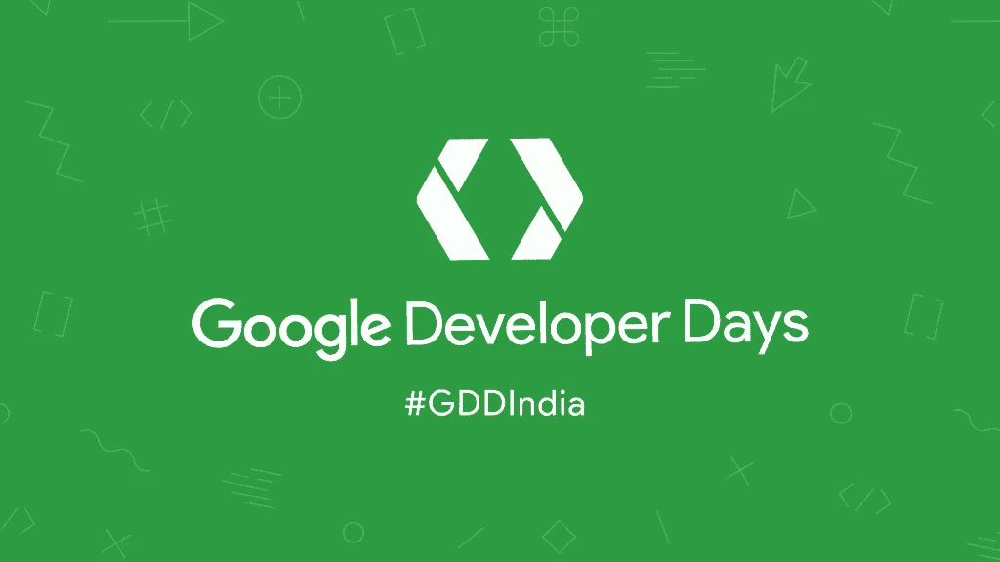
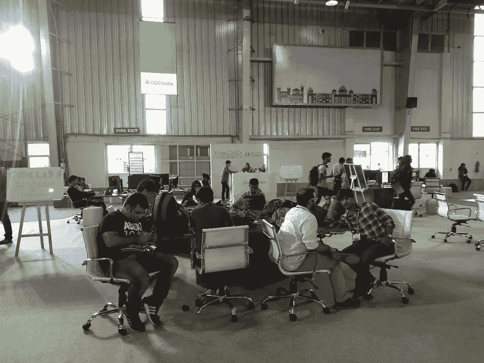
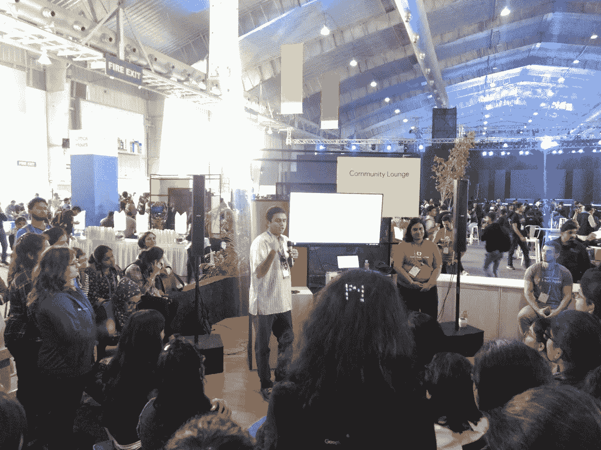
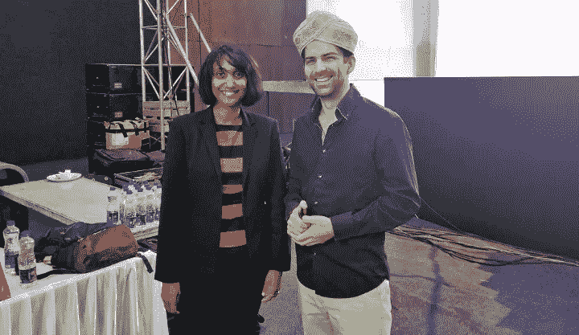

# 我在谷歌开发者日学到的——第二天

> 原文：<https://medium.com/hackernoon/what-i-learned-at-google-developer-days-day-2-f3431ea7c670>

## “印度 GDD”于 2017 年 12 月 1 日和 2 日在印度班加罗尔举行

# 这篇文章是关于谷歌开发者日的第二天

*   [**第一天**](/@rajat_57730/what-i-learned-at-google-developer-days-day-1-97b316c06321)
*   **第二天**

# TL；速度三角形定位法(dead reckoning)

点击此处查看所有会谈录音:

以下是所有培训课程的代码和说明:

 [## 2017 年谷歌开发者日

### 谷歌代码实验室

codelabs.developers.google.com](https://codelabs.developers.google.com/gdd17) 

# 第二天

第二天我决定放松一下。所以我大部分时间都在沙盒里。

沙盒是分配给开发人员进行交流的地方。还有展示各种谷歌产品的摊位，如[谷歌助手](https://assistant.google.com/intl/en_in/)、[安卓系统](https://developer.android.com/things/index.html)、[灯塔](https://developers.google.com/web/tools/lighthouse/)等等。

还有一个叫 Codelabs 的地方，在那里开发者可以坐下来研究谷歌提供的各种编码项目。

在社区休息室里还有一整天的非正式谈话。在这里，你可以听各种各样的谷歌人谈论各种各样的事情，或者只是坐下来充电。😄

# 第二天会谈

## 第 2 天主题演讲

[Sebastian Trzcinski-Clement](https://twitter.com/SebaTrz)与 Geetha Manjunath 一起发表了主题演讲，后者是一家利用人工智能和基于机器学习的算法在非常早期阶段检测乳腺癌的初创公司 [Niramai](http://niramai.com/) 的首席执行官。

Sowmya and Sebastian

紧接着 Sebastian 的是 Sowmya Subramanian，他谈到了包容性设计范例。

假设你正在设计一种算法，它拍摄图像并检查图像中是否有人类。现在，如果你的系统只从浅肤色人类的图像中学习，它将不会把你图像中的深肤色人类归类为人类。

为了避免这种情况，你的算法需要对所有人都是可用的、可访问的和包容的。

## 性能工具

[Amrit Sanjeev](https://medium.com/u/65fb31e804c4?source=post_page-----f3431ea7c670--------------------------------) 讲述了在衡量应用质量时，用户体验是多么重要。电池消耗、无响应或有问题的 UI、缓慢的安装速度和高 RAM 使用率会导致糟糕的用户体验，进而导致 Play Store 上的负面评论。

Amrit 还谈到了添加到 [Android Studio](https://developer.android.com/studio/index.html) 的新工具，以及如何使用它们来极大地改进应用程序。

## 使用[安卓系统](https://developer.android.com/things/index.html)构建生产物联网设备

[Wayne Piekarski](https://medium.com/u/b0d0b1a4ba7?source=post_page-----f3431ea7c670--------------------------------) 在本次会议中，他谈到了 Android Things，这是谷歌的一个平台，旨在利用 Android 的强大功能和安全性来构建物联网产品。

在 Android Things 中，开发人员可以使用熟悉的工具，如 Android Studio 和 Android SDK，轻松开发物联网软件，并将硬件从单个原型扩展到生产。

从创业公司到大公司，任何人都可以大规模地构建商业产品。 [Wayne](https://medium.com/u/b0d0b1a4ba7?source=post_page-----f3431ea7c670--------------------------------) 解释了将 Android 应用到您的工作流程中所需的步骤。

## PWA + [AMP](https://www.ampproject.org/) =对用户和开发人员都很容易

[Ben Morss](https://twitter.com/benmorss) 谈到了 PWAs 在移动网络上实现类似应用程序的体验。加速移动项目(AMP)使用户的网络速度更快，开发者的网络更简单。

将 PWAs 和 AMP 放在一起给了我们一个简单的方法来构建一个快速、漂亮、身临其境的 web 应用。

## 情境中的移动:流动和导航的设计原则

随着新技术和新技术几乎每天都在进步，这些技术提供的经验证明，现在是进入移动和 web 应用生态系统的绝佳时机。

我有机会听珍妮·戈夫讲述今天如何让我们的手机设计和开发适应用户的工作方式。

我们创造的设计需要直观和完善。虽然每天都有新的技术出现，让我们的工作变得更容易，但是开发人员需要理解用户的需求，并相应地创造出符合用户需求的体验。

在这里，Jenny 讨论了一些关于导航和流程的原则，以及用户研究如何改进移动应用程序设计。

## 谷歌助手和高级主题的新功能

Silvano Luciani 谈论谷歌助手的所有新的高级功能。

通过谷歌助手，人们现在可以实现购物体验的支付、交易和定位，将对话转移到不同的表面，等等。

在众多新功能中，谷歌助手现在提供了对智能家居设备的支持，并可以与你自己的物联网设备集成。

## 在后台运行

在 Android 的世界里，“背景”是一个超载的术语。它用于描述不同上下文中的事情，例如在应用程序处于前台时运行 UI 线程，在应用程序进入后台后运行很短时间，在收到高优先级 FCM 数据消息时运行很短时间，或者运行计划的作业。

Nasir Khan 在他的演讲中谈到了一些最佳实践，以及适用于当前和未来各种用例的解决方案。

## 从网站到渐进式网络应用

在这个关于 PWA 的讲座中， [Pete LePage](https://medium.com/u/7c0452c75d1?source=post_page-----f3431ea7c670--------------------------------) 谈到了从哪里开始，实施什么，以及如何确定优先级和 PWA 技术。

## [谷歌云物联网核心](https://cloud.google.com/iot-core/)技术深度挖掘

[Gus Class](https://medium.com/u/282bfd5a4236?source=post_page-----f3431ea7c670--------------------------------) 讲述 Google Cloud 物联网核心产品的高级功能。

在这次演讲中，我了解了构成云解决方案的所有底层 Google can 产品，以及它们如何让您在产品中大规模添加物联网功能，包括数据导入和分析。

## 使用 Android 构建丰富的媒体体验

> 伟大的内容是伟大的媒体应用程序的基础，但是伟大的用户体验需要在 Android 上利用正确的媒体和用户界面功能。

[Paul R. Saxman](https://medium.com/u/c4e89ed47d1c?source=post_page-----f3431ea7c670--------------------------------) 和 [Daniel Galpin](https://medium.com/u/2e0fc9a4a8c2?source=post_page-----f3431ea7c670--------------------------------) 讲述了如何使用平台特性(如 Android Media Framework、画中画、MediaStyle 通知以及 Android TV 上的新频道和节目 API)来打造出色的媒体应用体验。

本专题讲座还介绍了在创建媒体创作应用时，Android 高性能音频的新特性。

## [安卓](https://www.android.com/)遇上 [TensorFlow](https://www.tensorflow.org/)

[Kaz Sato](https://medium.com/u/4b21e207ea2c?source=post_page-----f3431ea7c670--------------------------------) 和 Anitha Vijayakumar 谈论了开发人员通过将 Android 与 TensorFlow 相结合可以做的所有令人惊讶的事情！

TensorFlow 是一个多用途的机器学习框架。TensorFlow 可以在任何地方使用，从在云中跨集群训练大型模型，到在像手机这样的嵌入式系统上本地运行模型。

[Kaz Sato](https://medium.com/u/4b21e207ea2c?source=post_page-----f3431ea7c670--------------------------------) 还向我们展示了如何创建定制的图像识别模型，如何优化您的模型，如何压缩您的模型，以及如何在预先制作的 Android 应用程序中运行它。

## 打造一款[安卓即时应用](https://developer.android.com/topic/instant-apps/index.html)

作为一个用户，我们可能知道当应用程序开始加载甚至安装时是多么令人沮丧。解决这个问题最简单的方法就是缩小 APK 的尺寸。

更小的 apk 不仅为用户提供了更快的下载，而且重构过程通常会简化你的代码库。

这一简化过程为你的应用程序准备了 Android 即时应用程序:应用程序共享和发现的一次进化。Android Instant Apps 允许 Android 用户即时运行您的应用程序，无需安装。

Android 即时应用程序，可以从 URL 打开，提供原生应用程序体验，没有完全安装的摩擦。

[林珈安·藤原](https://medium.com/u/fdba971ca390?source=post_page-----f3431ea7c670--------------------------------)和[阿尼鲁德·德瓦尼](https://medium.com/u/a1d4bb5535c9?source=post_page-----f3431ea7c670--------------------------------)讲述了许多可以用来缩小你的 APK 尺寸、模块化你的应用程序和构建你的第一个 Android 即时应用程序的工具。

## [谷歌云平台](http://cloud.google.com/‎)基础:导游

云计算中有很多需要理解的东西，马克·科恩和 T2 在这次会议中帮助了我，他们亲自指导我使用谷歌云平台在云计算中解决问题的惊人范围和深度。

## 搜索的国际化和结构化数据

让一个多语言或国际化的网站在搜索中运行良好是一项非常复杂的工作。我从 Aaseesh Marina 的演讲中了解到这一点，他在这个主题上提出了一些非常重要的见解，并为搜索引擎添加了结构化数据。

## 为 Firebase 编写一个具有[云功能](https://cloud.google.com/functions/)和[云 Firestore](http://irebase.google.com/cloud/firestore‎) 的应用程序

Firebase 和 Google Cloud Platform 一起允许开发者快速构建非凡的移动和网络应用。迈克·麦克唐纳、[丹·麦格拉思·☁](https://medium.com/u/2b0e2a4871b8?source=post_page-----f3431ea7c670--------------------------------)和托德·伯恩在舞台上现场制作了一个应用程序，并演示了如何使用 Firebase 创造出色的用户体验。

此外，我学会了如何使用云 API，而不必启动服务器或管理基础设施。Firebase 使构建应用程序变得更加容易，而谷歌云平台使扩展变得更加容易。

## [聚合物](https://www.polymer-project.org/)和[网组件](https://www.webcomponents.org/.../GoogleWebComponents/google-web-components)

[Taylor Savage](https://medium.com/u/e4e368dae44a?source=post_page-----f3431ea7c670--------------------------------) 谈到了 web 组件，以及如何将它们融入 Web 平台，让您创建自己的定制、完全封装的 HTML 元素。

我了解了什么是 Web 组件，它们让你做什么，以及你如何使用聚合物库来构建你自己的 Web 组件和应用程序，它们更轻、更快、使用更少的数据。

## 使用 Firestore、云功能和 [G 套件](https://developers.google.com/gsuite/)API 的无服务器计算

Patrick Martinent 的这次演讲向我介绍了新的云 Firestore 数据库，这是最近由 Google 的 Firebase 团队发布的。

我还了解了一些使 Firestore 成为该平台重要组成部分的具体使用案例和功能。还有一个现场演示，展示了直接从 Firebase Cloud 函数中利用 G Suite APIs 是多么容易。

## 新 Google Sheets API 的功能和灵活性

在当今的大数据世界中，电子表格仍然一如既往地强大和灵活。在 Google I/O 2016 上推出的 Google Sheets API 可以比它的任何前辈做得更多。

在这次演讲中，Wesley Chun 演示了与工作表交互的各种方法，包括从 SQL 数据库迁移数据、修改数据、单元格格式等等。

## SEO:常见问题和误解

许多网站经常依赖于网络搜索的流量。在本次会议中，Malik Mairaj Syed 介绍了一些关于搜索引擎优化(SEO)的常见问题和误解，并给出了一些在雇佣他人进行 SEO 时需要注意的技巧。

## 搜索和 JavaScript 站点

[Amrit Sanjeev](https://medium.com/u/65fb31e804c4?source=post_page-----f3431ea7c670--------------------------------) 谈到了 PWA 和其他基于 JavaScript 的网站配置，以及如何通过关注一些关键方面将它们显示在谷歌搜索中。

## 谷歌开发者计划闪电对话

本次演讲包括六场关于谷歌开发者项目的闪电演讲，这些演讲针对的是开发者生命周期的各个阶段，从学生、认证专家、社区领袖/专家、企业家到导师。

闪电谈话由谷歌开发者项目的实际从业者进行，并由 [Karthik Padmanabhan](https://medium.com/u/f2c13b3c5c97?source=post_page-----f3431ea7c670--------------------------------) 主持。

# 就这样结束了！

唷！我终于完成了！😆

GDD 对我来说是一次累人但非常棒的经历。我真的很感激能成为这次活动的一部分，特别是因为这是 GDD 第一次在印度举办。我在这里学到的很多东西只能用一个盛满水的容器来描述。

我是 Rajat S， [GeekyAnts](https://geekyants.com/?utm_source=medium&utm_medium=article&utm_campaign=blog) 的技术内容撰稿人。有抱负的程序员还有很长的路要走。一个热爱漫威电影的铁杆 DC 漫画迷。以多任务处理著称。

感谢阅读，希望这是有帮助的！必定👏在这里和 [Twitter](https://twitter.com/rajatk16) 和[脸书](https://www.facebook.com/rajat.k16)上关注我，了解我的最新帖子！