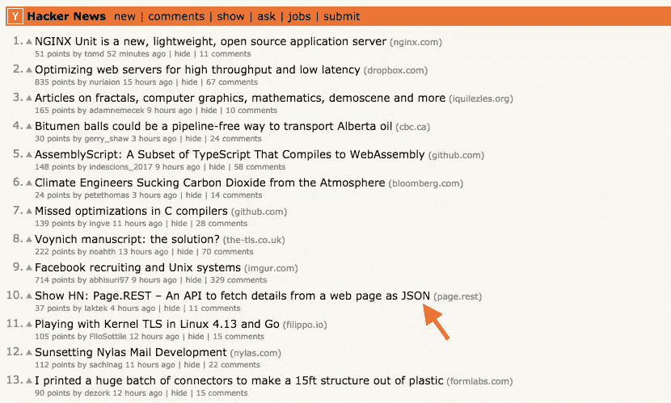
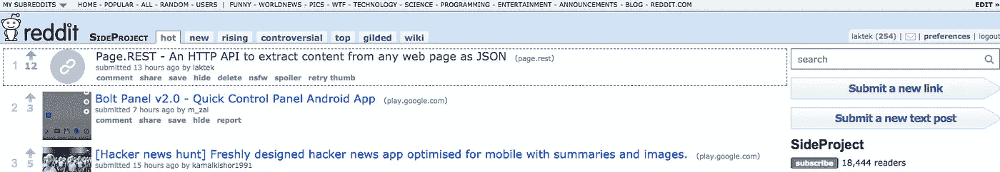

# 我学到了什么建设网页。休息——7 天内从一个想法到付款给客户

> 原文：<https://medium.com/hackernoon/what-i-learned-building-page-rest-from-an-idea-to-paying-customers-in-7-days-cea0ecc2bd76>

上周，我发布了[页面。REST](https://page.rest/) —一个从任何网页中提取内容作为 JSON 的 API。它在最初的 24 小时内获得了 10 个付费用户，而这只是我 7 天前在纸上草草写下的一个想法。

以下是我建造它的原因和我从中学到的东西。

一年前我离开了亚特兰大去 bootstrap Pragma 实验室。我们一直专注于[为网络团队建立](https://hackernoon.com/tagged/building)一个[现代 CMS](https://pragma.build/) 。虽然我们有一些早期采用者，但吸引力并不是很大。我们还没有找到适合市场的产品。远离客户的感觉产生了出货的惯性(“我们还需要这一样东西”)。

我开始觉得我们需要改变我们的心态。我们需要尝尝有人付钱给我们的滋味。我挑战自己在接下来的 48 小时内找到一个付费客户。

> “对于一名击球手来说，在国际系列赛之前获得一个像样的分数——无论是俱乐部级还是一流水平——都至关重要。”
> 
> 伊恩·沙佩尔 [#](http://www.espncricinfo.com/story/_/id/20553818/ian-chappell-why-australia-lost-mirpur)

我在 Atlassian 工作期间，有一个名为 ShipIt 的季度活动——你可以放下手头的工作，在 24 小时内提出一个想法。我决定试试我的 ShipIt 版本。在 24 小时内建造一些东西——然后在接下来的 24 小时内找人为它买单。

What I scribbled for Page.REST

# 找到一个最低可销售的产品

挑战在于找到一个我能在 24 小时内建立起来的想法，这个想法能吸引人们第一时间付钱。我认为进行 Slack 或 Trello 整合是一个不错的选择。我认识一些从他们那里获得成功的人。然而，浏览这些市场并没有灌输太多的信心。已经有很多整合了，我也没有偶然发现一个好的利基。

然后我反过来想。如果有很多人在构建这些机器人，我有什么可以卖给他们的吗？我注意到大多数集成都依赖于现有的网站作为数据源。公共交通时刻表、今天的天气、包裹追踪、当地餐馆的菜单、爸爸的笑话——所有这些都建立在一些现有的网站上，而这些利基网站中的大多数都没有公共 API。

我的假设是集成开发人员浪费时间从网站中提取内容。节省时间的解决方案会促使他们付费。

# 像消费者一样思考

如果我遵循我通常的开发者本能，我会写一个 API 来解决这个问题，在 GitHub 上开源它，并放一个 Pateron 页面来接受捐赠。我希望人们捐款。一周后放弃希望，继续做别的事情。然后在将来，当问题开始堆积的时候，我会去 Twitter 大声疾呼为什么开源模式不起作用。

相反，我想设身处地为消费者着想。如果我是消费者，我需要什么？

*   我想通过 API 来使用它。
*   我更喜欢避免自己设置和维护它的麻烦。
*   给我一个场地来快速测试 API 是否适合我的用例。
*   我不想做复杂的认证舞蹈来访问 API。给我一个可以包含在 API 请求中的访问令牌。
*   给我一些关于正常运行时间和可用性的期望(明天会消失吗？)
*   最好有一个我可以复制和修改的代码样本
*   有联系开发者的方法吗？他们有回应吗？

就我个人而言，我会为这样的服务付费。我开始相信，至少有几个人会像我一样思考。

# 避免兔子洞

当我开始工作时，我想我可以使用[木偶师](https://github.com/GoogleChrome/puppeteer)，一个库来控制 Chrome 的无头实例。但我很快发现，无头 Chrome 在云功能(谷歌云功能或 AWS Lambda)中无法开箱即用。我想坚持使用云功能，这样我就不必设置基础设施或担心扩展&可用性。

与其浪费时间试图让木偶师工作，我决定找到一个替代的解决方案。我决定 [jsdom](https://github.com/tmpvar/jsdom) 将足够满足我的需要。它对使用客户端渲染的网站不起作用(类似 React)，但我决定不去担心它，直到人们抱怨为止(这就是我现在做的，因为我让人们愿意为它付费)。

# 不要过度考虑定价

构建完 API 后，下一个挑战是弄清楚我应该如何收费。如果我能让人们在浏览完登录页面并玩了一些例子后拿出他们的信用卡(这就像最大 5-10 分钟的注意力跨度)，那么这个实验就成功了。

拥有一个简单的定价模型会让这个决定变得容易。我选择收取一次性费用来换取一个访问令牌(它有很长的有效期和每日限额)。

# 利用早期客户寻找方向

作为一个早期的想法，重要的是弄清楚我如何进一步发展它，并了解机会在哪里。我最初的假设还成立吗？

拥有早期客户的好处之一就是他们可以帮助你找到这个方向。在少数早期客户要求之后，我添加了 [OpenGraph 支持](https://www.page.rest/#open-graph)。此外，我选择接下来解析客户端呈现的内容，因为它在反馈中出现了多次。

此外，我开始从早期客户那里发现一些有趣的利基市场。例如，我不知道它对学术研究项目有用。我开始利用这些见解来微调如何接触更多的客户。

# 尝试多种渠道来传达信息

在过去，当我做这样一个[兼职项目](https://hackernoon.com/tagged/side-project)时，我只会在一些主流渠道上分享，比如 Twitter 和 Hacker News。如果我幸运的话，它可能会被一些有影响力的人发现，并得到一些病毒式的关注。

然而，这一次我尝试了一下分销策略。我计划这将是一个持续的练习，我将基于学习进行迭代(目前我每天留出 1 小时用于 Page。REST 的分布实验)。

我没有先上市，而是先在利基市场 Slack 和脸书集团上推广它。当我得到积极的信号时，我转向了更大的频道，如黑客新闻和 Reddit。幸运的是，它被 HN 的观众所接受，并在主页上排名第十。

Page.REST climbed to #10 on HN

在 Reddit 上，它从 [/r/sideproject](https://reddit.com/r/sideproject) 那里获得了一些牵引力。

我目前的重点是找到洪水过后保持河流畅通的策略。

如果您对 Page.REST 有任何有趣的想法，请随时[联系](mailto:lakshan@pragma.build)。很高兴探索我们如何合作。