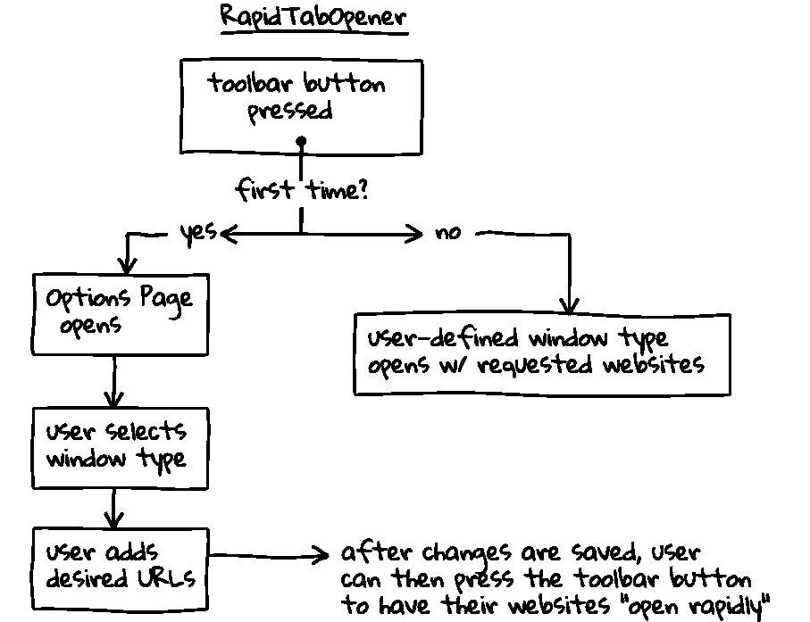

# 我从复制内置浏览器功能中学到了什么

> 原文：<https://medium.com/hackernoon/what-i-learned-from-copying-a-builtin-browser-feature-f18f68f370dd>

几周前，我意识到我每天都要花很多时间打开所有我需要使用的网站。还有工资单 webapp、工作和个人 Gmail、JIRA、Testrail、Jenkins 等等。每天下午，当我开始工作时，我会打开一个新的 Firefox 匿名窗口，手动打开每个标签，然后输入所有这些网址。我不是唯一一个——我注意到我的同事也在做和我一样的事情。作为一个喜欢解谜和解决它们的人，我把这看作是一个解决[编程](https://hackernoon.com/tagged/programming)问题的机会。

在我继续说下去之前，我想说我知道当你启动浏览器时，打开指定的 URL 是可能的。我不知道这有多简单。我原以为你需要写一个脚本来自动完成这项工作(我认为普通浏览器用户不知道或不想这么做)，但实际上，这很简单，只需在“主页”字段中输入你想要的网站，或者将这些网站添加到书签文件夹中，右键单击该文件夹，然后选择“在标签页中打开所有网站”。但这种认识是后来才出现的。

## 我的解决方案

为了解决这个问题，我决定做一个浏览器插件/扩展。在开始这个项目之前，我曾经做过一个，所以在操作浏览器时，我能够掌握扩展的能力和局限性。从那时起，我知道我想要能够按下一个按钮(最好位于一个方便的位置)，这样做后，它应该会打开我在某种设置页面中列出的所有网站。

Mozilla 为创建 WebExtensions 提供了优秀的文档(最新类型的附加组件，只有在 Firefox 57 发布后才会出现——查看[入门指南](https://developer.mozilla.org/en-US/Add-ons/WebExtensions))。基于我的需求，我想我会想要一个工具栏动作按钮(相对于页面动作，它只对某些网站有效)。这将允许我在任何时候按下按钮，不管当前标签或网站打开，因为工具栏按钮将始终存在。WebExtensions 的工作方式是，工具栏按钮的事件监听器需要在一个叫做*的后台脚本*中，不管 WebExtension 是否激活，它都会持续运行。在我的例子中，这是理想的，因为这意味着我可以在任何时候按下工具栏按钮，而不必担心事件监听器是否会被触发，因为它总是在监听。在我写这篇文章的时候，我已经对*rapidtaopener*做了一些小的改动和错误修复，所以打开想要的网站的逻辑有点改变。由于时间关系，我将只解释它目前是如何工作的。

[](https://addons.mozilla.org/en-US/firefox/addon/rapidtabopener/) [## 快速开瓶器

### 按下按钮，RapidTabOpener 立即打开所有您想要的网站，无需输入！

addons.mozilla.org](https://addons.mozilla.org/en-US/firefox/addon/rapidtabopener/) 

## 它是如何工作的

第一次点击工具栏按钮时，*rapidtaopener*会自动打开它的选项页面，以便用户选择他们想要打开的窗口类型，并添加他们想要“快速打开”的站点一旦添加并保存了首选项，这些首选项就会作为 JSON 对象存储在浏览器的本地存储中。这些物体看起来是这样的:

```
/**
 * object for window-type, where 'windowType' is a String,
 * "normal" or "incognito"
 */
var windowSettings = {
    type: windowType
};/**
 * the URLs, saved as Strings in an array
 */
var urls = [
    "gmail.com",
    "news.ycombinator.com",
    "reddit.com"
];
```

当涉及到开发附加组件时，开发人员有两种不同的选择来存储数据:本地或会话存储。这两者非常相似，唯一的区别是存储在本地存储中的任何数据都没有截止日期，并且即使在浏览器应用程序关闭后仍然存在，而会话存储数据将在会话结束后被清除。了解这一点后，我使用本地存储，因为我希望用户只需添加一次他们的初始首选项。

一旦他们的偏好被保存，用户可以立即按下工具栏按钮，他们输入的网站将“神奇地”在他们选择的窗口类型中打开。这是可能的，因为一旦保存了首选项，窗口类型和网站将作为对象保存在本地存储中。然后，当工具栏按钮被按下时，来自后台脚本的事件监听器被触发，它查找并获取这些首选项对象。窗口类型被确定，然后基于所期望的窗口类型是否已经被打开，在循环通过并打开用户添加的站点之前，程序可以打开或不打开新的窗口。



A simple flowchart depicting how RapidTabOpener works (generated with [ShakyDraw](http://shakydraw.com/)).

## 发布 RapidTabOpener

有了一个最小但有效的扩展，我很快就在火狐扩展和主题的应用商店[addons.mozilla.org](https://addons.mozilla.org/en-US/firefox/)(AMO)得到了它。我真的只是想能够在工作中使用这个插件，所以我提交给 AMO 的最初版本被归类为“实验性的”，因为我不愿意把它发布给公众。这使得只有拥有 AMO 列表网址的人才能下载*rapidtaopener。*最初的版本(1.0 版)只有添加和保存网址的功能，它会打开一个新的私人窗口，并关闭任何当前打开的正常窗口。你也许能明白为什么我不想让公众知道这个。一旦我设置了窗口类型选择功能，并在 AMO 中添加了新版本，我就将清单更改为公共的，并准备好让用户自己尝试。

## 是时候做些宣传了——也是一次现实检查

第二个版本在 AMO 获得批准后，我去了自己经常去的地方 Reddit。我在/r/firefox 中创建的第一个 subreddit 帖子。至少可以说，那边的人很难取悦。我真的不确定会期待什么，但对 *RapidTabOpener* 的总体感觉是，嗯，你可以通过评论来决定:

> “这可以通过设置由竖线字符分隔的多个站点来实现…”
> 
> “这个和书签文件夹有什么区别？”
> 
> 不是为了添油加醋，而是一种比右键单击文件夹更快/更简单的方法，即在单击文件夹时按住 CTRL 键，或者单击鼠标中键(如果有鼠标的话)
> 
> "为什么不直接使用会话恢复？"

我回答了每个人的问题，试图捍卫我的想法和所有投入其中的工作。尽管他们钦佩我的努力，但他们并不适合使用这样的工具(因为他们已经知道了打开一组指定 URL 的内置功能)。如果我说我在最初的帖子后没有一点不安，那我是在撒谎。这个项目是我做的第一个项目，我觉得好像人们真的会使用它并发现它很有帮助。我知道我没有接触到目标受众，因为在 Reddit 帖子发布一天后，插件的统计数据显示我前一天只有 11 次下载，其中 3 次来自外部来源(Reddit)，而其余的来自 AMO 的“最近添加”部分。

## 分享你的过程，而不仅仅是产品

虽然我已经解决了我最初面临的问题，但我认为 *RapidTabOpener* 会更容易被其他人接受。我对自己不能想出更好的项目想法感到沮丧，接下来的几天，我放下编码去思考一切。在退一步给自己思考的空间后，我意识到我的成就来自于处理最初的问题并能够解决它。第一，我能够自己学习 JavaScript 的基础知识，我认为这很不错。我意识到添加、编辑、删除和保存 URL 就像创建一个 TODO 应用程序，这是 JavaScript 初学者的第一个项目。最重要的是，我学会了如何在使用浏览器 API 的同时阅读文档，以便让我的附加组件的各个部分能够相互通信。最后，我意识到我不仅仅是复制了一个内置的浏览器特性，我还可以对它进行调整甚至改进。本来，你不能选择你想要你的网址在什么窗口类型中打开，它们只是在当前打开的任何窗口中打开。我能够更进一步，将该功能提供给用户。更有甚者，你只能在本地添加和删除 URLs 不能编辑链接。正如我们所知，这在*rapidtaopener*中不是问题。从最新版本(`v1.4.5`)开始，*rapidtaopener*拥有上下文菜单选项，因此您可以轻松添加您当前所在的网站或通过右键单击打开选项页面。

有了这些认识之后，我决定试着在不同的子编辑上多写几篇文章，这次是/r/learnjavascript 和/r/coolgithubprojects。这些帖子都是一样的，我确保包括了我对这个项目的新发现，这一次它真的引起了人们的共鸣，当天*rapidtaopener*获得了不到 60 次下载，甚至在 GitHub 上获得了几颗星。

我欣喜若狂！人们实际上在使用我自己创造的东西，这让我对自己编程和解决问题的能力更有信心。我认为第一篇文章和其他两篇文章的不同之处在于，我不仅分享了我制作的实际产品，还包括了我制作它的过程。看到最终产品很酷，但更有趣的是能够看到开发该产品的过程和创作者的心态。

## 结论

从一个我想解决的简单问题开始，我从解决问题开始，到改进解决方案，到分享我的解决方案并希望其他人会发现它很有用，但并没有真正被接受，到沮丧只是意识到我实际学到了什么和完成了什么，到分享我的解决方案以及我的实现，到最终瞄准正确的受众并找到不仅是为我自己也是为其他人的解决方案。

通过几乎不知不觉地复制一个内置的浏览器功能，我能够学到比我预期的更多的东西。从我学到的技术方面，比如学习 JavaScript 的基础知识和阅读文档，到我刚刚创造的重要的营销方面/课程，“分享你的过程，而不仅仅是项目”，我很高兴地说*rapidtaopener*是我创建的最重要的项目之一。现在，如果我能把 Medium 添加到我的*快速浏览器*的网站列表中，我就能记得多写些文章了…

*如果读完这篇文章后，你想亲自尝试一下*快速浏览器*，请随意从下面的 AMO 下载。对于你的 Chrome 用户来说，你只需要再等一会儿。将*rapidtaopener*移植到 Chrome 的过程目前正在进行中。如果你喜欢这篇文章，可以去 Cedric 的博客* coffee 看看他的其他文章。代码。塞德里克也在下面找到了。

[](https://addons.mozilla.org/en-US/firefox/addon/rapidtabopener/) [## 快速开瓶器

### 按下按钮，RapidTabOpener 立即打开所有您想要的网站，无需输入！

addons.mozilla.org](https://addons.mozilla.org/en-US/firefox/addon/rapidtabopener/) [](https://blog.cedricamaya.me) [## 咖啡。代码。塞德里克。

### 一个想成为软件开发人员的人的想法。

blog.cedricamaya.me](https://blog.cedricamaya.me)