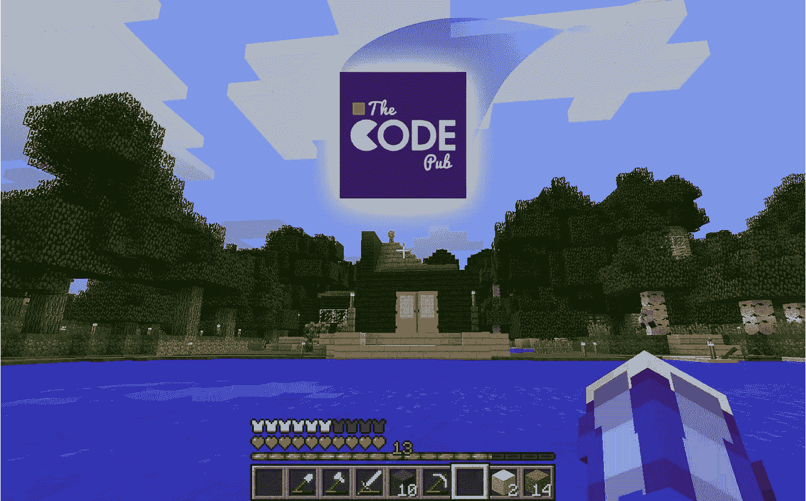
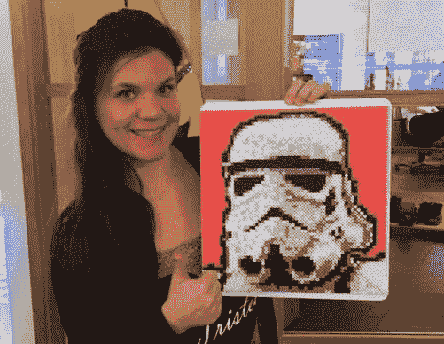
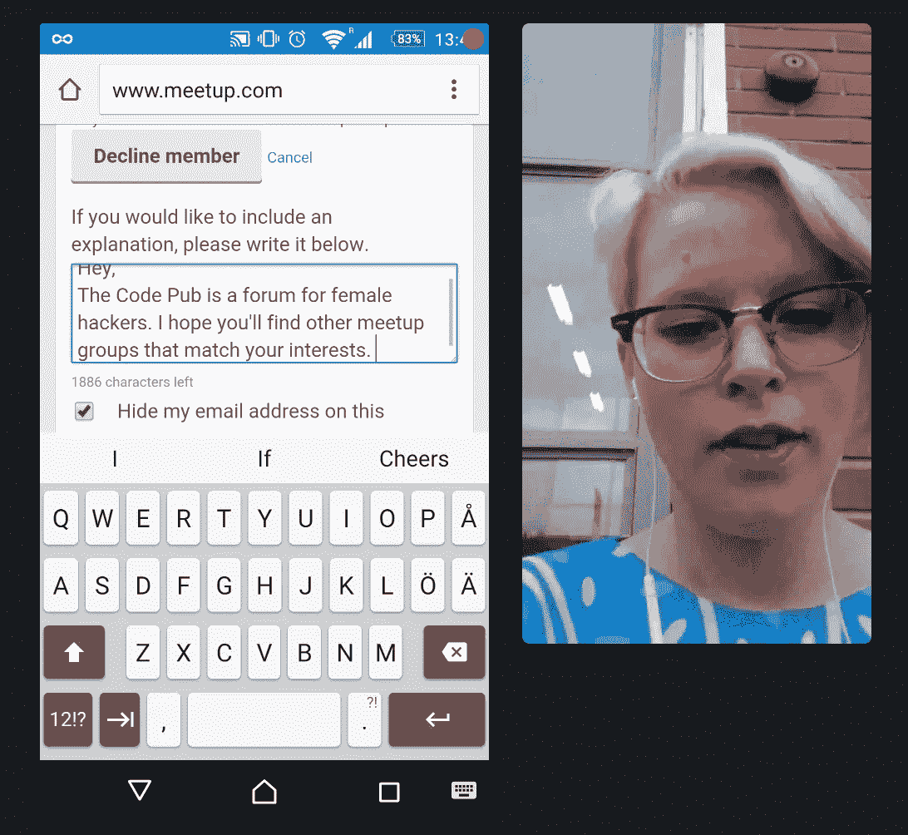

# 我从组织全女性代码会议中学到了什么💪🏻✨

> 原文：<https://medium.com/hackernoon/what-i-learned-from-organising-an-all-female-code-meet-up-74f40295b2f>

## 你是一个有抱负的活动组织者吗？太好了！你来对地方了，让我们来看看我在斯德哥尔摩组织科技活动中学到的一些东西。

我作为全女性代码聚会 [The Code Pub](https://www.meetup.com/The-Code-Pub-Stockholm/) 的组织者度过的这一年相当壮观！我们的规模几乎翻了一番，超过了神奇的 1000 名会员。我有没有提到这些成员是女性，她们在斯德哥尔摩编码？我还没数我们在[奥尔索](http://www.meetup.com/The-Code-Pub-oslo/)、[汉堡](http://www.meetup.com/The-Code-Pub-hamburg/)、[赫尔辛基](http://www.meetup.com/The-Code-Pub-helsinki/)，或者[慕尼黑](http://www.meetup.com/The-Code-Pub-Munich/)的姐妹呢！

> 那些说外面没有有能力的女性的人只是没有足够努力去寻找。

总之，这是我从组织代码酒吧中学到的。

## 玩得开心！

聚会组织的第一条规则。如果你不开心，你应该做些别的事情。只是说说。

## **组织你想去的活动。做你的观众。**

会面发生在晚上，工作之外。为了让人们在忙碌而有趣的生活中放弃一个晚上，来某个公司闲逛，最好是好事。作为一个组织者，你的工作是保护你的成员的时间和健康。你开始组织这些活动的原因可能是因为你和你的成员对同样的事情感兴趣。所以把自己当尺子用。你觉得你正在策划的活动听起来有趣吗？即使不是你组织的，你会参加吗？

## 问问你的会员喜欢什么。

有某种与你的小组交谈的论坛，我们发现使用一个封闭的[脸书小组](https://www.facebook.com/groups/TheCodePubStockholm/?fref=ts)非常适合与我们的成员进行交谈。在这里，我们询问我们的成员，他们希望在即将到来的聚会中了解什么。因此，当有人想学习 Git 或硬件黑客时，我们找到了最好的人来教我们。

We loved [hardware hacking with The Queen of Shitty Robots](https://www.meetup.com/The-Code-Pub-Stockholm/events/225538075/).

## 学习很棒

聚会是用来学习和闲逛的。当你为即将到来的活动决定主题时，你有足够的机会接近聪明人，请他们谈谈他们的专业领域。在 Code Pub，我们更进一步，实际上在每个事件中编写代码。有这么多有趣的技术需要学习，每个人在某个领域都是初学者。

Julia Adamsson. The kind of awesome who makes fuse bead stormtroopers for sick colleagues. 😘

## 有一个很棒的搭档

有了一个真正出色的共同主持人，一切都变得更容易、更好、更令人愉快。你希望找到一个人，当你在最后一刻被取消约会时，她会鼓励你进行即兴的闪电谈话，她会设法借走 23 台 MacBooks，因为她非常可爱，她很聪明，能让你开怀大笑。

通过与他人分担责任，你将能够在一半的时间内完成两倍的工作。两个大脑总比一个好。

## 最小可爱聚会

因为约会计划是在下班后进行的，所以明智地利用时间是很重要的。你不能什么都做！和你的搭档坐下来，想想什么对你来说是重要的。拿一堆便利贴，写下一次很棒的会面和一次低于平均水平的会面的区别。在每个音符上写下一个想法。然后开始优先考虑什么是值得你投入时间的。我们优先寻找鼓舞人心的演讲者和合作伙伴，而不是设计海报和社交媒体。运用在市场上获得最低可行产品的想法来学习。然后就可以迭代改进了！

**Learning by doing.** We didn’t really get the part about making sure everyone understood straight away that the group was for female coders only. Quite a lot of non-females applied for membership. It got to the point where the autocorrect function on my phone could type my standard decline message on its own. See my autocorrect in action here: [https://lookback.io/watch/DtFcFEh4MtypHjFZY](https://lookback.io/watch/DtFcFEh4MtypHjFZY)

## 如何成长

我们并没有真的试图增长，它是有机发生的。对我们来说，有一个关于 Meetup.com 的小组非常有用。确保清楚你的价值主张是什么，你的团队是为谁服务的。在登陆你的页面的几秒钟内(甚至在登陆之前？)我应该能弄清楚我是否属于你的目标受众，以及我会从参加你的活动中获得什么。

定期举办活动，这样你的社区就可以知道代码发布会是每个月的第一个星期二。

## 找好玩的主持人！

每当我和我的合作组织者看上一家公司时，我们都会请他们主持一次会面。事实证明，这是一个了解他们更多的好方法。我们还利用了该公司的女性开发人员网络，因此每月都有所增长。

## 喜欢你的扬声器

确保你的演讲者知道你有多感激他们！我们给演讲者送花。

## 传递火炬

组织聚会太有趣了！但是一定要照顾好自己。当你觉得是时候做些别的事情了，不要犹豫，把你的职责交给一群新的组织者。找一个和你开始时一样对这个机会感到兴奋的人。通过这种方式，社区获得了新的充满活力的领导人，并将继续繁荣！双赢！👩‍💻💖👩‍💻

> [黑客中午](http://bit.ly/Hackernoon)是黑客如何开始他们的下午。我们是 [@AMI](http://bit.ly/atAMIatAMI) 家庭的一员。我们现在[接受投稿](http://bit.ly/hackernoonsubmission)，并乐意[讨论广告&赞助](mailto:partners@amipublications.com)机会。
> 
> 如果你喜欢这个故事，我们推荐你阅读我们的[最新科技故事](http://bit.ly/hackernoonlatestt)和[趋势科技故事](https://hackernoon.com/trending)。直到下一次，不要把世界的现实想当然！

