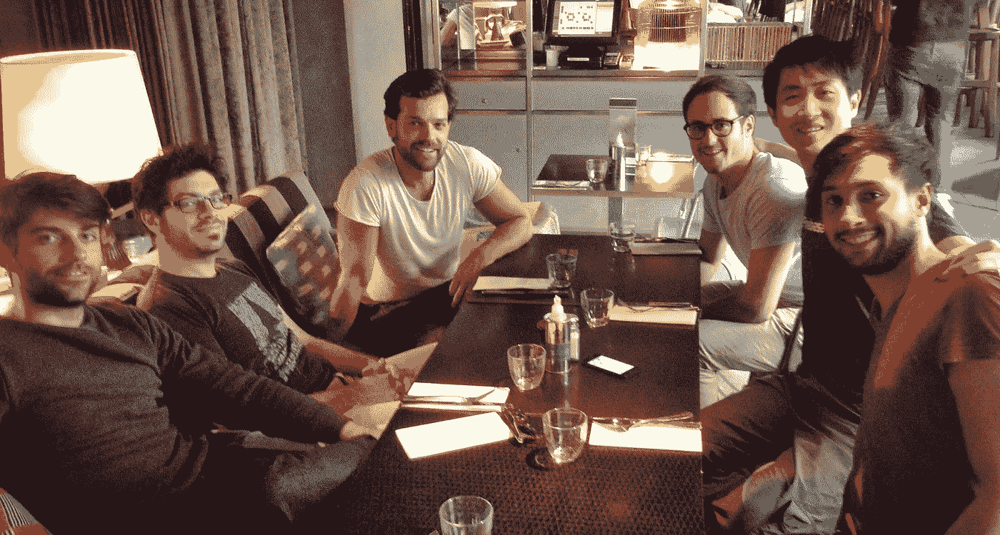
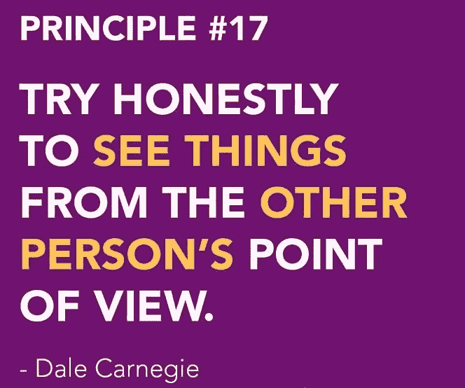
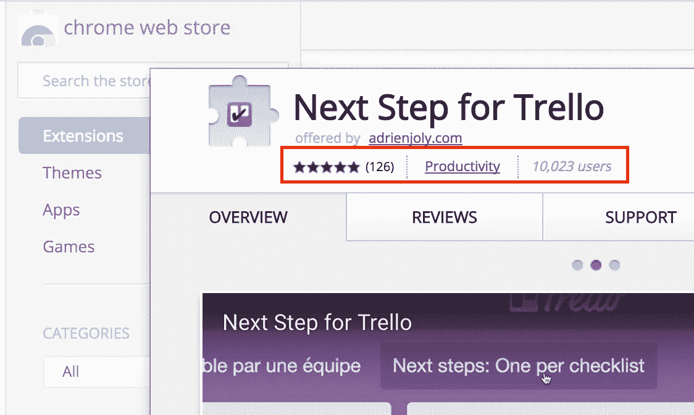
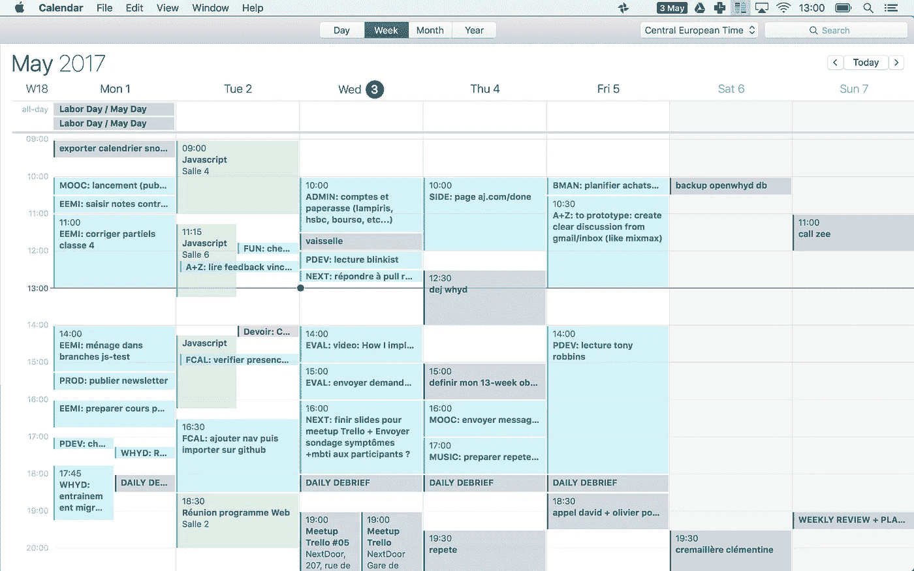
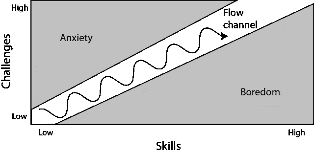

# 作为一名独立开发者，我在两年的工作中学到了什么

> 原文：<https://medium.com/hackernoon/what-i-learned-while-working-as-an-indie-developer-for-2-years-53619fafa81f>

Exploration of Black Rock City, Burning Man 2017\. Photo: [Camille Betinyani](http://www.camillebetinyani.com/)

## 关于营销、生产力和自我意识，我希望在辞职前知道的 7 条原则。

> ℹ️️本文是“[ce que j ' ai appris en travaillantàmon compte pendant 2 ans](/@adrienjoly/ce-que-jai-appris-en-travaillant-à-mon-compte-pendant-2-ans-7db72e20a86b)”(*🇫🇷*)的速译，可以看做是对“ [12 个月成为独立黑客](https://hackernoon.com/12-months-to-become-an-indie-hacker-ad0c916c1f5f)”的补充。请随意非线性阅读。

两年前，**我有一份很棒的工作**。

Eating out with Whyd’s team, a few months before quitting.

作为一家雄心勃勃的创业公司的[首席开发者](https://hackernoon.com/tagged/lead-developer):[Whyd](https://whyd.com)。我正在开发一个 B2C 产品，融合了我的两个爱好:音乐和技术。每天，15 分钟的自行车骑行会带我回到我的团队，我的朋友。和他们在一起，我从不感到无聊，我们经常一起欢笑！

最重要的是，我因为做自己喜欢的事情而获得了丰厚的报酬:**编码**。

然而，我开始羡慕那些摆脱老板去做自己的事情的开发者:独立黑客。我想以自己的方式工作，自己做决定。4 年半后，我获得了足够的信心，可以辞职创业了。我照做了。

两年后，我意识到我对世界的理解已经发生了变化。我对工作的理解，对我们生产的产品的价值的理解，对他们的“用户”的理解，以及对生活和人际关系的理解。

那时候的我很自信，但也很**幼稚**。现在，我对任何事情都不那么自信了——包括我自己——但是我相信我在过去几个月里的经历让我变得更加坚强和聪明。

早在 2015 年，这就是我希望得到的那种建议。

# 用户并非不感谢。他们绝望了。

我们收到了数百封电子邮件和推文，人们抱怨在使用我们的产品“Whyd”时出现了错误。因为这是努力的结果，而且是免费提供给用户的，所以我不禁认为这些用户是忘恩负义的。

One of the principles from the excellent book “How to win friends and influence people,” by Dale Carnegie.

看完《[如何赢得朋友，影响人](https://en.wikipedia.org/wiki/How_to_Win_Friends_and_Influence_People)》后，我衡量了一下自己有多幼稚。戴尔·卡内基主张人们只是以自我为中心，而不是“忘恩负义”。

让我们站在 Whyd 用户的立场上:他们想要的一切就是听音乐。Whyd 只是千千万万个解决方案中的一个。用户可能找到 Whyd 是因为我们在[的营销](https://hackernoon.com/tagged/marketing)上的努力。**用户没有选择 Whyd。他们被 Whyd 说服，认为这是满足他们需求的一个好办法:听音乐。因此，当这个解决方案没有像承诺的那样工作时，我们可以理解用户感到不安。通过抱怨，他们并不意味着对开发 Whyd 的团队有任何伤害，他们表明了**欺骗**尽管他们付出了努力和信任，但仍不能完全解决他们的需求。**

# 在期望兑现之前先付出。

当我开始做顾问时，我对客户没有安全感。我害怕失败。赚不到足够的钱。我担心我的客户会滥用我的时间和服务而不付钱。

我用来保证收入的策略之一是给自己打上“10 倍开发者”的烙印一个超级忙碌的软件工程师，通过优化他的关注点来超快的工作。带着这种姿态，我努力使我与客户和潜在客户的交流更加简洁、务实和不妥协。我相信我是一名优秀的软件工程师。但是，现在回想起来，我更多的是表现出我是一个冷酷、不可靠的人。除了赢得坏名声的风险之外，采取这种姿态还会导致错误地选择机会。例如，放弃令人兴奋的任务，支持那些愿意玩我的游戏的客户提出的任务。我曾经遇到过这种情况:我接受了一个并不真正符合我兴趣的任务，只是为了坚持我的价值观和不丢面子。这是明智的决策方式吗？

我[了解到](https://hackernoon.com/tagged/learned)为了创造良好的人际关系，为自己建立更好的未来，我必须先付出更多，而不期望任何回报。我说的给予是指:倾听、给出建议、提出建议、展示、分享，或者更一般地说，帮助他人。除了让世界变得更美好，给予也是展示一个人的品质、技能和爱心的好方法。我写这篇文章并公开发表的事实就是一个很好的例子。发布有用信息的理念也是“**内容营销**的基础。”

给年轻的创业者提供战略建议几个月后，我惊喜地收到了其中一位创业者的电子邮件。他告诉我，他已经创办了自己的公司，发展良好，我的建议在这个过程中帮了他很大的忙。我是如此的**高兴**从他那里读到我的建议是有用的，它清除了我因没有找到一种方法来指控他和/或我当时遇到的其他创作者而感到的所有罪恶感。回想起来，我只是在喝了几杯啤酒的时候给他提了一些建议(这对我来说是显而易见的)。但是，对他来说，这次会面显然很有价值。想想看，我很高兴我间接地**为一家新创业公司的诞生做出了**的贡献，而且它的创始人还记得并珍视我给他的帮助，这让我受宠若惊。

> 提示:反过来也一样:人们喜欢乐于助人。秘诀就是把帮忙叫做“帮忙”我见过太多的人(包括我自己)尴尬地说“**请随意……**”大多数时候，他们期望得到帮助，但实际上并没有要求帮助。在寻求帮助时，试着更加清晰和直接:选择更少的人，有意识地选择他们，不要忘记解释他们的帮助将如何帮助你。你会发现人们会很乐意帮忙的！

# 将产品货币化需要的不仅仅是知名度。

当我开始开发自己的产品时，我确信赚钱不会太难，这要归功于我高效开发 B2C 网络应用的经验，以及我产品理念的实用主义。利用 ProductHunt 和我的社交网络，我的第一款产品在发布后 10 个月内就成功获得了 10000 名用户。

My first product, installed by 10,000 users: Next Step for Trello

我为自己建造的东西感到非常自豪。实用性、产品质量、设计简单性和高效工程的完美平衡。一个开发商的春梦。

但是我意识到让人们为 T21 的高级功能付费并不像我想象的那么简单。可能是因为我太依赖自己的视觉和直觉来开发这个产品。我将我的愿景推向了大众，而不是解决一群用户的问题。

通过阅读贾斯廷·杰克逊的文章，我明白了我是**缺乏基本的营销知识**。贾斯汀经常坚持这样的观点，为了赚钱，一个产品必须被设计成**给用户“超能力”**。例如:为了减少碳足迹，Telsa 不把他们的汽车作为生态汽车来销售。相反，他们销售“高科技”、高性能的汽车。人们**渴望购买的汽车**。购买者并不是在寻找一辆生态汽车，他们想要成为生活在技术边缘的少数司机中的一员。这解释了为什么特斯拉集成了“疯狂模式”，使他们的汽车在短短 3 秒内从 0 加速到 60 英里/小时。

很明显，我的第一个产品没有给任何人超能力。所以我能做的就是去了解它的用户，更好地理解他们的需求，然后帮助他们满足这些需求。

> **我为你测试过**:发布几周后，我给我的用户发了一份调查。我问他们怎样才能让我的产品成为他们日常生活中不可或缺的一部分，他们愿意为此支付多少钱。结果说服我发起了一场众筹活动，根据最受欢迎的功能请求，开发我的产品的第二个版本。最后，只有三个用户同意参加，活动失败了。我的建议是:调查结果过于乐观。直到用户发送他们的付款，才完全做出决定。

# 营销:“每个人”都不是目标。

太多的创业公司希望通过 Techcrunch 上的新闻报道或者发送垃圾邮件给他们的联系人，在 ProductHunt 上获得更多的投票。是的，你的产品刚推出就被成千上万的人喜爱，这种感觉真好！但是早期的名气对你的生意有好处吗？

作为一名[精益创业](https://en.wikipedia.org/wiki/Lean_startup)理念的倡导者，我知道在试图优化收购(即扩大用户群)之前，提高产品的保留率(即达到一定的质量水平，让用户长期使用)是非常重要的。在开发我的第一个产品时，我确实应用了这些原则。但是我低估了与我的用户单独交谈的重要性。我不知道我的用户是谁，也不知道他们在追求什么样的价值。所以我怎么能卖给他们东西呢？

回想起来，我最好选择一个更具体的目标。是的，瞄准“小众”意味着潜在用户少。但是，通过更好地了解他们，我会为他们打造更好的产品。所以，这有望带来更多的销售。

当然，这种交流是不可扩展的。但是手动这样做会让用户更加信任我，从而增加**保留率**。忠诚的用户更有可能向他们的同事推荐我的产品，从而带来更好、更有机的 T2 增长。

> **注:**多语言创作者，这种反思也适用于你决定在网上交流时使用的语言。当我用英语分享东西时，我可以接触到全球的观众。当我用法语分享时，我的听众少了很多，但它带来了更多的机会，至少在短期内是这样，因为我的大部分网络更关注用法语交流，我的网络中的人比我的全球听众中随机的人更信任我。

# 措辞:使用你的目标搜索的关键词。

在我的第一个产品的登陆页面上，我尽最大努力挑选精确的关键词。我想清楚地解释我的愿景，并简明地描述它的特征。我的目标是为访问者对我的项目做一个**“高保真”的描述**。

我忘记了一些重要的事情:访问者如何找到我的页面？在寻找问题的解决方案时，他们会在谷歌上键入什么关键词来找到它？

A famous quote from Henry Ford about what people need VS how people express their need.

在阅读了克利福德·奥拉维奇和贾斯廷·杰克逊之后，我明白了潜在用户至少会有两种行为:

1.  简单的例子:一个潜在用户通过选择最能描述其问题的关键字来搜索解决方案。示例:“*修理破碎的挡风玻璃*
2.  复杂案例:一个潜在的用户想象他们的问题的解决方案——尽他们所知——并且通过挑选最能描述他们想象的问题解决方案的关键字来搜索它。示例:“*挡风玻璃贴片*

为了增加这两类用户找到我的产品的几率，我需要建立一个包含关键词的登陆页面，这些关键词对应于“简单案例”潜在用户表达的**问题**和“复杂案例”潜在用户表达的**解决方案**。

> 为了接触和转化更多的潜在用户，重要的是要设身处地地为他们着想，并确定他们可能使用哪些关键词来找到我们的登录页面。充分了解你的目标至关重要。(如前一部分所示)

# 当有疑问时:避免后悔，承担风险。

*既然我们已经讨论了产品用户和营销，我想分享一下我在* ***更个人层面*** *学到的东西。*

作为一个非常理性的人，我倾向于在决定任何事情之前列出利弊。我优柔寡断的程度如此之高，以至于一想到要在服装店选择买什么就让我冒汗！

规避风险可能让我错过了许多专业和个人发展的机会。尤其是在我创业期间。真扫兴。

在我创业期结束的那次旅行后，我冒了过去 18 个月里**最大的风险**:我接受了在一所我从未教过书的学校里举办一个 8 小时的研讨会，只有 24 小时的通知！为什么这个**有风险**？我以前从未讲授过关于“精益管理”的课程，也没有可依赖的课程材料。在过去的 18 个月里，这段经历最终成为最令人兴奋和最有收获的经历之一。

> **要点**:不断反思、学习和保持好奇心很重要，但更重要的是不要等到**做好准备**才开始一个令人兴奋的项目。挑战让我们能够推进我们的极限，或者至少能够发现我们真正的极限。跟随你的直觉会让你感到活着，并不断进化。**完美不存在。但后悔肯定会。**

# 在快乐和努力之间:对心流的追求

让我们以一个同时是成功和失败的经历来结束这篇文章吧:**优化我的生产力程序**。

网络产品通常需要几个月才能显示出成功的迹象。因为我的时间受限于我的积蓄，我决定同时开发多个项目。为此，我开发了一个任务规划和跟踪系统，依赖于一个 Trello 板+一个可衡量的目标列表+一个每周排得满满的日历+频繁的回顾。我的目标是尽可能高效地工作。

这张截图显示了我每周达到的**计划**的水平:

A typical week during my entrepreneurial period. Each 4-letter prefix refers to one of my projects.

在使用这个生产力系统一年后，我可以确认它是有效的。我开发了十几个项目，定期高效地发布我的成果。甚至我的朋友也向我寻求生产力方面的建议！

话虽如此，这个套路最终还是把我变成了某种**机械僵尸**。现在，我从我的目标和严格的时间管理规则中解脱出来，我觉得我在长时间的窒息后又开始呼吸了。

我可能没有给意外之喜留下足够的空间。有足够的时间让我的大脑处理。听够了我每时每刻感受到的情绪和欲望。我不会建议任何人连续 6 个月以上应用如此严格的时间管理常规。

此外，当我在一些任务中获得很多乐趣的时候，其他的任务却在**消耗**我的精力:那些依赖于我所没有的知识或经验的任务(例如**营销**)。)

A representation of “Flow”

如果我再次创业，我会花不到 20%的时间在这类任务上，以便花更多的时间在“**心流**”:这是一种沉浸和愉悦的状态，当我们在做一件既有挑战性又精通的事情时会有这种感觉。我的情况是:编程和写作。

> 回顾过去，我很高兴我能在这么短的时间里取得这么大的成就。翻开这一页，我也松了一口气，在这一页中，我太关心效率，而不够关心与现实世界和自己的联系。正如肖恩·麦凯布建议的那样:研究太广泛的话题会给自己和他们的关系网带来困惑。清晰和专注带来更多相关和令人兴奋的机会。

# 结论和展望

写这篇文章帮助我翻过了人生中重要的一页:在这段时间里，我挑战自己，独自开发并商业化自己的产品。这也是我在此期间所学的一点点痕迹。

我也想证明走“[独立黑客](https://www.indiehackers.com/)路线**不一定会成功**。我读过的许多成功故事给我的印象是一条容易走的路。肯定不是。

你可能会同情我。请不要。我把那段创业经历的结束视为开始新生活的激动人心的时刻，探索的死胡同更少了，心态也更坚定了。我很感激能够有这样的经历。我对我人生的下一个篇章感到兴奋，因为我对商业和我自己有了更多的了解。

感谢阅读！😊