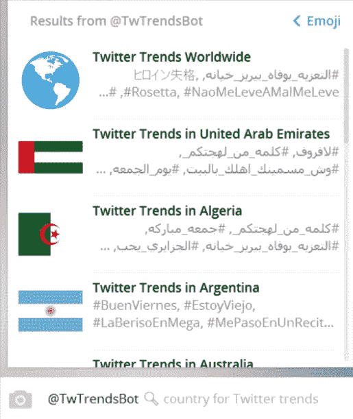

# 我从构建一个没有框架的聊天机器人中学到了什么(第 1/2 部分)

> 原文：<https://medium.com/hackernoon/what-i-learnt-from-building-a-chatbot-without-a-framework-part-1-2-438ef9f4dab3>

不通过外部的 bot 构建框架，直接将 bot 与 bot API 连接起来具有巨大的学习价值。

为了提供一些背景，我构建的聊天机器人向用户发送每日 Twitter 动态。你不需要推特来使用它。如果你有一个 Twitter 账户，它可以作为你 Twitter 体验的补充，因为它向你传达的趋势是特定国家的。

# **我学到了很多关于某个平台上可能的交互的知识**

当聊天机器人和用户只能用明文交流时，这就相当简单了。然而，不同的聊天平台，如 Facebook Messenger、Kik 或 Telegram，提供了不同的功能和交互，从本质上改变了用户体验。

了解什么是可能的最好方法是直接尝试他们的 bot API，而不需要通过外部框架或库。

例如，Telegram 有一个独特的内嵌查询功能，用户只需输入“@bot_name ..”从任何聊天中得到一些结果。因此，用户并不总是必须开始与机器人的私人聊天才能从中受益。

一旦提交了查询，机器人就可以处理它并生成一个结果列表，结果列表可以用多种方式格式化。当用户选择一个结果时，消息将被发送到聊天室。出于性能原因，Telegram 支持延迟加载和缓存。

A sample list of inline query results

当我完成我的机器人时，我意识到仅仅给用户发送一份 Twitter 趋势列表是不够的。毕竟，用户可能希望看到与某个热门话题相关的推文，一种方法是通过特定的链接将用户导向 Twitter。

谢天谢地，我发现 Telegram API 支持带有 HTML 标签的自定义超链接，所以我可以让消息非常简洁！用户只需点击某个趋势，就可以打开 Twitter，查看与之相关的推文。

A list of trends with selectable hyperlinks

相比之下，Facebook Messenger 目前不支持自定义超链接。如果我决定在 Messenger 中实现这个机器人，我可能必须分别显示趋势和它们的 URL，这将导致一个非常长的消息。

如您所见，不同的平台提供不同的功能和交互。了解它的最好方法是尝试一下。当您需要优化不同平台上的用户体验时，这从长远来看可能会带来巨大的好处。

# 我了解了服务信息

我以为只有用户可以给我的机器人发消息。

但是，我惊讶地收到了不是用户直接发来的消息！这些消息被称为服务消息，本质上是管理性的。

我意识到处理这些服务消息是有价值的。例如，当任何人(包括我的机器人)加入一个聊天组时，我会收到来自平台的服务消息，表明他是谁。如果是我的机器人加入了群组，我会发送介绍性消息作为回复，而不需要等待用户说“/开始”。相反，如果我的机器人被逐出一个聊天组，我会知道，并可以将该服务消息视为“/stop”消息。

# 我处理了用户停止我的机器人的不同方式

我通知用户，如果他们想取消订阅每日更新，就发送“/stop”。然而，我了解到并不是每个用户都会发送这条消息。

Telegram 聊天客户端允许用户停止聊天，方法是按住聊天，然后选择“删除并停止”。不幸的是，当这种情况发生时，我没有收到服务信息。当我试图向该用户发送每日更新时，Telegram 会回复“403 禁止，Bot 被用户阻止”。

我通过从订阅者列表中删除用户来处理这个错误，直到用户决定再次订阅。因此，我可以节省未来的服务器资源，因为我不会再尝试向该用户发送更新。此外，它允许我保持一个准确的用户数量计数。

# 框架呢？

我还没有试过使用。然而，这些是我对 bot 框架的初步想法，纯粹是就其与各种聊天平台的 API 的接口能力而言。

虽然最初使用框架可能会节省一些时间，但它们确实会带来一层复杂性，并且有各种限制。例如，由于框架需要相当通用以迎合许多用例，所以它们附带了您可能不需要的功能。它们可能不支持特定平台的所有 API 特性。

没有框架，我们仍然可以通过拥有良好的[软件](https://hackernoon.com/tagged/software)架构来构建一个支持多平台的 bot。解析接收到的消息并发回自定义响应的接口需要是特定于平台的，但其他组件(如数据库和文本解释)可以是通用模块。因此，我们可以完全控制如何使用每个平台的 API 来获得最佳的用户体验。[此外](https://hackernoon.com/tagged/furthermore)，我们可以为我们想要使用的特性编写足够的代码。

虽然有更多的前期成本，但代码仍然是服务器端的。因此，支持两个聊天平台并不像支持原生 Android 和 iOS 应用程序那样昂贵。

就像在 bot 建设者之前出现的网站建设者和应用建设者一样，要意识到利弊。不要觉得一定要用！

# 结束第 1/2 部分

在构建我的聊天机器人时，没有使用机器人框架，我了解了在我选择的平台上可能的不同交互，不同种类的消息，以及用户可以停止机器人的不同方式。因此，我对该平台的真正功能有了更好的了解。如果我最终使用跨平台框架，我会对它的局限性有更好的认识。

在第 2 部分中，我将分享更多关于解析消息、处理时区和处理边界情况的内容。点击此处查看[第二部分](/@kevinze/what-i-learnt-from-building-a-chatbot-without-a-framework-part-2-2-61f4d8f6c644)！

## 如果你觉得这篇文章很有见地，并希望看到更多，请❤和关注我！

> [黑客中午](http://bit.ly/Hackernoon)是黑客如何开始他们的下午。我们是 [@AMI](http://bit.ly/atAMIatAMI) 家庭的一员。我们现在[接受投稿](http://bit.ly/hackernoonsubmission)并乐意[讨论广告&赞助](mailto:partners@amipublications.com)机会。
> 
> 如果你喜欢这个故事，我们推荐你阅读我们的[最新科技故事](http://bit.ly/hackernoonlatestt)和[趋势科技故事](https://hackernoon.com/trending)。直到下一次，不要把世界的现实想当然！

