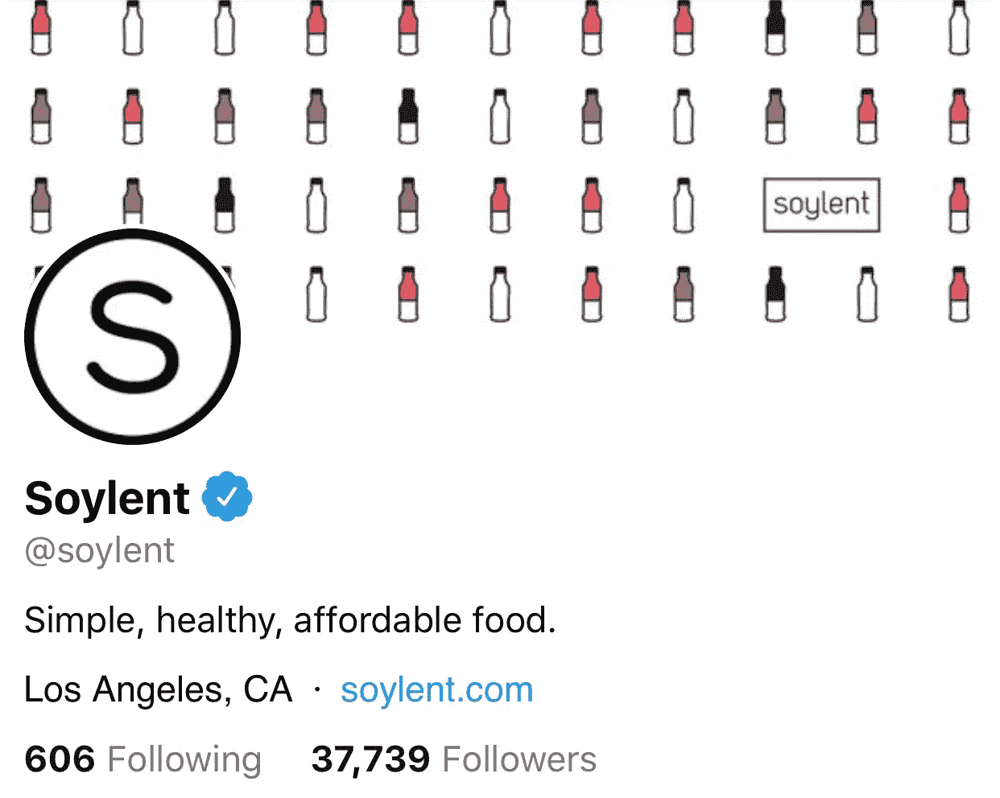
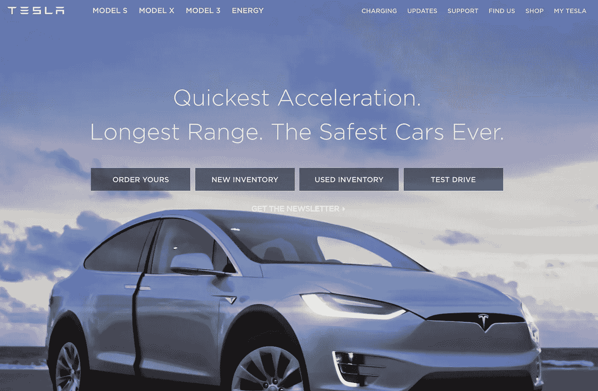

# 隐形帮助是新的社会企业家精神

> 原文：<https://medium.com/hackernoon/what-i-love-most-about-entrepreneurship-492d79eb7057>

自离开 Soylent 以来，我与朋友和新认识的人进行了大量有趣的对话，讨论作为一名企业家是什么激励了我，以及我通常对什么类型的公司感到兴奋。虽然 Soylent 开创了许多令人兴奋的趋势(订阅电子商务、植物性食品等)，但归根结底，我最喜欢的关于企业家精神的东西是我称之为“隐形帮助”的东西。

隐形帮助是指当一种产品促成了一种积极的生活方式的改变，而不需要将这种积极的生活方式作为单一产品的好处来大力推广。本质上，这是用户采用的正外部性。换句话说,“秘密帮助”与那些深夜电视广告相反，在那些广告中，一些庸医试图向你推销一种价格不菲的神奇减肥药，但最终却被扔进了垃圾桶。这些所谓的自助产品已被证明是如此无效和彻头彻尾的欺诈，以至于作为一名企业家，帮助别人的最佳方式往往是对你的主张过于随意。

## 简而言之:隐形帮助是实际有效的自助，不依赖欺骗性的营销宣传来推动增长。

当我在联合创办 Soylent 前不久开始了解更多关于创业的知识时，最有趣的趋势之一是社会创业。许多公司已经开发了改善世界的社会使命，并利用这些使命进行自我感觉良好的[营销](https://hackernoon.com/tagged/marketing)活动，取得了巨大成功。这似乎是一个双赢的局面，帮助世界*和*帮助你的公司成长，还会有什么问题呢？但是，当我与更多的客户谈论各种想法时，我意识到社会使命远不足以让消费者长期采用新产品，并成为社区中专注和支持的成员。这个产品需要把所有其他东西都击出水面。

作为一名企业家，我认为有一种想要改善世界的自然冲动，但这往往会偏离轨道，并表现为说教式的营销，试图诱使潜在客户购买。通常，让消费者觉得他们做错了什么，需要改变的营销信息是无效的。最好的客户希望和你一起踏上旅程，成为有抱负的事情的一部分。

## 秘密行动有助于在社会使命和坚如磐石的产品供应之间取得恰当的平衡。

[www.twitter.com/soylent](http://www.twitter.com/soylent) as of this publishing

我认为 Soylent 在这方面做得很好，所以我将使用 Soylent 的任务和营销作为我的第一个例子。Soylent 的使命是"*通过食品系统创新*扩大优质营养的获取途径，但目前的营销口号是"*健康、方便、实惠的食品*，这充其量只是松散的关联。这比告诉潜在客户“请购买我们的产品，这样我们可以帮助扩大优质营养的获取途径”要有效得多。当你过度推销你的使命时，你通常会被困在两个地方中的一个，要么不清楚地解释你的产品的好处，要么缩小你的总体目标的雄心。

## 隐形帮助公司可以通过他们的使命和他们的营销之间的差异来识别。

虽然我第一次注意到这种策略是在 Soylent 工作的时候，但我现在在许多其他地方也认识到了这一点。例如，特斯拉的使命宣言是“*加速世界向可持续能源的过渡。”*他们目前的登陆页面文案是“*最快加速。最远射程。史上最安全的汽车*。这些都是顾客在任何汽车中寻找的好处，而不仅仅是碰巧对环境更好的那种。

[www.tesla.com](http://www.tesla.com) as of this publishing

第一款大众市场电动汽车[通用汽车 EV1](https://en.wikipedia.org/wiki/General_Motors_EV1) 发布时，被称为*冲击*。除了令人联想到高冲击力的车祸，这种品牌更侧重于任务。给潜在客户的信息很明确:“这款车是为了与众不同。”尽管市场营销感觉良好，但这款车根本无法与竞争对手的汽油汽车竞争，最终以失败告终。特斯拉专注于人们在汽车中寻找的重要特征；加速、技术和安全。这使得他们能够凭借产品本身的优点发展出一批忠实的消费者，并最终推进他们的使命。

由社会企业家推动的传统公司仍然可以发挥巨大作用，但我认为越来越多的客户不仅仅想要一个社会使命，他们还想要最好的。矛盾的是，创造大规模变化的最快途径往往是完全停止推销你的社会使命，而专注于明确的产品利益。

***感谢阅读！如果你觉得这篇文章有趣，请点击下面的推荐按钮！***

***你可以在推特上联系我:***[***www.twitter.com/johncoogan***](http://www.twitter.com/johncoogan)