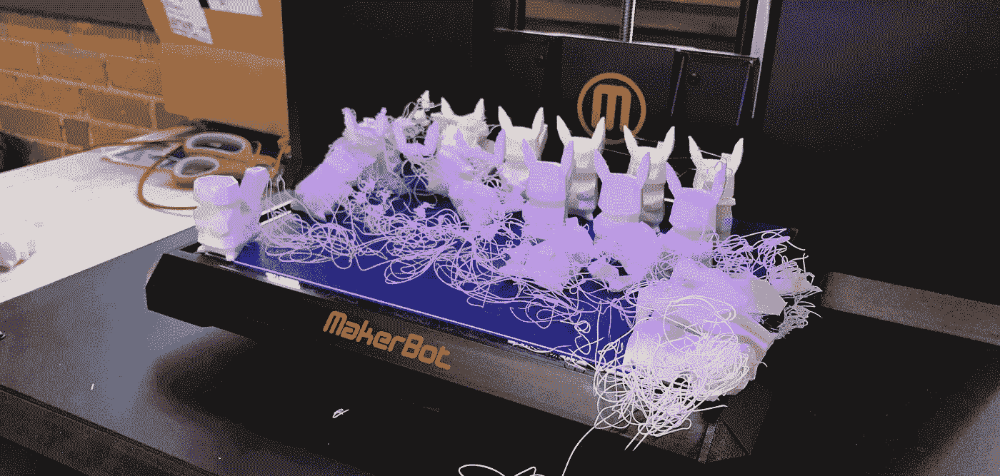
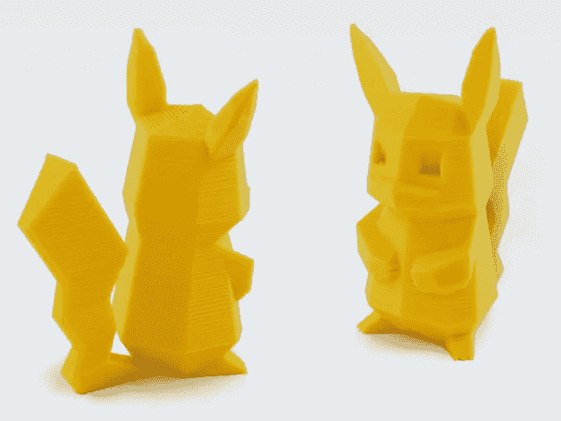

# 我希望在购买 3D 打印机之前知道什么

> 原文：<https://medium.com/hackernoon/what-i-wish-i-knew-before-buying-a-3d-printer-68968b20a30e>

[3D 打印](https://hackernoon.com/tagged/3d-printing)是新的、令人敬畏的、令人难以置信的酷。如果你做任何硬件/物联网项目，它可能是有价值的。就我个人而言，我想开始为我所有的项目建造围栏。

需要注意的是:**如果你已经拥有一台 3D 打印机，这些概念/主题可能对你来说非常熟悉。**如果你是新手，希望这有所帮助。先从头开始，一路上我学到了很多东西。希望我能帮你避免这种情况:

在你开始使用或购买[打印机](https://hackernoon.com/tagged/printer)之前，这里有一些有用的提示:

# 1.观看此视频

这是迄今为止我能找到的对 3D 打印最好的介绍:

# 2.有些地方可以为你 3D 打印

你不需要买打印机，因为你看到了一个很酷的视频，有人在打印小格鲁特。然而，它可爱得可笑:

实际上，如果你只想打印一样东西，有一些服务可以帮你 3D 打印:

## [3D 轮毂](https://www.3dhubs.com/)

3D Hubs 就像是 3D 打印的优步。该服务将您与您所在地区的其他人联系起来，这些人将他们的打印机提供给您使用。

这很方便，因为你可以直接取你的照片，而不是等待运输。我发现这是打印东西最快的方式。

 [## 3D 中枢:浏览在线 3D 打印服务

### 上传您的设计以获得免费的即时报价。选择 3D 打印服务，选择材料，然后订购…

www.3dhubs.com](https://www.3dhubs.com/) 

## [身材走样](https://www.shapeways.com/)

Shapeways 是一家印刷你的设计的公司。他们有一个很棒的市场，里面充满了令人惊叹的设计，你可以把它们打印出来。

Shapeways 最好的一点是它们有[吨的材料](https://www.shapeways.com/materials)——你可以用柔性材料或不同的金属打印。你甚至可以出售你的设计。

 [## Shapeways - 3D 打印服务和市场

### 在 Shapeways 设计、制作原型、购买和销售定制产品；世界上最大的在线 3D 打印服务社区…

www.shapeways.com](https://www.shapeways.com/) 

## 本地位置

你当地的图书馆或大学可能也有 3D 打印机。

一旦你开始考虑 3D 打印，你会想要 3D 打印一切。但是，要做到这一点，你不必得到一台打印机，这些服务将工作得很好。如果你发现自己经常使用它们，就买一台打印机吧。

# 4.设计很难

为实物产品设计是困难的。你每天使用的物品中有如此多的成分。这部[纪录片](https://www.netflix.com/title/70114976)解释了这一切。

## [Thingiverse](http://www.thingiverse.com/)

[Thingiverse](http://www.thingiverse.com/) 可以节省你很多时间。这是一个让你免费使用他们设计的社区。看，人们都很棒。

 [## MakerBot Thingiverse

### Thingiverse 是一个事物的宇宙。下载我们的文件，用你的激光切割机、3D 打印机或 CNC 来制作。

thingiverse.com](http://thingiverse.com) 

# 5.3D 打印需要很长时间

t

你的指纹需要很长时间。像皮卡丘(上图)这样的东西可能需要 50 分钟才能打印出来。[宝贝格鲁特](http://www.thingiverse.com/thing:2014307)花了~ **7 个小时**才打印出来。

看着它就像看着油漆变干或者等着水烧开。

只是要注意:你会花大部分时间让印刷品粘在打印机的底座上。这是一项非常具有挑战性的任务。

# 7.多种颜色？

哈！不可能，除非你想买一台[昂贵的打印机](https://shop3duniverse.com/collections/3d-printers/products/ultimaker-3?gclid=Cj0KEQiA0L_FBRDMmaCTw5nxm-ABEiQABn-VqTXphuPLhJ2MvzGFhU8szTVdGl2s31J93_Eylj2pHlgaAj3i8P8HAQ)。你的另一个选择是购买这款超棒的设备:

 [## 多色 3D 打印

### 调色板可以让您在单挤出机 3D 打印机上打印多根细丝，无需布线或修改。

www.mosaicmanufacturing.com](https://www.mosaicmanufacturing.com/) 

# 8.什么打印机？

如果你还想买一台打印机，这里是我最大的建议:买一台带加热床的。加热床有助于您的打印物附着在打印机底座上。因为你的打印会更少失败，这将节省你很多时间和精力。

这款打印机被《Make》杂志评为最佳 3D 打印机。它有加热床和多色升级。

 [## 原装 Prusa i3 MK2 3D 打印机套件，带 LCD

### 查看大图 Prusa i3 是一款经过验证的设计，在全球拥有成千上万的用户。现在你有一个伟大的…

shop.prusa3d.com](http://shop.prusa3d.com/en/3d-printers/59-original-prusa-i3-mk2-kit.html) 

# 硬件项目如何打印附件？

接下来，我将讲述如何为您的硬件项目设计和打印附件。敬请关注。

如果你有问题，请在推特上告诉我。

> [黑客中午](http://bit.ly/Hackernoon)是黑客如何开始他们的下午。我们是 [@AMI](http://bit.ly/atAMIatAMI) 家庭的一员。我们现在[接受投稿](http://bit.ly/hackernoonsubmission)，并乐意[讨论广告&赞助](mailto:partners@amipublications.com)机会。
> 
> 如果你喜欢这个故事，我们推荐你阅读我们的[最新科技故事](http://bit.ly/hackernoonlatestt)和[趋势科技故事](https://hackernoon.com/trending)。直到下一次，不要把世界的现实想当然！

