# 加入乳齿象之前

> 原文：<https://medium.com/hackernoon/what-i-wish-i-knew-before-joining-mastodon-7a17e7f12a2b>

## 我试图通过哈利波特 gif 来解释乳齿象

乳齿象已经存在六个月了，但很有可能，你现在才加入，因为你已经在 [Verge](http://www.theverge.com/2017/4/4/15177856/mastodon-social-network-twitter-clone) 、 [Vice](https://motherboard.vice.com/en_us/article/mastodon-is-like-twitter-without-nazis-so-why-are-we-not-using-it) 、 [Mashable、](http://mashable.com/2017/04/04/mastodon-twitter-social-network/#9YMgnBpbliqq)、 [Quartz](https://qz.com/951078/the-complete-guide-to-using-mastodon-the-twitter-twtr-alternative/) 或其他一些科技出版物上看到了关于“反推特”的文章——更不用说重金属乐队乳齿象的高质量推特[trolling 了。](https://hackernoon.com/tagged/twitter)

此外，由于其 24 岁的德国开发者 Eugen Rochko 试图进行一些质量控制，Mastodon 的旗舰账户[mastocon . social](https://mastodon.social)(稍后将详细介绍)已经暂时停止增加新用户，这使得这个俱乐部感觉更加排外。

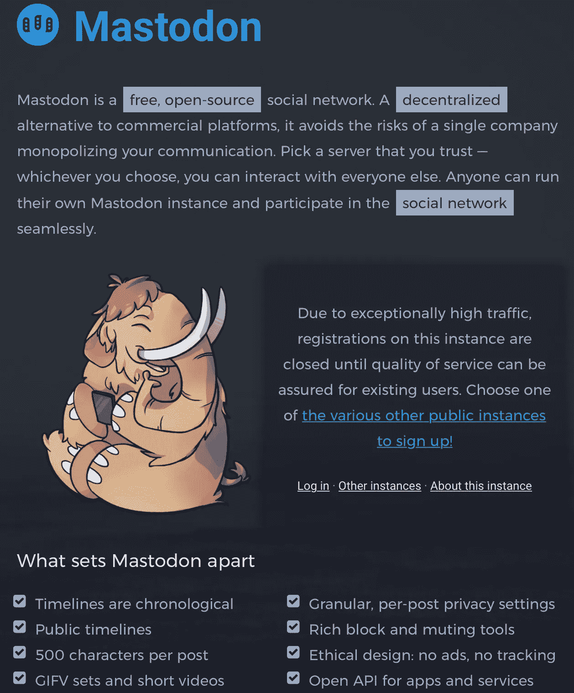

截止到 2017 年 4 月 9 日，已经做了超过 13 万个[乳齿象](https://hackernoon.com/tagged/mastodon)账号。其中超过 42000 个账户在 Mastodon.social 上注册。

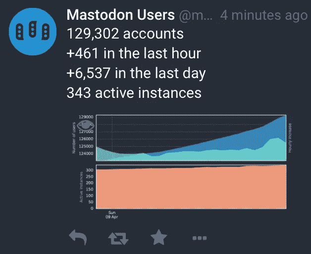

虽然乳齿象和 Twitter 一样让人感到熟悉，但它的不同之处在于，它最初给人的感觉就像《黑镜》中的一集。

以下是我在加入乳齿象的过去 48 小时里学到的东西，以及我希望在加入之前就知道的东西:

# 什么是实例，我应该加入哪个实例:

由于注册[mastosdon . social](https://mastodon.social/)已经截止，直到未来通知，你可能已经注意到一条消息，上面写着[“从各种公共实例中选择一个来注册！”](https://instances.mastodon.xyz)

即使 Mastodon.social 暂时限制了新用户的数量，你仍然可以通过加入任何实例来注册 Mastodon。

实例有点像 subreddits，每个实例都由一个专门的志愿者团队来管理，每个实例都可能有自己特定的规则、兴趣、主题或文化。但与 Reddit 不同的是，每个乳齿象实例由一个独立的管理员和开发人员团队托管在不同的服务器上，他们执行乳齿象实例的规则。

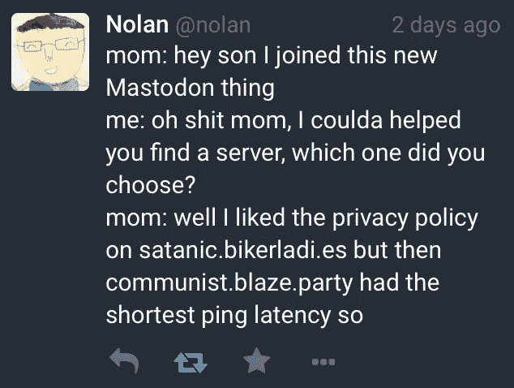

下面是一些可用实例的列表，注册是否开放以及如何找到它们。

 [## 成套工具/乳齿象

### 乳齿象——GNU 社交兼容的微博服务器

github.com](https://github.com/tootsuite/mastodon/blob/master/docs/Using-Mastodon/List-of-Mastodon-instances.md) 

但是在加入之前，你可以通过访问实例的“关于我”页面来了解更多关于乳齿象实例的信息。

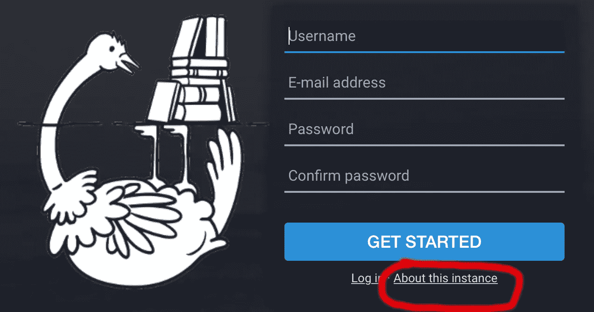

你参加的场合很重要，因为这可能会决定你最初会遇见谁。

如果你正在寻找一个网站来推荐一个接受新用户的随机实例，[试试这个:](http://tooter.today/suggestions/3)

 [## tooter . today——找到一个好的乳齿象实例

### 如果您不确定从哪里开始，这个工具可以很容易地找到乳齿象实例。

嘟嘟，今天](http://tooter.today/suggestions/3) 

有更多成员的实例可能与其他实例联系更紧密，根据您加入的实例，您将看到完全不同的本地和联合时间线(稍后将详细介绍)。

你仍然可以与其他实例中加入 Mastodon 的人联系，但就像电子邮件地址一样，你加入的实例会一直跟着你。

例如，如果你想在乳齿象上给我发消息，你必须嘟嘟地输入@ qinaliu @乳齿象. social(稍后会详细介绍)。

由于每个用户都绑定到一个实例，人们也可以在另一个实例上窃取你的用户名和身份(这有点像@gmail.com 和@yahoo.com 以及@aol.com 的电子邮件地址都不同)。由于您可以加入并登录任意数量的乳齿象实例，因此从技术上讲，您可以同时出现在多个地方。

# **乳齿象与推特相比如何:**

乳齿象，虽然在某些方面是史前的(谢天谢地，时间线仍然是按时间顺序排列的，你在这里“喜欢”而不是“喜欢”帖子)，但感觉很直观，因为它与 Twitter 非常相似。

界面看起来像 TweetDeck——除了专栏不可定制，你不能安排帖子，你不能建立列表，趋势更难跟踪或搜索，嗯，乳齿象不是 Twitter。

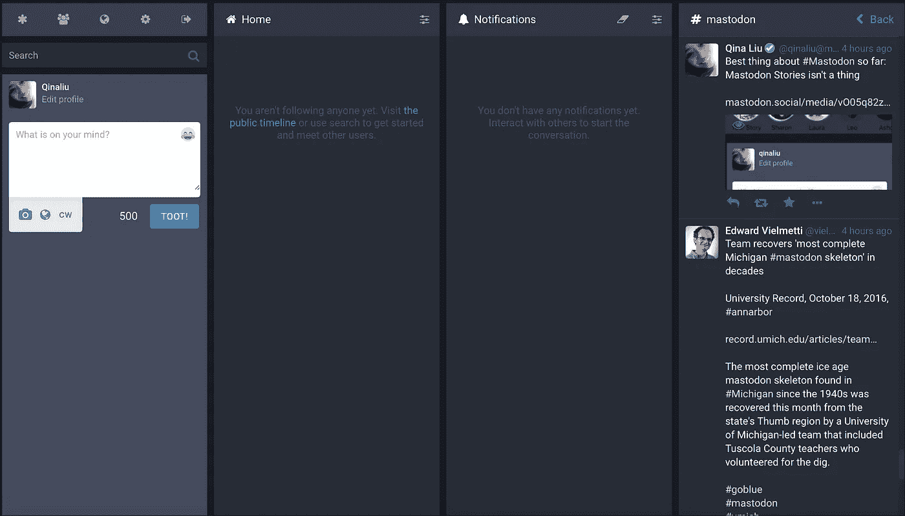

## 乳齿象:

*   推文被称为嘟嘟声。
*   转发被称为提升。
*   喜欢是最爱。
*   嘟嘟声按时间顺序显示，最新的嘟嘟声显示在您的订阅源的顶部。
*   一只小鸡取代了默认的 Twitter 彩蛋/个人资料。
*   与 Twitter 的 140 个字符相比，你有 500 个字符的限制。
*   Twitter 被称为 birdsite。

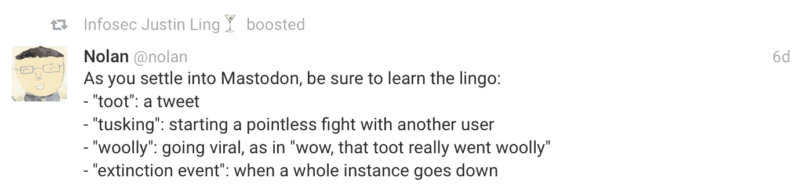

但这些是一些更明显的区别。Mastodon.social 是一个“Twitter 用户的乌托邦”:在这里，广告、种族主义和仇恨言论被严格禁止，平等是关键。

为了限制潜在的骚扰，乳齿象只能通过标签搜索(这在未来可能会改变)，你不能“引用-嘟嘟”乳齿象还具有为每个嘟嘟定制的隐私过滤器。

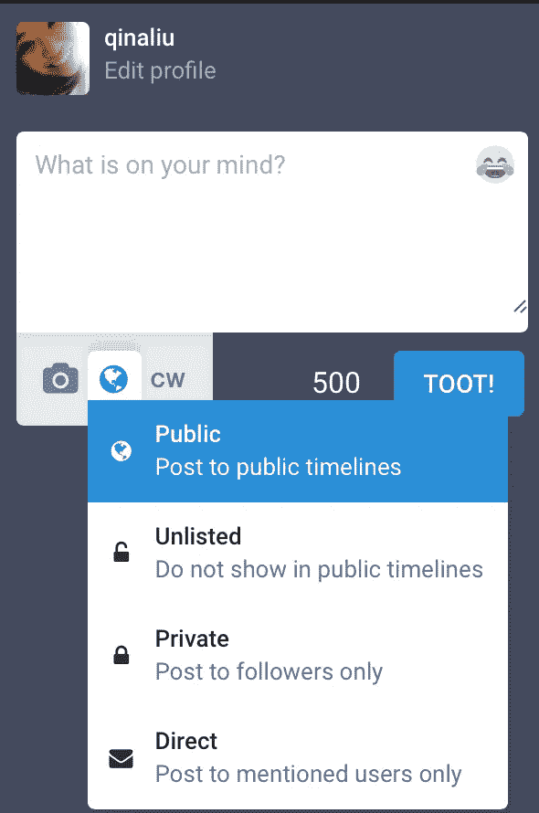

此外，Rochko 还推出了内容警告过滤器…

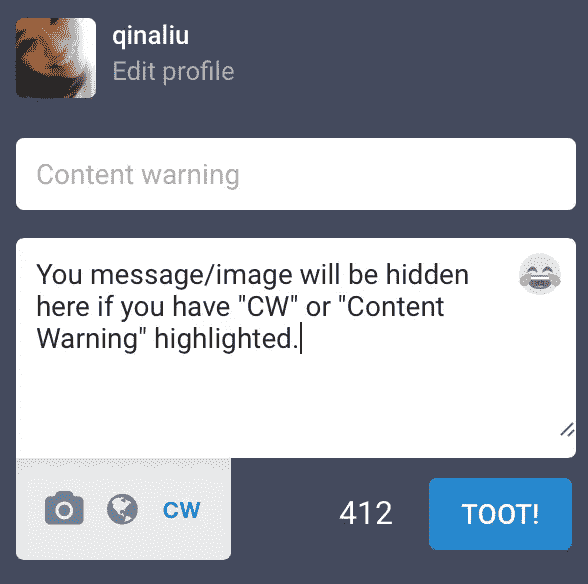

…哪些用户曾用来隐藏笑话的笑点:

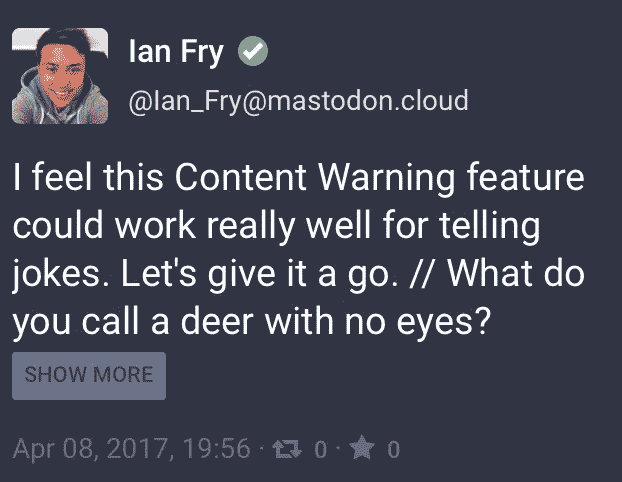

另一个主要的区别是如何接受嘟嘟声。因为在你点击嘟嘟之前，嘟嘟上的回复数、赞数和收藏数都是隐藏的，所以嘟嘟是被赞还是被收藏并不重要。由于时间线是按时间顺序排列的，而不是像 Twitter、脸书和 Instagram 所采用的算法，每个嘟嘟都有同等的机会被看到。

所有这一切的目的不是收集喜欢或关注，但也许人们真的会有对话。

但是如果你的一部分从建立一个追随者中得到快乐，要知道你的追随者数量看起来是不同的，取决于某人在哪个实例上。

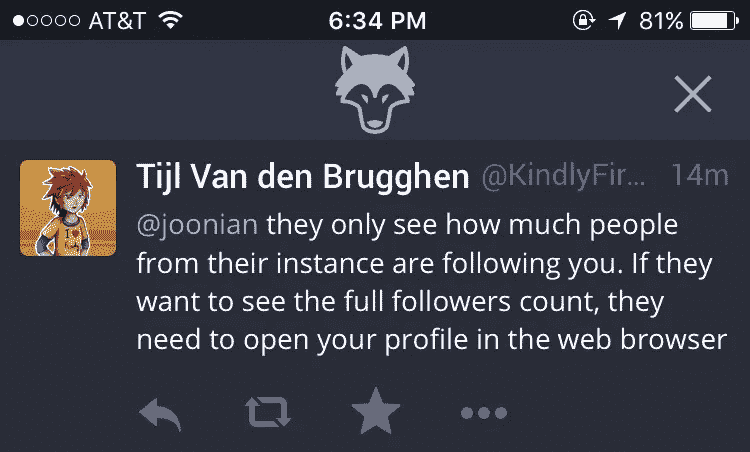

与推特不同，乳齿象也不再建议你应该关注的人(尽管这是社交网络首次推出时的一项功能)。你通过观察人们在说什么来找到他们。

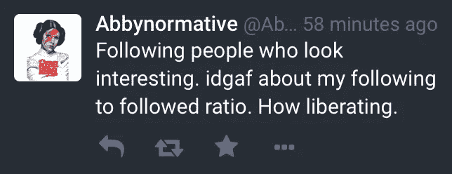

你可以点击 toots 来查看对话的线索。

# 本地时间线和联合时间线的区别

乳齿象给了你在本地和联邦时间线之间切换的选项。

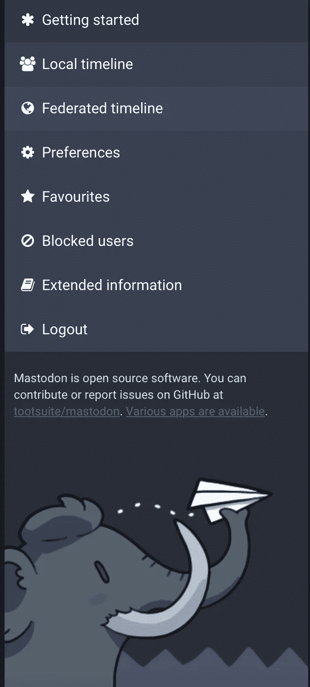

来自您的实例的嘟嘟声按时间顺序出现在您的本地时间线中，而来自您的实例中的用户关注的帐户的嘟嘟声可能出现在联合时间线中。

让人们出现在你们的联合时间线上需要一点探索和世界建设。随着您的实例中的帐户关注更多来自其他实例的人，更多的帐户可能会出现在您的实例的联合时间线中。有一堆追随机器人似乎是为了全球化和跨实例连接人们而创建的。

这意味着，根据您所在的实例，您的本地和联合时间线可能会与其他人在另一个乳齿象实例上的时间线完全不同。

但是如果你还是不明白，这里有另一个关于本地和联合时间线的解释:

# 乳齿象应该跟谁？

虽然本地和联合时间表可以帮助你找到可能感兴趣的客户，但乳齿象并不有趣，除非你关注一些客户。像 Twitter 一样，你可以策划你的“家庭”时间表，但与 Twitter 不同，除非你知道他们的乳齿象句柄，否则很难搜索到可以关注的人。

如果你想关注我，我的邮箱是@ qinaliu @ mastodon.social，但这里有一份其他记者和影响者的名单:

*   **欧根·罗奇科**,[乳齿象.社交](http://mastodon.social)创始人:@加格龙@乳齿象.社交
*   **trending bot**:@ trending bot @ mastodon . social(这显然是一个机器人，而不是人，但这个账户值得关注，因为它跟踪热门标签，并定期发出声音。)
*   **诺兰·劳森**,[嘟嘟的管理员。Cafe](https://toot.cafe) : @nolan@toot.cafe(他对新手超级有帮助，给了很多提示)
*   **《社区》制片人丹·哈萌**:@ Dan harmon @ mastosdon . social
*   **“IT 人群”的创造者格雷厄姆·莱恩汉姆**:@格林纳@乳齿象.社交
*   **威廉·夏特纳**，因在《星际迷航》中扮演柯克船长而出名的演员:@ WilliamShatner @ mastosdon . club([谁也不能删除他的乳齿象账号](http://mashable.com/2017/04/06/you-cant-delete-your-mastodon-account/#kgfYyxmLaSqV))。)
*   [**Sarah Jeong**,“Vice”的特约编辑](https://motherboard.vice.com/en_us/article/mastodon-is-like-twitter-without-nazis-so-why-are-we-not-using-it):@ sarahjeong @ mastosdon . social(Twitter-addict，她写了 Vice 关于乳齿象的文章，你可能读过。)
*   [**凯西·牛顿**，《The Verge》编辑](http://www.theverge.com/2017/4/4/15177856/mastodon-social-network-twitter-clone):@ Casey Newton @ mastosdon . social
*   [**米卡·李**，记者于截:](https://theintercept.com/staff/micah-lee/)@米卡·李@乳齿象.社会
*   **Wong Joon Ian** ，Quartz 科技记者:@joonian@social.tchncs.de(他[写了这本乳齿象指南](https://qz.com/951078/the-complete-guide-to-using-mastodon-the-twitter-twtr-alternative/))。)
*   Mashable 的编辑兰斯·乌兰诺夫(Lance Ulanoff)写道:@ LanceUlanoff @ mastodon.cloud(以下是他对乳齿象无法生存的原因的看法。)
*   [**李洁莹**，Engadget 高级编辑:](https://www.engadget.com/2017/04/07/mastodons-sudden-popularity-should-serve-as-twitters-wakeup-ca/)@ Nicole @ mastosdon . cloud
*   [**Sonya Mann** ，Inc .科技记者](https://www.inc.com/author/sonya-mann) : @sonya@maly.io

有人还在乳齿象上为艺术家、音乐家和电影制作人建立了一个公共的谷歌文档数据库

 [## 乳齿象创意人员/艺术家/音乐家/插画师/动画师/电影制作人

### Sheet1 句柄、兴趣、注释/URL 等。、bird site/other handle @ pseudo Michael @乳齿象。网络、运动图形…

docs.google.com](https://docs.google.com/spreadsheets/d/1RijFCUasnrtZdLO2BOrkN1H-1i0wGj8YzdtF8FvciGE/edit#gid=0) 

# 如何在乳齿象上得到“验证”

实话实说吧:你只是想在你的名字旁边打上一个勾号✅。

这在乳齿象上非常容易做到，不仅仅局限于名人、记者和其他像 Twitter 上那样有影响力的人。你真正要做的就是在你的显示名旁边插入一个支票表情符号。

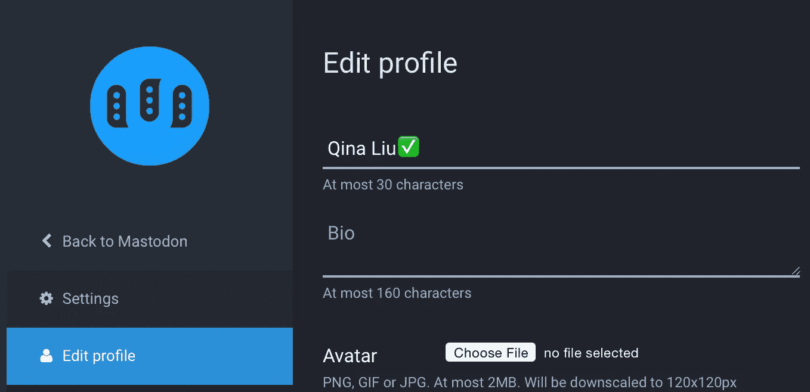

乳齿象用户使用✅来取笑 Twitter 上复杂的验证过程。

除了乳齿象上的假 Twitter 账户，还有一堆乳齿象账户取笑 Twitter 验证过程:

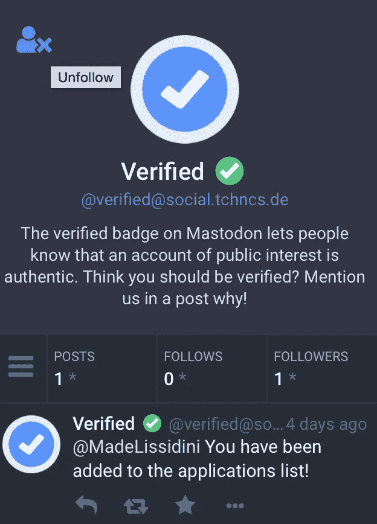

我甚至看到一些用户上传 Twitter 彩蛋作为他们的头像。

# 乳齿象上的人都聊些什么？

就像搏击俱乐部一样，搏击俱乐部的第一条规则是你不能在搏击俱乐部之外谈论搏击俱乐部。

既然从乳齿象到 Twitter 的交叉发布不起作用，而且在 Twitter 上发布关于乳齿象的信息可能会被人反对，那么乳齿象用户在乳齿象上谈论什么呢？

当然是乳齿象啦！根据一个追踪流行标签的趋势机器人，乳齿象一直是人们使用的头号标签。

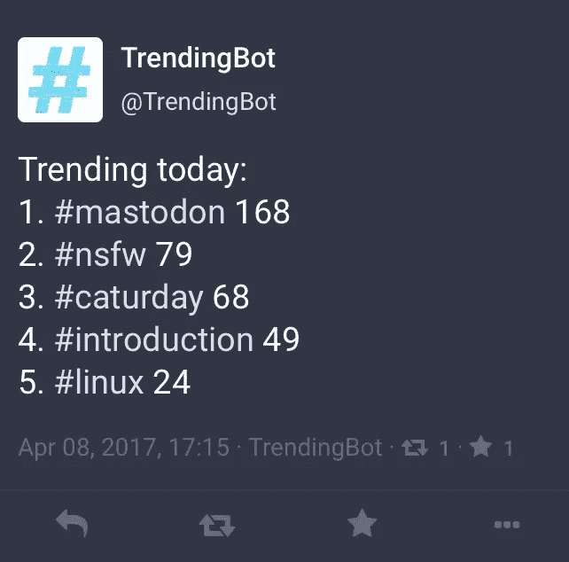

猫也很受欢迎。(毕竟这是互联网。)

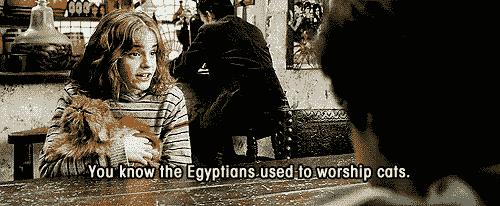

但是如果你是新手，搜索标签#introduction 或#introductions 是一个很好的搜索和寻找其他有相似兴趣的人的地方，他们可能值得关注。

# 那么我应该在乳齿象上使用标签吗？

看情况。toots 中的单词还不能搜索，但是标签可以。使用带有单词的标签有助于你的 toots 变得更容易被搜索到，也有助于你和有共同兴趣的人联系。但是如果你不想让潜在的巨魔通过关键字找到什么，就不要使用标签。

# 有这方面的应用吗？

当然啦！什么都有一个应用。我没有全部试过，但是这里有一个适用于 iOS、Android 和 Chrome 的应用列表:

 [## 成套工具/乳齿象

### 乳齿象——GNU 社交兼容的微博服务器

github.com](https://github.com/tootsuite/mastodon/blob/master/docs/Using-Mastodon/Apps.md) 

Android 版的[Tusky](https://play.google.com/store/apps/details?id=com.keylesspalace.tusky&hl=en)和 iOS 版的[Amaroq](https://itunes.apple.com/us/app/amaroq-for-mastodon/id1214116200?mt=8)似乎是最受推荐的。

# 为什么乳齿象上到处都是菠萝？

好吧，我不是 P.J. Vogt，Alex Goldman 或播客[“回复所有人”](https://gimletmedia.com/reply-all/)中任何一位出色的制作人，但我会尝试对你们说“是，是，不是”。

🍍🍍🍍on Mastodon 是由 Alex Weiner(@ acw @ mastocon . social)开始的，他是一个使用 APL 的软件开发人员。因为 APL 听起来像🍎，他真的喜欢🍎以及任何单词，包括🍎喜欢🎄🍎。

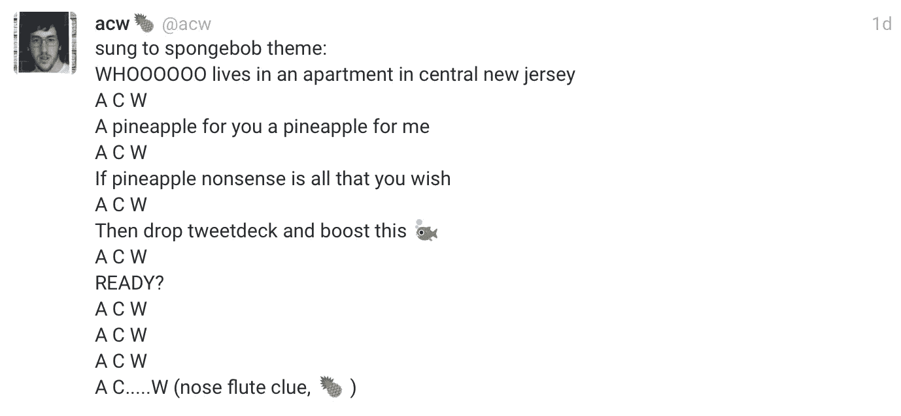

所以他开始嘟嘟叫🍍作为“你好”、“欢迎”、“阿罗哈”的一种形式，你明白了。

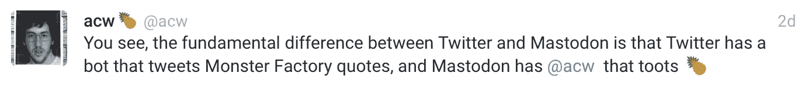

他还开始给图茨注射🍍。

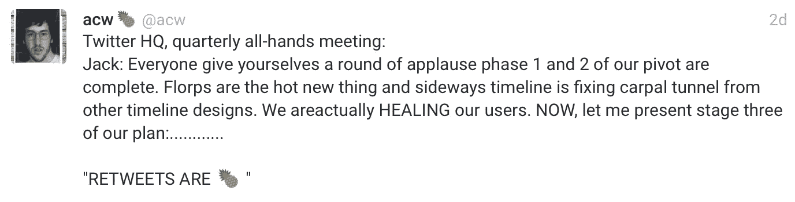

因此🍍成了 boost 的表情符号简写。

和🍍当你的乳齿象追随者数量超过你的推特追随者数量时，ing 也成为网络俚语。

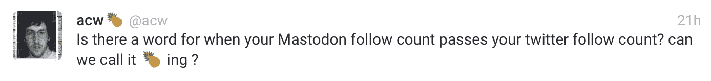

但是菠萝升值并没有就此结束。其他人开始发帖🍍在他们的显示名称中。

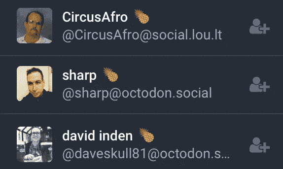

甚至罗奇科也开了个菠萝玩笑。

概括一下，如果你得到一个🍍在乳齿象上，是…

另外，菠萝太棒了。

除非你是冰岛总统，谁不喜欢🍍🍕。

那你是在说“是，是，是”吗？

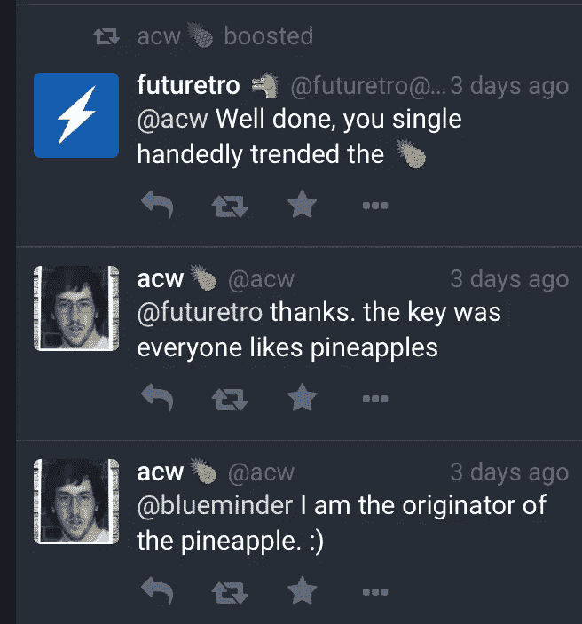

> [黑客中午](http://bit.ly/Hackernoon)是黑客如何开始他们的下午。我们是 [@AMI](http://bit.ly/atAMIatAMI) 家庭的一员。我们现在[接受投稿](http://bit.ly/hackernoonsubmission)并乐意[讨论广告&赞助](mailto:partners@amipublications.com)机会。
> 
> 如果你喜欢这个故事，我们推荐你阅读我们的[最新科技故事](http://bit.ly/hackernoonlatestt)和[趋势科技故事](https://hackernoon.com/trending)。直到下一次，不要把世界的现实想当然！

