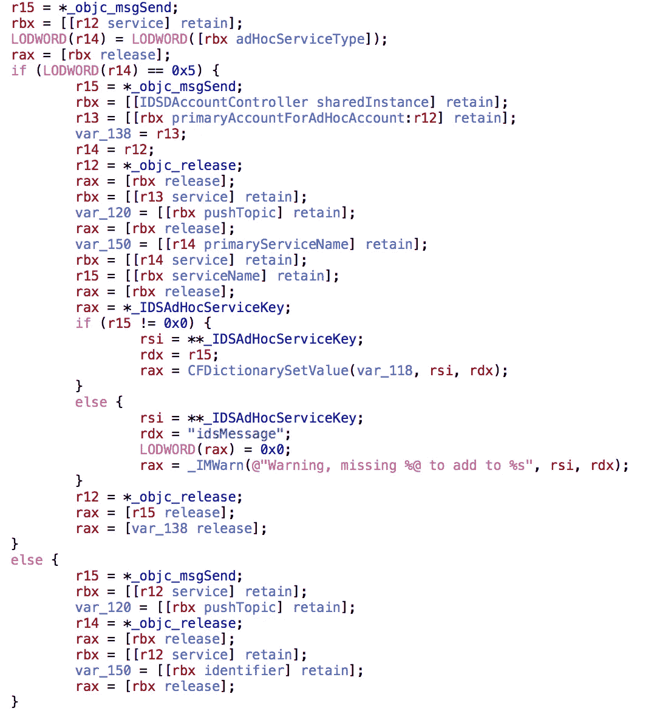
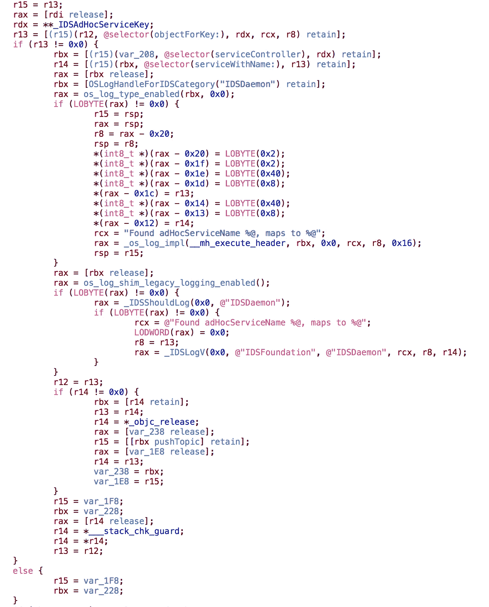

# 如果任何人都能成为你呢？

> 原文：<https://medium.com/hackernoon/what-if-anyone-can-be-you-973a2267cdda>

iPhone 发布十年后，我们的沟通方式发生了显著变化。我们不再面对面交谈，而是相互发送信息，通过手机告诉我们发件人是谁来识别信息的来源。如果我告诉你，你信任的设备可以背叛你，并代表你行事？如果任何人都可以成为“你”呢？

苹果产品[安全](https://hackernoon.com/tagged/security)的恐怖故事还在继续。今天，在“我们只是盲目信任 [IDS](https://www.apple.com/business/docs/iOS_Security_Guide.pdf) 而现在我们被骗了”的土地上，我们有了两个新成员。还记得那个超级方便、神奇的功能吗？它可以让你通过手机在 Mac 上发送短信。原来“它只是工作”的部分是唯一可能的，因为你的手机只会处理任何命令发送给它，要求它从当前号码发送短信。还有我们敬爱的私人助理 Siri？它也是一个傀儡，只是处理命令而不检查命令是否来自你。当 IDS 向两个守护进程发送请求时，它们都不验证消息来源和处理请求。

我需要澄清的是，仅仅因为守护程序不验证消息来源并不意味着苹果在安全方面是**那么**愚蠢。默认情况下，IDS 应该只允许帐户所有者(仅限于登录到您的 iCloud 帐户的设备)向那些受限制的服务(短信和 Siri iCloud)发送信息。这些保护应该足够了，只要苹果确保没有信息可以到达这些受限服务，除非它来自帐户所有者。但是，IDS 团队中的一些人认为，允许消息本身能够覆盖它应该交付给哪个服务是一个好主意。这意味着有人可以告诉 IDS 通过 iMessage 服务发送消息(每个人都可以向其他帐户发送消息，因为这是消息的工作方式😛)，并且在该消息内，代替正常的 iMessage 有效载荷，该人可以连同用于 SMS 服务的有效载荷一起包括说“实际上该消息是用于 SMS 服务的”的指令。一旦 IDS 通过 iMessage 服务将消息传递给目标的 [iOS](https://hackernoon.com/tagged/ios) 设备上的 *identityservicesd* ，守护程序就会看到覆盖目标服务的指令，然后将消息传递给新的目标服务，相关的守护程序不会检查发送方。哈哈，我们绕过了保护你身份安全的墙。

就我个人而言，我发现这个问题非常有趣，因为它提出了一些有趣的问题:我们应该如何将个人身份从应该是你的身份的设备中分离出来？个人应该为他们的设备在所有者不知情的情况下做的事情受到责备吗？我的意思是，有了短信，一个人可以把话放进别人嘴里。所有记录都将显示这些信息是由设备的所有者发送的，而事实是设备在未经所有者同意的情况下发送了这些信息。SMS 甚至会记录在受害者的设备上，这是传统的 SMS 欺骗技术无法实现的。有很多创造性的方法来使用它，当我看到这个 bug 真的工作时，我吓坏了😅。

## iOS 的意大利面味道🍝

[IDS](https://www.apple.com/business/docs/iOS_Security_Guide.pdf) (identityservicesd)现在是 iOS 中一根巨大的意大利面。根据 iOS 安全白皮书中的描述，IDS 的最初目标是允许 iOS 设备(和 Mac)交换设备标识(公钥、推送令牌),用于建立彼此之间的端到端加密通信。不知何故，IDS 本身变成了许多苹果守护进程的消息传输工具，这些守护进程需要在 iOS 上进行设备间通信。在守护进程端挖掘“假设是通用的”消息发送方法的反汇编，您可以找到许多特定于服务的黑客来禁用或启用单个消息的某些功能🤦‍♂️.

如果 identityservicesd 认为尝试发送消息的服务不能直接接收消息(即席类型 5)，它将尝试插入带有目标服务标识符的“IDSAdHocServiceKey ”,然后使用与目标服务关联的主服务发送消息。我不知道为什么会有这个，因为没有服务真正使用它，但也许 IDS 工程师只是想更好地为未来做准备？

反正发送部分没那么有趣，有趣的是消息处理部分。收到来自 Apple 推送通知服务的消息后，identityservicesd 将尝试找到该消息所针对的服务，然后将该消息发送给对该消息感兴趣的客户端。在此过程中，守护程序检查消息是否包含“IDSAdHocServiceKey ”,如果该键存在，则覆盖目标服务。

Here is where everything went south

看到问题了吗？他们错过的一件事是检查覆盖服务是否期望从主要服务交付。正确的方法是在实际重写目标服务之前检查它是否具有类型为 5 的 AdHoc。攻击者所要做的就是弄清楚哪个守护程序不会检查消息发送者，并通过编写消息来和他们玩得开心。下面是短信中继的视频演示。看到手机在没有人触摸的情况下发送文本有点令人毛骨悚然😛这个奇怪的字符串到底是由 bug(还是特性？)在 iOS 11.2 中，当它认为目标能够接收 iMessage 时……

## 正在修复 IDS

如果你还记得家庭工具包(HomeKit)发行版(T1)，你会发现二者有很多相似之处。苹果公司内部似乎有一个共同的假设，即使用 IDS 的客户不需要做额外的工作来确保以预期的方式传递消息……如果是这样的假设，也许 IDS 应该有一个默认行为，即不从当前帐户以外的发件人向客户传递消息，除非该客户拥有特殊授权。然后，产品安全团队可以对具有该特殊权限的 IDS 客户端执行定期安全审核，以确保其他守护程序将来不会再次出现类似问题。

苹果公司在 12 月 19 日到 20 日之间的某个时间通过让 IDS 服务器剥离单个消息中的“IDSAdHocServiceKey”来解决 IDS 绕过的问题。也许在未来的 iOS 版本中，他们将正确处理消息\_(ツ)_/

## 苹果安全奖金是个笑话

好吧，我不确定是不是只有我不适合苹果的产品安全团队，还是产品安全团队总是想做个混蛋。我与他们的沟通在让媒体参与到 HomeKit 事件中之后得到了很多回应。我在 12 月 15 日发现了 IDS 绕过问题，然后用 12 月 16 日的时间来研究受影响的守护进程。因为我不想为苹果公司免费做所有的工作，我给产品安全部门发了一封电子邮件，询问我能否收到加入他们的安全奖金计划的邀请，这样我就可以报告此人，并在一定程度上保证提交的内容将是奖金提交。这是我从他们那里得到的答复。

> 所有报告的问题都将根据 Apple Security Bounty 计划的标准进行评估，但仅接受邀请才能参与。有关 Apple Security Bounty 计划的信息，请访问位于 https://www.apple.com/business/docs/iOS_Security_Guide.pdf的《iOS 安全指南》。
> 
> 如果您能就您提到的问题提供更多信息，我们将不胜感激。提交合格发行是必要的，但不足以获得邀请资格；Apple Security Bounty 的参与需要负责任的披露:在修复程序发布和可用之前，不公开讨论该问题。
> 
> …
> 
> 对于合格的问题，研究人员必须向苹果公司充分披露细节，并与我们协调，以便在披露任何细节之前，问题可以得到充分解决。提前披露会使你的原始问题失去资格。

“对于一个合格的问题，研究人员必须向苹果公司充分披露细节，并与我们协调”第一个问题，不幸的是，由于苹果公司方面缺乏沟通，协调是不可能的。只有在 9to5mac 威胁要发表这篇文章后，苹果才给我回复了一些有意义的东西，现在他们责怪我“提前披露”\_(ツ)_/顺便问一下，有人知道“需要负责任的披露”这部分吗？任何地方都没有记载…

然后在 12 月 19 日与他们通了电话，主要是谈论 HomeKit 的修改，最后我又问了关于赏金邀请的问题，基本上这位女士仍然责怪我，但她说她会四处问问，看看是否有解决方案。我尽量表现得友好，给了他们一些关于 id 问题的提示，然后结束了通话。

然后第二天，他们从服务器端修复了这个问题，并再次说没有。从那以后，我基本上只是发一封长长的电子邮件来表达我的沮丧，并拒绝按照他们的方式行事。我认为那封邮件让他们把我放回了不回复名单，因为从那以后我再也没有收到他们的回复🙃。

感谢你通读，我真的很想得到一些反馈来校准我对这个世界的理解…我是一个不讲道理的人吗？我只是要求一个邀请，甚至没有说要求苹果在 HomeKit 问题上慷慨解囊。苹果应该指望所有的安全研究人员免费为他们工作吗？

这就是苹果产品安全的恐怖故事。希望你不会很快看到我的第三季。

圣诞快乐:)

PS:如果“糟糕的一周”一直发生，有人可能应该从内部仔细看看。一个新毕业生在一个周五的晚上就找到了这样的东西，谁知道在“安全和隐私”的想象下还隐藏着什么