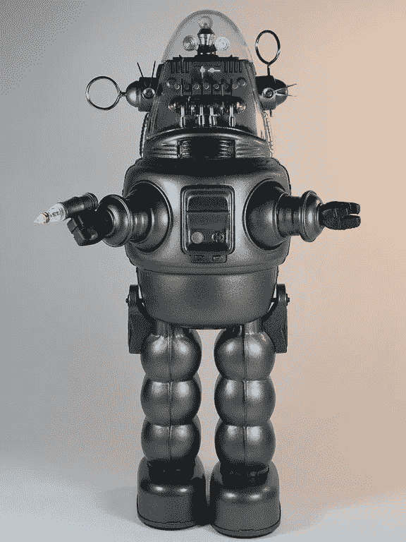

# 如果智能机器告诉我们一些我们不想知道的事情呢？

> 原文：<https://medium.com/hackernoon/what-if-intelligent-machines-tell-us-something-we-dont-want-to-know-3a44862b3ff1>

*以下文章转载，稍作修改，来自我的* [*邮件简讯*](http://inside.com/technically-sentient) *。如果你喜欢人工智能，你应该去报名。*

我想提前警告你，我将要写的东西可能会引起一些不舒服的情绪。如果你很容易被冒犯，你可以跳过这一节，等到下周再来。今天我想通过演示人工智能即将出现的问题来挑战极限。

让我们从唐纳德·特朗普开始。TechRepublic 本周有一篇 [**文章称，一位人工智能预测特朗普会赢，一场所有民调机构都未能捕捉到的胜利。不仅如此，这个人工智能现在已经连续 4 次准确预测了总统大选。这是一个令人印象深刻的壮举，如果这是真的，但它可能不是真的。这可能是**](http://www.techrepublic.com/article/ai-tool-successfully-predicted-trump-win-still-ai-experts-are-skeptical/) **[**完美预测谬误**](http://skepdic.com/perfectprediction.html) 的一个版本。**

我假设，根据选举结果，至少有 50%的读者对特朗普获胜感到不安。实际上，因为你们大多数人都是搞技术的，看看这些数字，你们中可能有接近 65%的人对他获胜感到沮丧。现在让我问你一个问题……当人工智能开始告诉我们不想听的事情时会发生什么？当它做出我们不喜欢的预测时，尤其是当我们无法干预和改变结果时，会发生什么？更重要的是…

当人工智能做了一些动摇我们核心信念的事情时会发生什么？

我知道我们都愿意相信自己思想开放，但是，我们真的是这样吗？在以前的时代，当技术质疑人类的核心信仰(哥白尼、伽利略、达尔文)时，人类并没有很轻松地处理。

回到我们的特朗普例子，如果一个人工智能提前告诉你特朗普会赢，而你说的其他数据都不是这样，你会怎么办？或者，如果一个人工智能预测特朗普实际上会是一个更好的总统，并鼓励你投票给他，而你并没有打算这样做，会怎么样？你会不会突然从觉得 A.I .很聪明很有用变成“这些机器不知道自己在说什么”？

本周我花了一些时间挖掘研究论文，寻找可能预测到一些非常冒犯我们的事情的机器学习模型。我找到了几个，并选择了两个在这里介绍。这些发现没有被媒体报道，因为人们不喜欢这些结果，也害怕公开接触它们。我会在文章的最后而不是现在链接到论文，因为我希望你们首先关注这些发现。

第一篇论文使用机器学习将智商测试问题按照种族划分为有偏见的或无偏见的。在对偏见进行调整后，该机器报告说，高加索人的平均智商实际上比亚洲人(低 11 分)或非裔美国人(低 8 分)低。

第二篇论文研究了与暴力行为相关的遗传信息，并建立了一个模型，但该模型被媒体忽略了，因为该模型显示**非洲裔美国人的基因构成使他们比其他种族更容易出现 3 倍的暴力行为。**

当你阅读每一个结论时，你有不同的感受吗？你瞬间做出了什么假设？现在，如果我告诉你，我实际上正在 A/B 测试这一点，使用评论作为开放思想的衡量标准，这篇文章发表了两次，有两个不同的标题，但上面的论文的种族描述在每一次都颠倒了，会怎么样？

如果你被冒犯了，知道这只是实验的一部分，你会感觉更好还是更坏？停下来想一分钟，因为这很重要。我最近读了一本名为 [**的书，但是如果我们错了呢？这本书的主题是，如果你问人们我们对这个世界的核心信念是否是错误的，他们会说“当然，每一代人都有。”但是如果你钻研任何特定的信念，对于每一个单独的例子，他们会解释为什么那个信念不可能是错的。气候变化？不会吧。民主？没有。平等？当然不是。所以，虽然我们通常认为我们在一些大事情上可能是错的，但我们不会把任何特定的信念归为这一类。**](https://www.amazon.com/But-What-If-Were-Wrong/dp/0399184120)

现在，如果我们开发出比我们更聪明的机器，它们将不可避免地证明我们在一些事情上是错的。如果我们错了的事情是我们不想放弃相信的事情呢？如果一个神经网络可以预测谁做出了好的明智的深思熟虑的决定，谁没有，并建议我们将投票仅限于深思熟虑的阵营，会怎么样？如果这能表明这个国家最终属于所有人，所有种族，性别和社会经济阶层，如果我们这样做了会怎么样？我们会禁止这个国家的大部分人投票吗？

如果机器告诉我们关于种族、性别、平等、民主等我们不想知道的事情，会怎么样？如果机器证明人类并不特别，某种形式的统计决定论是正确的，那会怎样？

我无法预测机器将学习或了解哪些我们不了解的社会，但我可以放心地预测，它们可能会发现一些让我们不舒服的真相。

所以关于那些研究论文…它们不存在。没有 A/B 测试，我上面提到的结论完全是瞎编的。我的观点(我希望至少对你们中的一些人有用)是用一个你们不相信或者不想相信的结论来建立一个可信的论点。我的观点是产生某种形式的情感，这可能是不可避免的，因为机器驱动着我们的世界，而我们对它们的决定理解得越来越少。我的观点是，这些机器最终可能会给今天定义开明人类的一些核心理念带来压力，这增加了混淆、滥用甚至更糟糕的可能性。我们这些在这个领域工作的人应该小心行事。

一些值得思考的事情。

> [黑客中午](http://bit.ly/Hackernoon)是黑客如何开始他们的下午。我们是 [@AMI](http://bit.ly/atAMIatAMI) 家庭的一员。我们现在[接受投稿](http://bit.ly/hackernoonsubmission)，并乐意[讨论广告&赞助](mailto:partners@amipublications.com)机会。
> 
> 如果你喜欢这个故事，我们推荐你阅读我们的[最新科技故事](http://bit.ly/hackernoonlatestt)和[趋势科技故事](https://hackernoon.com/trending)。直到下一次，不要把世界的现实想当然！

