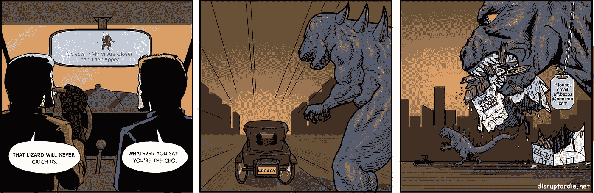
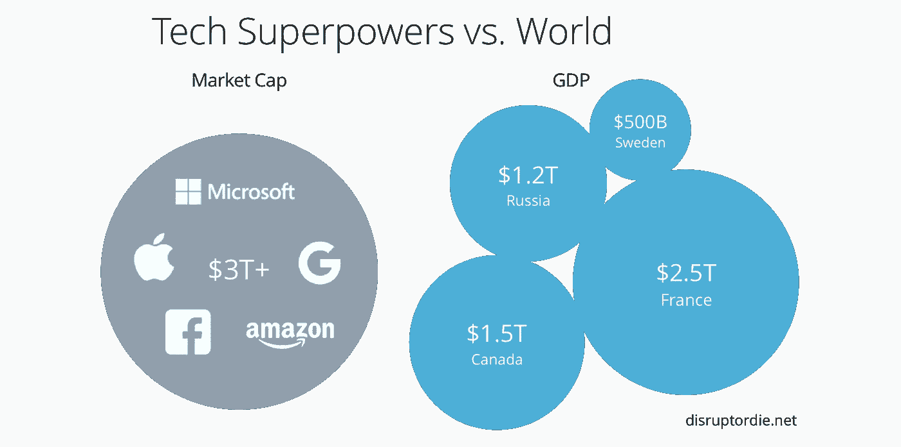
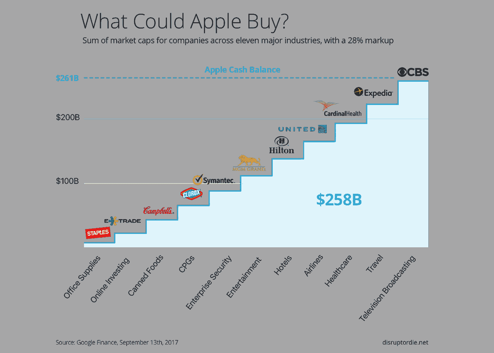

# 科技超级大国接下来会消费哪些行业？

> 原文：<https://medium.com/hackernoon/what-industries-will-the-tech-superpowers-consume-next-35365745b6e6>

如果世界上最富有的公司苹果公司收购了一家银行会怎么样？如果世界上最强大的数据公司 Alphabet(谷歌)收购了一家保险公司会怎么样？如果世界上最有价值的零售商亚马逊将邮件服务私有化会怎样？如果世界上最强大的媒体公司脸书收购了一家电视网络会怎么样？

世界可以在眨眼之间改变。

当亚马逊以 137 亿美元收购全食超市时，颠覆性的威胁格局永远改变了。

消息传出几个小时后，在市场悲观情绪的冲击下，其他主要杂货连锁店的股价暴跌。然而，亚马逊却一路走高，股价上涨了 150 多亿美元。

市场跷跷板效应使得收购**对贝佐斯和他的公司来说可以说是免费的。**

科技超级大国，世界上最有价值的五家科技公司——苹果、Alphabet、亚马逊、脸书和微软——总市值超过 3 万亿美元。这比俄罗斯和加拿大的 GDP 总和还要多。

科技超级大国还能以其令人难以置信的现金储备和对他们如此有利的市场跷跷板买到什么呢？

**狭隘的颠覆观**

几十年来，企业家和高管们一直将克莱顿·克里斯滕森的《创新者的困境》称为定义颠覆的书。

在他的书中，克里斯滕森描述了行业领导者如何一再输给新进入者，新进入者建立更简单的解决方案，瞄准一小部分被忽视的市场，然后随着时间的推移添加功能并转向高端市场。

最终，新进入者推翻了自满的国王，后者在少数大客户的要求下花费了太多时间来提供增量功能，使得他们的产品过于复杂，已经到了颠覆的时候了。

如果传统企业只需担心自下而上的颠覆，这个世界将变得更加可预测。

**创新者的困境打乱了**

苹果最近发布了 iPhone X，智能手机的未来，一款 999 美元的手机，可能会推动足够的销售，使苹果成为第一家市值万亿美元的公司。

当然，最初的 iPhone 曾经是克里斯腾森将颠覆定义得过于狭隘的典型证据。

苹果没有瞄准一个很小的、得不到充分服务的人群，而是超越了顶端。

是的，乔布斯和他的公司建立了一个更简单的用户界面，但他们在他们的设备上加载了传感器、功能和应用程序商店，从而打开了潘多拉魔盒的特性和功能。他们没有瞄准服务水平低下的人群，而是瞄准了价格远高于竞争对手的高端市场。

结果呢？全世界都腾出钱包来买 iPhone。他们还会这么做，即使苹果大幅提高 iPhone X 的价格。

特斯拉(Tesla)、Nest(被 Alphabet 收购)等公司，以及像 [Otto](https://meetotto.com/) 这样的新进入者，都遵循过度策略，专注于更好的产品，而不是更简单的产品。

但是，如今，行业巨头需要担心的不仅仅是自下而上或过度的 T2 产品颠覆。他们需要担心批发*行业*的中断。

随着科技超级大国在其主要市场的增长空间耗尽，他们将渴望新的产业来消费。他们已经在无数行业扎根。

**代际银行鸿沟**

我最近会见了美国十大银行的行长。他低估了初创公司甚至科技超级大国带来的颠覆威胁。“我没有看到他们同意成为一家银行的监管要求，”他表示。

然而，他确实担心一件事，即行为的代际转变可能会扰乱银行与富人建立的宝贵客户关系。千禧一代——他们最终将继承前几代人的财富——不想与银行家和财富顾问建立关系。

他们想要一个应用程序。

猜猜哪些公司可以方便地把它给他们？

如果苹果或脸书收购一家银行，比如 E-Trade，会发生什么？

如果苹果支付 28%的加价(亚马逊收购全食超市的加价)，电子贸易将花费苹果 145 亿美元。不到 6%的下降，他们庞大的 2610 亿美元的现金桶，以建立一个进入银行业的主要滩头阵地。

几乎在一夜之间，苹果就可以将全套银行服务——储蓄、支票和证券投资——融入他们的手机和其他 iOS 设备。毕竟，苹果、亚马逊、Alphabet 和脸书已经尝试了支付。

如果脸书收购 AMC 网络公司(53 亿美元，加价 28%)，AMC 网络公司是《行尸走肉》的制片人，将电视广告产业的一部分吸入我们的手机，会怎么样？千禧一代会在手机上看任何东西。

如果亚马逊将美国邮政署​私有化会怎样？凭借其现有的遍布大都市地区的每日递送路线及其自动化诀窍，他们难道不能在持续盈利的同时运营邮政服务，同时大幅降低自己的递送成本，从而让纳税人和亚马逊股东受益吗？

如果 Alphabet 收购了水星保险(42 亿美元，加价 28%)会怎么样？有了来自 Waymo(他们的自动驾驶汽车子公司)的自动驾驶汽车数据和来自 Nest、Dropcam 和 Google Home 设备的数据，他们在为家庭和汽车保险提供有竞争力的费率和服务方面难道不会有令人望而却步的数据优势吗？

2016 年，沃尔玛以 30 亿美元收购 Jet.com，看起来像是行业巨头遏制竞争的重大举措。然而，在亚马逊收购全食超市后，现在很明显，收购的力度太小，为时已晚。

创新周期是转动我们世界的轮子，而且它以越来越大的规模转得越来越快。

随着初创公司自下而上的颠覆，以及科技超级大国带来的巨大颠覆潜力，世界各地的沃尔玛现在会怎么做？

# 关于作者

杰迪迪亚·约花了 20 年时间解码创新，收集了驱动当今许多最成功的技术企业家的隐藏框架。他亲自实施了这些框架，发明的软件产品推动了超过 40 亿美元的销售额。作为德尔福公司的创始人和执行主席，他与从脸书到沃尔玛的行业巨头合作，通过彻底改进数据管理来推动更快的内部创新。此前，他是 Avamar 的创始首席执行官，该公司开创了重复数据消除市场。2013 年，他被《三藩市 [*商业*](https://hackernoon.com/tagged/business) *时报*评为年度 CEO。他的第一本书将于 2017 年 10 月出版— *颠覆或死亡:世界需要向硅谷学习什么才能在数字时代生存。*

如果你想了解更多关于用于推动颠覆性创新和构建数十亿美元软件产品的框架，请注册本书发布的更新，现在就**获取前五章**。

You can also find the signup page here: [https://disruptordie.net/](https://disruptordie.net/)

这是这本书精装版的预览:

