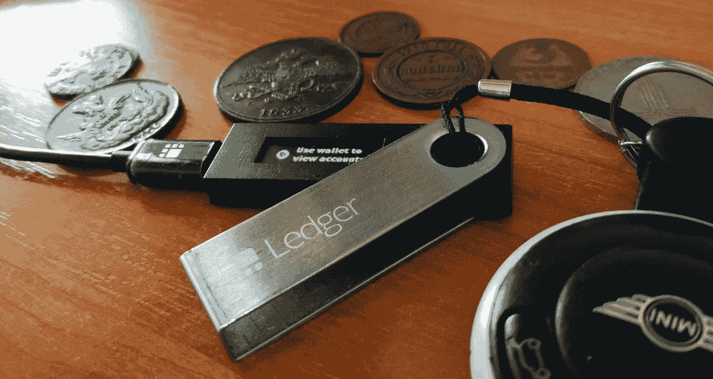
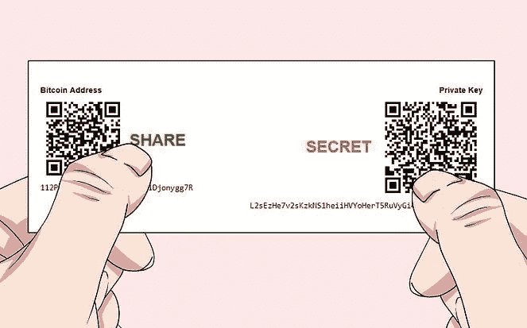
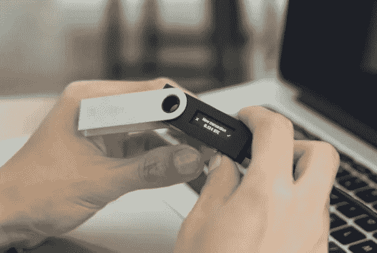

# 什么是比特币硬件钱包(以及为什么你必须使用它)

> 原文：<https://medium.com/hackernoon/what-is-a-bitcoin-hardware-wallet-and-why-you-must-use-it-3fceeae2b21>

最近，我研究了不同类型的加密货币钱包。目前我使用的是一个流行的网络钱包，但现在我正在考虑转向一个硬件钱包。

在这篇文章中，我将综合我所发现的信息。稍后我会写一篇新文章，对比 2017 年最佳硬件钱包——从 2018 年开始。

欢迎提出任何问题，完成并在评论中与社区分享您的经验。

一个加密货币钱包**包括**:

*   密钥集(公钥和私钥)用于获取存储在此钱包上的访问令牌
*   管理这些密钥并允许您在加密货币网络中执行交易的算法

硬件钱包——保护加密货币安全的物理设备。一些在线钱包也支持硬件钱包。

**大部分硬件钱包**:

*   生成私钥并存储在设备上
*   所有的操作和事务都在设备上执行。它只能显示它的结果:每个操作的散列。
*   有一个屏幕显示一些信息
*   有一个或多个物理按钮
*   显示交易信息
*   需要使用硬件按钮手动确认操作
*   如果设备损坏、丢失或被盗，允许创建私钥备份
*   要求安装制造商提供的软件
*   适用于所有现代版本的 Windows、Linux 和 MacOS
*   不适用于 Android
*   不允许在设备上安装任何软件
*   需要设置 PIN 码(甚至多个 PIN 码)
*   支持**顶级加密货币的只有少数**

让我们来看看硬件钱包和其他类型的钱包有什么不同。

# 网络钱包

在这种情况下，您的**私钥存储在 remove 服务器**上。因此，如果出现以下情况，用户可能会丢失其令牌:

*   他的电脑被黑了，密码也丢了
*   一台远程服务器被黑了
*   这家公司破产了
*   联邦调查局(或其他机构)查封了公司的服务器
*   钱包里的软件漏洞
*   当所有者登录时，未经授权的人访问了智能手机或计算机

# 桌面钱包

被黑客攻击或被病毒感染的电脑会导致钱包被黑。与硬件钱包相比，计算机有更多的漏洞。

# 智能手机钱包

这些钱包可以分为两组:

*   网络钱包的用户界面。它们和其他网络钱包有着相同的弱点(见上文)
*   自主钱包。在这种情况下，它们或多或少类似于安装在计算机上的软件钱包，可能有相同的漏洞。

移动设备的广泛普及导致这些设备的病毒迅速发展，这意味着你的钱不会安全。

# USB 闪存驱动器

显而易见，将你的私钥存储在 USB 驱动器**上是不安全的**，但是人们仍然使用这种方法。

以下是几个相关的问题:

*   任何软件都可以读取或复制这些私钥
*   恶意软件可以替换接收者的地址
*   丢失或被盗会导致您所有代币的丢失

然而，使用需要输入 PIN 码才能访问文件的特殊 USB 驱动器可以提高安全性。

# 纸

在纸上正确存储私钥是非常安全的，但是使用起来非常不方便。此外，您必须在上述钱包类型中输入您的私钥才能进行交易。

# 硬件钱包的风险和可能的漏洞

目前(2017 年 11 月)**没有一个已知的代币从硬件钱包中被盗**。尽管它们是最近才出现的，但它们显示出良好的安全水平。

然而，重要的是要明白，使用硬件钱包不可能是灵丹妙药。有几个可能的漏洞**。重要的是要考虑选择一个硬件钱包，以及你打算在上面存储多少代币。**

**替换接收方地址。硬件钱包无法防止你将代币发送到错误的地址。例如，您桌面上的病毒可以跟踪您的交易，并在检测到大额交易时替换目标地址。为了解决这个问题，建议使用双因素身份验证来确认交易。**

**一个坏的随机数生成器。硬件钱包依赖于它们的内部随机数生成器。不幸的是，生成一个真正的随机数并不容易。一个坏的随机数生成器可以生成黑客可以预测的值。**

**虫子。**任何系统(硬件或软件)的安全性都基于其实现的质量。硬件钱包也不例外。固件缺陷可能会给攻击者提供访问钱包内部结构的权限。

**妥协的制造流程。**即使是理想的固件和硬件也无法防止制造过程中有意或无意的入侵。

**妥协的交付流程。**在交付过程中，移除或更换一些硬件或软件元素更加容易，这样客户就不会发现。有消息称，很多政府截取并更改不同的硬件产品来打开后门。

# 结论

因此，使用硬件钱包**不能防止所有风险**，但是选择一个信誉良好的可信制造商可以帮助保护你的钱包**免受比软件钱包更多的漏洞**。

看来**理想的解决方案**是使用一个**开源软件**和一个开放的通用硬件，如**树莓**Pi 或 **Arduino** 以及一个可信的熵源，如**骰子**。

正如我之前提到的，在我的下一篇文章中，我将向你展示我的 2017 年最佳硬件钱包名单——从 2018 年开始。请随意评论，并在下面的评论中完成这篇文章。

> 感谢阅读！如果你喜欢，请鼓掌支持👏👏👏还有分享帖子。欢迎在下面留下你的评论💭。

> ***丹*** *是区块链* ***开发商*******投资方*** *。**
> 
> **他是*[***LiveMarketCap.com***](https://livemarketcap.com)*的 CEO。它提供所有活跃加密货币的实时排名，包括最新的加密货币新闻、市场价格、图表和分析。**
> 
> **有反馈吗？关注 LiveMarketCap 上的* [*推特*](https://twitter.com/livemarketcap) *！👋**