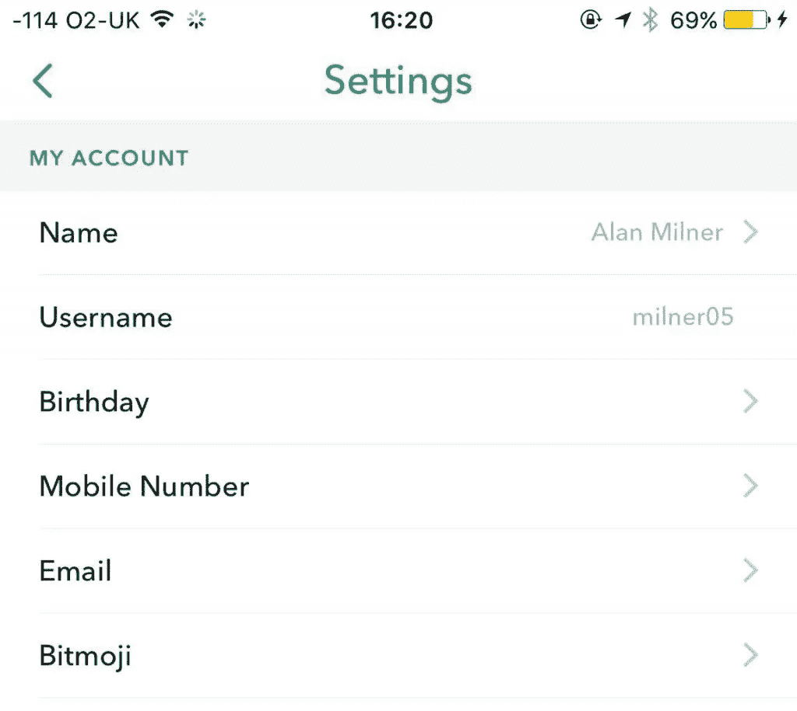

# 什么是 Bitmoji，如何在 Snapchat 上获得？

> 原文：<https://medium.com/hackernoon/what-is-a-bitmoji-and-how-can-i-get-one-on-snapchat-1887688cb81d>

## 眼尖的 Snapchat 用户可能已经注意到了上次更新后 Snapchat 设置中的一些小变化。

Snapchat 中不那么秘密的 Bitmoji 设置

## 介绍 Bitmojis。

现在这些可能看起来很熟悉，因为不久前它们作为位带遍布脸书。大约在 2016 年 3 月，Snapchat 以大约 1 亿美元的价格收购了这款应用(现在专注于个性化表情符号和贴纸)。

嗯，Snapchat 已经在他们的应用程序中引入了 Bitmojis。以下是你如何制作和使用一个。

首先，最简单的是从应用商店下载应用程序——Bitmoji。这款应用是免费的，下载后你可以使用 Snapchat 注册(据我所知，这是首批可以使用 Snapchat 注册的应用之一)。

一旦你进入应用程序，你就可以开始设计你的 Bitmoji 了。选择性别、脸型、眼睛、鼻子、头发等。最后，选择你的服装。别担心，你可以随时改变你的 Bitmoji。

里尔·阿尔·比特莫吉

## 好吧，你有了迷你版的我。如何将它添加到快照中？

这实际上再简单不过了。使用 [Snapchat](https://hackernoon.com/tagged/snapchat) 拍摄一张照片，然后点击右上角的小方框，这里保存着您的普通表情符号。沿着这个屏幕的底部，点击面部，你的 Bitmojis 就会出现。

左右滑动以选择不同的主题，只需点击您想要的主题，它就会出现在您的快照上。您可以通过捏来调整它的大小，并通过握住它来移动它。它就像任何其他的[表情符号](https://hackernoon.com/tagged/emoji)一样工作。

你可以回到 Bitmoji 应用程序(或在 Snapchat 设置中点击 Bitmoji)来编辑它的外观或装备。

## Bitmoji 朋友

现在你有了自己的，去找一个朋友，教他们怎么做。当你有一个有 Bitmoji 的朋友时，你们可以互相抓拍，并从一系列有你们两个 Bitmoji 的图像中进行选择。您可以将这些发送给彼此或您朋友列表中的任何人。你也可以把这些加到你的故事里。

比特莫吉五！

所以出去找点乐子吧。发挥创意，分享这篇文章，让其他人也能喜欢！

别忘了在 Snapchat 上加我— [Milner05](www.snapchat.com/add/milner05)

*最初发表于* [*阿兰·米尔纳*](http://www.alanmilner.xyz/bitmoji-snapchat/) *。*

> [黑客中午](http://bit.ly/Hackernoon)是黑客如何开始他们的下午。我们是 [@AMI](http://bit.ly/atAMIatAMI) 家庭的一员。我们现在[接受投稿](http://bit.ly/hackernoonsubmission)，并乐意[讨论广告&赞助](mailto:partners@amipublications.com)机会。
> 
> 如果你喜欢这个故事，我们推荐你阅读我们的[最新科技故事](http://bit.ly/hackernoonlatestt)和[趋势科技故事](https://hackernoon.com/trending)。直到下一次，不要把世界的现实想当然！

