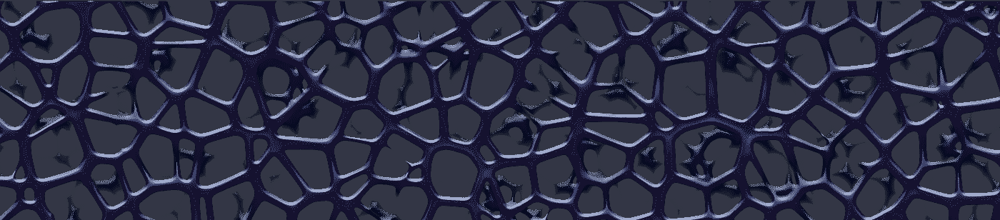
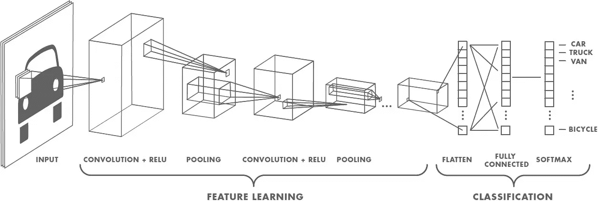
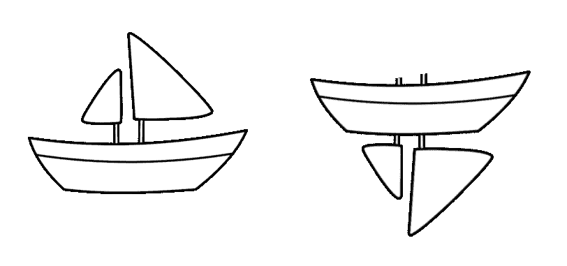
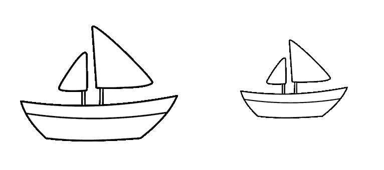
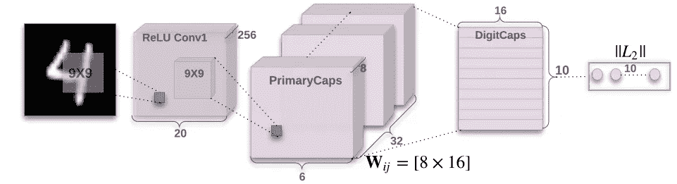
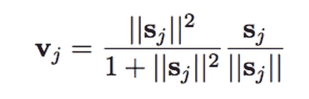

# 什么是 CapsNet 或胶囊网络？

> 原文：<https://medium.com/hackernoon/what-is-a-capsnet-or-capsule-network-2bfbe48769cc>

*什么是胶囊网？什么是胶囊？CapsNet 比卷积神经网络(CNN)更好吗？在这篇文章中，我将谈论以上所有关于 Hinton 发布的 CapsNet 或 Capsule Network 的问题。*

> 注意:本文不是关于药物胶囊的。它是关于神经网络或机器学习世界中的胶囊。

作为读者，你有一种期待。你需要了解 CNN。如果没有，我想让你在[杂志](https://hackernoon.com/)上浏览[这篇文章](https://hackernoon.com/supervised-deep-learning-in-image-classification-for-noobs-part-1-9f831b6d430d)。接下来，我将简要回顾一下 CNN 的相关观点。这样你就可以很容易地抓住下面的比较。所以事不宜迟，让我们开始吧。

CNN 本质上是一个系统，我们将许多神经元堆叠在一起。这些网络已经被证明在处理图像分类问题上非常出色。让一个神经网络映射出一幅图像的所有像素是很困难的，因为这在计算上非常昂贵。因此，卷积是一种帮助您在不丢失数据本质的情况下，在很大程度上简化计算的方法。卷积基本上是大量矩阵乘法和这些结果的求和。

image 1.0: Convolutional Neural Network

在图像被输入网络后，一组内核或过滤器对其进行扫描并执行卷积运算。这导致在网络内部创建特征地图。这些功能接下来依次通过激活层和池层，然后根据网络中的层数继续下去。需要激活层来在网络中引起[非线性](https://stackoverflow.com/a/9783865/2235170)的感觉(例如: [ReLU](https://github.com/Kulbear/deep-learning-nano-foundation/wiki/ReLU-and-Softmax-Activation-Functions) )。合用(例如:最大合用)有助于减少训练时间。汇集的想法是它创建每个子区域的“摘要”。它也给你一点点的位置和物体检测的平移不变性。在网络的末端，它将通过像 softmax 分类器这样的分类器，给我们一个类。训练是基于与一些标记数据匹配的误差反向传播进行的。非线性也有助于解决这个步骤中的消失梯度。

# **CNN 有什么问题？**

当对非常接近数据集的图像进行分类时，CNN 表现得异常出色。如果图像有旋转、倾斜或任何其他不同的方向，那么 CNN 的性能很差。这个问题是通过在训练过程中添加相同图像的不同变化来解决的。在 CNN 中，每一层都在更精细的层次上理解图像。让我们通过一个例子来理解这一点。如果你想给船和马分类。最内层或第 1 层理解小曲线和边缘。第二层可能理解直线或更小的形状，如船的桅杆或整个尾部的弯曲。更高层开始理解更复杂的形状，如整个尾部或船体。最后一层试图看到一个更全面的图片，如整艘船或整匹马。我们在每一层之后使用池化，使其在合理的时间框架内进行计算。但是本质上它也丢失了位置数据。

image 2.0: Disfiguration transformation

池有助于创建位置不变性。否则，CNN 将只适合非常接近训练集的图像或数据。这种不变性也导致对于具有船的部件但顺序不正确的图像触发假阳性。因此，系统可以触发右与上图中的左相匹配。作为一个观察者，你清楚地看到了不同之处。池层也增加了这种不变性。

image 2.1 Proportional transformation

这从来都不是 pooling layer 的本意。汇集应该做的是引入位置，方向，比例不变。但是我们获得这种用途的方法非常粗糙。实际上，它增加了各种位置不变性。从而导致将图像 2.0 中的右侧船只检测为正确船只的困境。我们需要的不是不变性，而是等方差。不变性使得 CNN 能够容忍视点的微小变化。**等方差**使 CNN 了解旋转或比例变化，并相应地调整自己，以便图像内部的空间定位不会丢失。一艘船将仍然是一艘较小的船，但是 CNN 将缩小它的尺寸来检测它。这让我们想到了胶囊网络的最新进展。

# 什么是胶囊网？

每隔几天，神经网络领域就有一项进展。一些聪明的人正在这个领域工作。你几乎可以假设每一篇关于这个主题的论文都是开创性的或者改变了道路的。Sara Sabour、Nicholas Frost 和 Geoffrey Hinton 发布了一篇名为*[***胶囊间动态路由***](https://arxiv.org/abs/1710.09829)*的论文 4 天回来了。现在，当深度学习的教父之一 Geoffrey Hinton 发表一篇论文时，它一定会是开创性的。当你阅读这篇文章时，整个深度学习社区都在为这篇论文而疯狂。因此，这篇文章讨论了胶囊、CapsNet 和 MNIST 挤兑。MNIST 是一个带标签的手写数字图像的数据库。结果显示，在重叠数字的情况下，性能显著提高。本文与当前最先进的 CNN 进行了比较。在这篇论文中，作者提出人类大脑有称为“胶囊”的模块。这些胶囊特别擅长处理不同类型的视觉刺激，并对姿势(位置、大小、方向)、变形、速度、反照率、色调、纹理等进行编码。大脑必须有一种机制，将低级视觉信息“路由”到它认为处理它的最佳胶囊。**

****

**image 3.0: CapsNet Architecture**

**胶囊是一套嵌套的神经层。所以在一个常规的神经网络中，你不断增加更多的层。在 CapsNet 中，您可以在一个层中添加多个层。或者换句话说，将一个神经层嵌套在另一个神经层中。胶囊内神经元的状态捕获图像内一个实体的上述属性。胶囊输出一个矢量来表示实体的存在。向量的方向代表实体的属性。该向量被发送给神经网络中所有可能的双亲。对于每个可能的亲本，胶囊可以找到预测向量。预测向量是基于乘以其自身的权重和权重矩阵来计算的。无论哪一个亲本具有最大的标量预测矢量积，都会增加胶囊结合。其余的父母减少他们的债券。这种**协议路由**方法优于现有的最大池机制。基于低层中检测到的最强特征的最大汇集路由。除了动态路由之外，CapsNet 还谈到了给胶囊增加挤压功能。挤压是一种非线性现象。因此，不是像在 CNN 中那样给每个层添加挤压，而是将挤压添加到一组嵌套的层中。所以挤压函数应用于每个胶囊的矢量输出。**

****

**image 3.1: Novel Squashing Function**

**介绍了一种新的挤压函数。你可以在图 3.1 中看到。ReLU 或类似的非线性函数适用于单个神经元。但是论文发现这种挤压功能在胶囊上效果最好。这将尝试压缩胶囊输出向量的长度。如果它是一个小向量，它会压缩为 0，如果向量很长，它会尝试将输出向量限制为 1。动态路由增加了一些额外的计算成本。但它无疑带来了额外的优势。**

**现在我们需要认识到，这篇论文几乎是全新的，胶囊的概念还没有经过全面的测试。它适用于 MNIST 数据，但仍需要在各种类别的更大数据集上进行验证。已经有(在 4 天内)关于这篇文章的更新提出了以下问题:**

> **1.它使用姿态向量的长度来表示胶囊所代表的实体存在的概率。为了保持长度小于 1，需要无原则的非线性，该非线性防止存在被迭代路由过程最小化的任何可感知的目标函数。**
> 
> **2.它使用两个姿态向量之间的角度余弦来衡量它们在路由上的一致性。与高斯聚类的对数方差不同，余弦不擅长区分相当好的一致性和非常好的一致性。**
> 
> **3.它使用一个长度为 n 的向量，而不是一个有 n 个元素的矩阵来表示一个姿势，所以它的变换矩阵有 n 2 个参数，而不是只有 n 个。**

**胶囊的当前实现具有改进的空间。但是我们也应该记住，辛顿的论文首先只说:**

> **本文的目的不是探索整个领域，而是简单地说明一个相当简单的实现工作良好，并且动态路由有所帮助。**

**所以有很多理论。让我们找点乐子，建一个顶网。我将带您浏览一些代码，为 MNIST 数据设置一个基本的 CapsNet。我将在代码中添加注释，这样你就可以一行一行地理解它是如何工作的。我将带你看一下代码中两个重要的部分。休息你可以去回购，叉它，并开始工作:**

**以上是整个胶囊层。这是现在堆叠创建一个胶囊网络。CapsNet 的代码如下:**

**整个代码以及培训和评估模块在[这里](https://github.com/debarko/CapsNet-Tensorflow)呈现。它在 [Apache 2.0 许可下](https://github.com/debarko/CapsNet-Tensorflow/blob/master/LICENSE)。可以自由使用。我想把代码归功于[自然经济学](https://github.com/naturomics)。**

# **摘要**

**因此，我们了解了什么是顶网以及它们是如何构建的。我们试图理解胶囊只不过是高级别的嵌套神经层。我们还研究了 CapsNet 如何传递旋转和其他不变性。这与图像中每个实体的空间设置是一样的。我确信仍然有问题需要回答。胶囊及其最佳实现可能是最大的问题。但是这篇文章是试图阐明这个话题的第一步。如果您有任何疑问，请分享。我将尽我所知回答这些问题。**

> **Siraj Raval 和他的谈话极大地影响了这篇文章。在[推特](http://bit.ly/2z1z6RU)上分享这篇文章。请在[推特](http://twitter.com/debarko)上关注我的最新消息。如果你喜欢这篇文章，请点击👏按钮来支持它。这将有助于其他媒体用户找到它。在 Twitter 上分享这篇文章，这样其他人也可以阅读。**