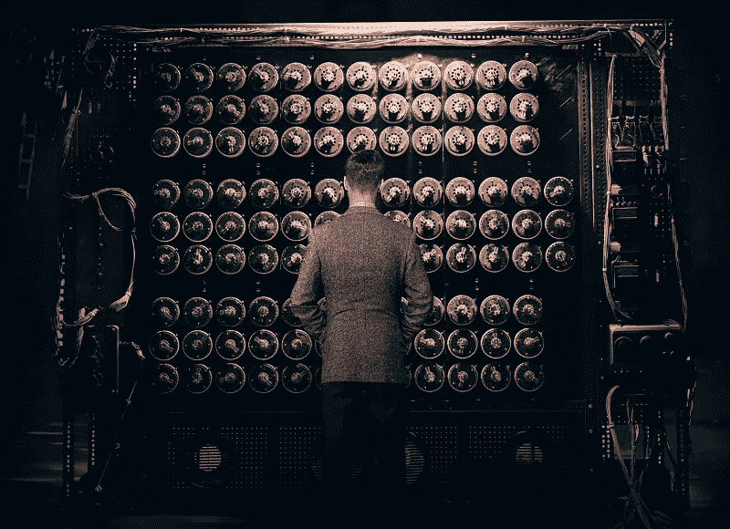

# 什么是电脑？

> 原文：<https://medium.com/hackernoon/what-is-a-computer-2e40eb382fb7>

## 计算机=强大+愚蠢。

我们倾向于认为[电脑](https://hackernoon.com/tagged/computer)仅仅是一台笔记本电脑或个人电脑，但它实际上是任何可以被指令执行任务的电子[设备](https://hackernoon.com/tagged/device)。

> 计算机是一种可以被指令自动执行任意一组算术或逻辑运算的装置

*   计算器是一台计算机。
*   手机就是电脑。
*   星巴克的收银机是一台电脑。
*   你的 FitBit 是一台电脑。

## 计算机有多强大，我们如何衡量它们的能力？

我想我们都有过使用“慢”或“快”电脑的经历。我们基于计算机能够多快地满足我们执行某个动作的请求来做出判断。

> 启动、打开浏览器和查看邮件需要多长时间？
> 
> 在我的电脑崩溃之前，我可以同时运行多少个应用程序？

但事实证明，有更多的定量方法来测量计算机的速度。

## 每秒浮点计算(loating point operations per second)

Immitation Game

考虑翻牌就像我们考虑汽车的马力一样。这不是一个完美的测量单位，但它是一个非常好的单位。

> 在计算中，flops 或 FLOPS(每秒浮点运算的缩写)是计算机性能的一种度量。

可以用熟悉的`kilo`、`mega`、`giga`、`peta`单位来测量 FLOPs，一次 FLOP 对应一秒钟内的一次操作。

*从长远来看，*手持计算器需要能够执行 **10 次 FLOPs** 才能被认为是有效的。在不到 10 千步的速度下，你将会等*太久*才能知道`1 + 1`等于什么。

从长远来看，第一台计算机图灵机能够在大约 20 分钟内处理 17576 种可能性，大约相当于每秒 15 次运算，或 15 kFLOPS。只有*比现代手持计算器略快*。

从长远来看，iPhone 7 每秒可以执行 729.6 万亿次运算😳。

## 计算机有多蠢，我们如何衡量它们的愚蠢程度？

尽管计算机具有原始的能力，但它所能执行的操作是简单而机械的。计算机不能*思考*，计算机没有*洞察力*，计算机不能做决策。计算机只是简单地遵循命令，执行命令**字面意思**，不能适应不可预见的问题。

有一个很好的方式来思考这个问题:

## 教机器人如何制作 PB & J🤖

想象一下，你需要教一个机器人如何制作花生酱和果冻三明治。

这个机器人不知道什么

*   花生酱是。
*   果冻是什么。
*   刀是什么。
*   面包是什么。

**它没有想法:**

*   如何在面包上涂 PB & J？
*   用刀的哪一头来铺 PB & J。
*   如何打开一罐 PB & J？
*   如何把 PB & J 从罐子里捞出来？
*   如何打开面包袋？
*   试着铺 PB & J 的时候要装几片面包。
*   展开完成后要做什么。
*   三明治的哪一面放在一起
*   按照什么顺序来执行这些指令。

为了教会一个机器人做一些像 PB 三明治一样简单的东西，你必须非常详细，非常彻底。

如果你忘记告诉机器人打开花生酱的罐子，它会试图将刀插入一个封闭的罐子。如果你不告诉机器人如何打开一袋面包，它会在你每次发出“拿些面包来”的指令时撕开袋子。如果你不告诉机器人如何从罐子里舀果冻，它会垂直插入和取出刀子。如果你不告诉机器人在哪里涂 PB & J，它可能会试着在面包皮一侧涂，等等。很傻，对吧？

## 减去

我们倾向于认为计算机是无所不能的机器，事实上，它们都是强大的，但是只能做程序员告诉它们去做的事情。一台计算机只和编写它的程序员一样聪明。