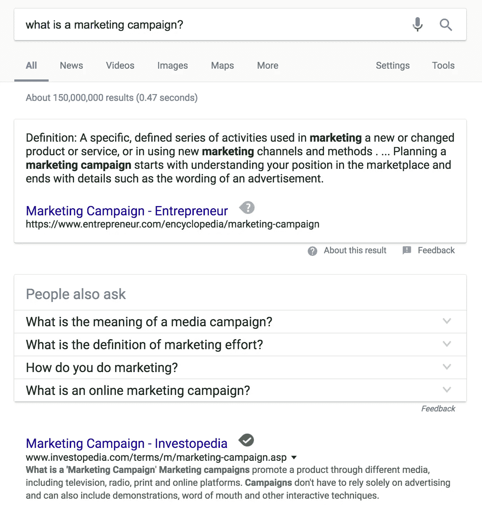
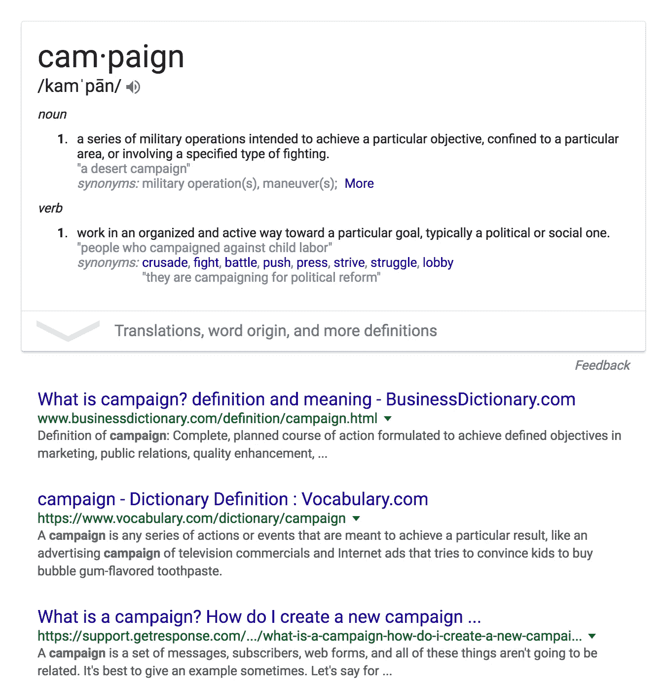

# 到底什么是营销活动？

> 原文：<https://medium.com/hackernoon/what-is-a-marketing-campaign-anyway-2d515e65367f>

## 定义一个模糊的术语

几天前，在与一位客户交谈时，我发现自己同意了一个被称为[营销](https://hackernoon.com/tagged/marketing)活动的模糊交付。作为市场部的领导，营销活动应该是我的专长。当我和我的团队讨论我的会议记录时，我很快意识到我完全不知道我同意了什么。更糟糕的是，我同意每月至少为客户做一次这种模糊的活动。

像一个真正的千禧一代，我决定[谷歌](https://hackernoon.com/tagged/google)它。

在更多的搜索查询之后，很明显，没有一个能够在 SERPs 上排名的人真正知道什么是营销活动。这些定义从每天在社交媒体上发布到制作公司范围的营销日历。

## **当其他方法都失败时，逆向工程**

我对缺乏按需知识的沮丧很快转变为自省。毕竟我是做营销的。我应该知道这些东西。但既然我没有，我决定说明一下我*所知道的*。

营销的目标是通过高针对性的沟通来推动新的收入。我不明白的是竞选部分。一些消息来源称活动为促销或交易，另一些消息来源称活动为更新的信息或品牌，大多数消息来源侧重于新媒体渠道的使用。

所以我回到了谷歌。

根据上面的定义，我的团队每天都在开展活动——有组织的、计划周密的行动过程，旨在实现特定的结果。如果我们不这样做，我们的客户就会解雇我们，我们就永远不会取得现在的成绩。这仍然没有澄清什么是营销活动，以及它与营销策略有何不同。

## **为什么题目这么模糊？**

我发现的关于公司生活的一件事，特别是关于市场营销的，是在网上永远找不到区分优秀市场营销主管和普通员工的技能。我不完全知道为什么，但我知道的是，帮助我为客户取得巨大成就的技能来自我的导师，当我用谷歌搜索这些话题和策略时，它们不会出现在搜索结果中。

我相信这是因为如此多的营销人员在推销他们自己和他们的通用策略。我将把那个话题留到以后再说。

 [## 处理错过的机会

### 为什么学会原谅自己是唯一的出路

theascent.biz](https://theascent.biz/dealing-with-missed-opportunities-be802f5e757b) 

## 什么是营销活动？

由于没有人给它一个明确的定义，我认为营销活动是这样的:

> *营销活动是在日常营销任务之外开展的活动，专门用于增加新收入和增强客户互动*。

它可以是有数百万美元支持的大规模有组织的努力，也可以是简单到只有少数人认识到它。最终，它的成功归结于它能够获得新的收入和与品牌的互动。

## **如何策划营销活动**

既然我们已经定义了这个术语，让我们来谈谈如何策划一次有效的营销活动。策划有效的活动可以分为三个阶段:

。规划:这是您确定目标并为您的活动设定固定目标指标的地方。

。协调:成功的营销活动需要扮演高度特定角色的多个营销学科的参与。

。执行力:伟大的活动需要整个团队完美的执行力。

**策划****——**在策划你的活动时，记住多个因素很重要。首先也是最重要的，是你的目标。这将基于新的收入指标。例如，假设您想在下一季度的底线上增加 100，000 美元。

第二，你要看活动的成本。花 11 万美元在一场竞选上，只获得 10 万美元，这是没有意义的。

协调 **—** 伟大的运动是由数百项出色完成的小任务组成的。它需要利用设计师，文案，付费广告专家，搜索引擎优化专家，开发人员，公关专家，你的销售团队，等等。并非每场战役都会使用相同的人才，但缺少其中一个关键角色会对战役的表现产生负面影响。

**执行****——**这就是橡胶与道路相遇的地方。我参与过许多营销活动，毫无疑问，最难做好的事情是执行。这是因为大多数活动都有大量的活动部件。让所有这些部分朝着正确的方向前进是极其困难的。

## **设计 Mindbox 营销活动**

在 [Mindbox](http://mindboxstudios.com) ，我们强迫自己围绕营销活动的想法采取行动并确定可实现的目标。这使得我们能够向客户提供[高效的营销活动](http://mindboxstudios.com/grow)服务。

 [## 什么是敏捷营销？—以及为什么 B2B 应该倾听

### 敏捷营销是传统营销过程的一种计算方法。敏捷营销重视灵活性…

artplusmarketing.com](https://artplusmarketing.com/what-is-agile-marketing-and-why-b2b-should-listen-up-3a649c209ff2) 

这迫使我们去识别哪些领域的营销活动是有效的，哪些领域是无效的。我们必须确保客户只为与投资回报相关的时间和精力付费。我们还为客户创造了长尾效应的营销活动，创造了即使在营销活动结束后也能产生收入的资产。

最重要的是，我们消除了与客户沟通中的另一个模糊领域，使我们能够始终如一地提供卓越的体验。

这篇文章最初发表在 [Mindbox 期刊](http://mindboxstudios.com/marketing-campaign-anyway/)上。

**关于作者:** *杰斯·威廉姆斯是一位年轻的企业家、丈夫、父亲、技术专家，也是 SaaS 的营销专家。你可以在* [*Twitter*](http://twitter.com/j_r_wi11iams) *上关注他，在这里* *了解更多关于他和他的项目* [*。*](http://jesse-williams.com/about)

> [黑客中午](http://bit.ly/Hackernoon)是黑客如何开始他们的下午。我们是 T21 家庭的一员。我们现在[接受投稿](http://bit.ly/hackernoonsubmission)并乐意[讨论广告&赞助](mailto:partners@amipublications.com)机会。
> 
> 如果你喜欢这个故事，我们推荐你阅读我们的[最新科技故事](http://bit.ly/hackernoonlatestt)和[趋势科技故事](https://hackernoon.com/trending)。直到下一次，不要把世界的现实想当然！

