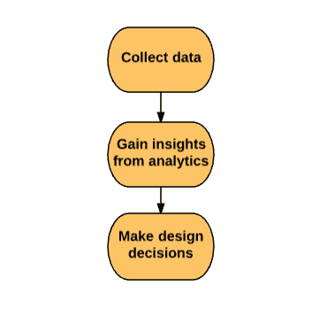
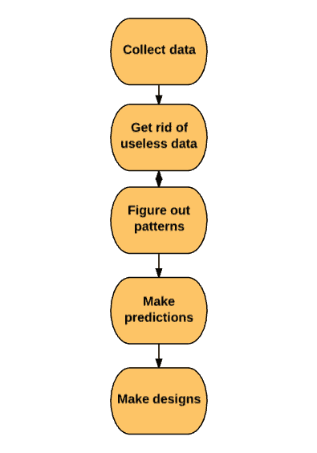

# 机器学习有什么好大惊小怪的？

> 原文：<https://medium.com/hackernoon/what-is-all-the-fuss-about-machine-learning-3a314220ebbe>

## 机器能有创造力吗？他们能感同身受吗？

## 昨晚，我足够清醒，拿出手机输入了一些信息。

很明显，到处都是拼写错误。

这是我输入的内容，

但谷歌给我展示了我想看的东西，

天哪！这绝对是机器学习！让我们从…开始

# 当今的市场营销和分析领域

首先，让我们停止把它称为**网络分析**。

> Web 分析通常与网站管理员关心的指标有关—网站加载时间、每次查看的页面时间等。

但营销人员需要**市场分析**。

我们寻找**号的。**——签约、下载、销售线索、销售额和总流量。

我们的关注点主要集中在社交媒体、电子邮件甚至线下活动上，这些活动通常都以客户为中心。

如果没有**分析工具**，就无法获得这些数据。也许，现在大多数营销人员都是数据驱动的。

> **而 ML 对于市场营销来说几乎就像是永远的成功！**

但在享受这些难以名状的好处之前，你得先了解一下硅谷对营销人员的看法。

他们管我们叫‘平庸的营销人员’，却不知道如今的营销人员简直就是预言家，而且是彻头彻尾的数据驱动型。也就是说，营销人员善于管理和使用数据。

我们也无法否认这样一个现实，即我们的数字世界已经从 **GUI** (图形用户界面)转变为 **CUI** (对话用户界面)，在这里**以网络为中心的营销已经过时**，而现在一切都以**以人为本**。

因此，要想保持正轨，并能够赶上其他领先的营销，了解用户如何与您的服务互动不仅仅是重要的。

随着**分销渠道**和**复杂用户交互**数量的增加(情况肯定和 10 年前不一样了)，为清理这一烂摊子 **SaaS 工具**的生产正在疯狂激增。

## 这就是我们的营销流今天看起来是多么激动人心！

# 我们现在应该如何处理这种情况？通过数据驱动(而不仅仅是数据通知)

从初创公司如何运作的角度来看，

有必要使用几个 **SaaS 工具**来运用自己的即时想法，并弄清楚用户如何使用他们的服务的模式。

在大多数情况下，这就是数据发挥关键作用的地方。

数据量越大，就需要越多的工具来理解用户模式，以通过从数据集获得的理解来支持生产活动。

到目前为止，我们已经知道并遵循了这 **3 个步骤，**

但这根本不能给我们带来凝聚力的成功。

在开始行动之前，还有更多的数据要做。

数据的实际和语义应用看起来像这样，

我们知道，我们用来获取数据的 SaaS 工具数量庞大，因此有必要确定最有效的 [**工具**。](https://hackernoon.com/list-of-50-artificial-intelligence-technologies-b1d9dc1de787)

尽管自数字世界发展以来，我们已经走过了几十年，但数据的效用还没有看到太大的不同。

同样，我们用来**提取**、**合并**和**聚类**的数据保持不变。我会考虑说这根本不是关键因素。

这是什么，

> “从有价值的见解中预测模式并做出正确的决策”

深入了解一下[个性化目标](https://medium.com/u/628458d920a9#.WUo07xN94Wo)分析用户数据。

*   从合并的用户行为中导出模式。*   采取战略行动。*   将数据转化为可操作的东西。

# 如果 ML 带头，客户会怎么样？

**CX** (客户体验)是每个企业必须关注的最重要的因素。稍有偏离就会导致巨大的失败。无论是产品方面，用户体验方面，还是其他方面。

> “忘记 CX 会给你自己带来灾难”

难道我们不知道**的客户体验**就是**推动销售**的那种体验吗？当然，我们有。

我们还知道，我们的客户不再玩盲目的游戏。

也就是说，在他们选择或转换任何平台/产品之前，他们会做大量的研究，然后发现适合他们的平台/产品。

> “顾客总是选择他们认为专为他们打造的产品”

因此，作为营销人员，我们需要更关心如何**与我们的客户建立**、**维持**和**扩大**关系。

有了 ML 的帮助，**理解**和**传递**更多**合适的内容**给我们的客户将会更加容易和有建设性。

> “ML 也能跟上我们的技术潮流，因为它完全是关于学习的”

# 机器学习可以通过以下方式帮助客户:

*   根据用户以前的活动推荐相关选项，这绝对可以节省用户的大量时间。
*   定制用户体验，ML 可以建议他们从来没有想过他们想要的东西。
*   从客户过去的行为中收集数据，it 可以提供与他们个人相关的内容。
*   从其他媒介学习，它可以打开我们通过任何其他方式都不知道的信息。

嘿，如果你因为我说的那些话担心你的工作，

最好不要想这个，

> “机器能有创造力吗？他们能感同身受吗？”

他们不能，但我们可以。我们可以通过多媒体教学来教他们

因此，要让机器完全取代人类，它们需要具备**与生俱来的人类特征**，这一点至关重要。

因此，我们也在可居住区！安然无恙。🙂

# 发这些→👏 👏 👏无论你能做多少…😃