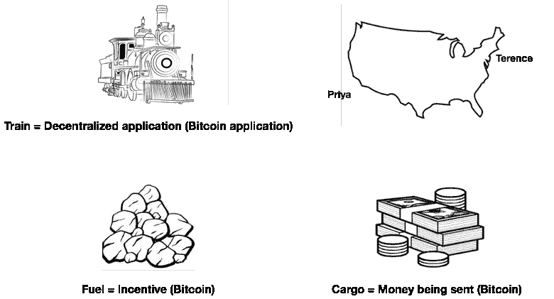

# 比特币是什么？非技术性的解释。

> 原文：<https://medium.com/hackernoon/what-is-bitcoin-a-non-technical-explanation-42c40688a6ad>

如果你曾经想知道比特币是什么，或者你是否应该参与进来，这篇文章和后续文章的目的是将比特币和相关主题分成超级易懂的部分，以便任何人都可以理解。

先说比特币是一种加密货币。但是什么是加密货币呢？在 Chain 的 Adam Ludwin 的帮助下，我可能会有一个定义，这个定义可能不是你所想的，但我认为最好的描述是:**加密货币是一种新的资产，它支持(激励)一种不同但重要的应用类型的功能——去中心化应用**(暂时将去中心化应用视为你手机上的任何应用，但不是由单个公司或个人管理)**。**在比特币的情况下，分散式应用是一种全球支付系统，它使用实际的比特币来推动任意两方之间任意金额的货币(比特币)的快速转移。

是的，我知道我在同一句话里说了好几次“比特币”。澄清一下，“比特币”这个词代表三种东西(部分普遍混淆):

*   促进全球支付的分散式应用程序
*   在此应用程序中转移资金的加密货币或燃料
*   最后，两个人之间通过比特币应用发送的实际货币类型

为了简单地说明比特币是如何工作的，想象一辆火车(不属于任何一家公司或个人的全自动火车)，它应该在两个兄弟姐妹之间携带 1000 美元从纽约市行驶到洛杉矶。

在这个例子中，几周前，特伦斯和普丽娅两兄弟在洛杉矶度过了一个疯狂的夜晚。特伦斯想还钱给普丽娅，他倾向于直接给她现金，而不涉及朋友或任何公司/银行。不幸的是特伦斯目前不在洛杉矶。特伦斯决定给普丽娅寄比特币。回到我们的例子，在这辆火车带着特伦斯的 1000 美元离开之前，它需要某种燃料来移动。它用一点点比特币给自己加油。一旦加好油，它很快就从纽约出发，几分钟后它就直接到达了洛杉矶的 Priya 家，没有任何停靠站或收费员。神奇！

如果你密切关注，你应该说，不，不是魔法。特伦斯本可以使用 Venmo 或 Paypal。当然，但前面提到的一个关键问题是，特伦斯和普丽娅希望避免任何公司或个人卷入交易。因为[比特币](https://hackernoon.com/tagged/bitcoin)不是由任何一家公司或个人运营的，所以它非常适合这类交易(稍后会有更多相关内容)。如果你生活在美国和其他西方国家，这可能对你来说并不重要，但是如果你生活在一个中央政府腐败的国家，有一个操纵(即恶性通货膨胀)的货币，阻止反对党的交易，或者只是从他们的银行拿走公民的钱，比特币是一个有趣的替代品，任何单一组织都无法抓住。

比特币的这种应用以及比特币的其他应用推动了比特币作为[未来](https://hackernoon.com/tagged/future)全球支付系统的流行。

请关注我未来关于比特币的用途、比特币如何工作、如何购买比特币以及各种相关话题的帖子。关于比特币，你还有哪些困惑的话题想要简化？

如果您有任何问题或反馈，欢迎在 Twitter [@vivekmgeorge](http://twitter.com/vivekmgeorge) 上留言或给我发消息。