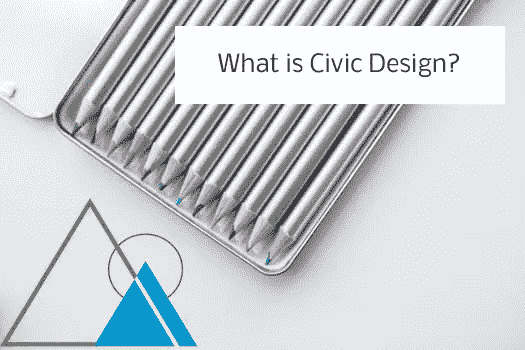
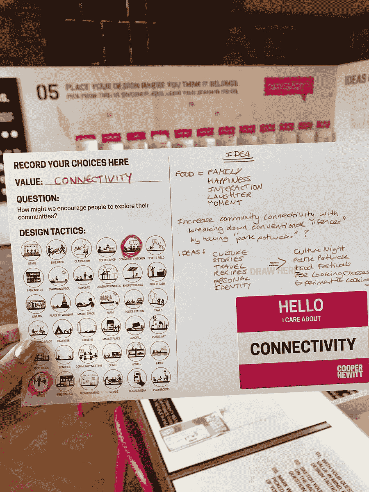

# 什么是思域设计？| 5 分钟练习开始

> 原文：<https://medium.com/hackernoon/what-is-civic-design-db1a55c7f4ab>

《裸公民学》将城市设计定义为“一种实践，通过利用我们社区中的所有制度工具，关注我们社区的共同利益，而不仅仅是关注政府。”

城市设计基本上是一种以人为中心的方法，以服务于彼此，并找到我们可以更好地塑造我们的社区成为我们最终想要的样子，同时服务于所有人的需求。我个人认为这是一种让一个地区的所有人都有发言权的机制，因为让*每个人*都坐在桌子前谈论他们希望看到发生的事情是很罕见的。

我最近在史密森尼设计博物馆的库柏·休伊特发现了[流程实验室](https://www.cooperhewitt.org/events/current-exhibitions/process-lab/)，这是对城市设计的一次惊人的尝试。

过程实验室的成立是为了提供一种沉浸式的体验，让人们了解如何开始像设计师一样思考。参观者参与数字和物理活动，这些活动分为 4 个不同的类别:获得想法，用材料制作原型，评论和评估日常设计解决方案。

我决定选择**连接**的社区价值。然后我经历了选择一个问题来回答的过程:**“我们如何鼓励人们探索他们的社区？”**

然后，我被带到一张巨大的桌子前，在那里我必须随机选择两种不同的策略，并围绕这两个想法进行设计，即使它们乍一看似乎毫无关联。我选了:**围栏**和**社区厨房。**

接下来，我参与了市政设计，我要从哪里开始。当我坐下来开始设计时，我感觉到了第一个创造性的障碍。“疏导最初的紧张，让你的思绪游走，”我提醒自己，“该是*玩*的时候了。”

我开始思考食物以及它对我的意义。除此之外，我开始思考如何让社区变得更加紧密，就像一个家庭一样。当我能够仅仅从这两个思路开始记下想法时，我感到非常惊讶。现在，我最初的想法没有一个是真正创新或新鲜的，但它们对我很重要，我发现自己对参加它们感到兴奋。

这就是了。公民设计。你对将什么带入你居住的空间感到兴奋？黑客马拉松是一个有趣的社区游乐场，可以让你开始计算有多少人支持你的想法。找到你的下一个活动，带着开放的心态和与你的社区联系的意图去参加，谁知道呢？也许你会受到启发去做更多的事情。

此外，在产生想法时，你不需要沉浸在流程实验室中(尽管它会有所帮助)。在周日的早晨，坐下来喝一杯热茶，花 5 分钟问问自己，如果明天你能改变一件事情，你会如何重新设计你的环境？

如果你想了解更多关于公民设计以及公民黑客马拉松如何成为创造力的终极空间，请通过 [experimentalcivics.io](https://www.experimentalcivics.io/) 联系我