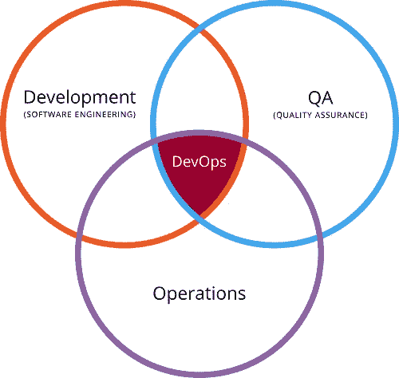

# 什么是 DevOps，它如何帮助组织

> 原文：<https://medium.com/hackernoon/what-is-devops-and-how-does-it-help-organizations-e4983d4b58f0>

软件[开发](https://hackernoon.com/tagged/development)过程在过去的几年里发生了很大的变化，从瀑布模型到敏捷或精益开发实践。感谢 IT 专家和开发人员，他们不断开发新方法来加快应用程序发布周期。如今，敏捷和 [DevOps](https://hackernoon.com/tagged/devops) 是开发社区中讨论最多的话题。敏捷已经是一个广为接受的模型。但是，DevOps 对许多人来说是一个新名词。

**什么是 DevOps**

Photo Credit, [https://hostingcanada.org/](https://hostingcanada.org/)

DevOps 是一个过程，它使开发人员(Dev)和运营人员(Ops)能够更好地协作，以创建更加简化的软件开发和发布渠道。根据维基百科，“DevOps”一词是通过 2009 年在比利时开始的一系列 devopsdays 而流行起来的。从那以后，DevOps 被大量使用。

> **Gartner 对 DevOps 的研究**
> 
> *DevOps 代表着 IT 文化的变革，通过在面向系统的方法背景下采用敏捷、精益的实践，专注于快速的 IT 服务交付。DevOps 强调人(和文化)，并寻求改善运营和开发团队之间的协作。DevOps 实施利用技术，尤其是自动化工具，从生命周期的角度来看，这些工具可以利用日益可编程和动态的基础设施。*

本质上，DevOps 不是一个工具或技术。这是一种文化。而且，这也与敏捷方法学有关。

**DevOps 帮助组织加速应用交付**

在传统的软件发布过程中，开发团队首先在隔离的环境中构建和测试代码以保证质量，然后将其发布给运营团队进行生产。由于两个团队分开工作，开发团队很难完全了解操作的复杂性，如基础设施、配置、部署、日志管理和性能监控。开发和运营之间的这些部门孤岛减缓了产品发布的速度。DevOps 方法使开发和运营无缝协作，其中运营团队的一些职责被转移回开发团队。这是通过应用 DevOps 工具和原则来实现的，这些工具和原则可以自动化流程并降低版本控制、配置管理、持续集成、部署和持续性能监控的复杂性。这种紧密的结合使组织能够在几天内而不是几个月内发布新的东西。

除了加快部署过程，组织还提高了应用程序的质量，因为他们不再需要经历耗时且容易出错的手动过程。这使得他们的应用程序或 IT 性能更好。更好的 IT 性能与整个组织的更高性能相关。因此，部署 [**DevOps 实践**](http://www.osscube.com/devops-consulting-services) 可以交付真实的结果，并给予组织竞争优势。今天，围绕新兴的 DevOps 文化有很多积极的言论。许多组织已经开始进行文化转变，以打破部门间的孤岛，并尽可能地自动化来提高软件交付的速度和质量。

**[***Gartner***](http://www.gartner.com/newsroom/id/2999017)*表示:“到 2016 年，DevOps 将从大型云提供商采用的小众战略发展成为全球 2000 强企业中 25%采用的主流战略。”*

但是在现有的结构中采用 DevOps 可能会比较棘手。它需要有意识的规划，以便引进技术工具、技术人员、流程和文化变革。**

****原文来源:**[https://www . digital donut . com/articles/2016/June/what-is-devo PS-and-how-it-help-organizations](https://www.digitaldoughnut.com/articles/2016/june/what-is-devops-and-how-does-it-help-organizations)**

************