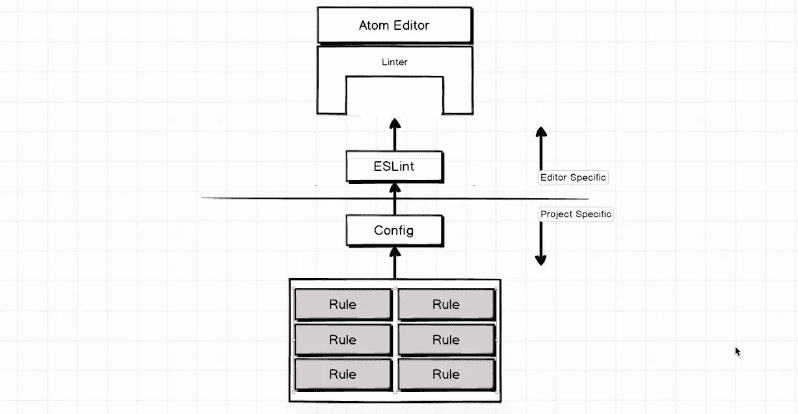
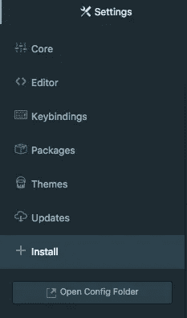
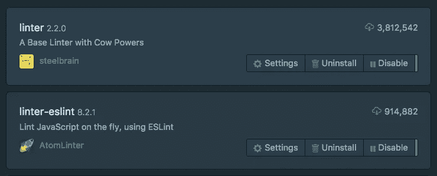
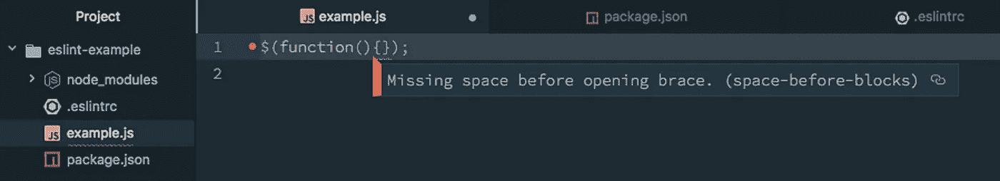
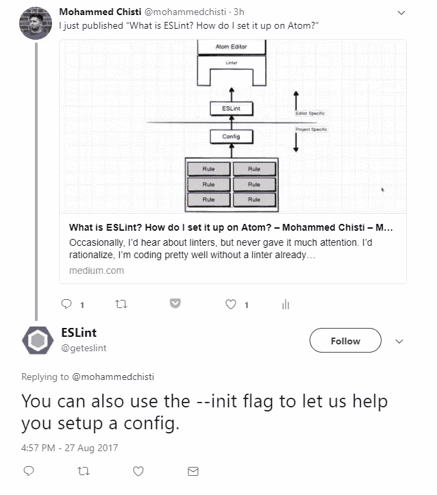

# 什么是 ESLint？我如何在 Atom 上设置它？

> 原文：<https://medium.com/hackernoon/what-is-eslint-how-do-i-set-it-up-on-atom-70f270f57296>



偶尔，我会听到关于棉绒，但从来没有给它太多的关注。我会合理化，我已经不用 linter 编码得很好了，为什么膨胀我的编码经验？

通过在运行应用程序之前调试代码，Linters 为您节省了时间。此外，它确保您和您的团队都遵循干净的代码实践。ESLint 安装快捷方便，其优势不容忽视。

想象一下。

> 你有一个拼错的名为`*people*` 的变量，你运行你的代码，然后你的项目中断了，你打开控制台，控制台显示一些任意的行号，比如第 43 行上的*错误，然后你转到*第 43 行*，看到你传递了一个名为`*purple*`而不是`*people*`的变量。你可能浪费了 3 分钟，而你的棉绒会立即抓住它，`Error: No variable named purple`，你解决它，你继续前进。*

# 安装 Atom 包

为了能够使用 ESLint，您必须确保在 Atom 中安装了两个包。

让我们来看看 Atom 的**设置**，在 Mac 上只需按下`⌘` + `,`或 **Atom >偏好设置**，在 Windows 上按下`ctrl` + `,`或**文件>设置**即可进入。进入**设置**选项卡后，点击`Install`，您应该会看到一个搜索栏来搜索包名。



键入这两个软件包的标题，并安装这两个软件包。



# 设置 ESLint

现在您所要做的就是创建一个新文件，并用 ESlint 规则在项目目录的根目录下将其命名为`.eslintrc`。这些规则可以是你自己创建的，也可以是别人创建的`npm install`规则，以便快速入门。

对于这个例子，我们将使用 Google 创建的一组规则，您可以通过下面的命令安装它。

```
$ npm install --save-dev eslint eslint-config-google
```

之后，您需要将以下内容添加到您的`.erlintrc`文件中。

```
{
    “extends”: “eslint-config-google”
}
```

# 尝试

如果一切都做得正确，你可以尝试下面的代码，eslint 会自动给你一个错误。一旦您通过在右括号和左大括号后加一个空格来纠正它，它应该会自己消失。



如果您没有看到任何错误出现，请尝试退出 Atom 并重新启动它。

# 来自 ESLint 的一些帮助来创建你自己的规则



来自 ESLint 的家伙让我知道，他们也可以帮助你快速开始你自己的规则。

以下代码行将全局安装 ESLint。

```
$ npm i -g eslint
```

然后这一行将提示您一些关于您的编码偏好的问题，以便您可以使用自己的规则集。

```
$ eslint --init
```


*感谢阅读！请分享推荐给其他感兴趣的读者！*

【查看我的作品集】http://mohammedchisti.com[T5](http://mohammedchisti.com)