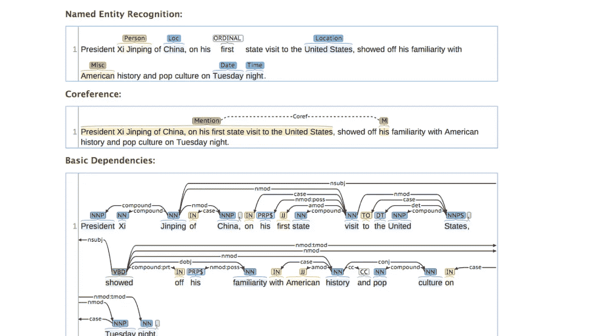
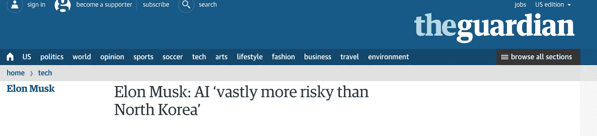
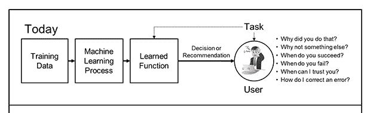
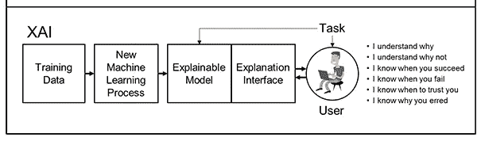

# 什么是可解释的人工智能？对你的工作有什么影响？

> 原文：<https://medium.com/hackernoon/what-is-explainable-ai-how-does-it-affect-your-job-fcfa418bfce1>

Screenshot courtesy of Stanford CoreNLP — Core natural language software

媒体和一些科技领袖试图让我们都害怕人工智能。即使是我们这个时代最大胆的企业家[埃隆·马斯克也认为我们应该非常害怕](https://www.theguardian.com/technology/2017/aug/14/elon-musk-ai-vastly-more-risky-north-korea)。我相信埃隆·马斯克是在夸大其词，因为在我们到达[人工超级智能(ASI)](https://www.wired.com/2017/04/the-myth-of-a-superhuman-ai/) 之前还有很长的路要走。甚至 ASI 也不是一个可怕的命题。

例如，就在三天前，Wolfram Alpha 的基于人工智能的图像识别工具错误地认为我的花园里有蘑菇，而实际上是兔子的粪便。我怎么知道的？不到一分钟，我的一个 iMessage 群中的某个人就确认了这是什么。而且，有趣的是，我和技术专家交谈过，他们认为宣传他们人工智能能力的大公司还没有他们在电视上展示的能力。营销热背后没有牛排。

那么，为什么害怕这项技术呢？

## 人工智能进展如何？

1954 年，约翰·麦卡锡教授将人工智能定义为“制造智能机器，尤其是智能计算机程序的科学和工程”。像所有通用技术一样，人工智能将从目前的实验状态发展到嵌入大多数企业的结构中。围绕人工智能能力的所有故事、新闻和小说都表明，我们在开发这项技术方面已经走得更远了。但我们仍然只处于人工狭义智能(ANI)的阶段，人工智能做一件事，并且做好一件事，就像 Siri 和自动驾驶仪在你最后一次飞行的近 90%时间里驾驶你的飞机。而且，不管媒体会让你怎么想，AlphaGo 只是在 100 名科学家和大量分布式机器的帮助下打败了 Lee Sedol。

## 可解释的人工智能及其如何增加就业

在机器真正像人类一样获得意识、感觉和感觉之前，我们还有很长的路要走。是的，[今天，我们有保险公司使用机器学习来自动化和改善/个性化客户支持](https://hbr.org/cover-story/2017/07/the-business-of-artificial-intelligence)，交易公司使用神经网络和[人工智能来优化他们的交易，以实现诊断的自动化](https://www.newyorker.com/magazine/2017/04/03/ai-versus-md)。这些预测表明，智能机器人将完全接管体力工作，更智能的人工智能将接管分析任务(以及随后的角色)，最终人工超级智能将接管一切。一些工作已经被智能机器抢走了。但是恐惧远远超过了实际的影响。为什么会这样呢？

这种担忧来自于底层人工智能过程的黑箱性质。以机器学习(ML)为例，它是人工智能的一个分支，当前的结构/方法如下图所示。用最简单的话来说:将数据输入到模型中以训练模型，模型从训练数据中学习模式，并使用它来预测其他数据中的模式，或者基于学习提出建议。系统提供的决策或建议背后的潜在思想是神秘的。这就是你所谓的无法解释的人工智能。缺乏透明度，这让普通用户感到不舒服。在一些决定生死的情况下，例如人工智能建议手术而不是化疗，这种建议可能是违反直觉和令人恐惧的。这就是我们今天使用人工智能工具的情况；他们能告诉我们*事情*但是不能告诉我们那些*事情*背后的原因。

但是 DARPA 的 David Gunning 先生提出了一个他称之为可解释人工智能(xAI)的系统。就是下图。与上面无法解释的人工智能不同，可解释的人工智能提供了一个*可解释的模型*和一个*解释界面*，带走了人工智能如何做出决定的神秘，并为用户提供了某种程度的舒适。继续医学的例子，如果人工智能建议手术而不是化疗，医生明白为什么。这种舒适性允许用户*在 AI 推荐的最终实现中*拥有所有权；医生可以向家属解释为什么建议进行手术，而不仅仅是在治疗文件上签字。

> 新的机器学习系统将有能力解释它们的基本原理，描述它们的优缺点，并传达对它们未来行为的理解。

## **我们害怕什么，我们想要什么**

我们对人工智能最大的恐惧是，当我们思考未来的工作时，我们看到很少有人参与其中。像 xAI 这样的工具将减轻这些恐惧(在一定程度上)，将我们对人工智能的使用从机器的自主性转移到人类工人的增强。虽然 xAI 项目专注于智能分析和自治系统(感兴趣的过程)，并专注于分类和强化学习(两种机器学习方法)，但最终产品将是一个工具包，其他研究人员和技术人员可以修改、优化并与社区共享，以实现这种(*因为缺乏更好的术语*)用户友好型人工智能的发展。

根据凯利兄弟的《创造性的信心》( Creative Confidence )( T12 ),每一项创新都需要生存能力、可行性和可取性。用人工智能

*   我们了解到 ANI 的技术是可行的
*   对于人工智能的许多用例来说，我们离**可行性**还有一些路要走，但我们现在手头有足够多的增值人工智能用例。
*   我们失败的地方在于让人们相信人工智能会让他们失业，这是他们想要的。

可解释的人工智能将开始把我们带到一个地方，在那里员工的角色可以得到增强，而不是被技术取代。迈向[我们这个时代的下一个通用技术](https://www.linkedin.com/pulse/amplified-intelligence-new-buzzword-death-your-job-seyi-fabode/)的理想未来状态；艾。

*请分享、点赞、推文。报名参加* [*博学月刊*](https://www.getrevue.co/profile/seyifabo?utm_campaign=Issue&utm_content=forwarded&utm_medium=email&utm_source=Seyi+Fabode)*——如果你已经读到这里，我打赌你会爱上它。* [***你可以在亚马逊***](https://www.amazon.com/dp/B072875DFJ) *上买我的书《抗碎网格》。*