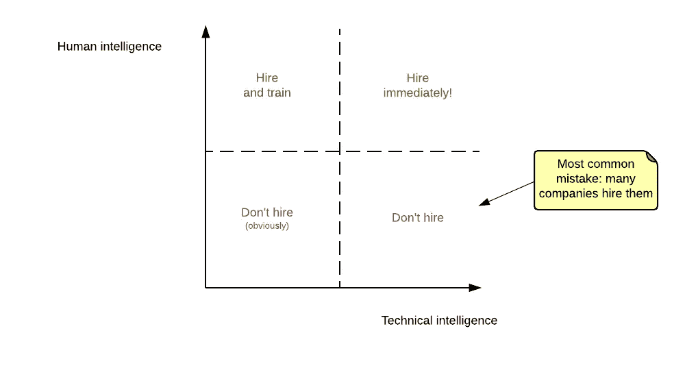

# 什么是智能？

> 原文：<https://medium.com/hackernoon/what-is-intelligence-9f58e034e28b>

*TL；博士当然不只是智商*

我在一个酒吧里，庆祝我们的初创公司 OpenClassrooms 达到了一些很酷的里程碑。我想我正在喝第三杯或第四杯莫吉托，这时团队中有人问了我这个问题:

> "开放课堂是如何组建这样一个聪明的团队的？"—匿名团队成员

首先，感谢匿名团队成员。我就当这是赞美了。

但是，这个问题让我想了很多。这件事困扰了我好几天。他们为什么聪明？为什么我喜欢聪明的人？为什么在我看来它们很聪明？**你怎么能说某人聪明呢？**

# 招聘失误

作为一家初创公司的联合创始人，我有机会认识许多人，他们有着非常不同的背景。我几乎参与了我们所有的招聘过程。许多招聘都失败了，但我觉得随着时间的推移，我在这方面越来越好。

我不再专注于技术专长。忘记其他的太危险了。相反，我专注于我所谓的“人类智能”。以下是我每次面试别人时想到的:

How I view hiring (borrowed from Automattic CEO)

这“人类智能”是什么？嗯，对我来说，是那些我能与之交流，能与之进行鼓舞人心的谈话的人。这些人:

*   总是很好奇，他们想知道更多
*   不要假装他们是完美的
*   通常是微笑的，随和的人
*   是他们自己，而不是他们认为你希望他们成为的人

所有这些都与他们的*自我*有关。在我看来，自尊心很强的人没那么聪明。他们没有我要找的这种“人类智慧”，这也是我不想和他们合作的原因。

# 给智力下定义很难

当你认为某人很聪明时，你真正的意思是什么？

显然不止一种智能。智力是多方面的，这就是为什么它如此难以定义。例如，你可能有很强的技术智商，但在人际关系方面却很弱。如果你想知道更多，有些人试图列出我们的多元智能。

我再怎么强调这一点也不为过，因为我在学校被告知，我应该在科学课题上取得更好的成绩。我们的社会一直在高估我们的逻辑能力，这导致了智商的诞生。但是，在这一过程中，我们忘记了许多事情:人类、情感、智力的直觉方面。

最重要的是，智力是相对的。有人在我看来会很聪明，因为她会比我做得更好。她会说一些我想都没想过的事情。她会画出一个更广阔的画面，显示出她比我在脑子里建立了更多的联系。那就是我觉得某人很聪明的时候。

试图写下智力的等式是困难的。每个人都有自己的定义。但是如果有一件事你应该记住的话，那就是智慧远比智商重要。

> [黑客中午](http://bit.ly/Hackernoon)是黑客如何开始他们的下午。我们是 [@AMI](http://bit.ly/atAMIatAMI) 家庭的一员。我们现在[接受投稿](http://bit.ly/hackernoonsubmission)并乐意[讨论广告&赞助](mailto:partners@amipublications.com)机会。
> 
> 如果你喜欢这个故事，我们推荐你阅读我们的[最新科技故事](http://bit.ly/hackernoonlatestt)和[趋势科技故事](https://hackernoon.com/trending)。直到下一次，不要把世界的现实想当然！

