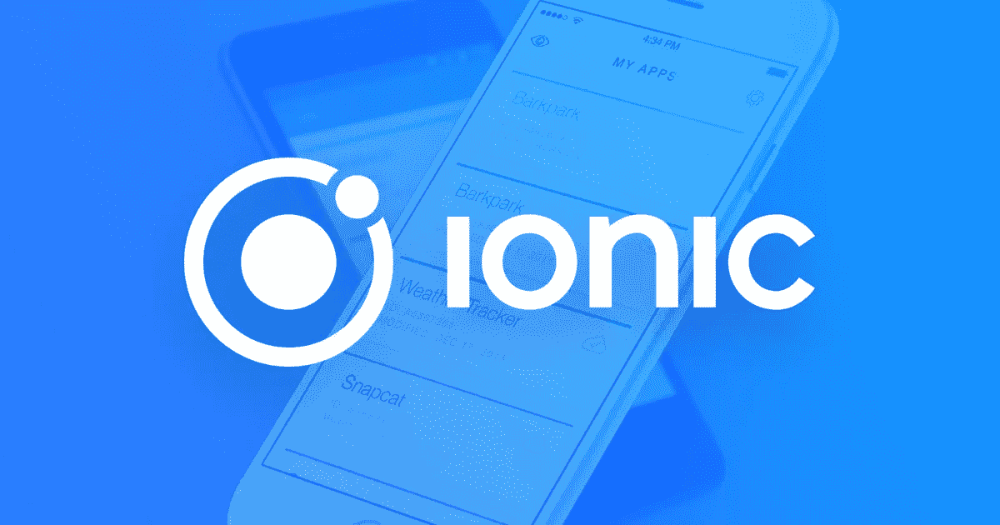

# 什么是爱奥尼亚？

> 原文：<https://medium.com/hackernoon/what-is-ionic-c1da6eab0d8a>

Ionic 是一个开源的前端 SDK，用于使用 HTML、CSS 和 JavaScript 等 web 技术开发混合移动应用程序。它提供基于移动优化 web 技术的组件以及使用 Cordova 和 Ionic Native 的本地 API。

Ionic 的最新版本使用最少的 DOM 操作来提高性能。角度在提高离子应用的性能方面也起着重要作用。

它有自己的命令行界面工具，这真的有助于搭建和开发应用程序，主要是在避免编写样板代码，从而节省宝贵的时间。

# Ionic 的开发设置

# Nodejs 和 npm

要开发和运行 Ionic apps，我们需要 Nodejs，最重要的是，因为 Ionic 使用 Node 的 CLI 来构建任务和生成资源。导航到 [Nodejs 官网](https://nodejs.org/)下载 Nodejs 及其包管理器:`npm`。

要检查 Nodejs 是否正确安装，请在您的终端窗口中

npm 是一个包管理器，用于下载 Ionic 项目中几乎所有的依赖项。

# 以打字打的文件

下一步是安装 TypeScript 编译器。

# 安装 Cordova 和 Ionic CLI

通过以下方式验证您的安装:

# 平台指南

要安装 iOS 和特别是 android 等平台，我希望您参考官方指南:
-对于 iOS:【Cordova iOS 平台指南】([https://Cordova . Apache . org/docs/en/latest/Guide/platforms/iOS/](https://cordova.apache.org/docs/en/latest/guide/platforms/ios/))
-对于 Android:【Cordova Android 平台指南】([https://Cordova . Apache . org/docs/en/latest/Guide/platforms/Android/](https://cordova.apache.org/docs/en/latest/guide/platforms/android/))

想收到更多像这样的文章吗？订阅我 [**这里**](https://patreon.us17.list-manage.com/subscribe?u=ad4c168a6d5bb975f2f282d54&id=39e959cecd) **。有时，我会向我的订户发送“从未见过”的内容。**

# 如果你喜欢这篇文章，请鼓掌👏。

# 谢谢大家！