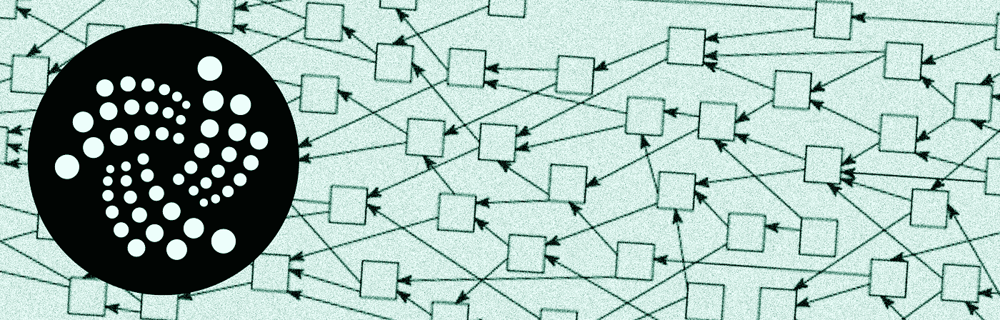
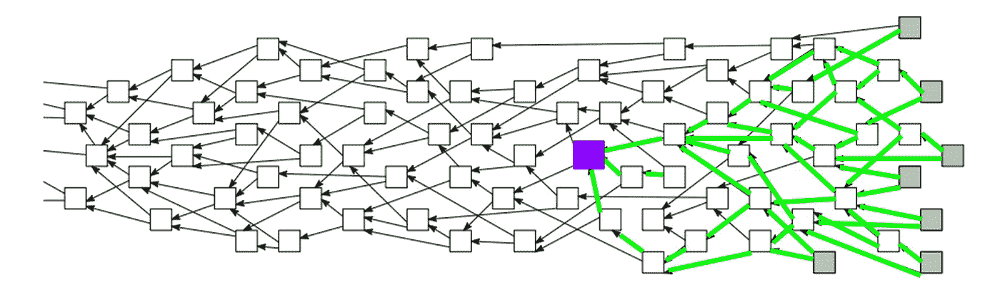
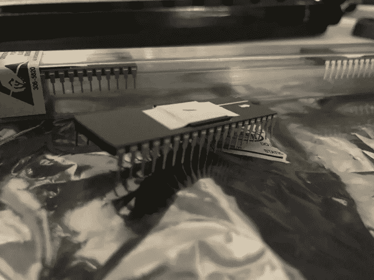

# Iota 是什么？

> 原文：<https://medium.com/hackernoon/what-is-iota-5da4446602a>

## 加密货币和物联网

加密货币提供了这种无需中介的可信交换技巧。或者至少，协议充当了调停者的角色。今天的大多数硬币需要一个区块链来达到这种平衡。

Iota 想要颠覆这种模式。该团队认为他们已经找到了下一代加密货币；一种更快、更便宜、更安全的信任管理方式。他们称之为纠结。这是它看起来的样子。

Click [here](https://tangle.blox.pm/) to watch the Tangle as it grows in real-time

每个白点代表一笔交易。为了使一个交易被批准，它需要验证另外两个交易。绿线代表验证。

因此，当您想要向系统添加一个交易时，您可以随机选择另外两个交易，检查它们以确保它们相关的密钥和余额是有效的，然后将它们与您自己的交易和一个小小的[工作证明](https://en.wikipedia.org/wiki/Proof-of-work_system)捆绑在一起。该包被发送到网络，由下一代交易进行审查和验证。

工作证明保护网络免受垃圾邮件攻击或[西比尔攻击](https://en.wikipedia.org/wiki/Sybil_attack)。这两种攻击都需要攻击者发出大量的交易。有了工作证明，每个事务都需要牺牲一些处理能力。这意味着，生成攻击者破坏系统所需的交易数量要困难得多，吸引力也小得多。

使用工作证明的加密货币通常将繁重的工作外包给矿工。作为贡献哈希力量的回报，矿工会得到奖励。因此值得注意的是，Iota 将这种处理作为事务的一个元素。这种在网络上分发工作证明的系统有助于解释 Iota 的两个最有趣的特性。

Iota 不需要交易费。因为网络是以这样一种方式建立的，为了参与，你必须做出贡献，每一笔交易本质上都是通过工作证明来获得的。没有交易费意味着 Iota 应该非常适合处理微交易。

此外，该团队声称他们的网络的效率将随着规模的扩大而提高。为了了解这可能是如何工作的，让我们看看当网络开始泛滥时会发生什么。

I shamelessly stole and edited this image from the [Tangle whitepaper](https://iota.org/IOTA_Whitepaper.pdf).

想象紫色方块代表你午餐买的玉米煎饼。每一条绿线都是一个证明，直接或间接地证明你为你的墨西哥卷饼付钱了。您可以在上面的案例中看到，仅仅几代之后，系统就达到了这样一种状态，即任何被间接验证的新事务都会强制验证您的事务。

因此，即使网络被随机分段并分布在不同的设备上，你也可以很快地广播交易，只要交易有效，整个网络都会站起来为你担保。

这是一个很酷的概念。如果你有时间、耐心和数学能力，[Tangle 白皮书](https://iota.org/IOTA_Whitepaper.pdf)对其进行了分解，以准确显示增加的负载如何将 Tangle 推向一个阈值，在该阈值下，所有进入网络的流量几乎都会立即验证事务。你也可以看看[这个 youtube 视频](https://www.youtube.com/watch?v=tYbRyVrrUDY)。他们在 19:45 左右提到了这个概念。

## 协调员

在规模上，Iota 承诺了一些令人印象深刻的特性:快速交易验证、零费用、增强的安全性等。但是这个网络还没有大规模运行。

为了在这些早期阶段保持事情在正轨上，Iota 依赖于所谓的协调器。协调器的目的是在交易量较低时保护网络。计划是当网络达到足够高的交易量时禁用该系统。

这导致了对 Iota 的主要批评之一。[有人认为](/@ercwl/iota-is-centralized-6289246e7b4d)，因为 Iota 事务受制于该协调器，并且协调器功能的具体细节不公开，Iota 在其当前状态下实际上是“集中的”。

我们不能访问协调器的源代码，所以我们不能完全确定它做什么。但是，如果没有它，网络似乎会暴露于某些漏洞。这表明协调者对与这些漏洞相关的因素保持一定的影响力。

根据 Iota 的联合创始人 Sergey Ivancheglo 的说法，协调器目前被用来防范 34%的攻击。34%攻击是指攻击者能够贡献超过 1/3 的网络总处理能力，允许其产生冲突的事务。那么，是什么阻止了协调者自己策划 34%的攻击呢？

虽然 Iota 团队可能没有破坏自己网络的好理由，但这并不完全证明他们找不到理由。尽管如此，还是有一种机制应该有助于检查协调者的权力。

任何 Iota 用户都可以独立操作一个[全节点](https://iotasupport.com/gettingstarted.shtml)。这样做，您就贡献了处理能力来维护 Tangle 的有效性。现在，没有采矿奖励，就没有经营这些节点的经济激励。但是，如果用户已经在处理大量事务，如果他们操作从与 Tangle 的可靠连接或事务时间的减少中受益的应用或系统，或者如果他们只是希望支持 Iota 生态系统，则节点可以使用户受益。

应该注意的是，这里提到的 34%并不是指简单的网络的 34%。链接到 Iota 的缠结的设备仅暴露于整个网络的子集。因此，即使你能够产生足够的处理能力来快速控制 34%的网络，你也必须找到整个网络。

## Curl 和 JINN 处理器

Iota 的原始工作证明算法被称为*旋度。Curl* 采用了[三态逻辑](https://en.wikipedia.org/wiki/Three-valued_logic)，这意味着信息以三态存储，而不是传统的二态逻辑。三值逻辑是早期俄罗斯计算的一个[夹具。与传统逻辑相比，它可以提供某些类型的性能优势，但目前要找到或制造利用这种逻辑的处理器还不太现实。](https://dev.to/buntine/the-balanced-ternary-machines-of-soviet-russia)

那是 JINN 进来的地方。JINN Labs 仍然处于“隐形模式”，但他们似乎正在研究一种异步三进制处理器，旨在用于物联网应用。Iota 的几个关键团队成员似乎参与了它的开发。假设 JINN 处理器能够比传统处理器更有效地散列 Iota 的三进制算法。目标是 JINN 三元处理器有朝一日将集成到大多数物联网设备中，为这些设备提供交换价值的能力，并确保 Iota 作为交换价值的媒介。

但是, *Curl* 算法和三元逻辑的使用是对 Iota 平台的另一个批评的基础。该算法由 Iota 团队成员开发。由于加密算法被赋予了敏感信息，因此在用于现实世界应用之前，它们通常要经过广泛的评估。

麻省理工学院的 Neha Narula 和她的[团队](http://dci.mit.edu/)认为 [Iota 的密码术没有经过适当的审查](/@neha/cryptographic-vulnerabilities-in-iota-9a6a9ddc4367)。Narula 声称她的团队能够在 Iota 的哈希算法中产生冲突。也就是说，利用实际可用的计算能力，他们能够识别散列到相同值的 2 个密钥。这可能为攻击者提供生成冲突事务的能力。

在 Ivancheglo 对 Narula 报告的[回应](https://gist.githubusercontent.com/Come-from-Beyond/a84ab8615aac13a4543c786f9e35b84a/raw/bb00cdf3625deba453d614f55c27f769b261df56/CFB's%2520letters%2520to%2520Neha%2520Narula's%2520team%2520during%2520their%2520analysis%2520of%2520Curl-P%2520hash%2520function)中，他认为这些漏洞是故意添加到代码中作为一种复制保护的形式(这引起了[其他关注](http://www.trustnodes.com/2017/09/27/iota-bad-actor-says-ethereum-developer)),并且协调员使得利用这些漏洞不切实际。他还认为，该系统的独特性保证了开发专用密码术的风险。该团队显然已经发布了对用于某些任务的加密技术的一些调整，从而消除了任何可能存在的安全问题。

使用 *Curl* 的另一个理由是它包含了 [Winternitz 一次性签名方案](https://eprint.iacr.org/2011/191.pdf)。从理论上讲，量子计算在处理 Winternitz 哈希时并没有表现出明显的优势，因此随着量子计算的到来，Iota 应该能够抵御未来的潜在攻击。

## 闪光通道

[快速频道](https://blog.iota.org/instant-feeless-flash-channels-88572d9a4385)是 Iota 服务的新成员。受“闪电网络”和“雷电 T21”等系统的启发，闪信道允许私人的离线交易。它们为可信方提供了一种将交易从混乱中转移出去的方法。

如果您想要处理大量的 iota，您必须等待每个事务处理到 Tangle。这很可能会造成瓶颈。使用快速通道，多方将等量的 Iota 存入一个[多重签名](https://en.wikipedia.org/wiki/Multisignature)账户。相关各方可以独立于主要纠纷进行交易。要结束交易，他们只需同意从账户中释放资金。通过这种方式，独立的小组可以通过最小化与 Tangle 的直接交互来快速处理大量的事务。

## 硬币

Iota 的 genesis 块中创建的固定总数为 2，779，530，283，277，761。没有挖掘器，系统缺少分发令牌的自然机制，因此 Iota 令牌最初是通过 ICO 分发的。ICO 为负责 Iota 管理和发展的德国实体 [Iota 基金会](https://iotasupport.com/foundation.shtml)筹集了大约 584，000 美元。此处显示了当前的令牌分配[。点击](https://thetangle.org/statistics/tokens-distribution)查看当前价格[。因为存在如此多的 Iota，所以交易所上列出的 Iota 价格几乎普遍以 Miota (1，000，000 Iota)发布。大量存在的 Iota 应该有助于进一步促进 Iota 成为用于非常小的交易的有效工具。](http://www.blockknight.com/coins/17305982)

## 团队

Iota 的基本结构最初是由 Serguei Popov 在 Iota 白皮书中描述的。波波夫看起来像是一名 CS 博士，专攻概率论，曾在莫斯科学习，并在巴西的 UNICAMP 大学保持教职。

所述协议的实施由谢尔盖·伊万格洛和[张秀坤·希内尔](https://twitter.com/DomSchiener)完成。根据[本期播客](https://www.youtube.com/watch?v=T2FJ9hH66b8)对 Iota 另一位创始人[大卫·索恩斯特博](https://blog.iota.org/@DavidSonstebo)的采访，Sergey Ivancheglo 是 [Nxt](https://en.wikipedia.org/wiki/Nxt) 的创始人。Ivancheglo 在 2013 年以 BCNext 的笔名推出了 Nxt。伊万格洛也经常以化名“来自远方”出现。

## 最后

Iota 项目提供了许多令人兴奋的东西。如果团队能够实现他们的部分目标，效果将是惊人的。但这仍处于游戏的早期，Iota 还处于未知的领域。有些项目有概念、资金和人员来推动一个令人信服的论点，即他们可以实现他们梦想的东西。但是没有保证。Iota 是一个特别狂野的梦，这正是它有趣的地方。这个团队承诺了很多。只有时间才能证明他们是否能够实现。

## 额外链接:

[Youtube Iota 介绍视频](https://www.youtube.com/watch?v=LyC04NrJ3yA)。

[快速采访张秀坤·希内尔](https://www.cleantech.com/blockchain-and-iot-a-conversation-with-dominik-schiener-of-the-iota-foundation/)。