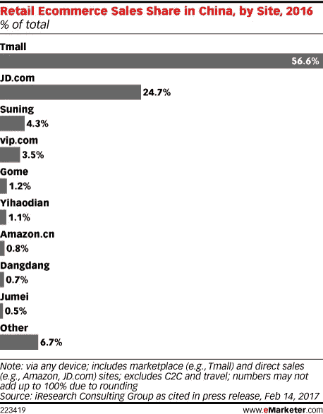

# 什么是 JD.com？

> 原文：<https://medium.com/hackernoon/what-is-jd-com-38e51263cc11>

你可能已经在最近的科技新闻中注意到了一家新的中国公司:JD.com，又名京东。该公司前身为京东商城，过去一年发展迅速，年初至今市值从 369.3 亿美元增至 660 亿美元。就流量而言，京东现在是全球访问量第 21 的网站。目前，京东是中国收入最高的零售商。

JD 于 1998 年在北京的一个 4 平方米的单元里开始运营，当时只有 1800 美元。该公司由刘(又名)创建，是一家消费电子产品零售商。2007 年， [JD 开始关注他们的物流网络，这样他们就可以控制供应链的各个方面。](http://corporate.jd.com/ourHistory)

京东目前的大部分收入来自其企业对消费者(B2C)业务。这意味着，京东类似于亚马逊；他们(企业)卖给个人(消费者)。消费电子产品仍然是京东销售的很大一部分，2014 年该公司 85%的收入来自于 CE 销售。

自 2016 年以来，京东一直在与一个不太可能的合作伙伴合作:沃尔玛。[2016 年 6 月，沃尔玛将其中国电子商务业务移交给京东，以换取 5%的股权](http://www.nasdaq.com/press-release/walmart-and-jdcom-expand-strategic-cooperation-20170725-00126)。[2017 年 8 月，两家公司举办了首届京东-沃尔玛联合购物节](http://www.nasdaq.com/press-release/walmart-and-jdcom-expand-strategic-cooperation-20170725-00126)。

京东还与另一家中国科技巨头有关联:[腾讯](https://hackernoon.com/tagged/tencent)。腾讯于 2014 年收购京东 15%的股权，2016 年[以 21.25%的股权成为京东第一大股东](https://asia.nikkei.com/Business/Deals/Tencent-becomes-top-shareholder-of-e-retailer-JD.com)。京东和腾讯一直通过腾讯广受欢迎的即时通讯客户端微信进行合作。

京东最接近的竞争对手是阿里巴巴的 B2C 市场天猫。根据 L2 最新发布的阿里巴巴洞察报告，2014 年超过 90%的 CPG 品牌在天猫上保持官方旗舰店，但只有 26%的品牌在 JD.com 有官方店铺。现在，在 2017 年，在 JD.com 有官方店铺的 CPG 品牌的比例飙升至 98%。"如前所述，京东非常专注于 B2C 业务，[只有约 6%的收入来自 B2C 销售](http://www.businessinsider.com/jdcom-is-gaining-ground-on-alibaba-2017-3)；阿里巴巴则相反，它以 B2B 企业而闻名。

[Source](https://retail.emarketer.com/article/alibabas-tmall-maintains-reign-over-chinas-retail-ecommerce/58ada2369c13e50c186f6f32)

与亚马逊相比，京东看起来像是 B2C 领域的一个小玩家。例如，2016 年，亚马逊的收入为 136 亿美元，而京东的收入仅为 390 亿美元。在撰写本文时，亚马逊的市值为 4740 亿美元，而京东为 660 亿美元。

虽然京东总部位于北京，但它一直在进行国际扩张。京东有一个通用的国际站点，https://www.joybuy.com/和[的](https://www.chinaretailnews.com/2017/06/20/9177-chinas-jd-eyes-expansion-to-thailand-russia/)[一直致力于拓展泰国和俄罗斯市场](https://www.joybuy.com/)和[东南亚市场](https://www.reuters.com/article/us-go-jek-m-a-jd-com-idUSKCN1B50MH)。

考虑到京东现在的规模相当大，它一直在进行哪些战略投资？

2017 年 6 月，[该公司向在线奢侈品市场 Farfetch](https://techcrunch.com/2017/06/21/jd-com-invests-397m-into-luxury-marketplace-farfetch-as-part-of-a-new-strategic-partnership/) 投资了 3.97 亿美元。这笔交易让京东在奢侈品电子商务领域获得了信誉，而其竞争对手阿里巴巴仍因山寨产品而受到嘲笑。

2017 年 5 月，[京东向 Go-Jek 投资 12 亿美元，作为该公司进军东南亚的一部分](https://www.reuters.com/article/us-go-jek-m-a-jd-com-idUSKCN1B50MH)。Go-Jek 是一家总部位于印度尼西亚的叫车和快递初创公司。随着 Go-Jek 的扩张，这一举措可能有助于 JD 在印度尼西亚交付的最后一英里物流，或许还有其他国家的交付。

2015 年 8 月，京东向总部位于上海的客户对客户订餐服务公司 Ele.me 投资 6.3 亿美元。

关于京东投资的完整列表，请参见他们的简介。

在分析中国公司时，了解它们在党内的地位很重要。在[中国](https://hackernoon.com/tagged/china)，你在党眼中的形象是首要的。

就在过去几周，[京东的创始人表示，随着技术进步，中国将能够实现完全的共产主义，所有公司都是国有的](http://www.globaltimes.cn/content/1062242.shtml)。他写道“我们离共产主义社会还很远，但是……共产主义的光芒将永远照耀着我们。”

此外，正如在[另一篇关于 JD](/@CaeX/jd-com-just-doit-43bbe6a47a3d) 的媒体文章中所说:

作为对中国经济的投资，我有两个公司外部的理由超级看好京东。这两个原因都受到政府决策的影响:

1.  *中国政府希望他们的核心网络经济由中国企业组成*
2.  *中国政府……希望以某种方式保护他们的公民，从而推动经济增长*

看起来理查德和 JD 作为一个整体，正在正确地遵循党的路线，并为成功做好了准备。

充分披露:我目前受雇于 Amazon.com，这篇文章中的所有观点都是我个人的。