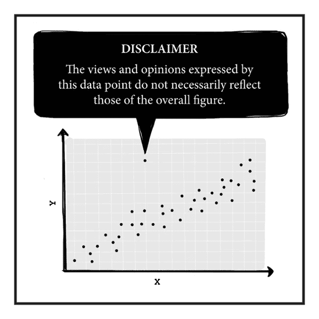

# 什么是机器学习？

> 原文：<https://medium.com/hackernoon/what-is-machine-learning-c74f16f910d0>

## 面向非技术人员的非常简短的指南

image edited from original at [http://blog.mindresearch.org/](http://blog.mindresearch.org/))

## **分类学**

1.  **监督学习:**一个模型通过[从(x，y)对的例子中学习](https://hackernoon.com/tagged/learning)来从 x 预测 y。这种 ML 分为两大类:**分类**(每个 y 是许多类中的一个，例如，照片上的人的身份)和**回归**(每个 y 是一个数字，例如，信贷申请中的风险)。
2.  **无监督学习:**没有 y，只有 x，这种 ML 的例子有:数据样本的【a】**聚类**、数据样本集合中的【b】**异常**检测、来自时间序列数据序列的【c】**预测**、学习潜在的**表示**例如，将英文单词表示为高维空间中的向量，使得相关单词彼此接近。[你可以说预测中有一个“y ”,但它是隐含的，有点像。]
3.  **强化学习:**有一个 y，但它是以奖励或惩罚的形式出现的。通常，数据以动态流的形式到达。你与一个系统互动，并为你的行为得到奖励或惩罚。例如，一辆自动驾驶汽车正在学习驾驶。

以下是四种目前比较突出的 ML 技术，按现实应用中成功的降序排列。原则上，任何 ML 技术都可以应用于上述分类法的任何部分。

## **神经网络**

这些模型是受大脑中神经元连接的启发。它们就像真实事物的漫画。自从 20 世纪 50 年代发明以来，这项技术已经在研究和资助方面经历了几个[冬天](https://en.wikipedia.org/wiki/History_of_artificial_intelligence#Perceptrons_and_the_dark_age_of_connectionism)。现在是[的春天](http://karpathy.github.io/2015/05/21/rnn-effectiveness/)。神经网络的基本构建模块是一个人工神经元，它计算其输入的加权和，并对该和应用非线性**激活**函数以产生其输出。这些神经元在一个[网络](https://hackernoon.com/tagged/network)中相互连接，通常是一个**分层**拓扑，没有反馈回路。训练这些网络的基本方法是[反向传播](https://en.wikipedia.org/wiki/Backpropagation)。卷积神经网络是一种特别有效的网络。如果你在神经网络中加入反馈，你会得到**递归**网络，其中 **LSTM** 网络最近非常成功。深度学习是一个有点模糊的术语，用于一些非常成功的神经网络应用。对大多数人来说，它指的是一个具有大量**层**的大型网络。我认为深度学习还指神经网络建模实践的其他细微变化，包括对[特征工程](https://en.wikipedia.org/wiki/Feature_engineering)的厌恶和对自动学习(分层)特征抽象的喜爱。

## **决策树**

决策树是计算机科学版的 20 个问题的游戏。您基于一个属性的值做出每个决定(例如:“它有四条腿吗？”决定“它”是否可以是一只鸟)。决策是[树](https://en.wikipedia.org/wiki/Tree_(data_structure))中的分支，其中每个连续的属性选择都依赖于之前的决策。 **CART** 和 **ID3** 是最早的两种学习决策树的算法，都是从 20 世纪 70 年代开始的。您可以将多个决策树聚集到**森林**中，在这里，来自各个树的预测可以被聚合，例如，通过投票。一个这样的**集合**是**随机森林**。从树组装森林有两种主要方法: **boosting** 和 **bagging** ，但是这两种技术也适用于非树 ML 模型的集合。

## **线性模型**

神经网络中的人工神经元是线性模型。线性模型产生的输出是输入的线性组合(加权和),后面可能有一个转换(激活)函数。与成熟的神经网络模型相比，它们非常简单。然而，当面对非常大的稀疏问题时，有时线性模型是唯一实用的选择。这类问题可能有几百万个维度(变量)，其中大部分是任何一个具体例子都没有的。谷歌的 24/7 数据管道，用于预测广告的点击量和转化率，如一个系统(截至 2009 年)。当结合适当的训练和[优化](https://arxiv.org/pdf/1606.04838.pdf)技术时，线性模型会非常有效。这仍然是一个成熟的研究领域。

## **支持向量机**

SVMs 背后的思想在这里得到了很好的解释[(不幸的是，您将不得不加载每个图像)。如果你在桌子上有两种颜色的球，你想用一根棍子把红色和蓝色分开，SVM 会尽量把棍子放在最好的地方，在棍子的两边留出尽可能大的空隙。但是，可能没有任何分离颜色的棒的位置(问题可能不是**线性分离**)。在这种情况下，你翻转桌子，把球抛向空中。随着这些球神奇地悬浮在不同高度的空间中，你也许可以放置一张纸来分隔颜色。表格的翻转是使用**内核**的数学变换。支持向量机的一个问题是，对于大量数据，学习速度很慢，如果不是不切实际的话。](https://www.reddit.com/r/MachineLearning/comments/15zrpp/please_explain_support_vector_machines_svm_like_i/)

image source: [https://xkcd.com/1725/](https://xkcd.com/1725/)

## **其他 ML**

这里没有描述许多其他的 ML 技术。示例包括图形模型、贝叶斯网络、隐马尔可夫模型、基于规则的学习、遗传算法、模糊逻辑、Kohonen 网络、混合模型、K 均值聚类、主成分分析、核方法等。其中一些是相互重叠的。

## **离别的思念**

在最大似然预测的准确性和可解释性之间有一个权衡。这通常表现为商业 ML 工作的业务和技术需求之间的争论点。有人认为你不能两者兼得。

关于商业智能、ML 和现代软件的更多思考，请看我的新博客[这里](https://bipp.io/blog/)。