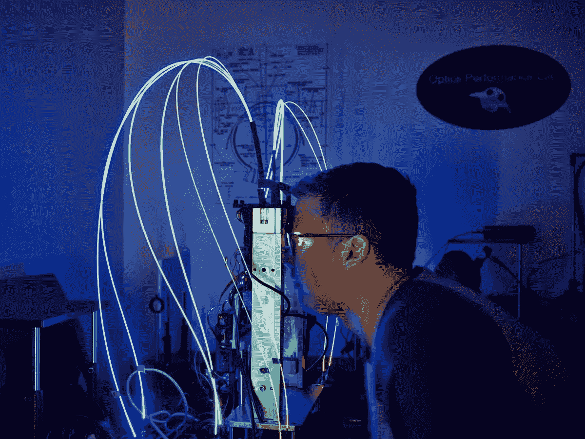
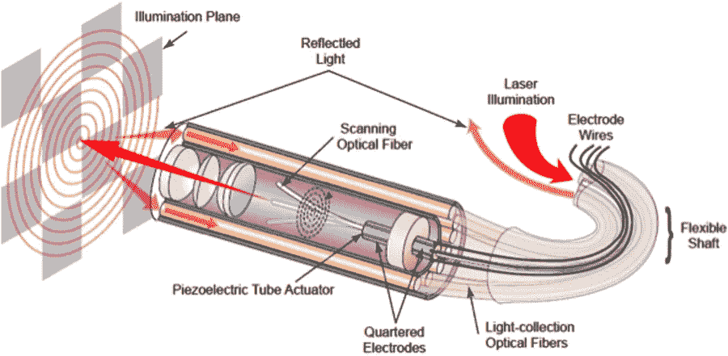
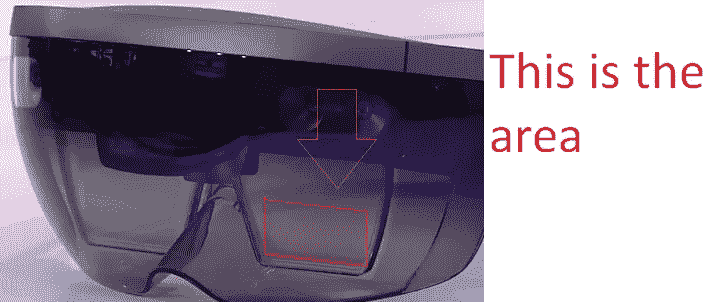
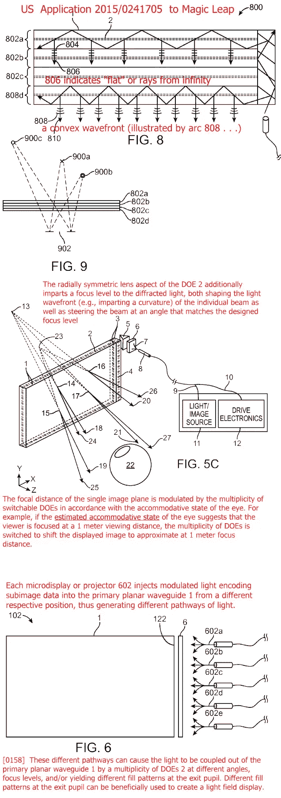
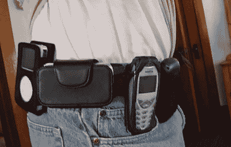

# 神奇的飞跃到底是什么？

> 原文：<https://medium.com/hackernoon/what-is-magic-leap-really-642e1660fcc4>

***摘自我写的一篇评论***

Magic Leap testing platform (early prototype of The Beast). Image by Wired.

Magic Leap 寄希望于纤维扫描显示器。然而，这项技术还没有准备好，至少在 5 年内可能不会。

Fiber Scanning Display in 2015\. Image from kguttag.com.

How Fiber Scanning Displays work. Image from ASME.

那么他们用的是什么？我们知道这一点，基于所有的泄漏和信息。他们用的是波导(像 HoloLens，Lumus，Vuzix，Epson 等。).他们很可能会使用 LCOS(比如 HoloLens)。他们可能会使用微型 OLEDs(如爱普生)，但可能会使用 LCOS，因为它价格低，亮度高，尺寸小。著名分析师 Ming-Chi Kuo 报告说 Magic Leap 将使用 Himax LCOS 显示器(可能是未发布的 1080p 版本)。

Viewable area of the HoloLens waveguide. Darkened shield for reducing external light to enhance brightness of virtual images (waveguides are notorious for light waste). Image from Neogaf.

使用波导的一个问题是它们只能提供相对较低的视野。Lumus 拥有最先进的 55 度 FOV 波导。虽然 FOV 将继续增长，但在几年内，它可能不会像梅塔的 FOV(他们声称是 90 度)一样大或更大。这将比全息透镜(第一代)更好，它只有大约 30 度，但没有令人兴奋的东西。

Field of view diagram. Image by Chris Grayson.

他们将如何区分？多个关注领域。他们计划使用多个相互堆叠的波导来实现这一点。然而，这将使波导比现在厚得多。此外，如果他们同时想要多个焦深，他们会牺牲帧速率。最有可能的是，他们会使用眼球追踪来根据你看的地方计算出投影的景深，以最大化帧速率。

Diagram of a Magic Leap multiple depth field patent. Image from kguttag.com.

为了处理，他们会把它分成两包，放在你的口袋里，或者更有可能绑在你的臀部，因为热量显然是一个很大的问题。电池组和加工包。他们可能会使用骁龙，或任何他们发布时的顶级产品。在 x86 上使用 ARM 不仅可以节省电力，还可以让他们利用 Android 的基础或谷歌未来创建的任何微内核来进一步节省电力，并实现快速准确的空间映射。

The last time people wore computers on their hip. Image from Pocketnow.

所有这些处理都将被转化为你的环境和你的手的三维空间映射。HoloLens 目前有最好的算法，甚至有定制的硅芯片来处理它。这将是任何 AR 设备的重要组成部分。Magic Leap 在理论上可以制造出相当或更好的系统，但微软肯定在最好的系统上处于领先地位，如果你只是一家初创公司，在不久的将来很难超过他们。

那么 Magic Leap 最后看起来是什么呢？是什么让他们与众不同，具有竞争力？似乎没有那么多。如果你撕开罗尼擅长的炒作的面纱，他们目前没有竞争优势。他们没有独特的品质或技术，他们的竞争对手没有或无法在短期内赶上。微软现在是 AR 领域的领导者，即使 Magic Leap 最终发布版本 1，它也处于领先地位。

Rony 想成为一个“小苹果”，但如果你发布另一个波导，你就不能像苹果一样。iPhone 不是黑莓或 Treo。这是一种完全不同的东西，还没有被设想出来(除了其他人在深夜默默进行的粗略尝试)。如果 Magic Leap 发布了经过修改的 HoloLens，它将无法成功对抗像微软这样的巨头。微软当然知道你不能只发布 YAW，因为他们现在已经决定跳过第二版，直接进入 2019 年至 2020 年发布的技术更先进的 HoloLens 第三版。如果 Magic Leap 也想这么做，我不会感到惊讶。对他们来说不幸的是，即使投资者愿意给他们时间来完善他们的首次发行，到那时要赶上竞争对手的牵引力也为时已晚。

Magic Leap 怎么可能追上？通过发布一些惊人的东西。但是所有的指标都表明没有明显的竞争优势，FSD 可能不会在 2-3 年内在 Magic Leap 这样一个组织混乱的初创公司投入生产。

然而，我可以想象他们会发布一款与 HoloLens 相当的竞争产品。他们可以通过这种方式获得一些支持。我不是说这不可能。但是，即使他们奇迹般地在发布时战胜了他们的竞争对手，他们也面临着更大的威胁。

苹果和三星可能会在 2020 年主导消费者 AR，如果不会超过 T1 的话。为什么？很简单:他们有牵引力、资金和技术。让我详述这些。

1. **AR 是计算密集型的，你的口袋里已经有一台他们制造的顶级电脑了。** Magic Leap 不仅要卖给你一台显示器，还要卖给你一台专门为它制造的电脑。这很容易使成本翻倍。与此同时，A/S(苹果和三星)可能已经卖给你一台袖珍电脑了。这意味着 Magic Leap 的 999 美元的 AR 设备变成了 A/S 的 499 美元的 AR 显示器。即使 Magic Leap 改变为利用你已经拥有的手机，他们也无法克服 A/S 将拥有的固有优势，并且永远无法获得苹果拥有的丰富的客户群，因为他们永远无法利用苹果练习的控制权来利用 iphone。

2.他们拥有 Magic Leap 永远无法超越的牵引力。这与第一点有关，从现在起 5-10 年内，AR 设备将是一种附件设备，而不是 iPhone 的替代品。它将成为以智能手机为中心的生态系统的一部分。我在这里设想了两种情况:一种，三星、微软、Magic Leap 和其他较小的竞争对手发布他们的产品，年复一年地迭代技术。几年后，苹果加入进来，用一款功能相当的设备横扫市场，在更精细的细节和生态系统(包括丰富的客户群)上击败了所有人。这本质上就是 Apple Watch 的场景。第二，三星、微软、Magic Leap 和其他较小的竞争对手年复一年地发布他们的产品和迭代技术。AR 设备仍然是一个利基，并没有被广泛采用。5-10 年后，当技术成熟时，苹果会推出一款技术领先的设备，除了最大的竞争对手(三星、微软、谷歌)之外，横扫所有对手。苹果主导了消费者市场一段时间，三星参与竞争并最终赶上，谷歌迅速发布了他们的竞争对手。这本质上是 iPhone 的情况。鉴于史蒂夫·乔布斯(Steve Jobs)去世后苹果领导层管理公司的方式，我敢打赌，苹果手表会比 iPhone 更像苹果手表。

3."**如果你看到一支唱针，他们会吹掉它."**史蒂夫·乔布斯说了一些关于 iPad 纯触摸屏(以及智能手机)出现之前的平板电脑技术的话。同样，我会说“**如果你看到电线，它们就把它炸了。**“如果你必须佩戴一个连接到耳机的腰包式耳机，甚至连接到你的手机，AR 技术永远不会受到消费者的欢迎。你可能会指出，将耳塞连接到手机上是完全正常的，但我们都熟悉过度弯曲或过度弹跳以及耳塞被拔出或掉出的情况。无论如何，苹果的终极愿景是无线，我怀疑他们会强烈倾向于发布简单地将大部分非即时处理(除了毫秒级至关重要的空间跟踪之外的一切)无线传输到 iPhone 的眼镜(只需给设备的其余部分加载电池和显示硬件)。在可预见的未来，竞争对手将首先推出有线 AR 眼镜，但无线(无论处理是独立的还是卸载的)是不可避免的结论，无论哪家公司最终主导市场，最终都需要朝着这个方向发展。

分析师 Ming-Chi Kuo 还表示，Magic Leap 正在购买一个高价高频天线，这可能意味着他们的设备将无线传输到一个腰包。这肯定会更好，但是第一点仍然有效。从积极的一面来看，在早期采用者市场获得一个立足点可能“刚刚好”。

Steve Jobs explains design decisions for the iPad. Video from All Things Digital.

**那么 Magic Leap 会怎么样呢？**最有可能的是，他们将从现在开始竞争 5-10 年，最终他们将被谷歌或三星或 **Snap** ( *可能是* ***通配符竞争对手*** )收购。如果他们有一个成功的未来，他们将被用作一个跳跃平台，或者如果他们做得不好，他们将被用作一个专利包。我可以想象，十年后，他们的纤维扫描显示器将会成熟并可以投入生产。我也可以想象这可能是一个死胡同。

A wildcard player could come from Snap (formerly Snapchat). Facebook is also a possible contender. Video by The Verge.

最终，Magic Leap 是一辆宣传列车，与装备更好的竞争对手相比，它没有明显优势。在这一点上，我也可以看到 Vuzix 在不久的将来会因为他们的显示技术而被收购。Magic Leap 可能会被收购，也是在不久的将来，最有可能被谷歌/Alphabet(Magic Leap 最大的投资者之一，谷歌首席执行官(不是 Alphabet)拥有董事会席位)或阿里巴巴收购，但也有可能被三星、微软、苹果、脸书或其他潜在的参与者收购。

当然，这是一种以西方为中心的观点。阿里巴巴是 Magic Leap 一轮 7 亿多美元融资的一部分，Magic Leap 发布了一段视频，展示了与阿里巴巴的亚马逊/Ebay 平台淘宝的合作，淘宝是中国(也是世界上)最大的平台之一。

Taobao shopping demo on Magic Leap. Image from Magic Leap.

AR 非常适合中国社会。中国与移动技术的结合令人难以置信，这是美国和欧洲所没有的。他们的整个生活都是通过微信(另一家大型企业腾讯拥有，与阿里巴巴竞争)这样的大型应用程序运行的。AR 的范式转变是，它将移动技术从你消费的由内向外的设备变成了我们生活的由外向内的世界(这可以被称为混合现实，或 MR)。中国很适合这一点，因为他们的社会与移动技术紧密结合，这在西方社会是看不到的。他们生活在一个建立在移动基础上的世界，而我们生活在一个移动只是扩大了我们当前世界的世界。

阿里巴巴，甚至腾讯，可以在 5 年内轻松收购 Magic Leap，并利用它们在中国启动 AR。腾讯投资了 Meta，所以他们当然也在关注 AR。

Man wearing Meta 2\. Image from UploadVR.

为了实现这一点，Magic Leap 可能会在 5-10 年后被收购，就像 Rony 的上一家公司一样。他们要么因为专利被收购，要么因为平台和技术被收购。除了是目前少数准备在不久的将来进入 AR 市场的公司之一之外，他们目前没有任何竞争优势。他们的光纤扫描显示器最终可能会成熟为一项技术优势，但它也可能只是一个死胡同(尽管随着最近日本为视力不好的人发布的虚拟视网膜显示器，我还不会把它排除在外)。Magic Leap 凭借其内容合作伙伴关系(ILM、华纳兄弟、Weta 等)可能会有一段时间的竞争优势。).但我敢打赌，它们要么被收购，要么干脆倒闭，被卖给投资者。

看看我从哪里得到了很多关于 Magic Leap 技术的知识:[http://www.kguttag.com/](http://www.kguttag.com/)

> [黑客中午](http://bit.ly/Hackernoon)是黑客如何开始他们的下午。我们是 [@AMI](http://bit.ly/atAMIatAMI) 家庭的一员。我们现在[接受投稿](http://bit.ly/hackernoonsubmission)并乐意[讨论广告&赞助](mailto:partners@amipublications.com)机会。
> 
> 如果你喜欢这个故事，我们推荐你阅读我们的[最新科技故事](http://bit.ly/hackernoonlatestt)和[趋势科技故事](https://hackernoon.com/trending)。直到下一次，不要把世界的现实想当然！

