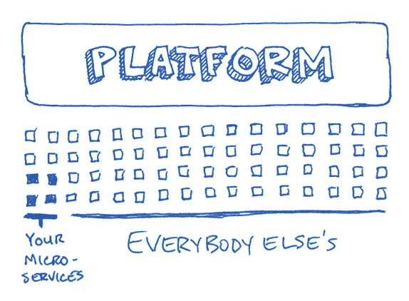
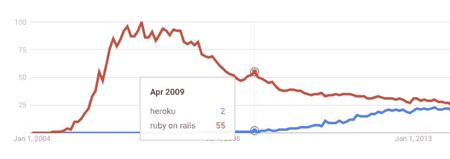
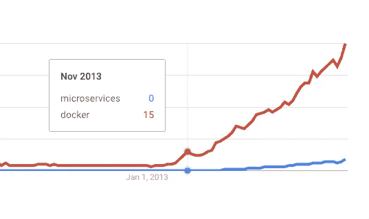
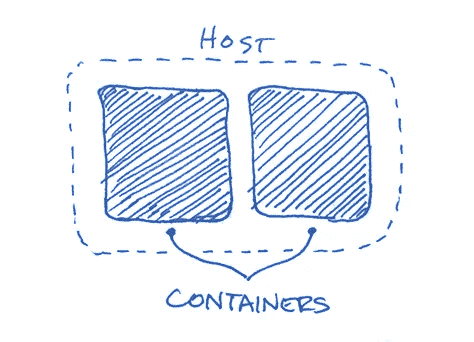
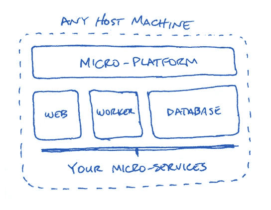
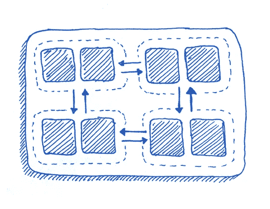

# 什么是微 PAA？为什么它是应用开发的未来

> 原文：<https://medium.com/hackernoon/what-is-micro-paas-and-why-its-the-future-of-app-development-3aa30d086703>

码头工人让集装箱化变得比以往任何时候都更容易使用，这正在改变我们开发应用程序的方式。

应用程序不是代表整个应用程序功能的单一代码库，而是被分解成更小的功能块，称为微服务，它们一起工作形成应用程序。

然而，应用程序开发人员发现很难在线托管这些应用程序，因为它们正在迅速超越平台即服务(PAA)的“一刀切”性质。

# 什么是 PAA？

PAA 的存在是为了允许应用程序开发人员部署和管理 web 应用程序，而不必处理创建、配置和管理服务器的复杂性。

换句话说，开发人员可以专注于编写他们的应用程序，然后快速轻松地将它们部署到生产环境中，而无需等待数小时(甚至数天)，等待其他人调配和配置他们的基础架构。

## p 代表站台

> 平台——计算机系统硬件的标准，决定了它可以运行何种软件。

PaaS 中的 P 代表平台。平台包含应用程序需要运行的所有东西——应用程序代码、依赖项、web 服务器、代理等。

在“传统”PAA 中，所有这些东西都在一个全球空间中，一个巨大的整体共享平台中。在部署代码之前，您需要确保某个地方有一个基础设施，为运行应用程序做好一切准备。

当大多数人想到 PaaS 时，他们会想象一个设计良好的 UI，它在底层主机(如 AWS、Google 或 DigitalOcean)之上提供了一个很好的抽象层，并负责为他们订购、配置和管理服务器。有点像……英雄。

# 据我们所知，paa

Heroku 最初创建于 2007 年。2009 年 1 月，Heroku 发布了全新版本的平台，完全从头开始。

*(警告:前方意见)*

就在那之后，2009 年 3 月，Rails 2.3 上的 Ruby 发布了。Rails 已经越来越受欢迎，随着 2.3 的出现，它突然成为网络开发中非常受欢迎的选择。

Rails 之前的生活有点像狂野的西部。您要么在前端使用 Java，因为后端就是这样，要么使用 PHP。

PHP 并不是真正以它的约定而闻名……有人说，“PHP 框架的数量和开发人员的数量一样多”(类似于今天的 JavaScript 场景……但是我跑题了)。

随着 Node.js 处于萌芽阶段，Rails 看起来是 web 开发方式的一个非常有前景的替代品，尤其是有了“约定胜于配置”的承诺。

事实证明，这正是许多开发人员想要的。就在那时，Heroku 将自己定位为 Rails 应用程序和 PAA 的实际宿主，正如我们所知，它开始腾飞。

Source [Google Trends](https://trends.google.com/trends/explore?date=all&q=heroku,ruby%20on%20rails)

*(回到事实上)*

在接下来的几年里，Heroku 将宣布对各种其他语言的支持，使得 PaaS 不仅仅适用于 Rails。

从那时起，PaaS 已经爆炸式增长，现在有几十个不同的提供商可供选择。

# PaaS 的价格

不必配置服务器和管理基础设施的代价是*灵活性*和*控制*。

**灵活性** —当您选择一个平台即服务提供商时，您会被困在他们单一的底层主机上。例如，Heroku 在引擎盖下使用 AWS。随着应用程序的增长，如果你需要扩展到新的领域，你最终会受限于亚马逊所能提供的一切。

此外，由于您不是直接从主机订购服务器，您会受到 PaaS 提供商提供的计划的限制。这有可能严重限制您可以访问的服务器的大小和配置。

**控制**—PaaS 的另一个主要限制是直接控制“您的”服务器。对于大多数 PaaS 提供商，您没有对服务器的 SSH 访问权限，即使有，也是有限的访问权限，因此您将无法安装软件包或服务。

此外，由于服务器是通过 PaaS 提供商订购的，而不是直接从主机订购的，因此您只能通过提供商的仪表板来管理它们。这通常会限制您与服务器本身的直接交互(重启、重新启动等)。).

# 应用程序开发的未来

应用程序开发经历了向微服务架构和容器化的巨大转变，尤其是 Docker。

Source [Google Trends](https://trends.google.com/trends/explore?date=all&q=microservices,docker)

容器实际上已经存在很长时间了。从 1979 年的 chroot 开始。从那里来了几个迭代，包括 FreeBSD 监狱，开放 VZ，LXC 和 LMCTFY。

最后，2013 年初推出了 Docker。真正让 Docker 与众不同的是，它不仅提供了容器化，还提供了创建、使用和管理容器的整个生态系统。以前是一个相当模糊的过程，现在变得相当容易。

容器本身就像运行在主机内部的孤立的小型服务器。它们从主机获得自己的资源，并将所有进程包装在自己的文件系统中。它们非常轻便，易于创建、扩展和销毁。

容器非常适合存放单一的功能，所以微服务架构流行很大程度上是因为容器。

将应用程序的各个部分解耦提供了稳定性和灵活性。一个应用程序不再由一个巨大的代码库组成。然而，随着应用微服务的增长，它需要托管解决方案提供匹配级别的灵活性，而这是 PaaS 无法提供的。

# PaaS 的未来

PaaS 的下一次迭代将是*微* -PaaS (μPaaS)，仔细想想完全说得通。

PaaS 中的 P 不会消失，也永远不会消失。然而，微服务应用需要一个像它们一样灵活和动态的平台，因此 PaaS 正在发展以满足这一需求。

## μ代表微

在μPaaS 中，应用程序的每一部分都是它自己的容器。这创造了一个独特的微服务生态系统，所有这些微服务都可以随您的应用一起部署到任何环境中。无论您的代码走到哪里，您的基础设施都会跟到哪里。

“我不知道它对我有效…”的日子已经一去不复返了。

想象一个本地环境，它可以通过开发团队自由分发，并保证对每个人都一样，甚至是新员工…真酷！

## 生产中的微 PaaS

μPaaS 允许开发人员轻松创建即时、隔离的开发环境，然后同样轻松地将该环境部署到生产环境中。这种开发与生产的对等实际上是一件大事

此外，由于这些环境的分布式本质，不再需要绑定到任何一个特定的主机。应用程序不需要“全栈”或“单主机”PaaS 产品，它们需要一个动态的底层主机。

## 向前一步，向后两步

然而，有一个很大的警告…

就像 PaaS 需要 Heroku 这样的东西来真正发挥其全部潜力一样，μPaaS 需要能够抽象出管理 Docker 和容器的所有复杂性的东西。

虽然容器化真的很棒，但它将开发带回了 PaaS 出现之前的状态。然而，现在开发人员不再配置和管理服务器，而是在服务器中配置和管理容器*。*

您现在不再仅仅负责服务器基础架构，而是负责内的容器*基础架构服务器基础架构…基础架构概念！*

## 容器编排

因为需要处理所有这些容器并使它们易于管理，所以像 Kubernetes (K8s)和 Docker Swarm 这样的东西被创造出来。

虽然这些都是解决实际问题的好工具，但它们有自己的学习曲线和不简单的复杂性，这使得使用它们令人望而生畏。

就像 PaaS 抽象出基础设施配置和管理一样，μPaaS 将需要一些东西来抽象出所有的容器配置、编排和管理。

# 立即开始使用微 PaaS

Nanobox 是一个很好的μPaaS 的例子。

它考虑了开发人员从μPaaS 中需要的一切，使得在团队成员之间和整个开发阶段维护环境平衡变得容易。

它处理配置和管理容器*和*服务器的所有复杂性，因此应用程序开发人员不必这样做。

创建现代应用程序的便利性，以及μPaaS 为部署和管理这些应用程序提供的灵活性和控制力，代表着面向应用程序开发和 PaaS 未来的一次重大飞跃。

> [黑客中午](http://bit.ly/Hackernoon)是黑客如何开始他们的下午。我们是 [@AMI](http://bit.ly/atAMIatAMI) 家庭的一员。我们现在[接受投稿](http://bit.ly/hackernoonsubmission)，并乐意[讨论广告&赞助](mailto:partners@amipublications.com)机会。
> 
> 如果你喜欢这个故事，我们推荐你阅读我们的[最新科技故事](http://bit.ly/hackernoonlatestt)和[趋势科技故事](https://hackernoon.com/trending)。直到下一次，不要把世界的现实想当然！

