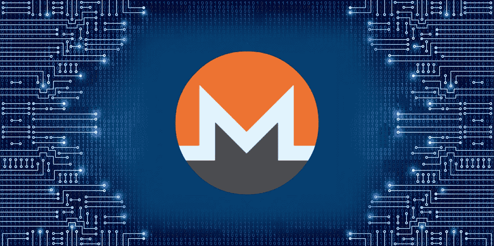
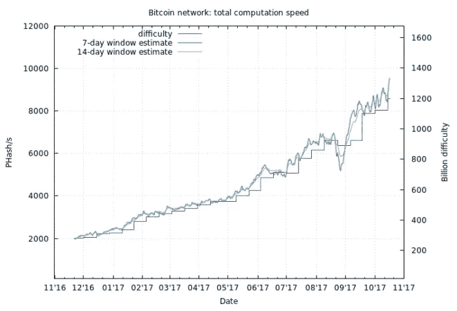
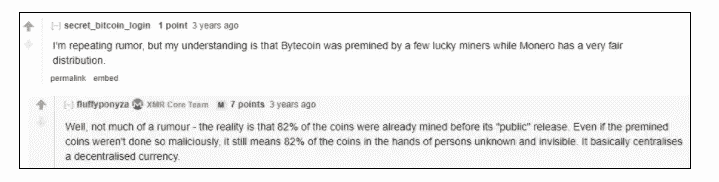
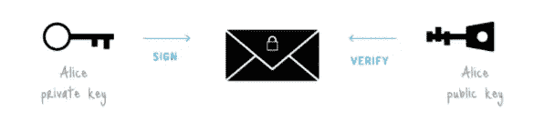
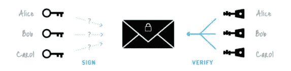
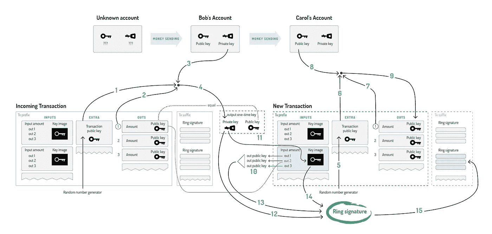
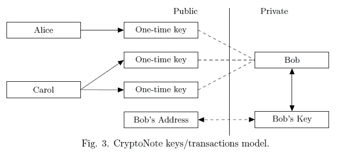
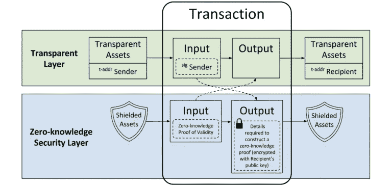
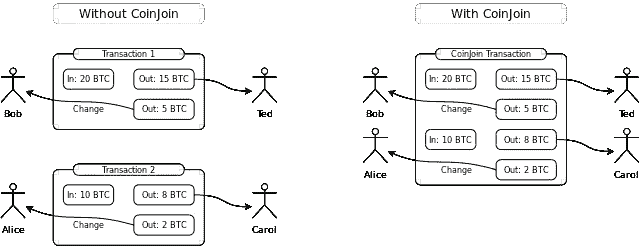

# 什么是 Monero？深入的指南

> 原文：<https://medium.com/hackernoon/what-is-monero-an-in-depth-guide-5d43f1917178>

最初于 2014 年 4 月推出，名为 BitMonero，Monero(符号 XMR)，在世界语中的意思是金钱。Monero 是 Bytecoin 的一个分支，是一种安全、私有且不可追踪的货币，建立在 Cryptonote 协议之上。

Monero 使用环签名、环保密交易(RCT)和秘密地址在协议级别混淆交易。

**技术细节**

**发射:**2014 年 4 月 14 日

**总硬币供应量:**最初为 1840 万枚硬币(此后，将永久固定生产每分钟 0.3 XMR，以平衡每年损失的硬币)

**算法:**使用 CryptoNight 的工作证明(PoW)

**块奖励:**平滑变化

**阻塞时间:** 120 秒

**难度:**每一格重定目标

**Cryptonote，Monero 的初始代码库和前身**

# Monero 旨在解决的比特币问题

比特币的一大缺点是缺乏实现新功能的灵活性，这需要几乎完全的网络更新。([正如我们看到的关于区块大小的争论](https://en.bitcoin.it/wiki/Block_size_limit_controversy))

这包括硬编码的约束和设计的自然元素(如阻塞频率、最大货币供应量和所需的确认次数)。

使用[比特币](https://hackernoon.com/tagged/bitcoin)可以自动公开交易金额以及汇款人/收款人的可追溯性，除非用户采取特定步骤。

随着 GPU 和专用集成电路(ASIC)硬件的出现，工作证明算法(PoW)也违反了最初的“一个 CPU 一票”的 Satoshi 愿景。这允许这些矿工获得对网络的多数控制权(51%+)并控制变化。(像叉子一样，让网络继续下去。)

不规则排放指的是比特币奖励每 4 年减半的结构。最初的意图是创建有限的指数衰减平滑发射。(更可预测而非起伏不定的模式)

相反，我们有一个分段线性发射(如下图所示),这为双重支出攻击创造了机会。这是因为网络哈希速率在每减半时都会降低。注意像“楼梯井”一样的移动。

# 字节码分支及其创建的细节

Bytecoin 是 CryptoNote 协议的第一个已知实现，其代码完全是从零开始生成的。但是，如果已经实现了，为什么还需要 Monero 呢？好吧，和往常一样，为一些戏剧性事件做好准备。

[正如 3 年前的 Monero subreddit](https://www.reddit.com/r/Monero/comments/26we1g/why_monero_and_not_bytecoin/) 中所阐述的，不仅有字节币溢价，还伪造了区块链以显示公平分配。然后，有 2 年的“残废”代码，本来可以改进，但没有。 [Ricardo Spagni 又名“fluffy pony”](https://steemit.com/introduceyourself/@fluffypony/what-s-up-steemit-people-i-m-riccardo-fluffypony-spagni-from-the-monero-project)表示，Monero 团队在几周内就解决了这些问题。

# Monero 技术基础

Monero 背后的主要技术是一种平衡，允许用户控制他们的密钥，并通过成熟的安全机制进行私人操作，同时还允许网络的可扩展性和发展。(例如可变块大小、Kovri 的集成)

**How a normal (not fully anonymous) transaction works**

如果不采取措施掩盖个人身份和交易(例如 VPN 和混合服务)，比特币交易的默认设置是完全透明和匿名的。这意味着您的 IP 地址可以连接到您的设备(即个人身份)，并有足够的资源专用于连接这两者。

**Ring Signature Transactions**

**用环签名保护发送者**

环签名(如上所示)是数字签名，其中几个签名人签署一项交易。(**想想:**用联名账户签名，但是没有人知道真正的签名者)

发送者生成一次性花费密钥，并且接收者是能够基于该密钥检测和花费金钱的唯一一方。

密钥映像是一种加密密钥，从每次支出的输出中获得，可防止重复支出。这是因为区块链上的每个产出(支出)都有一个关键图像。

**环密交易(RCT)隐藏发送金额**

发送者可以透露足够的信息，让矿商确认交易，而不必公开披露总支出。(称为“提交”)这允许交易被验证为真实的，而不会失去用户的隐私。

**隐形地址使收件人隐姓埋名**

秘密地址，也称为一次性公钥，可以防止接收者的资金与他们的钱包联系在一起。该地址可以由第三方审核，以证明交易发生。(发送者共享他们的公共视图密钥)

收款人通过扫描区块链的钱包私人查看密钥获得资金。一旦被钱包检测和检索，就创建一个一次性私钥(对应于发送者的公钥)。

接收者现在可以使用他们的私人花费密钥来花费这些资金。这种情况没有发送者、接收者，也没有公开链接的交易金额。

# Monero 交易如何工作

在这个 [Monero Bitcointalk 线程](https://bitcointalk.org/index.php?topic=583449.0)中非常简洁地解释了这个过程(下面的图片附有数字):

*“鲍勃决定花费一个输出，该输出被发送到一次性公钥。他需要额外的* ***(1)*** *，tx 数量超过* ***(2)*** *，以及他的账户私钥****(3)****来恢复他的一次性私钥****(4)****。Bob 在向 Carol 发送交易时，随机生成其额外值****(5)****。他使用额外的****(6)****、tx 数量超过****(7)****和卡罗尔的账户公钥****(8)****来得到她的输出公钥****(9)****。*

*在输入中，Bob 在外键(10)中隐藏了到其输出的链接。为了防止重复花费，他还打包了密钥映像，该映像源自他的一次性私钥****【11】****。最后，Bob 使用他的一次性私钥****(12)****、所有公钥****(13)****和密钥映像****(14)****对交易进行签名。他将得到的环签名附加到事务的末尾****【15】****。”*

# 与其他主流隐私协议的主要区别

Monero 与其他注重隐私的解决方案相比如何？

与 Monero 的主要区别在于 CryptoNote 的实现，该实现自 2001 年就已经出现，并且已经获得了围绕其功能的大量同行评审。(例如可追踪的环签名)

**隐私技术的另外两种实现包括:**

零硬币/零现金(zero coin/zero cash)—使用零知识证明(ZKP)该协议隐藏了发送者和整个经济。由于网络的匿名性，任何利用(如创建虚假证明/消费)直到很久以后才为人所知。最大的风险之一是加密背后缺乏成熟度和同行审查。此外，ZKP 依赖于最初的 RSA 私钥生成销毁的创造者。([据说是在这次电脑焚烧仪式中完成的](https://petertodd.org/2016/cypherpunk-desert-bus-zcash-trusted-setup-ceremony))

**使用零知识安全层的 ZCash 交易(ZSK)**

CoinJoin 是一个混合协议，它组合事务，但不在协议级别屏蔽用户、发送者或事务。Coin Join 最初由比特币开发者 Gregory Maxwell 开发，由 DASH 使用，Dash 利用 Masternode (MN)模型，用户必须拥有 1000 个 Dash 才能托管 MN。批评者说，这造成了单点故障，因为提供混合服务的单个节点容易受到 Sybil 攻击。

[**莱特币的创造者查理·李最近被爱德华·斯诺登问及 Zcash vs Monero:**](https://twitter.com/satoshilite/status/913644791144919040?lang=en)

# 批评、弱点和关注

虽然 Monero 似乎有很多荣誉，但它有哪些弱点呢？[如本子编辑](https://www.reddit.com/r/Monero/comments/611jtu/lets_talk_about_moneros_disadvantages/)中所述，有一些:

*   **隐私** —有能力跟踪发起交易的节点的 IP 地址。这种 IP 地址记录可能会导致用户匿名化。
*   **采矿集中化**—Monero 的大部分采矿由 4 个联营体完成，每个联营体拥有不超过 20%的股份。此外，ASIC Monero mining 的出现进一步威胁到“一个 CPU 一票制”的原始风气，尤其是在规模扩大的情况下。
*   dark web PR——虽然这不是 Monero 团队的直接原因，但它值得注意，因为品牌和公众认知总是要记住的，并且可能会减缓其采用，因为人们担心其用于非法目的。
*   **交易规模** — Monero 交易比比特币交易大得多，需要更多的数据，并导致更大的区块链，每天都在持续增长。
*   **开发难度**——与多硬币钱包结合的能力以及其他能让使用更广泛的集成一直进展缓慢。
*   **有限的商户工具** —商户集成支付的工具在这个时候很难集成。然而，有越来越多的第三方服务出现，以帮助补救这一点。

**迄今为止的成就**

*   [**Kovri fork，用 C++**](https://getmonero.org/resources/moneropedia/kovri.html) 中的 I2P 层创建更安全的交易——这个从零开始重建的版本利用了 I2P 被称为隐形互联网项目的 TOR 替代方案，它将为所有推送到网络的交易添加一个安全层。这是在用户 anonimal 恳求 Monero 社区同意资助全职开发以使其成为现实之后。(Gotta love 众筹)
*   [**Monero Hardware wallet 发布**](https://forum.getmonero.org/7/open-tasks/88149/dedicated-monero-hardware-wallet)**——该项目是在 Monero 社区中作为一种资助机制组织和创建的，称为论坛资助系统(FFS)，由 Michael Schloh von Bennewitz 15+软件和创客资深人士以及 Kovri 的首席开发人员 anonimal 牵头。除此之外，莱杰和特雷佐也在整合中。**
*   你可以用 Monero **支付积压商品——多亏了 Shapeshift 和他们的 API，积压商品现在可以接受 Monero 和其他几种替代硬币。这进一步表明了主流采用的可信度。**

**结论**

Monero 在这场不仅是加密货币而且是隐私的迷人游戏中一直是一个非常稳定和创新的玩家。该技术旨在从比特币停止甚至不起作用的地方捡起来(即非 ASIC 挖掘、匿名)。

团队致力于构建代码和辅助功能(如 Kovri，这是一个独立但非常相关的项目)是非常明显的。在这个充斥着“本月风味”硬币和 ico 的世界里，有能力的团队是金子。

此外，这些项目的技术细节绝不简单，这进一步使这个项目更加迷人，是一个伟大的工程壮举。

保持这个安全，隐私硬币在你的雷达上，它的团队是行业的领导者，将是一个无限期观察。

*最初发表于*[*【coincentral.com】*](https://coincentral.com/what-is-monero/)*。*