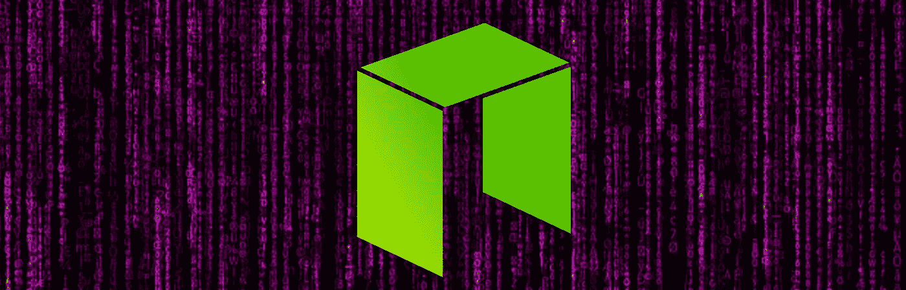
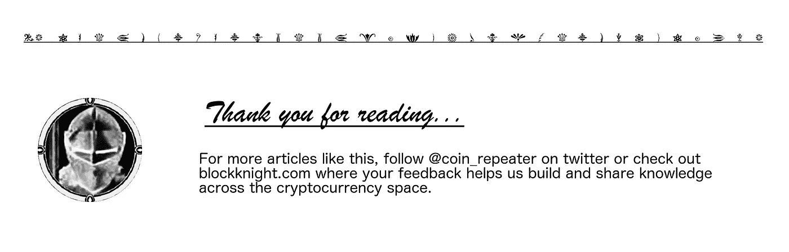

# 什么是近地天体，什么是气体？

> 原文：<https://medium.com/hackernoon/what-is-neo-and-what-is-gas-5b9828a1aa65>

## 介绍以前被称为 AntShares 的加密货币及其友好的伙伴。

# 哪来的！？

围绕近地天体平台有相当多的困惑。考虑到该项目的复杂历史，这并不奇怪。

Neo 于 2014 年开始作为 AntShares (ANS)的生活。由[达](https://twitter.com/dahongfei)和[埃里克张](https://twitter.com/neoerikzhang)创立的蚂蚁金服，被称为“[中国第一个区块链平台](http://bitcoinist.com/chinas-first-blockchain-platform-antshares-rebrands-neo/)”。2016 年，据说是为了应对对 AntShares 日益增长的兴趣，以及对满足政府监管机构和私营公司要求的区块链解决方案的需求，d a 和 Erik 成立了 OnChain，这是一家由风险投资支持的公司，提供区块链的金融服务。2017 年，AntShares 更名为 Neo。

Neo 和 OnChain 的总部设在上海。毫无疑问，中国的监管会对加密货币市场和发展产生深远的影响。Neo 同样容易受到中国监管机构的影响，并且处于有利位置，可以向中国监管机构提供信息并与之合作。

# 智能经济

[Neo 白皮书](http://docs.neo.org/en-us/)是我们了解该平台的重要资源。不幸的是，Neo 的一些方面仍在开发中，某些细节还不清楚。有时，白皮书读起来更像是智能合约的概述，而不是 Neo 内部工作的具体指南。

在概念上，Neo 是一个[智能合约](https://en.wikipedia.org/wiki/Smart_contract)生态系统，类似于[以太坊](https://en.wikipedia.org/wiki/Ethereum)。它允许用户自动存储和交换数字资产。为了与更成熟的智能合同实施竞争，Neo 利用不断发展的技术以及与中国当局的合作，实现“智能经济”的既定目标。

## 数字身份

2005 年，中国的《数字签名法》允许数字签名在理论上具有法律约束力。这里的问题是，很难找到一种符合该法规要求的数字识别方法。2016 年，OnChain 与微软中国合作，成立了[法律链](https://cointelegraph.com/news/antshares-partners-with-microsoft-to-digitalize-real-world-assets-with-blockchain)，目标是提供这种身份识别手段。Legal Chain 打算应用区块链系统的不变性和透明性来满足这些要求，目的是在整个过程中集成人脸和语音识别。

这种数字身份的概念是 Neo 提出的智能经济的一个关键特征。维护数字实体和物理实体之间的可信链接意味着您应该能够追踪系统的滥用情况，一直追溯到具有法律约束力的身份。

## 共识；一致

Neo 采用了一种被称为[委派拜占庭容错](https://steemit.com/neo/@basiccrypto/neo-s-consensus-protocol-how-delegated-byzantine-fault-tolerance-works) (dBFT)的共识机制。系统中的参与者能够指定某些节点作为簿记员。簿记员节点必须保持 NEO 的最小平衡，并满足某些性能要求。

簿记员的任务是验证写入区块链的数据块。如果网络上三分之二的节点同意簿记员版本的区块链，则达成共识，并且所提议的区块链版本被验证。如果意见不一致，就请另一个簿记员来，重复这个过程。

因为这种共识只需要在网络的子集上复制，所以据说它比经典的[拜占庭容错](https://en.wikipedia.org/wiki/Byzantine_fault_tolerance)更有效。网络作为一个整体消耗更少的资源，可以处理更高的交易量。

凭借 dBFT 和其他一些关键优化，Neo 声称每秒能够处理超过 1，000 个事务，目标是优化到每秒超过 10，000 个事务。相比之下，以太坊目前的速度是每秒 15 笔交易。

这是一个很大的优势，但也可以说这些收益是以集中化为代价的。数字标识和 dBFT 可以用来将系统的控制限制到选定的组。

## 新契约

Neo 的智能合约被称为新合约。设计智能合约的一大障碍是，它们的结果需要在网络上可靠地重现。

如果一个合同在一个[区块链](https://medium.freecodecamp.org/how-does-blockchain-really-work-i-built-an-app-to-show-you-6b70cd4caf7d)上被引用，并且它在不同的系统上产生不同的结果，网络就不能可靠地就区块链的样子达成一致，块将被停止。但是如果不访问一些变量，智能契约就无法执行有意义的操作。

**时间戳**——也许你想使用智能合同自动每周向员工付款，或者每 30 天与经销商结算一次。你的合同需要知道时间。为了提供对时间数据的一致访问，Neo 会为生成的每个新数据块注册一个时间戳。每隔 15 秒添加一个新块，因此合约可以在 15 秒内访问当前时间。

**随机性**——生成随机数的能力也很有用。但是，如何提供一个随机数，同时又能确保在整个网络中识别出同一个随机数呢？为了给智能契约提供访问随机性，在每个新块的 Nonce 字段中插入一个随机数。契约可以引用这个 Nonce 字段来访问这个随机数。

**数据存储-**neo contracts 中的数据可以私人存储，只有与之相关的合同才能访问。数据也可以存储在全局环境中，网络上的所有合同都可以访问。外部数据必须传输到近地天体区块链系统，并传递到这些私人或公共数据存储中，以便在合同中引用。

# 代币

该平台包含两种不同的令牌。近地天体和天然气是驱动近地天体网络的加密货币。NEO 和 GAS 的上限都是 1 亿代币。

NEO token 代表 NEO 市场中的股票，不可分割。近地天体持有者在近地天体生态系统中拥有投票权，并有权以气体形式分红。通过最初的群众筹资，分发了 5，000 万个近地天体。其余 5000 万个令牌的锁定期为 1 年，截止日期为 2017 年 10 月 16 日。

这些锁定令牌将由近地天体委员会(该项目的创始人之一)管理，以支持生态系统的发展和维护。具体来说，1000 万代币将专门用于奖励核心开发者和近地天体委员会成员，另外 1000 万将用于刺激近地天体发展生态系统，1500 万代币将作为“应急”保留，其余 1500 万将交叉投资于支持近地天体的区块链生态系统。

随着区块链的建造，Neo 的替代令牌 GAS 以每块 8 个 GAS 的速率产生。每生成 200 万个数据块，生产率就会降低 1 个令牌。2039 年左右，天然气循环量将达到 1 亿，生产将停止。不像 NEO，气体是可以分的。

天然气红利也作为费用累积到网络中。用户支付天然气费用来部署和运行智能合同。费用与合同消耗的计算资源成正比。这些费用分发给“簿记员”,作为他们在网络上活动的报酬。

# 特殊特点

除了核心协议之外，近地天体小组还支持一些为近地天体生态系统带来各种好处的附带项目。

## 超导交易

在传统的货币交易中，订单是在一个集中的市场中下达和匹配的。该过程是高效的，但是它要求用户将他们资金的控制权交给交易所。

通过在一致同意的网络中自动下订单和匹配订单，您可以确保公平透明地匹配和处理订单，有效地创建一个分散的交换。但是这导致了缓慢的交易，因为调整必须通过网络进行验证。

Neo 提出了一个系统，通过该系统，交易所交易在区块链上结算，但订单匹配由中心交易所在链外处理。Neo 称这些交易为“超导交易”。这是为了提供集中交换的效率和分散交换的安全性。

## NeoX

NeoX 允许交易穿越区块链。我找不到太多关于这个协议的细节。类似的协议包括生成智能合约，用来锁定一个区块链上的资金，以换取对另一个链上的资金的访问权。

## NeoFS

NeoFS 允许在网络上分割和分发大型文件。用户可以指定他们期望文件的可靠性级别。可靠性要求低的文件可以以最低的成本存储和检索。如果支付更高的费用，数据可以存储在更可靠的节点上。

## NeoQS

量子计算机威胁到某些密码技术的安全。Neo 使用一种基于[晶格的加密机制](https://en.wikipedia.org/wiki/Lattice-based_cryptography)，它称之为 NeoQS(量子安全),理论上可以抵御来自量子计算机的攻击。量子计算不太可能在不久的将来影响加密系统，但它确实让人们感到安心。

**延伸阅读**

 [## 新加密货币新闻，价格和描述-什么是新加密？blockknight.com

### 介绍以前被称为 AntShares 的加密货币及其友好的伙伴。有相当多的…

www.blockknight.com](http://www.blockknight.com/coins/17316292-NEO) 

[https://steemit . com/crypto currency/@ basiccrypto/almost-everything-you-wanted-to-know-on-neo-part-1-of-2](https://steemit.com/cryptocurrency/@basiccrypto/almost-everything-you-wanted-to-know-about-neo-part-1-of-2)

[https://bitcoinmagazine . com/articles/op-ed-China-ico-ban-character istic-not-disastative/](https://bitcoinmagazine.com/articles/op-ed-chinas-ico-ban-characteristic-not-catastrophic/)

[https://crypto insider . com/拜占庭容错区块链系统/](https://cryptoinsider.com/byzantine-fault-tolerance-blockchain-systems/)

[https://stee MIT . com/neo/@ basiccrypto/neo-s-consensus-protocol-how-delegated-Byzantine-fault-tolerance-works](https://steemit.com/neo/@basiccrypto/neo-s-consensus-protocol-how-delegated-byzantine-fault-tolerance-works)

 [## NEO、Onchain 及其终极计划——DNA

### Onchain

它的终极计划——DNA Onchainhackernoon.com](https://hackernoon.com/neo-onchain-and-its-ultimate-plan-dna-4c33e9b6bfaa)  [## 因为:锡安城

### 锡安城通过合作或个人努力创造的模范项目。

锡安城](https://cityofzion.io/) 