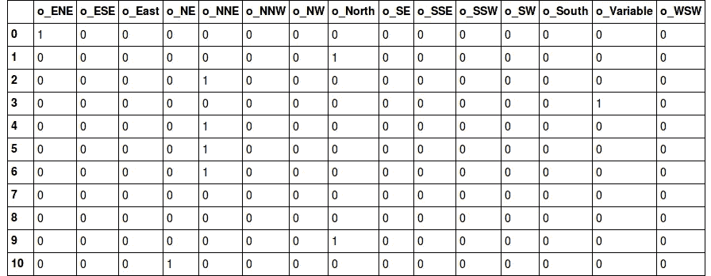
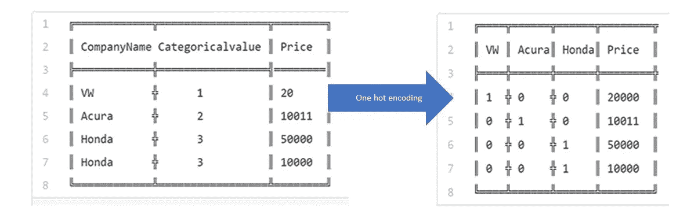

# 什么是热门编码？为什么以及什么时候必须使用它？

> 原文：<https://medium.com/hackernoon/what-is-one-hot-encoding-why-and-when-do-you-have-to-use-it-e3c6186d008f>

[https://i.stack.imgur.com/mfsNd.png](https://i.stack.imgur.com/mfsNd.png)

所以，你在玩 ML 模型的时候，到处都会遇到“一个热门编码”这个术语。你可以看到一个 hot 编码器的 sklearn 文档,上面写着“使用 one-hot 或者 one-of-K 方案对分类整数特征进行编码”不是很清楚，对吧？或者至少对我来说不是。让我们来看看热门编码到底是什么。

一种热编码是将分类变量转换成一种形式的过程，这种形式可以提供给 ML 算法，以便在预测中做得更好。

假设数据集如下:

分类值表示数据集中条目的数值。例如:如果数据集中有另一家公司，它将被赋予类别值 4。随着唯一条目数量的增加，分类值也相应增加。

上表只是一个表象。实际上，分类值从 0 一直到 N-1 个类别。

正如你可能已经知道的，分类值赋值可以使用 [sklearn 的 LabelEncoder](http://scikit-learn.org/stable/modules/generated/sklearn.preprocessing.LabelEncoder.html) 来完成。

现在让我们回到一个热编码:假设我们按照 sklearn 的文档中给出的关于[一个热编码](http://scikit-learn.org/stable/modules/generated/sklearn.preprocessing.OneHotEncoder.html)的说明，并对其进行一些清理，我们得到如下结果:

0 indicates non existent while 1 indicates existent.

在我们继续下一步之前，您能否想出一个原因，为什么仅仅标签编码不足以提供给模型进行训练？为什么需要一个热编码？

标签编码的问题是，它假设分类值越高，类别越好。“等等，什么！?"。

让我解释一下:这种组织形式的前提是基于分类价值观的大众>讴歌>本田。假设你的模型内部计算平均值，那么相应地我们得到，1+3 = 4/2 =2。这意味着:大众和本田的平均水平是讴歌。这绝对是一场灾难。这个模型的预测会有很多误差。

这就是为什么我们使用一个热编码器来执行类别的“二进制化”,并将其作为一个特征来训练模型。

另一个例子:假设你有一个“花”特征，它可以取值“水仙花”、“百合”和“玫瑰”。一个热编码将“花”特征转换成三个特征，“是水仙花”、“是百合”和“是玫瑰”，它们都是二进制。

图像摘要:

One hot encoding explained in an image