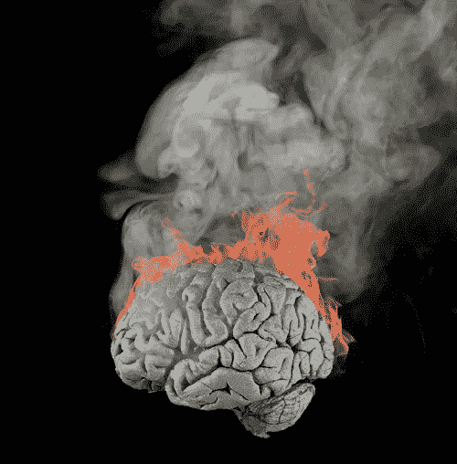

# 什么是程序员倦怠？

> 原文：<https://medium.com/hackernoon/what-is-programmer-burnout-651aa48984ef>

我在 20 世纪 90 年代末经历过这种情况。我完全精疲力竭了。我害怕每天去上班。在工作中，我几乎不能做我的工作。我努力完成交给我的任何任务。

我拖延了。我试图找任何借口不工作。我喝了很长时间的咖啡，吃了很长时间的午餐。我来晚了，下班早了(大约 5:00——大多数程序员都要工作到很晚)。

我害怕失去工作。我担心我再也找不到工作了。

我感到疲倦和沮丧。我再也不想看编程了。

我最终决定提前退休(46 岁)。

接下来的几年，我没有做任何编程。然后我决定逐渐放松自己。我在 T2 为一个认识的精神病医生无偿工作。我接触的技术之一是 Smalltalk…

我爱上了这门语言。这是一次如此干净和新鲜的经历！我意识到这项技术的惊人潜力。

几年后，我决定成为一名闲聊大使。我建立了一个非营利组织[来推广 Smalltalk】。我写了数百篇关于 Smalltalk 的文章和博客。](https://smalltalkrenaissance.wordpress.com/)

这种语言拯救了我。这让我对编程又恢复了信心。现在，我有精力和热情写软件。Smalltalk 是我最喜欢的工具，但我也经常使用 Python 和 Go。

生活是美好的。

是什么导致了倦怠？这是许多事情的汇合:

1.  一次又一次地做着同样的工作，月复一月，年复一年，没有休息(即使是一个月的假期也不够休息)。这可能会变得非常烦人。
2.  不断地在紧张的期限内工作；一切都是匆匆忙忙。项目经理和营销经理不知道如何说“不”，他们总是过度承诺。
3.  连续几个月长时间工作。这包括工作到深夜，甚至周末，所以你没有很多机会放松和娱乐。这会让你的个人生活和工作失去平衡。
4.  不良饮食和缺乏锻炼。你需要照顾好自己。
5.  这份工作不再有刺激性。没有刺激，没有变化。程序员渴望新技术和新挑战。

最终结果是**压力**。巨大的压力。

教训是:如果你感到筋疲力尽，那就休息一段时间(也许几年)。做点别的。

然后，如果你愿意的话，慢慢地回到编程中去。选择一项令人兴奋的新技术来激发你的兴趣。这不一定是闲聊，尽管这将是一个很好的开始。Pharo 只有 9 岁，实际上是一门新的编程语言。)

另一个不错的选择是[茱莉亚](https://julialang.org)。对[球拍](http://racket-lang.org)也印象深刻。有了这些技术，你可以享受许多乐趣。这是关键:你必须把乐趣带回到你的职业生活中。