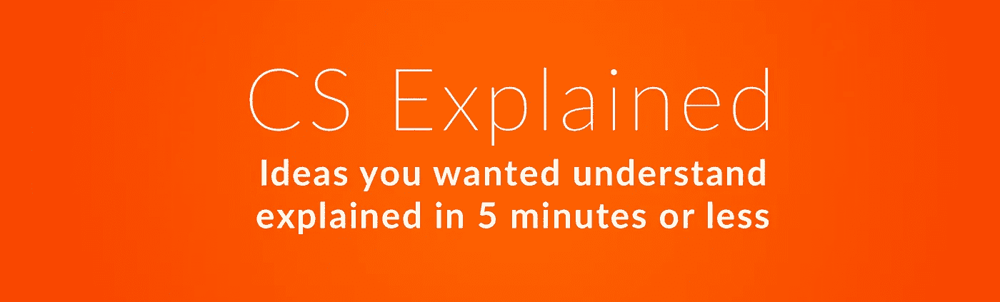

# 什么是递归？

> 原文：<https://medium.com/hackernoon/what-is-recursion-a1c26baa1d36>



递归仅仅意味着“自我引用”。当一个东西引用自己或者描述自己的时候，就叫递归。

例如

> “这个句子是递归的。”

是递归的。

这张图也是递归的:


在编程中，递归函数是调用自身的函数。

假设你和你的朋友点了披萨，现在你想把它切成相等的片。要做到这一点，你把它切成两半，然后你把结果切片切成两半，继续下去，直到有足够的切片给每个人。

在代码中，它看起来像这样:

该函数获取房间中朋友的数量(15)和比萨饼的数量(最初为 1)。它把披萨切成两半:

```
number_of_slices = number_of_slices*2
```

并检查现在是否有足够的切片。如果是——它只返回结果切片的数量，如果不是——它再次调用自己，再次将比萨饼切成两半。

递归函数可能很难想象，但是在计算机科学中有一整类问题通过使用这种算法更容易解决。例如，它可以用于二分搜索法，寻找一个数字的阶乘，或者创建一个类似 reddit 的嵌套注释系统。

接收必读的新闻、资源和提示，帮助你建立和发展自己的创业公司:[**https://startuplab.io/newsletter**](https://startuplab.io/newsletter?src=medium-csexplained)

[](https://startuplab.io/newsletter?src=medium-csexplained)