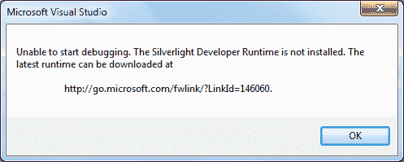

# 什么是 Silverlight？

> 原文：<https://medium.com/hackernoon/what-is-silverlight-24df8b1acbb6>


[credit](http://www.tested.com/tech/web/3143-rumor-silverlight-5-to-be-the-final-version-of-microsofts-plug-in/)

最近，我在为一个项目学习`Silverlight`。以下是我为将来参考而保留的内容:

# 银光 5

用于开发和部署富互联网应用程序的微软平台。现在，这是一种被弃用的技术。作为浏览器插件运行。支持。NET 语言像`C#`和`VB.NET`、`IronPython`和`IronRuby`使用 DLR(动态语言运行时)。

# 安装:

有三种选择:

*   使用 WPI 安装 [silverlight](https://hackernoon.com/tagged/silverlight)
*   安装 Expression blend 用于设计目的
*   安装 XNA Game studio 以使用 3D

我们还需要安装 Silverlight SDK。

# 创建 Silverlight 项目

*   在`C#`->-`Silverlight`下的 [VS](https://www.visualstudio.com/) 新建一个项目


*   确保检查**在新网站中托管 Silverlight 应用**

# 运行项目

如果没有安装`Silverlight`的开发者运行时，将显示以下弹出窗口



运行项目时，如果浏览器中没有安装`Silverlight`，将会显示以下浏览器通知:


> *点击安装链接将带我们到微软网站下载并安装插件*

# Visual studio 设置

从 VS 主菜单的工具->选项

*   对于所有语言:启用常规节点下的`word warp`和`line number`
*   将选项卡节点下的`Tab`和`indent size`设置为 2。还要保持标签

# 装配

有两种类型的 Microsoft Silverlight 程序集:

核心 Silverlight 程序集

*   `mscorlib.dll`
*   `System.Core.dll`
*   `system.dll`
*   `System.Net.dll`
*   `System.Windows.dll`

SDK 程序集，用于附加功能。

# Silverlight 项目的结构

*   App.xaml 文件包含全局设置和全局事件
*   MainPage.xaml 是主 Silverlight 用户界面

`Path in web`设置指定输出`.xap`文件的存放位置。在显示的图像中，它是`ClientBin`文件夹。

初始/启动控制可以通过`App.xaml.cs`设置。

Silverlight 应用程序被编译成一个`.dll`，然后由 Silverlight 运行时使用。

`.csproj`文件包含构建指令。在构建期间，VS 执行包含在`.csproj`文件中的构建指令。其中一条指令调用语言编译器，例如`csc.exe`代表`C#`，`vbc.exe`代表`VB.NET`

虽然这个过程是构建的，但是很多开发者称之为编译。

当解决方案配置设置为`Debug`时，Visual studio 将在项目的`Bin`文件夹中创建一个`Debug`文件夹。一般情况下，会有 **5 个**文件

*   应用程序`AppManifest`文件-包含应用程序信息
*   应用程序`.dll`文件——在执行项目时，Silverlight 运行时将加载的实际代码
*   应用程序`.pdb`文件——项目的可移植调试文件
*   应用程序`.xap`文件——应用程序`AppManifest`和应用程序`.dll`的压缩包。这在应用程序使用 SDK 程序集的情况下很有用。zip 包将帮助客户下载 SDK
*   应用测试`.html`文件-由`Properties`->-`Debug`->-`Start Action`设置为`Dynamically generate a test page`生成的应用测试文件

# 部署

进行部署时，需要按照以下步骤在 IIS 中映射 mime 类型:

*   从“站点”节点选择相关的应用程序
*   双击`Mime Types`，条目如下所示:

`.xap`->-`application/x-silverlight`-对于 Silverlight 1 及以后的`.xap`->-`application/x-silverlight-2`(-2 表示 mime 类型的第二个实现)-对于 Silverlight 2 到 5`.xaml`->' application/xaml+XML '

当应用程序启动时，`Test` [HTML](https://hackernoon.com/tagged/html) 页面(在`Bin`文件夹中生成)要求浏览器加载 Silverlight 插件，该插件在以下标记中指定:

```
<object data="data:application/x-silverlight-2," type="application/x-silverlight-2" width="100%" height="100%">
```

浏览器插件随后会要求提供`.xap`文件。它基本上是一个`.zip`文件夹，包含应用程序和应用程序清单文件中的其他`.dlls`信息。

要在 Silverlight 插件不可用时不允许浏览器加载默认错误页面，请将`object`标签的`autoUpgrade`参数设置为`false`

```
<param name="autoUpgrade" value="false" />
```

url 设置为所需 Silverlight 插件的下载链接。需要使用 javascript `onSilverlightError`。需要注意的`ErrorCode`是`8001`:

```
function onSilverlightError(sender, args) {if (args.ErrorCode == 8001) {
  //code to run when correct Silverlight plugin version isn't available
 }
}
```

文件背后的 Silverlight 代码在`partial`类中(一个保存事件处理，另一个用于 UI 处理)。使用一个`XAML`元素等于实例化一个`.NET`类。根据 xml 名称空间验证`XML`元素。

# 有约束力的

要分配运行时计算的值并分配给一个属性，我们需要使用标记扩展。这些类进行绑定和资源查找。

当我们在 XAML 分配一个属性时，我们传递一个

*   线
*   通过 TypeConverter 传递(转换发生在编译时)

**编译时传递值**

```
<TextBox Text='abc' Background='Orange' />
```

**运行时传递值**

```
<TextBox Text='{local:LatinWords}' Background='{StaticResource warning}' />
```

XAML 的数据绑定类型有:

*   绑定:按数据源绑定
*   模板:从控件模板获取值，并将其赋给属性
*   static resource:resource dictionary 中定义的查找资源
*   Null:将 null 值赋给属性
*   元素到元素的绑定:

```
<!-- Make this element idenfiable by name -->
<TextBox Text='Hello' x:Name='textHello' Background='Goldenrod' />
<!-- Assign value from the above textHello to this element -->
<TextBox Text='Goodbye' Background='{Binding ElementName=textHello, Path=Background}' />
```

*   自绑定:

```
<!-- Read value red from Text property and assign it to Background property -->
<TextBox Text='Red' Background='{Binding Text, RelativeSource={RelativeSource Self }}' />
```

*   静态资源绑定:

```
<!-- Define a static resource -->
<LinearGradientBrush x:Key='seaBrush'>
 <LinearGradientBrush.GradientStops>
  <GradientStop Offset="0" Color="Yellow" />
  <GradientStop Offset="0.5" Color="Orange" />
  <GradientStop Offset="0.8" Color="LightCoral" />
 </LinearGradientBrush.GradientStops>
</LinearGradientBrush><!-- use the seaBrush static resource for the Background property -->
<TextBox Text='StaticResource' Background='{StaticResource seaBrush}' />
```

*   空绑定:

```
<!-- Null MarkupExtension -->
<TextBox Text='Null MarkupExtension' Background='{x:Null}' />
```

*   自定义标记扩展绑定:

```
<!-- The XML namespace abc is defined which refers to abcLib in UserControl -->
<UserControl xmlns:abc='clr-namespace:abcLib;assembly=abcLib' >... rest of the code ...<!-- use our custom markup extension-->
<TextBox Text='{abc:LatinWords WordCount=5}' Background='{x:Null}' />
</UserControl>
```

而自定义标记扩展的实现是:

```
namespace abcLib
{
  public class LatinWords : IMarkupExtension<string>
  {public bool RandomStartPoint { get; set; }
    public int WordCount { get; set; }private Int32 _numberOfWords;
    private static Random ran = new Random();
    private string[] _words;public void SetupWords()
    {
      // for demo limit the number of words to 100
      if (WordCount <= 1)
      {
        _numberOfWords = 1;
      }
      if (_numberOfWords > 100)
      {
        _numberOfWords = 100;
      }
      else
      {
        _numberOfWords = WordCount;
      }_words = _sourceString.Split(' ');}
    public string ProvideValue(IServiceProvider serviceProvider)
    {
      SetupWords();
      int skipCount = 0;
      if (this.RandomStartPoint)
      {
        skipCount = ran.Next(3, 20);
      }
      return string.Join(" ", _words.Skip(skipCount).Take(_numberOfWords).ToArray());
    }private string _sourceString = "Lorem ipsum. ";}
}
```

# 从属财产制度

Silverlight 使用了一个由 WPF 团队发明的独特的属性系统。这为 UI 提供了服务，如动画、模板、样式，并减少了关键资源的使用(如内存)。它有两个部分:

*   依赖属性
*   附加属性

当创建自己的用户控件时，依赖属性(如按钮元素上的:FontSize)和。净财产**这两个**都是在他们身上暴露财产的正确方式。

*   首先，创建一个依赖属性来处理 Silverlight 服务，比如数据绑定
*   其次，创建一个. NET 属性来设置和读取代码中的属性值

**值解析优先级**

1.  活动动画
2.  本地值
3.  模板化属性
4.  风格引领者
5.  属性值继承
6.  默认

案例:

*   如果一个属性的`local value`被设置为 **20** 并且相关的控件正在将属性值从 **40 变为 80**
*   当我们查询属性的值时，根据上面的优先级列表，将返回由当前动画步骤设置的值

**使用代码设置依赖属性:**

*   在`XAML`文件中

```
<Button x:Name='sampleButton' Content='Set the Properties in Code' Click='sampleButton_Click' />
```

*   代码隐藏

```
private void sampleButton_Click(object sender, RoutedEventArgs e)
  {
   sampleButton.FontSize = 40;  // using a .NET wrapper to set valuedouble size = sampleButton.FontSize; // use the .NET wrapper to read value// use the DP system directlysampleButton.SetValue(FontSizeProperty, 30);
   size = (double)sampleButton.GetValue(FontSizeProperty);}
```

Silverlight 元素和控件(默认或自定义)有许多依赖属性。该系统为 Silverlight 元素提供动画、数据绑定、控件模板和样式等服务。为了获得这些服务，开发者需要编写“丑陋的”注册码。

声明和注册依赖属性的一个示例是:

```
public partial class StarShape : UserControl {public StarShape()
 {
  InitializeComponent();
 }//declaring
 public static readonly DependencyProperty PointsProperty;//registering
  static StarShape()
  {// 2\. Register with the DP system
   PointsProperty = DependencyProperty.Register("Points", typeof(double), typeof(StarShape), null);}
 }
```

请注意，该属性被声明为 readonly，这意味着它只能在其静态构造函数中进行实例化。

# 附加的依赖属性

它们是一种特殊的依赖属性，用于提供解耦的可扩展模型。我们可以认为它是一个“全局属性”,这意味着它对 Silverlight 运行时中的所有控件都可用。

它由一个类型拥有和注册。同样的方法是`DependencyProperty.RegisterAttached`。它使用点语法`TypeName.AttachedProperty`。这些属性主要用于布局面板 Canvas，Grid，DockPanel。

**要点:**

*   附加的属性值存储在 DPS 中
*   值由赋值元素赋值
*   所属类将从 DPs 中查询该值

[照片](https://goo.gl/photos/fWU5PoCK333JNVpA8)

*最初发表于*[*xameeramir . github . io*](http://xameeramir.github.io/what-is-silverlight/)*。*