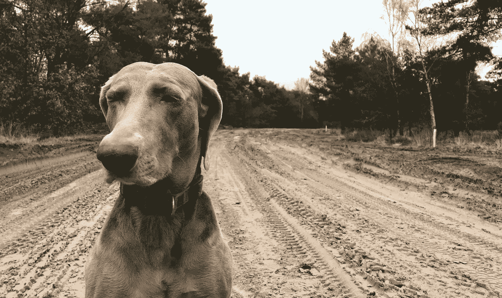

# 在我们新的数字世界中，什么是“智能”？

> 原文：<https://medium.com/hackernoon/what-is-smart-in-our-new-digital-world-87e6426398>

## 我们的生活、工作和学习方式将在 2018 年发生怎样的变化

> 我们对新的数字世界还不够“聪明”。

至少，这是我上周开了几次会后得出的结论。而且，我遇到的和我讨论过这个问题的其他几个人也证实了这个观点。

但是这种说法需要一点解释。

# **一个“更智能的世界”**

> “智能”是数字时代的流行语之一。

我们大多数人都有“智能”手机或其他“智能”设备，而且——在不到一代人的时间里——这些设备已经成为我们生活和工作的绝对核心。最近，关于“智能”城市、“智能”合同、“智能”电网等的讨论越来越多。

在这种情况下，“智能”是指互联的、数据驱动的、基于传感器的技术，并且越来越自主(更多地利用人工智能)。

每个人似乎都理解并同意，我们正在创造的新世界在这个意义上会更“聪明”。

然而，我们中的许多人并没有真正意识到这个新的“更聪明”的世界的特征和后果(好的和坏的)。有很多“聪明话”，但这个新世界的现实被许多人忽视了。

就其本身而言，这可能不是一个问题，但我担心的是，政策制定者、高管和教育工作者没有足够快地适应数字时代的新现实。

我们的“领导者”没有改变他们的思维模式或行为，仍然遵从“标准程序”社会。

这可能会导致严重的问题。为什么？

嗯，这就导致了两个“平行世界”的产生。

# 平行世界

“旧世界”的特征是等级结构、标准化程序和对短期利益的关注。企业、政府和其他组织按照这种类型的“文化”运作。

例如，组织通常是“目标管理”，这是管理顾问彼得·德鲁克发明的概念。他们使用所谓的 S.M.A.R.T .的缩写(*，这是讽刺的*)来设定他们未来的战略和目标。

SMART 目标的特点是具体、可衡量、可实现、现实/相关和有时限。此外，日本自上而下的“Hoshin Kanri”流程来沟通、实施和执行这些 SMART 目标在我们的数字时代仍然很受欢迎。

但这种“自上而下”的方法在“更智能”的数字世界中并不奏效。首先，这些方法假设高级管理层能够跟上快速变化的技术发展。但是，我们都知道他们通常很难做到这一点。

我们通常看到的是，这些管理方法导致下一代的脱离。我们已经从政治选举中的低投票率以及“旧世界”企业在吸引和留住最佳人才方面面临的困难中观察到了这一点。

> “下一代”需要一个目标和愿景。

他们被一种更奉承的“最佳创意赢得文化”所吸引。实验和“跳出框框”的思维在新世界盛行。

他们认为“每个人现在都是企业家”，因为他们从事“自己的事业”。个人身份是个人在一生的工作过程中主动和独立构建的，而不是被动地从与雇主或职业的关系中获得的。

问题是，政府、企业和其他组织似乎很难摆脱旧世界的等级结构和思维。改变来之不易。他们努力适应新的数字文化的需求。

结果是“旧”和“新”世界之间的“脱节”。

这在“旧世界”关于“新世界”的讨论中变得非常清楚。“新世界”的趋势和发展，如社交媒体和发布平台，只是没有得到重视。他们不符合“旧世界”的期望和经验，通常会被解雇。

尽管我是从代际冲突的角度来介绍这一点，但它远不止于此。这确实是两种文化或两个世界之间的冲突。旧的模拟世界对新的(不确定的)数字世界。

# 解决脱节问题

以上可能听起来过于悲观。但是，我相信有理由保持谨慎乐观。

预测总是很难，但 2018 年预计会有以下变化。所有这些都指向一个未来，在这个未来中，两个世界之间的脱节将被克服。

## 智能工作

智能技术将继续对组织产生重大影响，迫使“领导者”改变思维模式和行为。

越来越多的人认为，为了变得敏捷、精益和创新，组织需要变得“更扁平”，以目标为导向，以网络为基础。

智能技术将导致更多平台的出现，并赋予消费者更多“权力”。2018 年的消费者——我们今天已经看到了这一趋势——要求不断创新，甚至在功能上进行颠覆，从而导致更快的创新周期。

智能技术(人工智能、区块链、数据分析等。)将开始成为组织的“集成特征”。

## 智能生活

物联网将越来越成为现实。

例如，2018 年预计将是自动驾驶汽车具有里程碑意义的一年，因为监管机构越来越多地开始允许在高速公路上无人驾驶。

 [## 从明年开始，无人驾驶汽车将被允许在加州道路上行驶

### 加州机动车辆部门将允许没有方向盘、脚踏板、镜子的自动驾驶汽车…

www.theverge.com](https://www.theverge.com/2017/10/11/16458850/self-driving-car-california-dmv-regulations)  [## 无人驾驶汽车可能会比你想象的更快到达英国——这是最新消息

### 无人驾驶汽车可以让我们在前往目的地的途中阅读、看电影和放松。在这里，我们采取了…

www.thesun.co.uk](https://www.thesun.co.uk/motors/3096829/self-driving-vehicles-driverless-cars-uk-safe/) 

当传感器和数据分析即将成为我们生活中不可或缺的一部分时，机器将变得更加智能。更重要的是，这些机器将开始在我们的决策中占据主导地位。

此外，监管模式将实现自动化。律师事务所已经在试验加密货币领域之外的区块链和智能合约(一套计算机编码的规则，计算机将在需要时执行)。

## 智能学习

在线课程会越来越多。重点将放在智能技术的知识和理解上。

但是还有更多。对下一代的期望是明确的。数字一代属于一种没有前互联网时代记忆文化。他们已经沉浸在智能技术文化和所有相对“轻松”的可能性中。

创造性思维、团队合作和多学科学习将成为教育的重要组成部分。

# 关键外卖

有很多关于“智能技术”的讨论。每个人似乎都同意这些技术将决定我们的未来。

然而，当前的技术革命并没有对我们组织自己和管理组织的方式产生太大的影响。传统、保守和“自上而下”的管理流程仍然盛行。

许多人似乎没有意识到世界上正在发生一些不寻常的事情。这是危险的，会导致新旧世界的脱节。

 [## 世界上正在发生一些不寻常的事情

### 我们大多数人还没有完全意识到正在发生一些不寻常的事情。

medium.com](/the-global-future-of-work/there-is-something-extraordinary-happening-10492495c715) 

然而，预计这种脱节将在 2018 年减弱。

这是好消息。只有我们改变生活、工作和学习的方式，我们才能对当前技术(数字)革命带来的机遇和挑战做出“更明智”的决策。

*感谢您的阅读！请按住*👏*下面，还是留下评论吧。*

*每周都有新的故事。因此，如果你关注我，你不会错过我关于数字时代如何改变我们生活和工作方式的最新见解。*