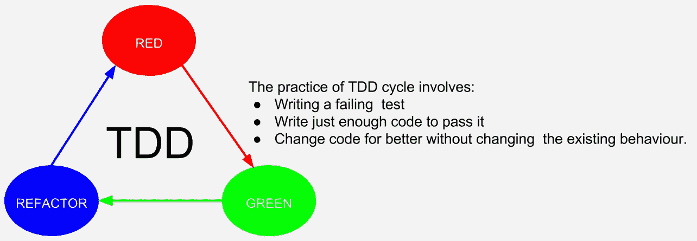

# TDD 到底怎么了？

> 原文：<https://medium.com/hackernoon/what-is-so-wrong-with-tdd-aa60112aadd0>

这个问题最近贴在 [Quora](https://www.quora.com/What-is-so-wrong-with-TDD/answer/Karthik-Sirasanagandla?srid=iaOA) 上。我先看了别人的回答，很想分享一下我的想法。这篇文章是那个答案的翻版:

我讨厌 TDD(又名测试驱动开发)，认为它有很多问题。下面是我想不起来的一些。

copyright: codonomics

**在一个长期实践 TDD 的团队:**

1.  下班后花时间在办公室，解决不时出现的问题，现在已经一去不复返了。
2.  孤独的单身汉在办公室不眠不休地工作，与以家庭为重的同事竞争的机会已经没有了。
3.  智能编码而不是可读/可维护代码的机会大大减少了。
4.  看起来努力工作的好机会已经没有了。我现在必须努力工作，通过 TDD、CI 和其他迫使我遵守纪律的东西，让自己看起来更聪明。我讨厌死了。
5.  团队对我理解代码及其功能的依赖大大减少了，因为测试就像说明或文档一样。
6.  从我的客户那里为代码重构或特性变更请求积累大量资金的机会成本被极大地降低了。
7.  手动测试在时间和金钱方面的成本大大降低。这种做法扼杀了很多 QA 工作。
8.  开发人员将 bug 归咎于 QA 的简单机会已经成为过去。
9.  进化设计和架构成为可能，让我每天都编码。早些时候，我曾吹嘘自己是不编码的架构师。
10.  产品上线焦虑无处可寻。以前每次发布都是一件大事。
11.  等等，等等…

**没有 TDD 的球队有以下优势:**

1.  TDD 是为普通人准备的。我的团队没有他的位置。
2.  TDD 是如此的不直观和怪异。
3.  TDD 是为那些不擅长前期代码设计的初级开发人员准备的。
4.  我的团队有经验丰富的开发人员和领域专家，他们从一开始就为这个产品编码。他们是可靠的黑客。他们不需要 TDD。
5.  TDD 伤害了我们的生产力。
6.  TDD 是为那些面向过程的大型企业准备的。我们没有时间了。
7.  TDD 是为那些混乱的、没有适当流程的初创企业准备的。
8.  TDD 就像买了所有的彩票去赢彩金。
9.  TDD 不是科学。我们不相信不科学的东西。
10.  TDD 不是魔术。糟糕的测试代码比糟糕的常规代码更糟糕。
11.  TDD 这么破。我没有见过两个 TDD 专家用相同的方式和相同的工具集解决问题。
12.  等等等等..

让我们一起努力，停止 TDD 的实践，把混乱和不确定的旧世界带回来。

Devil: “Let us work together to stop the practice of TDD and bring the old world of chaos and uncertainty. Game?”

***注:*** *这个回答是对一个开发商内心魔鬼的恶搞。读到这里，你应该会大笑，而不是欣然接受。你肯定会很好地思考这些问题，而不是马上放弃。* ***愿“愿天下太平”成为我们的驱动因素。*** *干杯！*

希望你能通过点击拍手和在推特上传播来表达你对我这个书面作品的喜爱。你也可以在 [Quora](https://www.quora.com/What-is-so-wrong-with-TDD/answer/Karthik-Sirasanagandla?srid=iaOA) 投票支持我的这个回答。提前感谢您的鼓励:)