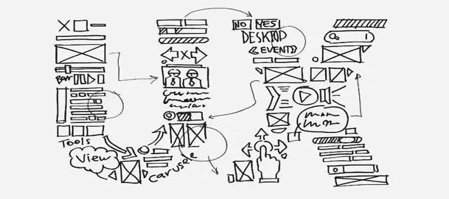
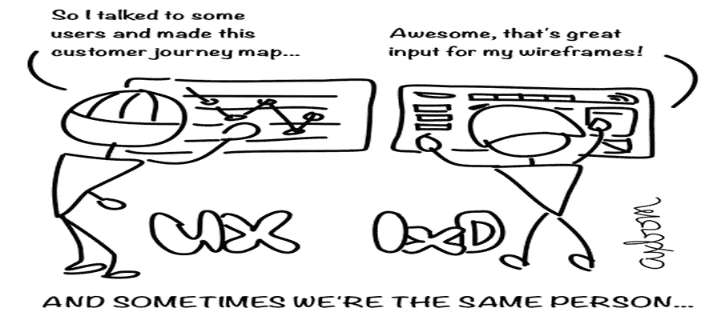

# 用户体验和交互设计有什么区别？

> 原文：<https://medium.com/hackernoon/what-is-the-difference-between-user-experience-and-interaction-design-5223646903>

在设计行业的广阔世界中，有些人做体验设计，有些人做交互设计，有些人甚至两者都做，因此产生了一个最终结果，即定义那些不同的技术概念和行业术语的区别变得更加混乱和困难。然而，彻底理解用户体验之间的差异对于创造优秀的产品来说确实很重要，或者它会让你更 T2，至少让你更有资格和专业。因此，在这篇文章中，我想描述一下用户体验和交互设计的区别。

# 用户体验

用户体验包括用户在使用产品过程中的全部感受和情绪，这需要考虑比传统可用性更广泛的范围。通常，用户体验可以通过几个要素来实现:

1.可用性是必要的，但显然不是唯一重要的东西

2.吸引用户的良好兴趣点和服务吸引力

3.帮助用户轻松愉快地理解和使用产品的简明说明和规格

4.用户在使用产品的过程中获得的真正价值和体验

5.用户在日常生活中和与他人交流时体验到的满意度和良好的互动

然而在现实生活中，一个产品的使用不一定总能让用户满意。一般来说，它有时可以是不被帮助的、不被满足的、不可接近的甚至是失败的。想象一下，你在一个公园里，进出的道路非常复杂，这让你迷失了方向，或者让你别无选择，只能原路返回到另一个地点，或者只是离开那里。如果我们把公园当成一个“产品”，我相信你使用它的经历一定是一场噩梦，你再也不会去那个公园了。

所以用户体验和交互设计就有了区别。这里的用户体验设计师必须处理的问题是，虽然道路可以到达公园的每个地方，并且也设法让人们进出公园，这是由[交互设计师](https://goo.gl/FH5qoo)完成的，但为什么人们仍然感到疲惫和枯竭，甚至不愿意再去那个公园。

# 交互设计

交互设计更多地与用户使用产品或与产品交互的方式以及如何设计用户与产品之间的交互过程的方法有关。交互设计师是应该关心这应该如何发生的人。

设计过程中最重要的一个因素是掌握一个高效的原型制作工具，如 [Mockplus](https://goo.gl/LjPr7R) 或 [Axure](https://www.axure.com/) 。此外，交互设计师必须满足大量的[要求](https://goo.gl/9bfHxg)来创作和完成他或她的交互设计，包括客户研究、大量实践、实地研究、反馈接收等。在特定的条件下，交互设计师也是体验设计师，尽管角色实际上是分离的，强调不同的职责。

这里我想继续用公园的比喻，交互设计师负责设计这个公园的蓝图。正是交互设计师建造了连接整个公园的道路。他或她必须充分意识到，哪条路径可以将人们引向大门，哪条路径可以让人们在钓鱼池中度过美好时光后回到游乐场。如果道路是一张蜘蛛网，那么交互设计师就是制作这张网的蜘蛛，他确保每一个连接点都完美连接。此外，交互设计者必须有足够的资格，并控制所有的交互。

所以，一旦像这样的公园建成，人们会感谢交互设计师让公园对他们无障碍的工作，但是交互设计师可能会向用户体验设计师寻求建议，为什么人们不能在公园里享受美好的时光。因此，用户体验和交互设计不同于用户设计通常在交互设计发生之前的事实，因为用户体验设计师必须提供用户洞察、用户需求、用户旅程地图等，或者它们只是同时发生。

# 一个问题:用户体验和交互设计有什么关系？

经常听到这个问题:如果我不是交互设计师也能做用户体验专员？其实用户体验和交互设计就像笔和纸，缺了任何一个都会限制你[设计](https://www.mockplus.com/blog/post/ux-design-skills/?r=cherry)的能力。如果你打算做一些伟大的设计，那就握紧你的笔和纸。用户体验&交互设计本质上是不同的，但是，没有规则限制你既做体验设计又做交互设计。

如果你对我的文章感兴趣，请点击下面的链接，希望对你有所帮助:

[***UI UX 设计师的五大要求***](https://goo.gl/wWtSku)

[***六大惊艳 UI UX 设计教程***](https://goo.gl/PTGR7R)

我非常欣赏你的阅读。