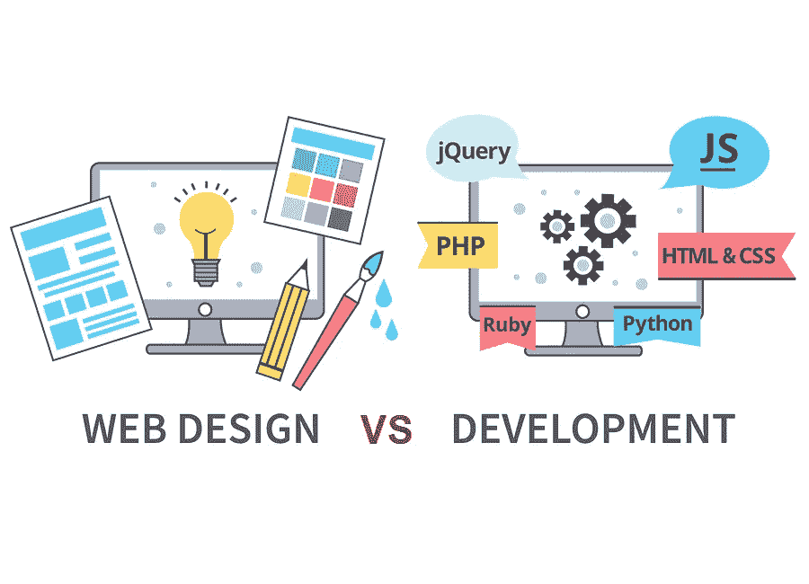

# 网页设计和网页开发有什么区别？

> 原文：<https://medium.com/hackernoon/what-is-the-difference-between-web-design-and-web-development-cc23171de85c>

What is the difference between web design and web development?

我记得在我学习 *web 开发*的早期阶段，我发现自己多次对设计和开发之间的区别感到困惑。网页设计师的角色是什么？网页设计涉及到什么？网页设计和网页开发是一样的吗？它们是具有相同含义的可互换术语吗？

简单的答案是否定的。两者的角色完全不同。但是让我们来看看网页设计师和网页开发者的不同角色和方法。

# 网页设计

把网页设计师想象成那些把一个想法或一个故事转化成视觉上吸引人的设计，并使用他们的布局来构建整个网站的用户体验的人。他们*设计*网站的外观和感觉。就像建筑师在开始建造房子之前会为你的房子设计一份平面图一样，网页设计师会在网页开发者开始*开发*网站之前为你的网站设计一个模型。

网页设计师是一个困难的角色，经常被低估。在他们的设计中，他们需要整合最好的用户体验，为用户创造一个友好的环境。他们必须把一个想法从写作变成一个可以吸引用户注意力的有用的设计和界面。如果在项目的早期阶段没有应用适当的设计策略，一个网站就不能被描述为伟大。如今，网页设计师和网页开发人员处于同一水平，因为没有好的用户体验和设计，开发就不能被用户真正欣赏。

网页设计师已经为自己建立了一个完整的战略技术库。你不仅仅是在阅读或思考了规范或所需的功能后，立即创建一个完美的网站。你从一个范围开始——网站将提供的焦点和目的。你首先会在脑海中粗略地设想一下设计，然后从设计草图开始。从草图，网页设计师移动到线框，模型，并最终设计。专业网页设计师用设计组件构建整个网站，所有网页、图标、排版和其他复杂功能的布局都非常完美。

以下是网页设计师的一些主要角色:

*   使用软件工具，如 Figma、Photoshop 或 Sketch 来构建网站的最终布局设计
*   具有良好的平面设计和标志设计技能
*   对用户体验有一个好的感觉，以识别可能获得期望功能的最简单的方法。这包括布局，按钮，图像和网站的一般格式。
*   网页设计师需要让自己跟上最新的设计趋势。保持设计的一致性也很重要，这一点在其他网络巨头公司中很流行，比如谷歌和脸书。这使得网站环境和界面更容易导航和使用，因为它已经为用户所熟悉。
*   网页设计师还必须牢记网站的品牌，使用的调色板，以及网站的排版和可读性。

# Web 开发

把网页开发者想象成那些把设计变成一个活的网站的人。Web 开发人员使用 web 语言和软件工具来开发网站的设计和功能。请注意，web 开发人员被进一步分为两个子类别；前端开发者，和后端开发者。我认为前端开发人员是网页设计师和后端开发人员之间的纽带，因为对两者都有一点了解，就可以让前端开发人员建立一个完整的工作网站。前端开发者是构建界面的人，提供布局作为网站后端与用户的交互。

前端开发人员使用三种主要语言；超文本标记语言(HTML)、级联样式表(CSS)和 JavaScript (JS)。有了这些语言，开发者就能够创建一个成熟的网站。从主设计布局，到插入图像，应用不同类型的排版和字体系列，实现动画，不同页面的流程，表单界面等等。

后端开发人员是控制服务器数据和请求的人。通常一个网站如果包含动态数据就需要后端服务。这意味着，例如，用户提交一个包含个人数据的表单(比如创建一个帐户)，或者为您的博客页面保存一篇文章。一般来说，如果网站需要保存数据，并在以后阶段使其可访问，这意味着它也需要一个数据库连接。服务器本身的直接连接使数据库连接成为可能。因此，后端开发人员使用 PHP 或 ASP.NET 等服务器语言，并使用 SQL 或 MySQL 等语言编写数据库查询。

以下是 web 开发人员的一些主要角色:

*   构建用户与网站交互的实际界面。这个接口是前端开发人员使用 HTML、CSS、JS 语言构建的。
*   前端开发人员可以使用样式预处理器、javascript 库和框架来加快开发过程(参见[我之前的文章](https://hackernoon.com/frameworks-libraries-both-or-none-my-honest-opinion-3a21ddf75323))。
*   前端开发人员向后端开发人员提供标记设计，因此他们可以实现一个动态网站，并在服务器和数据库上提交所有需要的数据。
*   后端开发人员使用 PHP 和 MySQL 等语言创建网站的主干。
*   前端和后端开发人员可以使用相同的开发环境或 ide(集成开发环境)。这些是软件应用工具，你可以在其中编码和构建网站的结构。
*   Web 开发人员也可以使用版本管理工具来保存以前版本的历史记录。如果需要的话，这将帮助他们快速、轻松地回到先前的“完整”版本。

# 结束语

Design vs Development

## **全栈开发者是做什么的？**

全栈开发人员是那些非常了解上面讨论的所有开发领域的人。这意味着，如果你是一个全栈开发人员，你应该能够从头开始构建一个网站，从查看设计，创建设计的标记，到处理后端流程和数据库查询。通常，全栈开发人员也应该具备设计和用户体验的基础知识。成为一名全栈开发人员并不意味着你必须成为所有语言的专家。只掌握其中一种语言已经很难成为专家或专业人士了。在我们上面讨论的所有领域，学习如何最有效的所有最好的技术和策略也是很难的。记住，网络技术每天都在发展。

对网络相关的一切有一个基本的了解总是有利的，但是我建议你**坚持做你最喜欢的，并且专注于成为这方面的专家。**一旦您对开发前端或后端感到满意，您就可以将更多时间投入到那些需要更多关注的领域。

我希望你现在对网页开发者和网页设计师的角色之间的区别有了更清晰的理解。请记住，*和*都有重要的角色，没有其中一个，网络就不会存在。我可以告诉你，从我的经验来看，没有比这更容易的了。作为全职前端开发人员，并定期与设计师和后端开发人员互动，我发现我们刚刚讨论的所有角色都有这样或那样的怪癖。请记住，一开始专注于一门语言是让自己起步的最佳方式。一旦你有了动力，迈出了第一步，剩下的就没那么难了。

感谢您的阅读！

这些只是我的一些想法，在我的电子书《掌握 Web 开发》中会有更详细的讨论

直到下一次，

[欧文远](http://owenfar.com/#about)

如果你想继续学习 web 开发的 ***至关重要的秘密*** *，请关注我或加入我的简讯。*

# 离欧文更远:

 [## 我们如何建立一个合适的开发工作流程？

### 当我建立我的第一个网站时，我记得我的开发项目中只有几个文件和几个文件夹…

hackernoon.com](https://hackernoon.com/how-do-we-setup-a-proper-development-workflow-f708031370d9)  [## 别读了。开始编码。分享你的知识。

### 感觉我从来没有勇气开始。我一直在想我还没准备好，我必须…

hackernoon.com](https://hackernoon.com/stop-reading-start-coding-share-your-knowledge-50eab1e28ee1) 

> [黑客中午](http://bit.ly/Hackernoon)是黑客如何开始他们的下午。我们是 [@AMI](http://bit.ly/atAMIatAMI) 家庭的一员。我们现在[接受投稿](http://bit.ly/hackernoonsubmission)并乐意[讨论广告&赞助](mailto:partners@amipublications.com)机会。
> 
> 如果你喜欢这个故事，我们推荐你阅读我们的[最新科技故事](http://bit.ly/hackernoonlatestt)和[趋势科技故事](https://hackernoon.com/trending)。直到下一次，不要把世界的现实想当然！

