# 为普拉西斯工作意味着什么

> 原文：<https://medium.com/hackernoon/what-it-means-to-work-for-plxis-8f2916175877>

## 优美灵活的环境

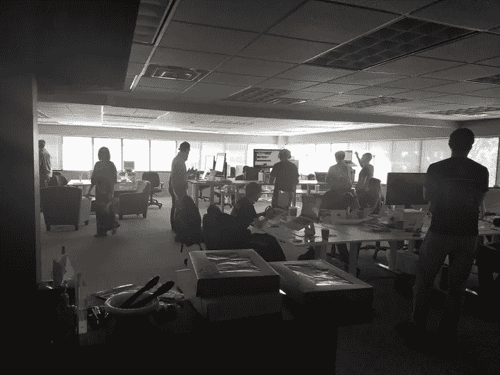

The team located at the Cincinnati office.

我们的办公室是工作的好地方。人们总是愿意分享和帮助。我们建立在合作的基础上。

## 团队是一家人

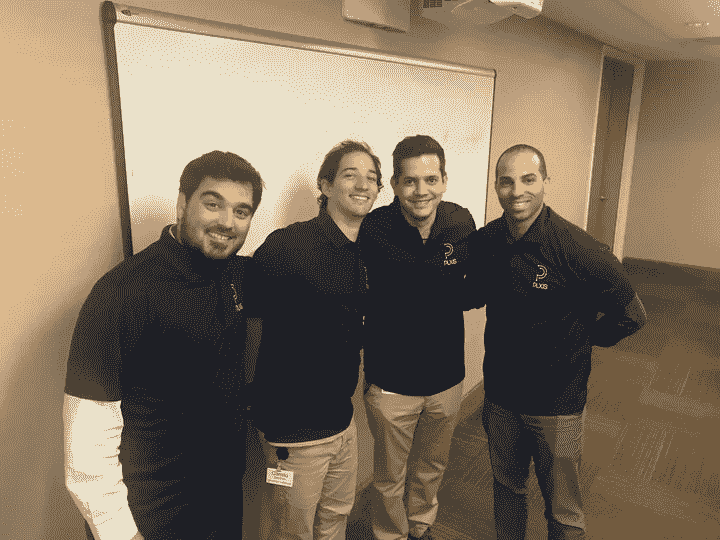

Some of us have known each other for 15–20 years!

我们在迈阿密的一些人已经认识很久了。每个人都喜欢和这些人一起工作。信任让我们可以畅所欲言，表达自己，分享想法，而不用担心被拒绝。

## 分布式团队

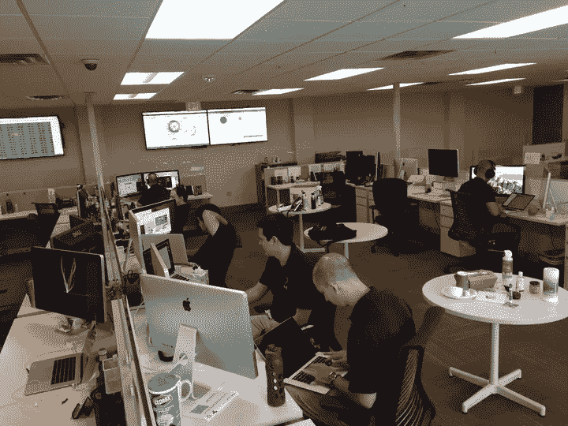

Our Miami office rocks.

我们在迈阿密和辛辛那提设有办公室，在华盛顿州、科罗拉多州、密歇根州、杰克逊维尔，甚至目前在巴西和荷兰都有远程员工。但是协作是一件不停的事情。

Collaboration means communication.

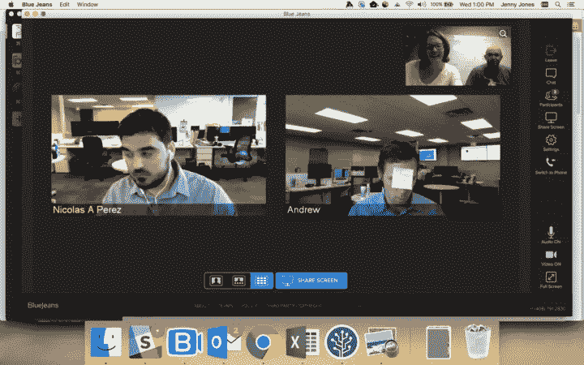

Yeah, sometimes we have to **post it.**

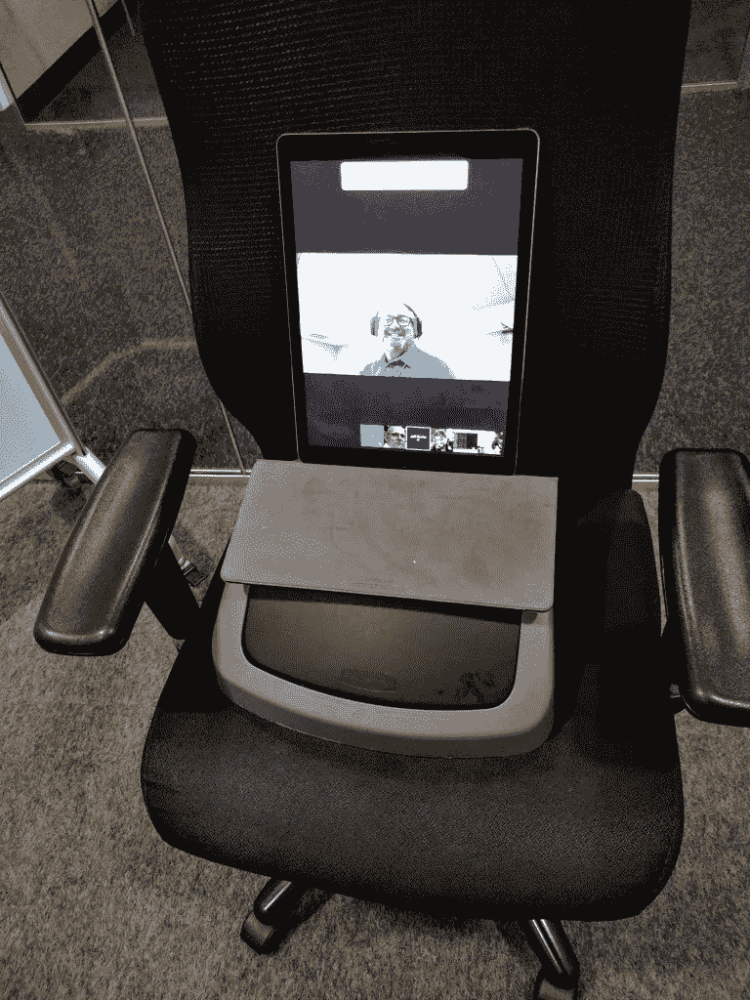

If you are late to the meeting, you better join in.

We all are capable of working from home, no matter where we’re located in the world.

Hats are standard here.

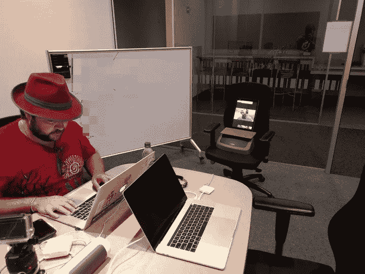

Again, hats are a must.

我们队经常聚在一起。有时我们去辛辛那提旅游，或者只是带人们去阳光之州，但每次我们都玩得很开心。

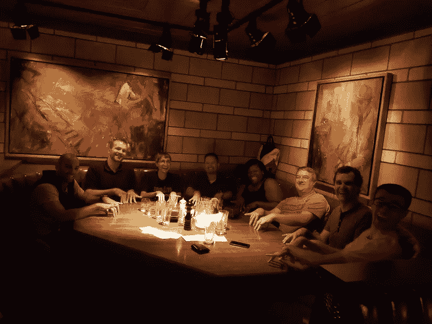

## 我们喜欢好咖啡

如果你喜欢咖啡，这是一个合适的地方。

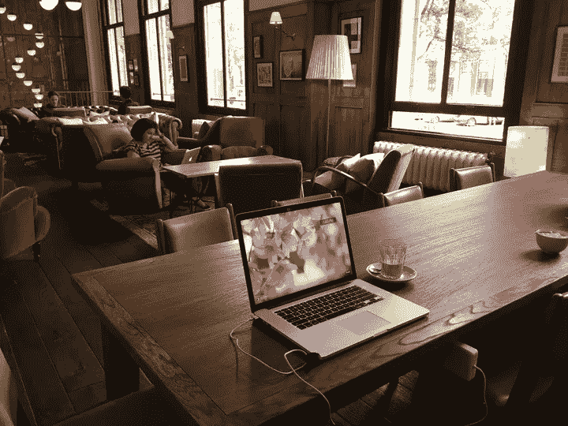

Coffee in Amsterdam.

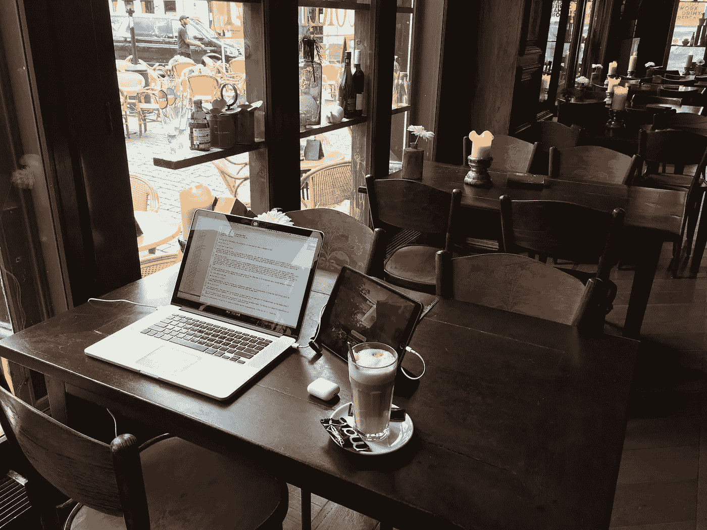

Coffee in Breda.

## 会议和培训

当然，我们也参加会议。

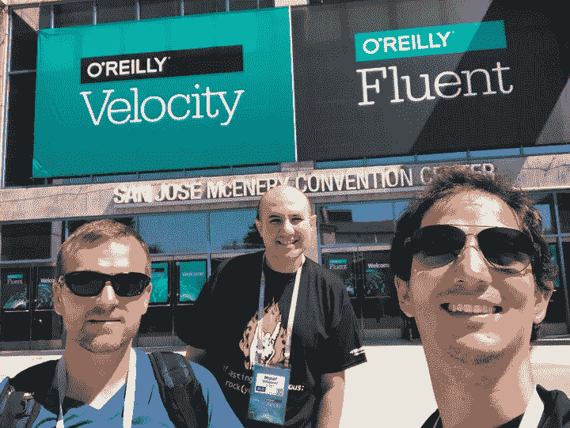

The latest Velocity.

## 工程

*我们的系统采用了多种技术*。我们大量使用 Java 虚拟机(JVM)。我们编写 Groovy、Scala、Python、Elixir，我们有物理和虚拟数据中心。

*我们以实践测试驱动开发(TDD)* 为核心价值观，不断提升自己，不断写出高质量的产品。

*我们建造我们需要的东西*。我们有相当多的定制工具，从我们通用的构建服务器到我们独特的用于编写集成测试的 DSL。

*我们自动化一切*，没有部署需要手动步骤，每个人晚上都睡得很好。

*我们实践敏捷*，但是我们足够灵活，所以我们继续向行业学习。

## **我们希望在宇宙中留下印记**

我们想在宇宙中留下印记。我们想改变我们生活的世界。我们正在建立一个创造高质量工作、有弹性、创新和鼓舞人心的团队。我们一直在寻找优秀的工程师，他们愿意学习和教学，在与我们合作的同时分享和接受。如果你想探索加盟，请在[careers@plxis.com](mailto:careers@plxis.com)给我们留言，以便我们聊天。

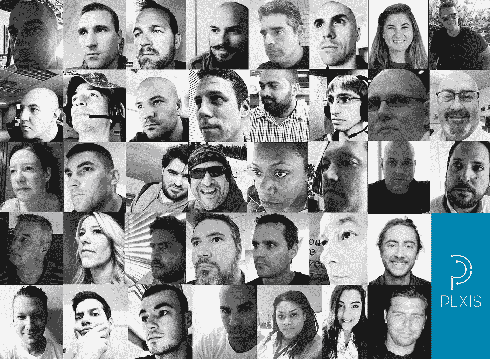

We are [PLXIS](https://www.plxis.com/)!