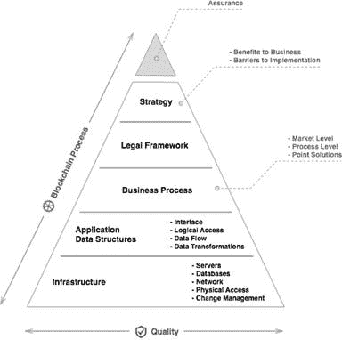

# 打造区块链 MVP 需要什么

> 原文：<https://medium.com/hackernoon/what-it-takes-to-build-a-blockchain-mvp-e8af56f6cb8f>

## 作者:基里尔·蒂莫费耶夫，**软件项目经理，数据艺术**

在我们的咨询公司，我们看到越来越多的大客户正在考虑使用分布式账本技术来改变并最终用增强的替代方案来替代现有的业务流程，这清楚地表明，分布式账本技术的市场随着时间的推移呈指数增长。尽管如此，我应该说区块链不是一场革命，也不是一项颠覆性的技术，它是基础性的，意味着有更长的采用周期和更广泛的影响。

虽然我分享了对区块链潜力的热情，但我担心炒作。我们在区块链的经验告诉我们，如果要有一场区块链运动，许多障碍，如技术、治理和组织，都必须消除。我提出了区块链需求层次，这是一个通用的概念，说明了一个最小可行的生态系统，以建立一个成功的区块链项目。基本上有五层:

**基础设施—** 服务器、数据库、网络、物理访问、灾难恢复等。是在不同组织的多个网络上运行分布式应用程序的所有要求。通常，它需要但不限于运行和支持集装箱化的应用程序，遵循最佳实践以使环境可处理，在公司和网络之间建立隧道和安全策略。例如，即使是相对基本的 Hyperledger Fabric 区块链解决方案，也需要两个对等节点、一个订购方节点、一个认证机构和一个数据层来运行它。手动管理基础架构不再可行，自动化是区块链转型的众多关键因素之一。

**应用和数据结构-** 接口、逻辑访问、数据流、数据转换。区块链有不同的口味，也没有灵丹妙药，每一款区块链都有自己的优势:

胖区块链是可以在网络上部署和运行程序或智能合约(处理业务流程的某种逻辑)并得到其所有成员同意的技术。相比之下，瘦区块链的预定义操作数量有限，并且只能将资产从一个帐户转移到另一个帐户。

公共区块链是开放给每个人加入、挖掘、交易和审计的网络。通常，它们需要复杂的一致性算法来使系统可扩展和可靠。另一方面，二等兵区块链组建了一个联盟，要求参与者事先获得批准并上船。

例如，最近兴起的首次硬币发行(ICO)活动在很大程度上使用 Ethereum 网络来部署和分发智能合同。利用一个受欢迎的公共区块链来促进市场效应是很容易的。另一方面，如果您想解决几家公司之间的一个非常具体的问题，您可以考虑使用私人区块链将网络访问权限限制在获得批准的成员之间。

**业务流程**

银行和其他金融机构不会在一夜之间改变。无论听起来多么有希望，都不可能用一种新的闪亮技术取代任何现有的解决方案。存在市场阻力。通常，这种转变涉及三个层面，它总是从一些痛点开始，并对其进行局部改进:

a)点解决方案

b)流程层面

c)全市场解决方案

**法律框架**——在特定的法律条件下运行区块链应用程序需要什么。

例如,[一般数据保护条例(GDPR)](http://www.bobsguide.com/guide/news/2017/Oct/9/what-is-gdpr-the-implications-you-need-to-know/) 旨在为声称“通过设计和默认进行数据保护”的消费者创建安全应用程序。这意味着构建和构建应用程序时，要把隐私视为头等大事。我相信在区块链世界，这是一个零和游戏，分布式分类账技术(DLT)提供了比传统方法更安全的原则。

**战略**——业务优势，实施障碍

让我们举一个跨境支付的例子。麦肯锡估计，B2B 支付为银行带来最大的跨境收入，2015 年，这类交易占跨境支付总额超过 150 万亿美元的 75%。

跨境支付效率低下，因为没有一个单一的无处不在的全球支付系统。要改善跨境流程，必须克服五个挑战:

**a)基础设施**:国内基础设施不是为了处理跨境支付而设计的，大多数支付系统都是基于当地法律以及现有国内银行和金融结构内的惯例。

**b)标准**:缺乏通用的全球标准以及系统之间的差异降低了银行和企业资金/企业系统之间无缝传递数据的能力。

**c)法规**:政府法规正在改变付款方式。付款需遵守国内法规，这加大了跨境付款的难度，因为始发国和接收国之间的规则往往各不相同。

**d)速度**:根据麦肯锡对跨境支付的研究，完成一笔跨境交易的平均时间是三到五个工作日。

**e)不透明**:汇款人和收款人通常很难在资金转移过程中跟踪他们的付款，这就造成了交付时间和最终付款金额的不确定性。当出现问题时，例如帐号不正确时，很难快速跟踪交易。

如今，对银行和企业来说，跨境支付速度慢、效率低、成本高。全球贸易的增长和实际供应链效率的提高带来了对流程改进的需求。跨境支付的效率和有效性可能会提高，但所有利益攸关方都需要增加投资，以改变企业、银行和支付系统的系统和流程。

分布式分类帐技术提供了修复这些流程的机会，特别是提高了整个共享分类帐的透明度，加快了交易结算的速度，并提高了标准——区块链可以成为公司用来读写数据的统一协议。

**总结一下:**从小处着手，但一定要开始。避开区块链不是一个选项。选择一个点问题并做 MVP，不要试图计划大规模的转换，尽管区块链技术仍然非常年轻，并将随着时间的推移而改变。当您有了有希望的结果时，在这些 MVP 的基础上构建生产级解决方案。

## 关于作者。

基里尔·蒂莫费耶夫是金融服务领域创新和新技术领域公认的专家和思想领袖。作为 DataArt 的软件项目经理，他为金融服务和资本市场领域的一些全球最大机构交付了企业级项目，例如证券结算平台和用于支付和外汇的数字货币解决方案。Kirill 撰写了许多关于前沿技术的思想领袖文章，是区块链会议和社区的定期参与者，也是金融科技应用的积极贡献者。

*原载于*[*http://www . bobs guide . com/guide/news/2017/Oct/6/building-a-区块链-mvp/*](http://www.bobsguide.com/guide/news/2017/Oct/6/building-a-blockchain-mvp/) *。*