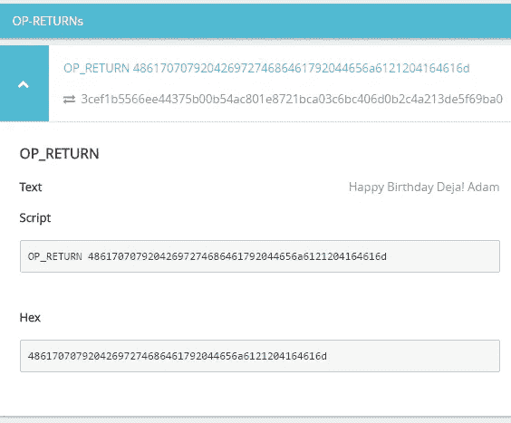
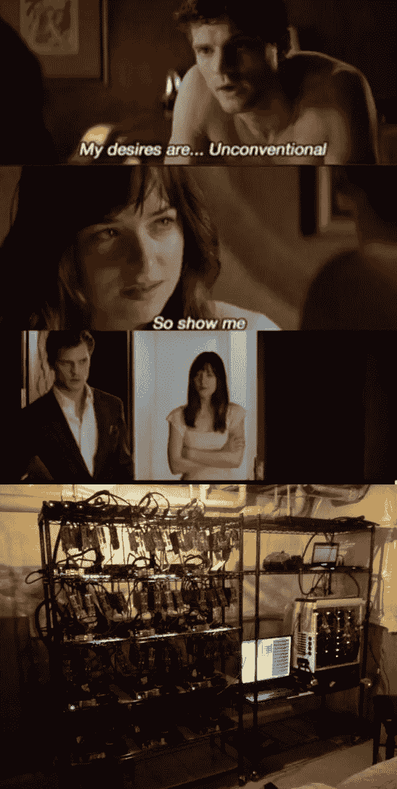

# 和比特币制造者约会是什么感觉？

> 原文：<https://medium.com/hackernoon/what-its-like-to-date-a-bitcoiner-e3c4ba702472>

你有没有陷入一段关系，然后发现你在和一个比特币制造者约会？我不这么认为。很有可能你在第一次约会时就发现了，可能是在最初的 10 分钟内。

刚刚偶然看到文章，[“和一个程序员约会”](https://hackernoon.com/dating-a-programmer-d302693d10f5)觉得写一个 Bitcoiner 版本会很好玩，就来了。

Pic: [Julia Tourianski of Brave the World](http://bravetheworld.com/2015/11/08/top-10-favorite-bitcoin/)

# 1.你永远是第二名

比特币创造者尤其热情。他们相信他们正在创造历史，他们相信他们是这场将彻底改变世界经济的战斗中被驱逐的战士。他们不仅仅是热情，而是痴迷，常常到了不健康的程度。但是不要误解，**这种激情可能是你一开始就爱上他的主要原因之一。**尽量不要问这个问题:

> 你更爱谁？我还是你的比特币？

# 2.他总是缺钱

或者用他的话来说:“一文不值的、不兑现的纸币”。不是因为他没有。他要么不想花他的比特币，因为他预计比特币价格到明天会上涨 10 倍，要么不能花他的比特币，因为它们是比特币。
你可能得亲自教他如何花他的钱。最好是在你身上。

# 3.你的生日礼物:比特币

如果他是一个更有爱心的人，他会买一些硬件钱包，一个禅悟硬币或为你设计和制作一个纸质钱包，但不要期待更多。在他们的世界里，一切都与比特币有关。他们身体上没有能力想出其他的东西。除了我，我没有落入那个陷阱，我没有给她比特币，我写了一个软件，发送一个带有 OP_RETURN 输出的[交易](https://www.smartbit.com.au/tx/3cef1b5566ee44375b00b54ac801e8721bca03c6bc406d0b2c4a213de5f69ba0)，在那里我祝她生日快乐，但当然不是每个人都可以像我一样浪漫。

# 4.你知道安德烈亚斯·安东诺普洛斯是谁吗

你每天都能听到这个人讲话。你不得不承认，有时候你甚至会对他的演讲感到兴奋，但通常只是担心你的男朋友有什么问题:

# 5.“我能用比特币支付吗？”

天哪，他知道他不能。为什么每次我们要买东西的时候他都要问？

# 6.“今晚不谈比特币！”

在你和他出去参加一个重要的活动之前，你必须把规则写在石头上，否则他会毁了它。

# 7.他希望你尊重他的隐私

他对自己的隐私如此着迷，以至于这个假人甚至没有意识到你已经通过关注他的 Reddit 账户实时了解了他的一切。事实上，如果他几个小时没有发帖子，那可能意味着他在欺骗你。

# 结论

当谈到关系时，比特币制造者是…非传统的。

> [黑客中午](http://bit.ly/Hackernoon)是黑客如何开始他们的下午。我们是 [@AMI](http://bit.ly/atAMIatAMI) 家庭的一员。我们现在[接受投稿](http://bit.ly/hackernoonsubmission)，并乐意[讨论广告&赞助](mailto:partners@amipublications.com)机会。
> 
> 如果你喜欢这个故事，我们推荐你阅读我们的[最新科技故事](http://bit.ly/hackernoonlatestt)和[趋势科技故事](https://hackernoon.com/trending)。直到下一次，不要把世界的现实想当然！

