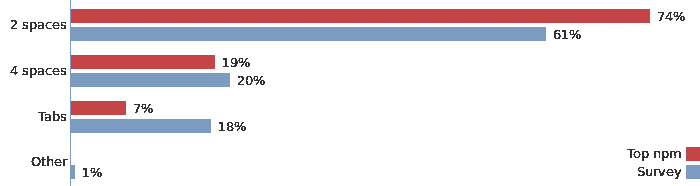
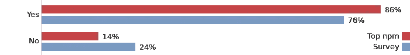
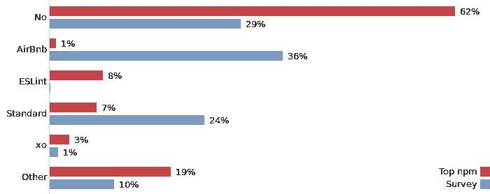
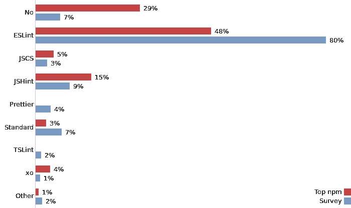

# 哪种 JavaScript 代码风格最受欢迎

> 原文：<https://medium.com/hackernoon/what-javascript-code-style-is-the-most-popular-5a3f5bec1f6f>

关于 JavaScript 中的代码风格，有两大圣战问题:制表符对空格和分号对无分号。当然还有更多，比如在多行数组声明中何处放置逗号，但是这两个是造成最多伤亡的。

我在想这是否值得我们花时间。如果有的话，我们能不能都采用最流行的款式，不要再争论了？因此，我分析了 [100 个最受依赖的](https://www.npmjs.com/browse/depended) npm 包，并对 1169 名受访者提出了同样的问题。

# **制表符还是空格？**

*   两个空格的缩进是明显的赢家，特别是对于开源项目。
*   有些开发者并不真正知道他们用的是什么。下面是我最喜欢的回答:“我只要按 tab，编辑器就会把它格式化成我甚至不知道的其他东西”。

# **分号还是没有分号？**

*   大多数开发人员用分号来编写 JavaScript。

# **棉绒预置**

npm 结果:

*   大多数开源项目不使用任何 linter 预置。
*   许多项目根本没有代码风格林挺。
*   拥有许多软件包的大型项目使用它们自己的预置:Babel，Gulp，PostCSS，脸书。
*   辛德雷·索胡斯使用 [xo](https://github.com/sindresorhus/xo) 。
*   我已经包括了 [eslint:推荐的](http://eslint.org/docs/rules/) (ESLint)，因为它相对来说比较流行，但是它没有代码风格规则。

调查结果:

*   结果几乎相反。
*   [AirBnb](https://github.com/airbnb/javascript) 是最受欢迎的预置。
*   [标准](http://standardjs.com/)也很流行(貌似所有不用分号的开发者都用标准)。
*   这让一些开发商相当气愤:“绝对不是那种‘标准’的 BS”。

# **棉绒**

npm 结果:

*   许多开源项目都有非常基本的林挺:不超过 10 条规则。
*   有些项目有。eslintrc 或。但是不要将 linter 作为测试的一部分运行。
*   有些项目两者都有。eslintrc 和。jshintrc，有些甚至有冲突的规则。

调查结果:

*   几周前刚刚发行，但已经被很多人收养了。
*   并让一些人非常兴奋:“等待更漂亮，以获得更多的牵引力！”或者“一旦主要错误被修复，将使用更漂亮的”。
*   有些开发者其实并不在乎:“代码风格无所谓”。

# **结论**

对于前两个问题，我期望看到接近 50%的数字。但是我对 JavaScript 中空格缩进的流行程度感到惊讶:制表符几乎不存在。分号也是一样:不使用分号的人没有你想象的阅读 Twitter 的人多。

结果显示，流行的开源项目代码风格的多样性更少:超过一半的项目使用 2 个带分号的空格。许多人仍然不使用任何工具来验证代码风格。

这也可能是因为许多流行的开源项目已经过时，但在调查中，人们描述了他们在最新项目中使用的东西。

> 所以如果你开始一个新的 JavaScript 项目 [AirBnb 预置](https://github.com/airbnb/javascript) (2 个空格，分号等。)将是一个不错的选择:您的代码风格将会为许多开发人员所熟悉。

*注:两个 100 的项目是用 CoffeeScript 写的。CoffeeScript 本身就是其中之一。他们和一个只有本机代码的人被排除在结果之外。*

[*数据和图表来源*](https://github.com/sapegin/jscodestyle) *。* [*喜欢这篇文章就在 Twitter 上关注我*](https://twitter.com/iamsapegin) *。*

**订阅我的简讯:**[**https://tinyletter.com/sapegin**](https://tinyletter.com/sapegin)

[黑客中午](http://bit.ly/Hackernoon)是黑客如何开始他们的下午。我们是这个家庭的一员。我们现在[接受投稿](http://bit.ly/hackernoonsubmission)并乐意[讨论广告&赞助](mailto:partners@amipublications.com)机会。

> 如果你喜欢这个故事，我们推荐你阅读我们的[最新科技故事](http://bit.ly/hackernoonlatestt)和[趋势科技故事](https://hackernoon.com/trending)。直到下一次，不要把世界的现实想当然！