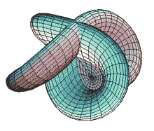
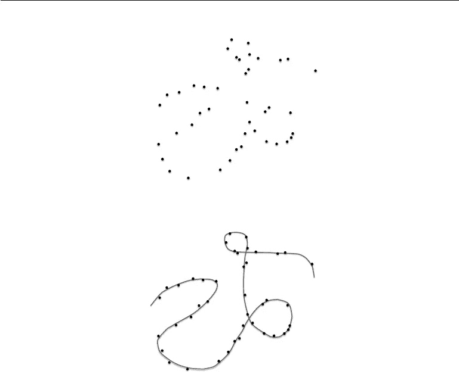

# 是什么杀死了维度的诅咒？

> 原文：<https://medium.com/hackernoon/what-killed-the-curse-of-dimensionality-8dbfad265bbe>

深度[学习](https://hackernoon.com/tagged/learning)如何克服机器学习中的这道坎，为什么？

首先，我们应该清楚地定义维数灾难:

> 当数据的维度增加时，数据的稀疏性增加。

数据是有维度的。添加到数据中的维度越多，就越难找到模式。把维度想象成你在玩捉人游戏的动物的活动范围。如果你在追逐一只只能在地面上移动的动物，它们只能在二维空间内移动，向左或向右(x)，向前或向后(y)。抓住一只鸟更难，因为这只鸟可以在三维空间里向左或向右(x)，向前或向后(y)，向上或向下(z)移动。我们可以想象一些神话中的时间旅行兽，它们可以在 4 个维度上移动，向左或向右(x)，向前或向后(y)，向上或向下(z)，过去或未来(t)。你可以看到，随着维度的增加，这变得更加困难。

同样的问题也适用于数据和机器学习。随着数据维度的增加，数据的稀疏性增加，从而更难确定模式。在传统的 ML 中，有一些绕过维数灾难的方法，这些方法需要某些技术，如函数平滑和近似。深度学习凭借其固有的特性克服了这一“诅咒”，可能是受欢迎程度增加的贡献之一。

# 深度学习

在高维度应用中，深度学习不会遭受与线性回归等其他机器学习算法相同的后果。这一事实是这种用神经网络建模的方法如此有效的魔力的一部分。在当今的大数据世界中，神经网络对维数灾难的不渗透性是一个有用的特征。

关于为什么会发生这种情况，有多种理论。现在，我们将快速回顾一下每个主题的主要内容:

Linear Manifold

## 流形假设[1]

在高层次上，流形假设表明高维数据实际上位于嵌入在高维空间中的低维流形上。

从某种意义上来说，这几乎意味着在这种高维数据中，在较低水平的维度中存在一些深度学习方法擅长利用的潜在模式。因此，给定一个表示图像的高维矩阵，神经网络擅长发现在高维表示中不明显的低维特征。

Image from deep learning book. Manifold over high dimensional data

上图代表了高维空间中的一组数据点。在这篇博文中，它是二维的，以便于表达。点与点之间有一条线的表示在这个高维空间中有一些流形，大部分数据都在那里。那个流形是连接所有点的线。神经网络和深度学习方法利用了这一点，并在理论上找到了这种多样性。

Visualization of activations from different neurons of a Convolution Neural Network

## 稀疏编码[2]

当数据流经网络中不同的神经元时，就会发生这种情况。神经网络中的每个神经元都有自己的激活功能。当每个神经元被激活时，它会导致稀疏编码。

上图描绘了神经网络激活的可视化。每一个单独的神经元都从一幅图像中获得不同的特征。上面的图示显示了不同的神经元如何获得不同的特征，并且每个特征都对网络的最终输出做出贡献。

例如，英语由 26 个字母组成。这些字母可以组成这种语言的所有单词。就神经网络而言，有一些神经元在被激发时可以与其他神经元的激发相结合，以输出正确的答案，而不管输入的维度如何。

## 结论

没有唯一被证实的理论表明为什么神经网络克服了维数灾难。有很多研究正在进行，以了解允许深度学习和神经网络在实践中如此有效的不同方面和潜在特征。在那之前，我们对引擎盖下正在进行的概念类型有一个很好的想法，这有助于推动深度学习和神经网络在实践中使用。

> 更多深度学习文章，请查看 [camron.xyz](http://camron.xyz)

## 延伸阅读:

流形假设[1]:【https://www.ima.umn.edu/2008-2009/SW10.27-30.08/6687】T2

深度学习[书](https://hackernoon.com/tagged/book)【1】:[http://www . deep Learning Book . org/version-2015-10-03/contents/manifolds . html](http://www.deeplearningbook.org/version-2015-10-03/contents/manifolds.html)

[1] & [2]帕萨·尼代木的演讲:[https://www.ima.umn.edu/2008-2009/SW10.27-30.08/6687](https://www.ima.umn.edu/2008-2009/SW10.27-30.08/6687)

维基百科[2]:[https://en.wikipedia.org/wiki/Neural_coding#Sparse_coding](https://en.wikipedia.org/wiki/Neural_coding#Sparse_coding)

关于稀疏编码的文章[2]:[http://redwood.berkeley.edu/vs265/handout-sparse-08.pdf](http://redwood.berkeley.edu/vs265/handout-sparse-08.pdf)

*受此 reddit 帖子启发:*[*https://goo.gl/jJFtP1*](https://goo.gl/jJFtP1)